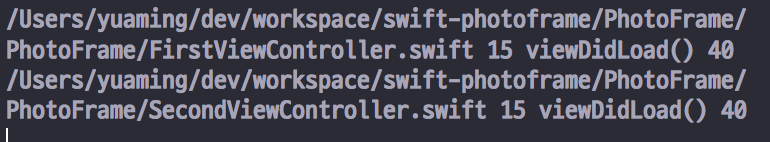
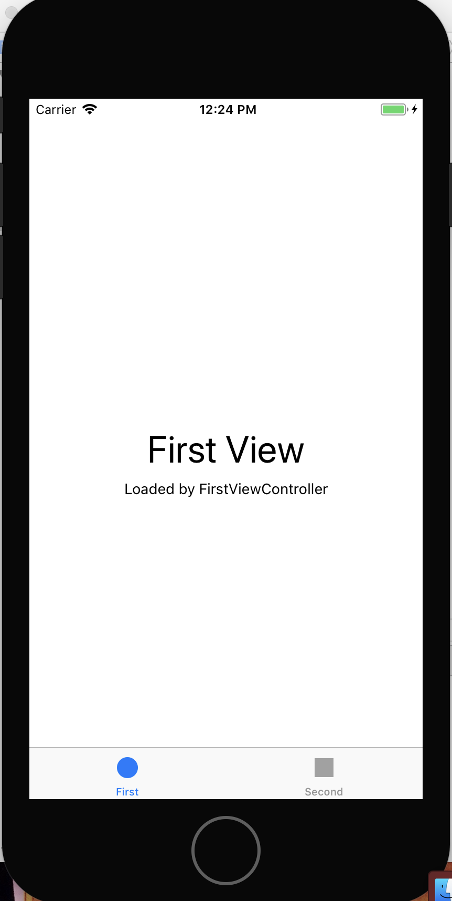
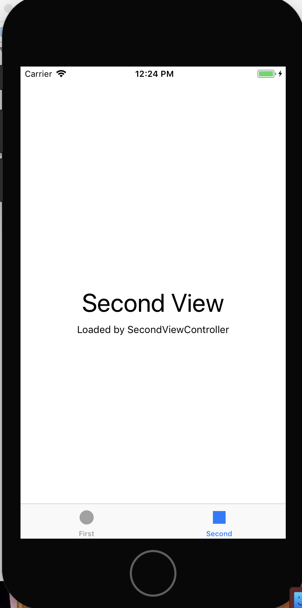
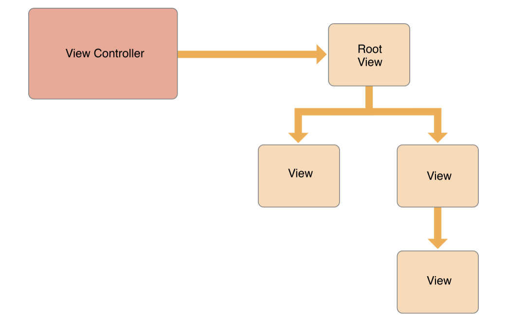
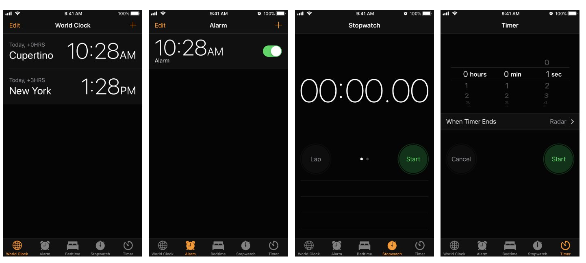
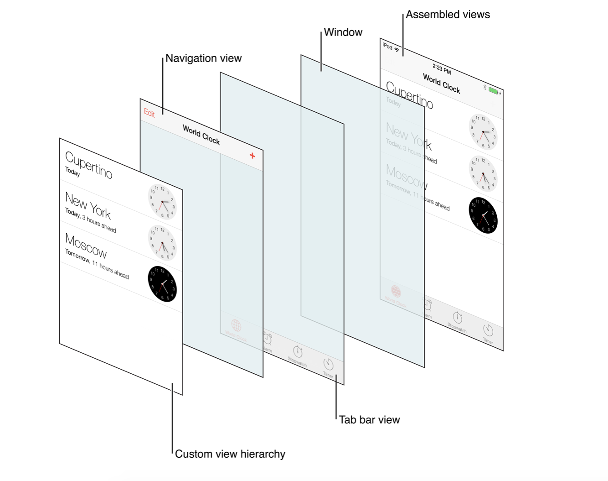
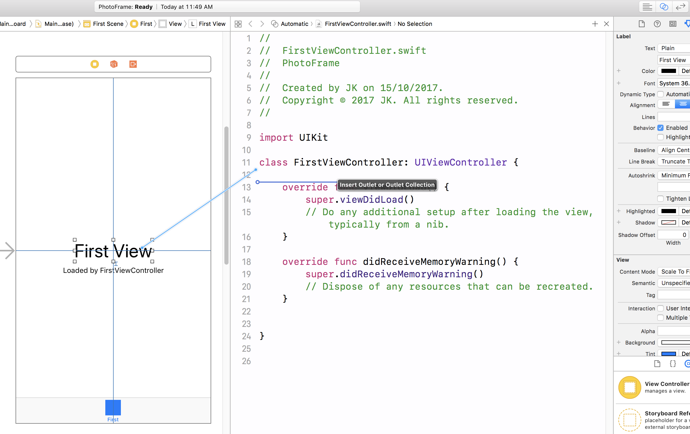
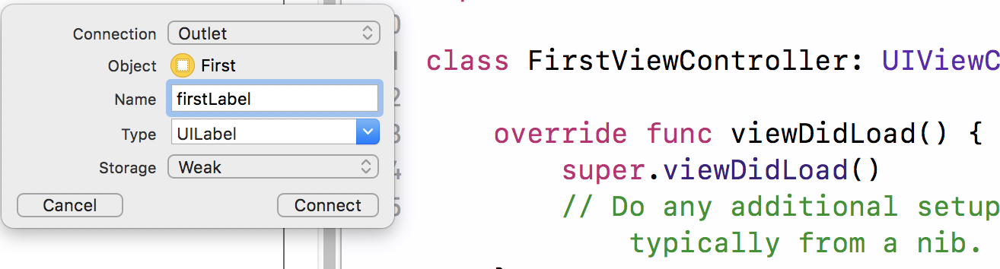
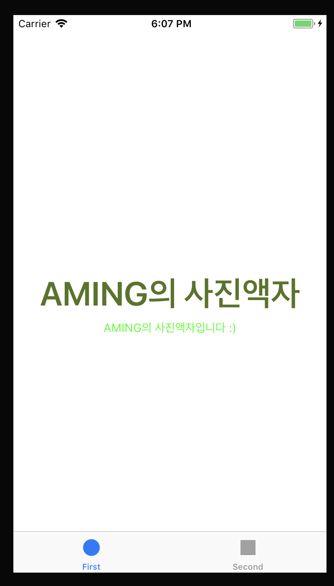

= Photo Frame

=== 1단계

===== 요구사항
* iOS 프로젝트 Tabbed App 템플릿을 만들고, 프로젝트 이름을 _PhotoFrame_ 으로 지정함

===== 실행결과

[source, swift]
----
import UIKit

class FirstViewController: UIViewController {
    override func viewDidLoad() {
        super.viewDidLoad()
        print(#file, #line, #function, #column)
    }

    override func didReceiveMemoryWarning() {
        super.didReceiveMemoryWarning()
        
    }
}
----

==== https://developer.apple.com/library/content/documentation/WindowsViews/Conceptual/ViewPG_iPhoneOS/CreatingViews/CreatingViews.html[View]

> View objects are the main way your application interacts with the user, they have many responsibilities

===== https://developer.apple.com/documentation/uikit/view_controllers[View Controllers]
* View를 제어하는 Controller 객체
* View의 라이프 사이클을 관리함
* https://developer.apple.com/library/content/featuredarticles/ViewControllerPGforiPhoneOS/index.html#//apple_ref/doc/uid/TP40007457-CH2-SW1[View Controller Programming Guide for iOS]

===== https://developer.apple.com/documentation/uikit/uitabbar[UITabBar]
* 일반적으로 UITabBarController와 함께 사용하지만 독립적인 컨트롤 형태로도 사용할 수 있음
* 하단에 있으며 https://developer.apple.com/documentation/uikit/uitabbaritem[UITabBarItem] 객체를 보여줌
* UITabbar는 Interface Builder, 생성자, https://developer.apple.com/documentation/uikit/uitabbar/1623455-setitems[setItems] 메서드를 통해 설정할 수 있지만 UITabBarController는 TabBar에 제공하는 객체를 개발자가 직접 만들어야 함
* https://developer.apple.com/documentation/uikit/uitoolbar[UIToolBar]와 비슷하지만 목적이 다름
** UITabbar => 화면전환 시 사용

> It’s important to understand the difference between a tab bar and a toolbar, because both types of bars appear at the bottom of an app screen. A tab bar lets the user switch quickly between different sections of an app, such as the Alarm, Stopwatch, and Timer tabs in the Clock app. A toolbar contains buttons for performing actions related to the current context, like creating an item, deleting an item, adding an annotation, or taking a photo.

** UIToolbar => 하나의 화면에서 탭메뉴 사용

> It’s important to understand the difference between a toolbar and a tab bar, because both types of bars appear at the bottom of an app screen. A toolbar contains buttons for performing actions related to the current context, such as creating an item, deleting an item, adding an annotation, or taking a photo. A tab bar lets the user switch quickly between different sections of an app, for example, the Alarm, Stopwatch, and Timer tabs in the Clock app. See Tab Bars. Toolbars and tab bars never appear together in the same view.

* Tabbar는 선택항목, 사용자 지정 항목에 대해 delegate 객체에게 알려야 함
* Tabbar를 만들 경우 Tabbar 항목의 선택, 추가, 삭제, 정렬에 대한 정보를 delegate(https://developer.apple.com/documentation/uikit/uitabbardelegate[UITabBarDelegate]) 객체에게 알려야 함 

===== https://developer.apple.com/documentation/uikit/uitabbarcontroller[UITabBarController] 
* 보여지는 화면과 선택된 탭 관계는 일반적으로 as-is관계지만, SubClass일 수도 있음
* Tabbar Controller Interface의 탭은 사용자가 선택하였을 때 RootView를 보여줌
* 이전 화면과 관계없이 RooView를 보여줌
* Tabbar Interface는 서로 다른 유형의 화면을 보여줌
** 아이폰의 시계 앱에서 하단 메뉴를 Tabbar Interface로 이용하여 만듬

* Tabbar Controller에 직접 접근화면 안됨. https://developer.apple.com/documentation/uikit/uitabbarcontroller/1621185-viewcontrollers[UITabBarController => viewControllers]를 이용해야 함
* 개발자가 지정한 순서대로 화면에 나타나며 https://developer.apple.com/documentation/uikit/uitabbarcontroller/1621172-selectedviewcontroller[SelectedViewController] 속성을 이용하여 먼저 보여줄 화면을 설정할 수 있음
* 사용자가 Tabbar Interface를 선택하였을 때 Tabbar Controller 객체에서 일어나는 상호작용을 delegate에게 알려야 함
* delegate는 어떤 것이여도 상관없지만 https://developer.apple.com/documentation/uikit/uitabbarcontrollerdelegate[UITabBarControllerDelegate] 프토포콜에 준수해야 함
* delegate는 Tabbar를 선택했을 때 작업을 추가하거나 선택하지 못하게 제어할 수 있거나 Navigation Controller로 구성된 Tabbar의 변화를 알 수 있음
* UITabBarController는 UIViewController를 상속받았기 때문에 Tabbar Controller는 https://developer.apple.com/documentation/uikit/uiviewcontroller/1621460-view[View] 속성으로 인해 접근할 수 있는 View를 소유할 수 있음
* Tabbar Controller View는 Tabbar View와 View 내용을 담는 컨테이너임
* Tabbar View는 항목에 대한 선택을 제어할 수 있음
* Toolbar View와 Tabbar에 대한 항목은 변하지만, 그것을 관리하는 View는 변하지 않음
* 현재 선택된 Tab의 View Controller만 반영하여 View를 바꿈
* Navigation Controller와 Custom View Controller는 Tab의 Root View Controller로 사용할 수 있음

=== 2단계

===== 요구사항
* First Scene에 만들어져 있는 레이블을 IBOutlet으로 연결함
* 연결한 아웃렛 변수에 값을 변경함

===== 프로그래밍 요구사항
* Xcode 프로젝트 내비게이터에서 Main.storyboard 파일을 선택하고 First Scene 에 있는 'First View' 레이블(Label)을 선택하고 Assistant Editor 모드로 변경함
* 레이블을 선택하고 `Control + 드래그` 해서 ViewController 코드에 IBOutlet으로 연결함

* Outlet 이름으로 photoLabel을 입력함

* ViewController 클래스 viewDidLoad() 함수에서 위에 추가한 아웃렛 변수에 값을 변경하고 다시 실행함

[source, swift]
----
self.firstLabel.text = "JK의 사진액자"
----

* 위와 같이 코드로 firstLabel의 속성을 변경해봄. 글자색, 배경색, 투명도, 글자 크기를 바꿔봄
* firstLabel 아래 있는 레이블도 firstDescription 아웃렛으로 연결함
** 마찬가지 방식으로 값을 변경해서 꾸며봄

===== 실행결과 

[source, swift]
----
self.photoLabel.text = "AMING의 사진액자"
        self.photoLabel.textColor = UIColor(red: 0.333, green: 0.455, blue: 0.116, alpha: 1.0)
        self.photoLabel.font = UIFont.boldSystemFont(ofSize: 40)
        self.firstDescription.text = "AMING의 사진액자입니다 :)"
        self.firstDescription.textColor = UIColor.green
----

===== https://developer.apple.com/documentation/uikit/uilabel[UILabel]
* Core Attributes
** Text
*** 런타임때, https://developer.apple.com/documentation/uikit/uilabel/1620538-text[Text] => https://developer.apple.com/documentation/foundation/nsstring[NSString], https://developer.apple.com/documentation/uikit/uilabel/1620542-attributedtext[AttributedText] => https://developer.apple.com/documentation/foundation/nsattributedstring[NSAttributedString] 이용하여 Label 텍스트 내용을 바꿀 수 있음
*** NSAttributedString API를 이용하며 개별 문자나 문자 그룹의 속성을 바꿀 수 있음
** Color
*** Label 텍스트의 색상을 바꿀 수 있음. String, UIImage 타입의 값을 바인딩 할 수 있음
** Font
*** Label 텍스트의 글꼴을 바꿀 수 있음
** Alignment
*** Label 텍스트의 수평방향 정렬을 제어함
** Lines
*** Label 텍스트가 사용할 수 있는 최대 행을 정할 수 있음. 0으로 설정하면 최대 행을 사용할 수 있음. https://developer.apple.com/documentation/uikit/uilabel/1620539-numberoflines[numberOfLines] 속성을 이용함
** Behavior
*** https://developer.apple.com/documentation/uikit/uilabel/1620530-isenabled[isEnabeld => Label 사용 여부]
*** https://developer.apple.com/documentation/uikit/uilabel/1620526-ishighlighted[isHighlighted => Label 문자열 강조 여부]

* Spacing Attributes
** Baseline
*** 자동 축소 기능을 사용할 때, 수직 정렬을 제어함. 일반적으로 bottom 속성
*** https://developer.apple.com/documentation/uikit/uilabel/1620524-baselineadjustment[baseLineAdjustment] 
** Line Breaks
*** 텍스트의 길이가 라벨의 프레임보다 클 경우 어떤 기준으로 텍스트를 나눌지를 설정함
*** https://developer.apple.com/documentation/uikit/uilabel/1620525-linebreakmode[lineBreakMode => Label 텍스트를 자르거나 줄바꿈을 사용하는 속성]
** Autoshrink 
*** Label이 잘리기 전에 Label를 조정함. Label 텍스트의 크기가 작아짐. https://developer.apple.com/documentation/uikit/uilabel/1620544-minimumscalefactor[minimumScaleFactor], https://developer.apple.com/documentation/uikit/uilabel/1620533-allowsdefaulttighteningfortrunca[allowsDefaultTighteningForTruncation]

* Advanced Appearance Attributes
** Highlighted
*** https://developer.apple.com/documentation/uikit/uilabel/1620540-highlightedtextcolor[highlightedTextColor]
** Shadow
*** https://developer.apple.com/documentation/uikit/uilabel/1620536-shadowcolor[shadowColor]
** Shadow Offset
*** https://developer.apple.com/documentation/uikit/uilabel/1620528-shadowoffset[shadowOffset]
