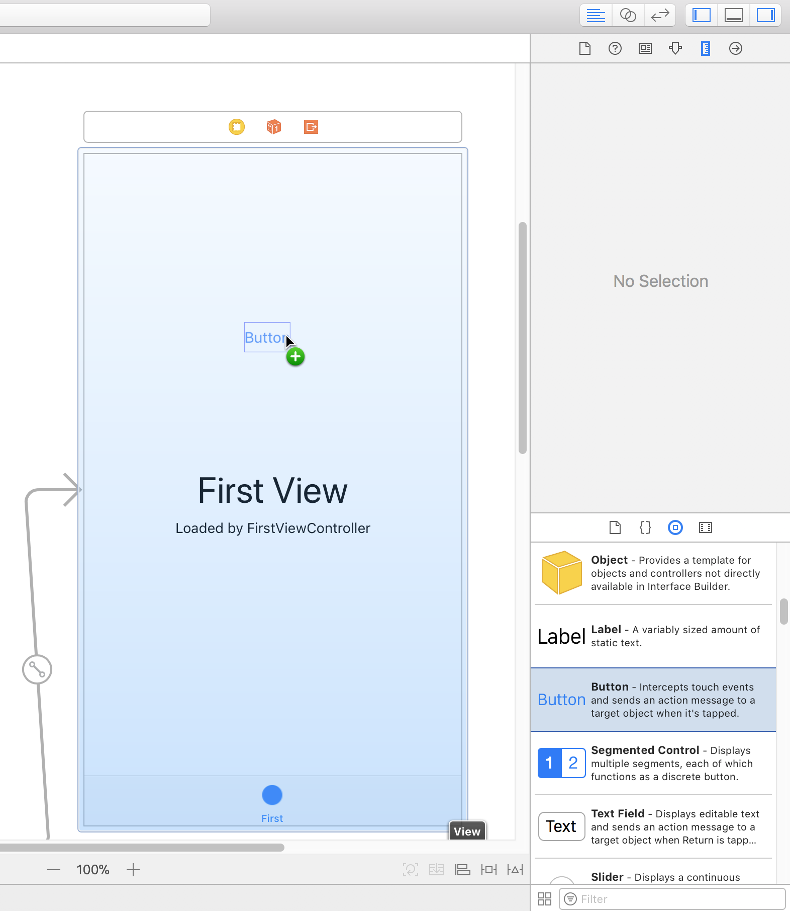
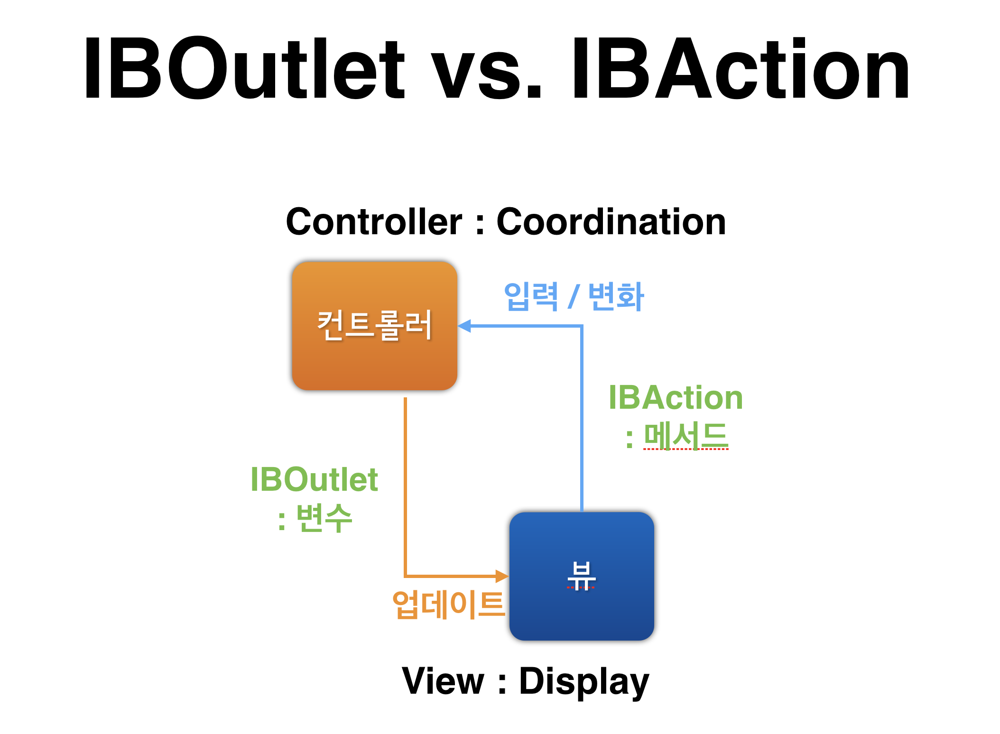

= Photo Frame

=== 1단계

===== 요구사항
* iOS 프로젝트 Tabbed App 템플릿을 만들고, 프로젝트 이름을 _PhotoFrame_ 으로 지정함

===== 실행결과

[source, swift]
----
import UIKit

class FirstViewController: UIViewController {
    override func viewDidLoad() {
        super.viewDidLoad()
        print(#file, #line, #function, #column)
    }

    override func didReceiveMemoryWarning() {
        super.didReceiveMemoryWarning()
        
    }
}
----

image::./image/console-view.png[50%, 50%]

image::./image/first-view.png[30%, 30%]

image::./image/second-view.png[30%, 30%]

==== https://developer.apple.com/library/content/documentation/WindowsViews/Conceptual/ViewPG_iPhoneOS/CreatingViews/CreatingViews.html[View]

> View objects are the main way your application interacts with the user, they have many responsibilities

===== https://developer.apple.com/documentation/uikit/view_controllers[View Controllers]
* View를 제어하는 Controller 객체
* View의 라이프 사이클을 관리함
* https://developer.apple.com/library/content/featuredarticles/ViewControllerPGforiPhoneOS/index.html#//apple_ref/doc/uid/TP40007457-CH2-SW1[View Controller Programming Guide for iOS]

===== https://developer.apple.com/documentation/uikit/uitabbar[UITabBar]
* 일반적으로 UITabBarController와 함께 사용하지만 독립적인 컨트롤 형태로도 사용할 수 있음
* 하단에 있으며 https://developer.apple.com/documentation/uikit/uitabbaritem[UITabBarItem] 객체를 보여줌
* UITabbar는 Interface Builder, 생성자, https://developer.apple.com/documentation/uikit/uitabbar/1623455-setitems[setItems] 메서드를 통해 설정할 수 있지만 UITabBarController는 TabBar에 제공하는 객체를 개발자가 직접 만들어야 함
* https://developer.apple.com/documentation/uikit/uitoolbar[UIToolBar]와 비슷하지만 목적이 다름
** UITabbar => 화면전환 시 사용

> It’s important to understand the difference between a tab bar and a toolbar, because both types of bars appear at the bottom of an app screen. A tab bar lets the user switch quickly between different sections of an app, such as the Alarm, Stopwatch, and Timer tabs in the Clock app. A toolbar contains buttons for performing actions related to the current context, like creating an item, deleting an item, adding an annotation, or taking a photo.

** UIToolbar => 하나의 화면에서 탭메뉴 사용

> It’s important to understand the difference between a toolbar and a tab bar, because both types of bars appear at the bottom of an app screen. A toolbar contains buttons for performing actions related to the current context, such as creating an item, deleting an item, adding an annotation, or taking a photo. A tab bar lets the user switch quickly between different sections of an app, for example, the Alarm, Stopwatch, and Timer tabs in the Clock app. See Tab Bars. Toolbars and tab bars never appear together in the same view.

* Tabbar는 선택항목, 사용자 지정 항목에 대해 delegate 객체에게 알려야 함
* Tabbar를 만들 경우 Tabbar 항목의 선택, 추가, 삭제, 정렬에 대한 정보를 delegate(https://developer.apple.com/documentation/uikit/uitabbardelegate[UITabBarDelegate]) 객체에게 알려야 함 

===== https://developer.apple.com/documentation/uikit/uitabbarcontroller[UITabBarController] 
* 보여지는 화면과 선택된 탭 관계는 일반적으로 as-is관계지만, SubClass일 수도 있음
* Tabbar Controller Interface의 탭은 사용자가 선택하였을 때 RootView를 보여줌
* 이전 화면과 관계없이 RooView를 보여줌
* Tabbar Interface는 서로 다른 유형의 화면을 보여줌
** 아이폰의 시계 앱에서 하단 메뉴를 Tabbar Interface로 이용하여 만듬

image::./image/clock-app.png[]

* Tabbar Controller에 직접 접근화면 안됨. https://developer.apple.com/documentation/uikit/uitabbarcontroller/1621185-viewcontrollers[UITabBarController => viewControllers]를 이용해야 함
* 개발자가 지정한 순서대로 화면에 나타나며 https://developer.apple.com/documentation/uikit/uitabbarcontroller/1621172-selectedviewcontroller[SelectedViewController] 속성을 이용하여 먼저 보여줄 화면을 설정할 수 있음
* 사용자가 Tabbar Interface를 선택하였을 때 Tabbar Controller 객체에서 일어나는 상호작용을 delegate에게 알려야 함
* delegate는 어떤 것이여도 상관없지만 https://developer.apple.com/documentation/uikit/uitabbarcontrollerdelegate[UITabBarControllerDelegate] 프토포콜에 준수해야 함
* delegate는 Tabbar를 선택했을 때 작업을 추가하거나 선택하지 못하게 제어할 수 있거나 Navigation Controller로 구성된 Tabbar의 변화를 알 수 있음
* UITabBarController는 UIViewController를 상속받았기 때문에 Tabbar Controller는 https://developer.apple.com/documentation/uikit/uiviewcontroller/1621460-view[View] 속성으로 인해 접근할 수 있는 View를 소유할 수 있음
* Tabbar Controller View는 Tabbar View와 View 내용을 담는 컨테이너임
* Tabbar View는 항목에 대한 선택을 제어할 수 있음
* Toolbar View와 Tabbar에 대한 항목은 변하지만, 그것을 관리하는 View는 변하지 않음
* 현재 선택된 Tab의 View Controller만 반영하여 View를 바꿈
* Navigation Controller와 Custom View Controller는 Tab의 Root View Controller로 사용할 수 있음

image::./image/the-primary-views-of-a-tab-bar-controller.png[]

=== 2단계

===== 요구사항
* First Scene에 만들어져 있는 레이블을 IBOutlet으로 연결함
* 연결한 아웃렛 변수에 값을 변경함

===== 프로그래밍 요구사항
* Xcode 프로젝트 내비게이터에서 Main.storyboard 파일을 선택하고 First Scene 에 있는 'First View' 레이블(Label)을 선택하고 Assistant Editor 모드로 변경함
* 레이블을 선택하고 `Control + 드래그` 해서 ViewController 코드에 IBOutlet으로 연결함

image::./image/photoframe-iboutlet-1.png[]

* Outlet 이름으로 photoLabel을 입력함

image::./image/photoframe-iboutlet-2.png[]

* ViewController 클래스 viewDidLoad() 함수에서 위에 추가한 아웃렛 변수에 값을 변경하고 다시 실행함

[source, swift]
----
self.firstLabel.text = "JK의 사진액자"
----

* 위와 같이 코드로 firstLabel의 속성을 변경해봄. 글자색, 배경색, 투명도, 글자 크기를 바꿔봄
* firstLabel 아래 있는 레이블도 firstDescription 아웃렛으로 연결함
** 마찬가지 방식으로 값을 변경해서 꾸며봄

===== 실행결과 

[source, swift]
----
self.photoLabel.text = "AMING의 사진액자"
self.photoLabel.textColor = UIColor(red: 0.333, green: 0.455, blue: 0.116, alpha: 1.0)
self.photoLabel.font = UIFont.boldSystemFont(ofSize: 40)
self.firstDescription.text = "AMING의 사진액자입니다 :)"
self.firstDescription.textColor = UIColor.green
----

image::./image/result-2.png[[30%, 30%]

===== https://developer.apple.com/documentation/appkit/constants/interface_builder_constants/iboutlet[IBOutlet]
* `IB-` => Interface Builder
* 앱 코드에서 스토리 보드 객체로 연결함
* https://developer.apple.com/documentation/appkit/constants/interface_builder_constants?language=objc[Interface Builder Constants]
* https://soooprmx.com/archives/5123[IBOutlet]

> Type qualifier used by Interface Builder to expose a symbol as a connection point for sending messages from app code to a user interface element. Used immediately before an object type in a property or instance variable declaration. 

===== https://developer.apple.com/documentation/uikit/uilabel[UILabel]
* Core Attributes
** Text
*** 런타임때, https://developer.apple.com/documentation/uikit/uilabel/1620538-text[Text] => https://developer.apple.com/documentation/foundation/nsstring[NSString], https://developer.apple.com/documentation/uikit/uilabel/1620542-attributedtext[AttributedText] => https://developer.apple.com/documentation/foundation/nsattributedstring[NSAttributedString] 이용하여 Label 텍스트 내용을 바꿀 수 있음
*** NSAttributedString API를 이용하며 개별 문자나 문자 그룹의 속성을 바꿀 수 있음
** Color
*** Label 텍스트의 색상을 바꿀 수 있음
** Font
*** Label 텍스트의 글꼴을 바꿀 수 있음
** Alignment
*** Label 텍스트의 수평방향 정렬을 제어함
** Lines
*** Label 텍스트가 사용할 수 있는 최대 행을 정할 수 있음. 0으로 설정하면 최대 행을 사용할 수 있음. https://developer.apple.com/documentation/uikit/uilabel/1620539-numberoflines[numberOfLines] 속성을 이용함
** Behavior
*** https://developer.apple.com/documentation/uikit/uilabel/1620530-isenabled[isEnabeld => Label 사용 여부]
*** https://developer.apple.com/documentation/uikit/uilabel/1620526-ishighlighted[isHighlighted => Label 문자열 강조 여부]

* Spacing Attributes
** Baseline
*** 자동 축소 기능을 사용할 때, 수직 정렬을 제어함. 일반적으로 bottom 속성
*** https://developer.apple.com/documentation/uikit/uilabel/1620524-baselineadjustment[baseLineAdjustment] 
** Line Breaks
*** 텍스트의 길이가 라벨의 프레임보다 클 경우 어떤 기준으로 텍스트를 나눌지 설정함
*** https://developer.apple.com/documentation/uikit/uilabel/1620525-linebreakmode[lineBreakMode => Label 텍스트를 자르거나 줄바꿈을 사용하는 속성]
** Autoshrink 
*** https://developer.apple.com/documentation/uikit/uilabel/1620544-minimumscalefactor[minimumScaleFactor], https://developer.apple.com/documentation/uikit/uilabel/1620533-allowsdefaulttighteningfortrunca[allowsDefaultTighteningForTruncation]

* Advanced Appearance Attributes
** Highlighted
*** https://developer.apple.com/documentation/uikit/uilabel/1620540-highlightedtextcolor[highlightedTextColor]
** Shadow
*** https://developer.apple.com/documentation/uikit/uilabel/1620536-shadowcolor[shadowColor]
** Shadow Offset
*** https://developer.apple.com/documentation/uikit/uilabel/1620528-shadowoffset[shadowOffset]

=== 3단계

===== 요구사항
* First Scene에 버튼(UIButton)을 추가하고 IBAction으로 연결함
* 연결한 액션에 대한 메서드를 구현함

===== 프로그래밍 요구사항
* Main.storyboard 에서 First Scene에 UIButton을 추가함
** 우측 유틸리티 영역 하단 3번째 탭 - 객체 라이브러리(Object Library)에서 Button 을 찾아서 View로 드래그함
** 추가한 버튼을 선택하고 우측 유틸리티 영역 상단 4번째 탭 - 속성(Attributes)에서 Title을 다음으로 변경함

* 버튼을 선택하고 Control + 드래그해서 ViewController 코드에 IBAction으로 연결함

image::./image/photoframe-ibaction-2.png[]

* 다음과 팝업에서 Connection 항목에서 IBOutlet 대신 IBAction 으로 변경함

image::./image/photoframe-ibaction-popup-3.png[]

* 액션 이름을 nextButtonTouched으로 지정함

===== 실행결과

[source, swift]
----
@IBAction func nextButtonTouched(_ sender: Any) {
    self.photoLabel.textColor = UIColor.white
    self.photoLabel.backgroundColor = UIColor.black
}
----

image::./image/before-3.png[30%, 30%]

image::./image/after-3.png[30%, 30%]

===== IBAction, IBOutlet 연결구조
* ViewController가 제어하려는 객체는 ViewController가 property 등으로 지정하여 알고 있어야 함. Interface Builder 객체를 ViewController와 연결하기 위해서 해당 객체를 IBOutlet으로 연결함
* UI 요소는 ViewController에게 액션 메시지를 전달함. 사용자 동작에 대해 액션을 수행할 수 있음. 이 때 IBAction으로 연결함
* https://soooprmx.com/archives/4486[ViewController Outlet, Action]

===== https://developer.apple.com/documentation/uikit/uicontrolevents[UIControlEvents]
* https://stackoverflow.com/questions/9344378/how-to-get-event-from-ibaction-method[How to get event from IBAction method?]

> The "event" is the one passed to your action method, but I assume your real question is which of the `UIControlEvents` caused the action. `UIEvent` and `UIControlEvents` are unrelated. The target/action pattern provides a `UIEvent`. If you want to handle different `UIControlEvents` differently, you should implement different actions for them.
> The target/action mechanism comes from `UIResponder`. `UIControlEvents` are related to `UIControl`.

===== IBAction에서 여러가지 이벤트 설정할 수 있음

image::./image/multiple-event.png[30%, 30%]

=== 4단계

===== 요구사항
* 스토리보드 구성 요소에 대해 학습하고 새로운 Scene과 Segue를 추가함

===== 프로그래밍 요구사항
* Main 스토리보드에서 First Scene 옆에 ViewController를 드래그해서 새로운 Scene을 추가함
* 앞 단계에서 추가한 [다음]버튼을 선택하고 Control + 드래그를 해서 새로 추가한 Scene에 연결함

** 팝업으로 표시되는 Action Segue에서 `Show` 항목을 선택함

* Scene과 Scene 사이에 화살표를 선택하면 Segue 속성을 변경할 수 있음

image::./image/photoframe-segue-attributes-3.png[]

* 새로 추가한 Scene 속성에서 배경 색상(Background Color)을 원하는 색상으로 변경한다. 새로 앱을 실행해보고 [다음] 버튼을 누르면 새로운 화면이 나타나는지 확인함
* 다시 스토리보드에서 위에 추가한 Scene (혹은 ViewController)에 [다음] 버튼을 추가한다. 우측 옆에 한 단계 더 표현하기 위한 ViewController를 추가하고 배경 색상을 다른 색상으로 변경한다. 위와 마찬가지로 [다음]버튼에서 새 Scene으로 Segue를 연결함
** 예를 들어 First Scene 다음에 추가한 화면이 Yellow 화면이었다면, First Scene에서 [다음] 버튼을 누르면 Yellow 화면이 표시되고, Yellow 화면에서 [다음] 버튼을 누르면 Blue 화면이 나오는 방식으로 두 단계 표시함

===== 실행결과

image::./image/result-4.png[50%, 50%]

===== 스토리보드
* 스토리보드
** 시각적인 표현으로  말하고자 할때 굉장히 강력한 접근 방식
** 특정 시퀀스가 특정 화면에 적합한 지 또는 캐릭터가 표현해야 하는 감정의 종류를 결정하기 위해 영화의 시각적 내용을 디자인하는 데 오랫동안 사용함

* 스토리보드 역사
** Mac OS의 조상격인 NeXTSTEP OS에 처음으로 탑재되었던, 그래픽 유저 인터페이스를 위한 메뉴구성 툴 _인터페이스 빌더_ 에 있음
** nib(Nextstep Interface Builder)
** xib(XCode Interface Builder)

* 스토리보드와 xib의 가장 큰 차이점?
** xib와 달리 스토리보드에서 어떤 동작에 따라 화면이 전환되는 것을 제어할 수 있음

* http://hamait.tistory.com/708[iOS 개발에서 스토리보드란 무엇인가?]

===== Scene
* View, ViewController

===== Segue
* 각각 장면들 사이의 전환/이동을 보여주는 Segues와 연결함
* 시작 뷰와 연결 뷰의 객체 사이에 Segue가 생김
* Segue 종류
** Show 
*** destinationViewController를 네비게이션 스택에 쌓으면서 보여줌
*** 새로 나타나는 화면은 오른쪽에서 왼쪽으로 이동하며 보여짐
*** 네비게이션바에 Back버튼이 생기게 되고 아이패드, 아이폰 모든 디바이스에서 똑같이 작용함
** Show Detail 
*** UISplitViewController에서 두번째 뷰 컨트롤러에 있는 내용을 대체함 
*** 네비게이션 스택에는 영향을 주지 않음
** Present Modally
*** 옵션에 따라 여러 다른 방법으로 기존 뷰컨트롤러를 덮는 새로운 뷰컨트롤러를 나타나게 함
** Popover Presentation
*** 아이패드에서 작은 팝업형식의 뷰를 띄움. 새로 띄운 뷰의 바깥영역을 터치하면 새로 띄운 뷰가 사라짐
*** 아이폰에서 모달뷰처럼 작동함