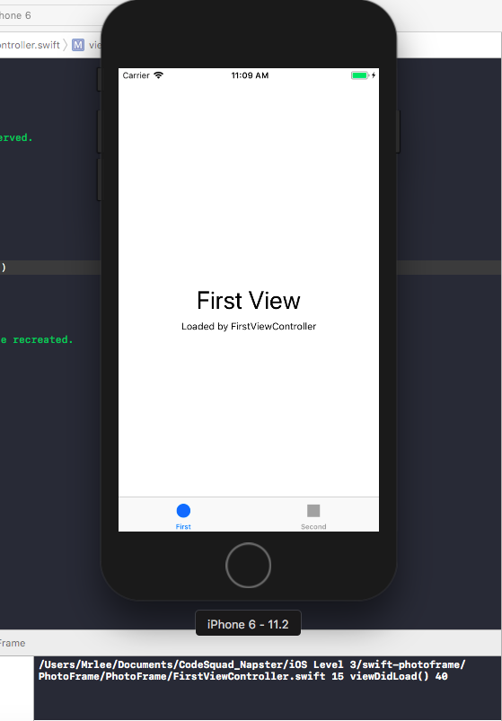
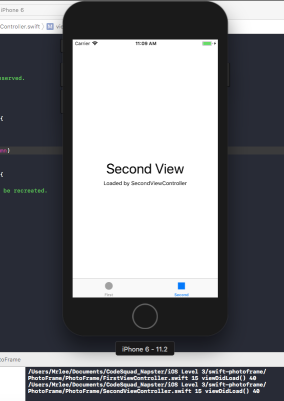
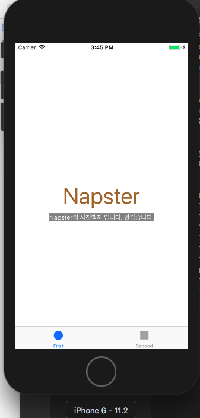
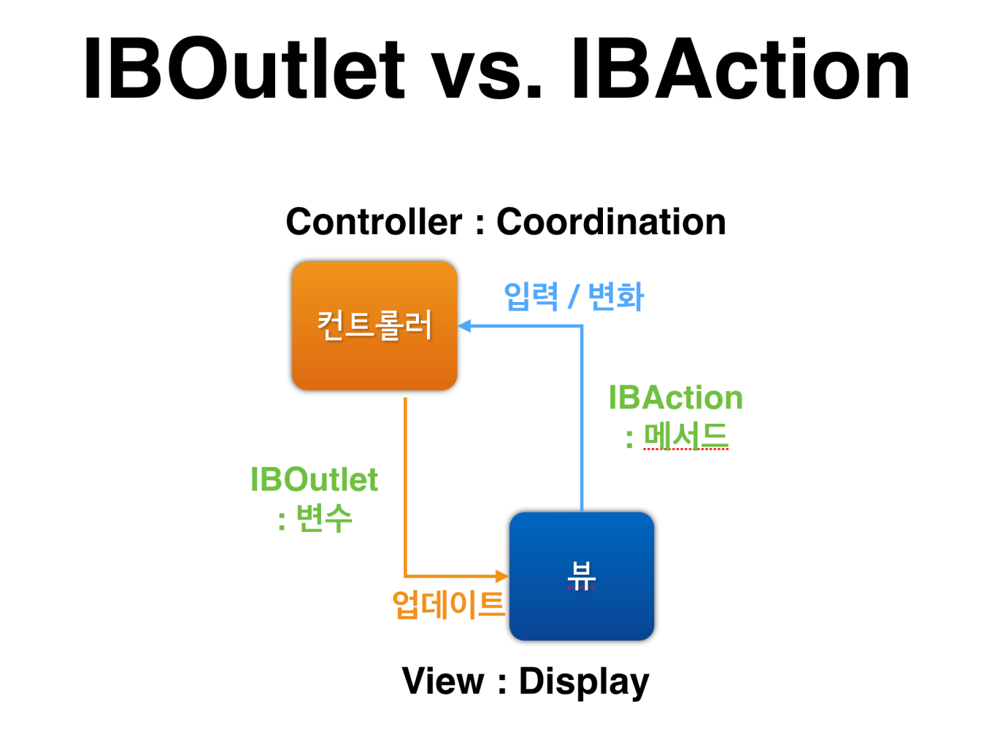
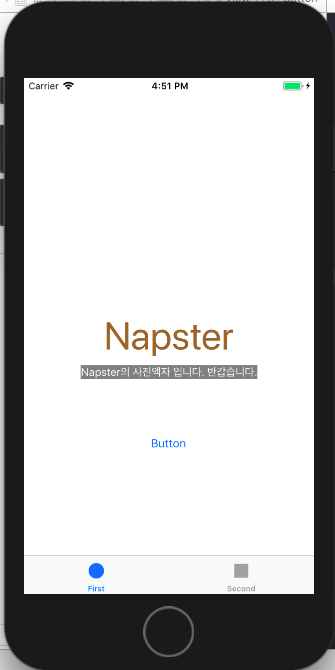
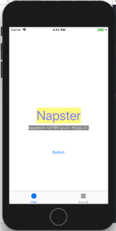
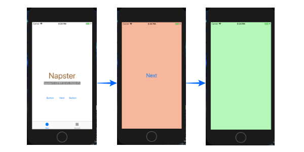
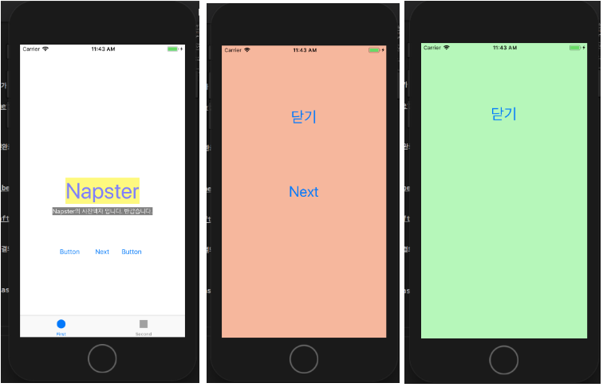

# 사진액자 앱
## 시작하기 - Tabbed App 템플릿 step1
* 최초 Tabbed App 프로젝트 생성, git의 issue, 프로젝트 설정. 사진앱 프로젝트를 시작하기위한 기본작업 완료.

<br>> step1_firstTapView_Screen_shot 17.12.21
<br>


<br>> step2_SecondTapView_Screen_shot 17.12.21
* 콘솔 창엔 프로그램 요구사항인 ```print(#file, #line, #function, #column)```가 출력되고있다.

* [UITapBar와 UITapBarController의 차이](http://llldddjjj.tistory.com/entry/iOSUITapBar%EC%99%80-UITapBarController%EC%9D%98-%EA%B0%84%EB%8B%A8%ED%95%9C-%EC%B0%A8%EC%9D%B4)

## IBOutlet step2
* UILabel의 여러가지 속성을 변경해보았다. 
```swift
self.photoLable.text = "Napster"
self.photoLable.font = UIFont.systemFont(ofSize: 50)
self.photoLable.textColor = UIColor.brown
self.firstDescription.text = "Napster의 사진액자 입니다. 반갑습니다."
self.firstDescription.textColor = UIColor(red: CGFloat(255), green: CGFloat(255), blue: CGFloat(102), alpha: CGFloat(20))
self.firstDescription.backgroundColor = UIColor.gray
```

<br>
> Step2의 UILabel을 이용하여 변경한 모습. 

## IBAction step3
* UIButton의 IBAction을 사용해보았다. IBAction은 유저가 버튼을 눌렀을때 메소드를 생성하여 그 메소드를 실행하게 하는데 다음의 특징을 가진다.

    * 버튼에 액션을 여러개 추가할 수 있을까?
    <br>한버튼에 여러가지 액션을 추가할 수 있다.(확인완료)
    * 버튼이 여러일 때 하나의 액션에 추가할 수 있을까?
    <br>여러번튼에 하나의 액션을 등록하는것도 가능하다.(확인완료)

* 버튼을 눌렀을때 Label의 변화를 주었다. 17.12.21
* Click Before<br>


* Click After<br>


## Scene과 Segue step4
* Button을 눌렀을때, 다음 Scene(ViewController)로 연결되는 Segue 셋팅한다.


## ViewController 프로그래밍 step5
* Button을 눌러서 연결되는 Scene에 ViewController Class 연결, 그리고 연결을 바탕으로 화면이 그려질때 화면 생명주기에 맞추어 메소드들이 호출되는 관계를 알아봄.
* Segue없이 코드로 View를 호출하는 방법을 학습.

