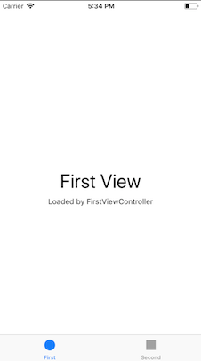
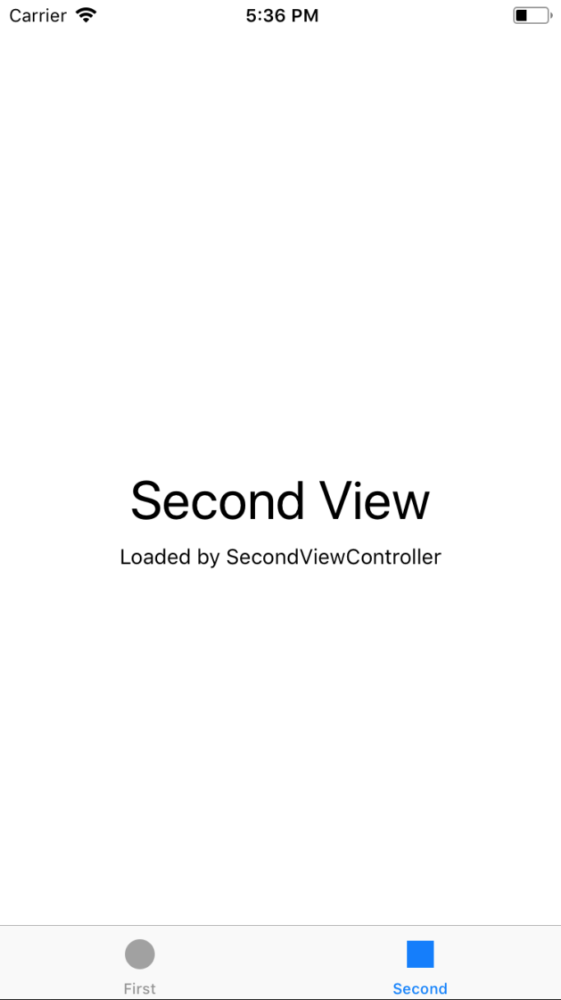
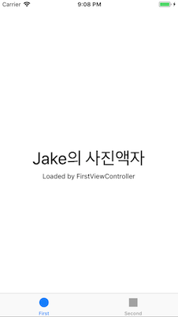
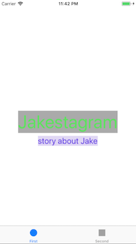

# PhotoFrame

## Step1 (시작하기 - Tabbed App 템플릿)
### 요구사항
- 포토프레임 프로젝트 저장소를 본인 저장소로 fork하고 로컬에 clone한다.
- iOS 프로젝트 Tabbed App 템플릿을 만들고, 프로젝트 이름을 "PhotoFrame"으로 지정하고, 위에 만든 로컬 저장소 경로에 생성한다.
- 기본 상태로 시뮬레이터를 하나 골라서 실행한다.
- readme.md 파일을 자신의 프로젝트에 대한 설명으로 변경한다.
    + 단계별로 미션을 해결하고 리뷰를 받고나면 readme.md 파일에 주요 작업 내용(바뀐 화면 이미지, 핵심 기능 설명)과 완성 날짜시간을 기록한다.
    + 실행한 화면을 캡처해서 readme.md 파일에 포함한다.

### 프로그래밍 요구사항
- 자동 생성된 ViewController 클래스 viewDidLoad() 함수에서 print(#file, #line, #function, #column) 코드를 추가하고 실행하면 콘솔 영역에 무엇이 출력되는지 확인한다.

### 결과
#### UI



#### Console
```
/Users/chocozero/Desktop/MyProject/CodeSquad/Masters/Level3/swift-photoframe/PhotoFrame/PhotoFrame/FirstViewController.swift 16 viewDidLoad() 40
```

---
## Step2 (IBOutlet)
### 요구사항
- First Scene에 만들어져 있는 레이블을 IBOutlet으로 연결한다.
- 연결한 아웃렛 변수에 값을 변경한다.
- 실행한 화면을 캡처해서 readme.md 파일에 포함한다.

### 프로그래밍 요구사항
- Xcode 프로젝트 내비게이터에서 Main.storyboard 파일을 선택하고 First Scene 에 있는 'First View' 레이블(Label)을 선택하고 Assistant Editor 모드로 변경한다.
- 레이블을 선택하고 Control + 드래그해서 ViewController 코드에 IBOutlet으로 연결한다.
- Outlet 이름으로 photoLabel을 입력한다.
- ViewController 클래스 viewDidLoad() 함수에서 위에 추가한 아웃렛 변수에 값을 변경하고 다시 실행한다.
```
self.firstLabel.text = "JK의 사진액자"
```
- 위와 같이 코드로 firstLabel의 속성을 변경해본다. 글자색, 배경색, 투명도, 글자 크기를 바꿔본다.
- firstLabel 아래 있는 레이블도 firstDescription 아웃렛으로 연결한다.
    + 마찬가지 방식으로 값을 변경해서 꾸며본다.

### 결과
#### UI


