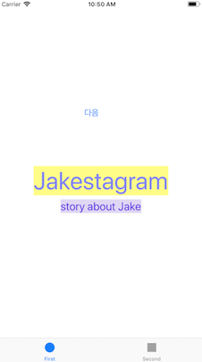
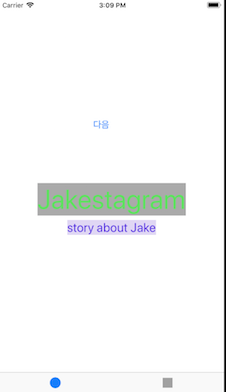
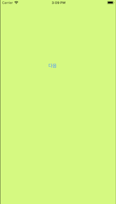
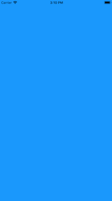

# PhotoFrame

## Step1 (시작하기 - Tabbed App 템플릿)
### 요구사항
- 포토프레임 프로젝트 저장소를 본인 저장소로 fork하고 로컬에 clone한다.
- iOS 프로젝트 Tabbed App 템플릿을 만들고, 프로젝트 이름을 "PhotoFrame"으로 지정하고, 위에 만든 로컬 저장소 경로에 생성한다.
- 기본 상태로 시뮬레이터를 하나 골라서 실행한다.
- readme.md 파일을 자신의 프로젝트에 대한 설명으로 변경한다.
    + 단계별로 미션을 해결하고 리뷰를 받고나면 readme.md 파일에 주요 작업 내용(바뀐 화면 이미지, 핵심 기능 설명)과 완성 날짜시간을 기록한다.
    + 실행한 화면을 캡처해서 readme.md 파일에 포함한다.

### 프로그래밍 요구사항
- 자동 생성된 ViewController 클래스 viewDidLoad() 함수에서 print(#file, #line, #function, #column) 코드를 추가하고 실행하면 콘솔 영역에 무엇이 출력되는지 확인한다.

### 결과
#### UI


#### Console
```
/Users/chocozero/Desktop/MyProject/CodeSquad/Masters/Level3/swift-photoframe/PhotoFrame/PhotoFrame/FirstViewController.swift 16 viewDidLoad() 40
```

---
## Step2 (IBOutlet)
### 요구사항
- First Scene에 만들어져 있는 레이블을 IBOutlet으로 연결한다.
- 연결한 아웃렛 변수에 값을 변경한다.
- 실행한 화면을 캡처해서 readme.md 파일에 포함한다.

### 프로그래밍 요구사항
- Xcode 프로젝트 내비게이터에서 Main.storyboard 파일을 선택하고 First Scene 에 있는 'First View' 레이블(Label)을 선택하고 Assistant Editor 모드로 변경한다.
- 레이블을 선택하고 Control + 드래그해서 ViewController 코드에 IBOutlet으로 연결한다.
- Outlet 이름으로 photoLabel을 입력한다.
- ViewController 클래스 viewDidLoad() 함수에서 위에 추가한 아웃렛 변수에 값을 변경하고 다시 실행한다.
```
self.firstLabel.text = "JK의 사진액자"
```
- 위와 같이 코드로 firstLabel의 속성을 변경해본다. 글자색, 배경색, 투명도, 글자 크기를 바꿔본다.
- firstLabel 아래 있는 레이블도 firstDescription 아웃렛으로 연결한다.
    + 마찬가지 방식으로 값을 변경해서 꾸며본다.

### 결과
#### UI


---
## Step3 (IBAction)
### 요구사항
- First Scene에 버튼(UIButton)을 추가하고 IBAction으로 연결한다.
- 연결한 액션에 대한 메서드를 구현한다.
- 실행하고 버튼을 터치하기 이전/이후 화면을 캡처해서 readme.md 파일에 포함한다.

### 프로그래밍 요구사항
- Main.storyboard 에서 First Scene에 UIButton을 추가한다.
    + 우측 유틸리티 영역 하단 3번째 탭 - 객체 라이브러리(Object Library)에서 Button 을 찾아서 View로 드래그한다.
    + 추가한 버튼을 선택하고 우측 유틸리티 영역 상단 4번째 탭 - 속성(Attributes)에서 Title을 다음으로 변경한다.
- 버튼을 선택하고 Control + 드래그해서 ViewController 코드에 IBAction으로 연결한다.
- 팝업에서 Connection 항목에서 IBOutlet 대신 IBAction 으로 변경한다.
- 액션 이름을 nextButtonTouched 로 지정한다.
- ViewController 클래스에 추가된 nextButtonTouched() 메서드에 아래처럼 구현을 추가한다.
```
@IBAction func nextButtonTouched(_ sender: Any) {
  self.firstLabel.textColor = UIColor.blue
  self.firstLabel.backgroundColor = UIColor.yellow
  self.firstLabel.alpha = 0.5
}
```
### 결과
#### UI



---
## Step4 (Scene과 Segue)
### 요구사항
- 스토리보드 구성 요소에 대해 학습하고 새로운 Scene과 Segue를 추가한다.
- 실행하고 새로운 화면을 캡처해서 readme.md 파일에 포함한다.

### 프로그래밍 요구사항
- Main 스토리보드에서 First Scene 옆에 ViewController를 드래그해서 새로운 Scene을 추가한다.
- 앞 단계에서 추가한 [다음]버튼을 선택하고 Control + 드래그를 해서 새로 추가한 Scene에 연결한다.
    + 팝업으로 표시되는 Action Segue에서 Show 항목을 선택한다.
- Scene과 Scene 사이에 화살표를 선택하면 Segue 속성을 변경할 수 있다.
- 새로 추가한 Scene 속성에서 배경 색상(Background Color)을 원하는 색상으로 변경한다. 새로 앱을 실행해보고 [다음] 버튼을 누르면 새로운 화면이 나타나는지 확인한다.
- 다시 스토리보드에서 위에 추가한 Scene (혹은 ViewController)에 [다음] 버튼을 추가한다. 우측 옆에 한 단계 더 표현하기 위한 ViewController를 추가하고 배경 색상을 다른 색상으로 변경한다. 위와 마찬가지로 [다음]버튼에서 새 Scene으로 Segue를 연결한다.
    + 예를 들어 First Scene 다음에 추가한 화면이 Yellow 화면이었다면, First Scene에서 [다음] 버튼을 누르면 Yellow 화면이 표시되고, Yellow 화면에서 [다음] 버튼을 누르면 Blue 화면이 나오는 방식으로 두 단계 표시한다.

### 결과
#### UI



