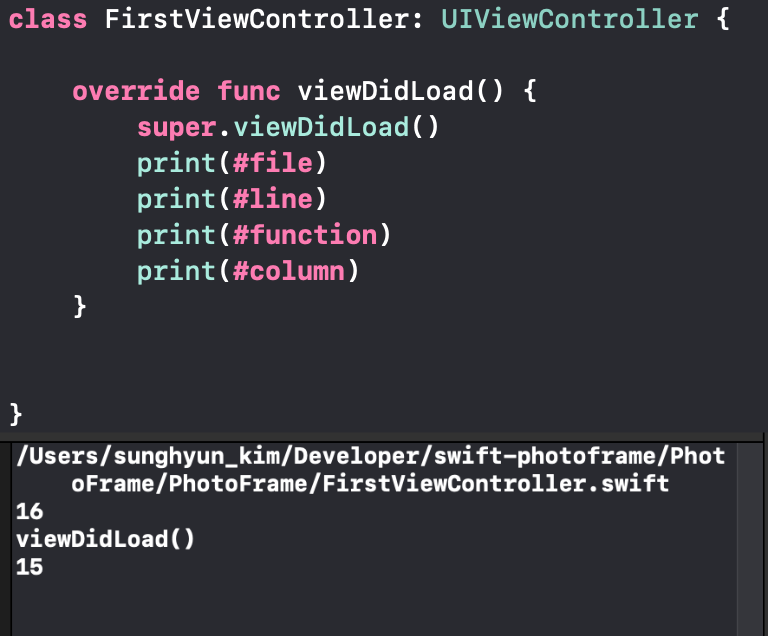
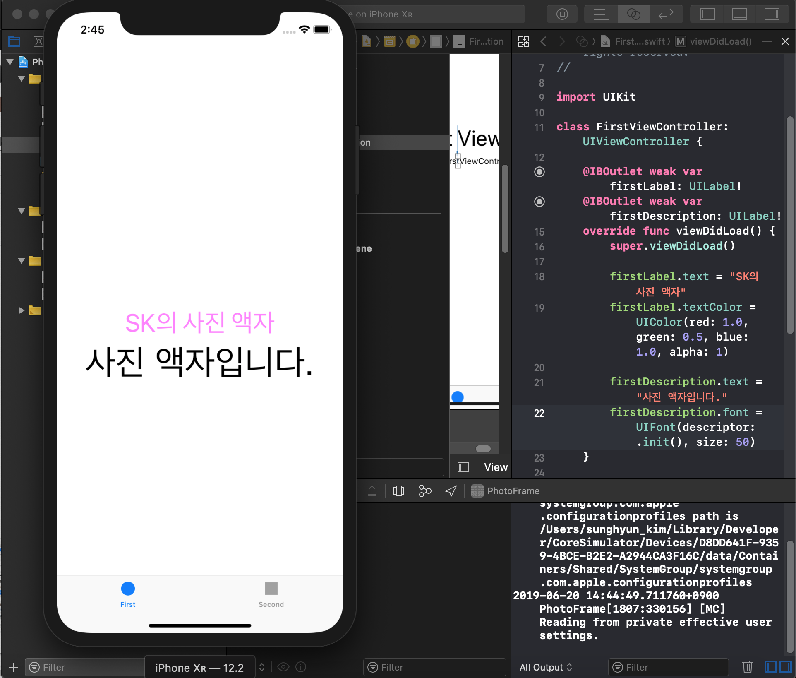
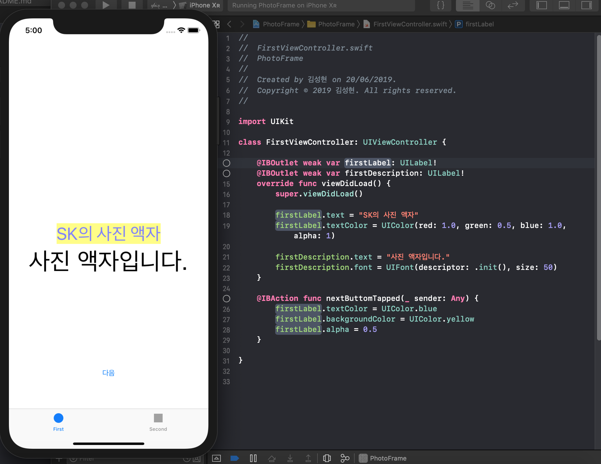
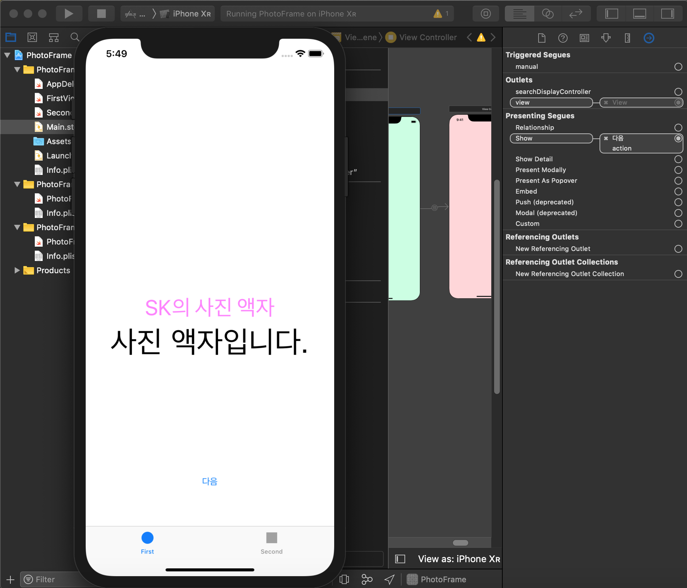
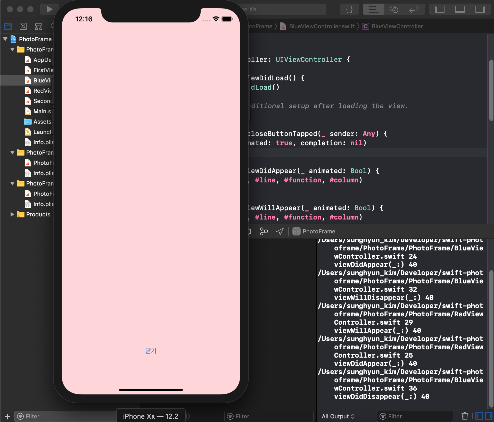

# PhotoFrame

## Step 1 (2019-06-20)

### 리터럴 표현식 (Literal Expression)

리터럴 | 유형 | 값
------- | ---- | -----
`#file` | `String` | 코드가 실행된 파일 디렉토리입니다.
`#line` | `Int` | 코드가 실행된 줄의 번호입니다.
`#column` | `Int` | 코드가 시작된 열의 번호입니다.
`#function` | `String` | 코드가 실행된 함수의 이름입니다.




## Step 2 (2019-06-20)

### UILabel

UILabel를 사용하여 View에서 텍스트를 나타낼 수 있습니다.

#### 사용된 UILabel의 속성들
속성 | 유형 | 설명
--- | --- | ---
Text | String | 표시되는 문자열입니다. (예: `firstLabel.text = "SK의 사진 액자"`)
Text Color | UIColor | 텍스트의 색상입니다. (예: `firstLabel.textColor = UIColor(red: 1.0, green: 0.5, blue: 1.0, alpha: 1)`)
Font | UIFont | 텍스트의 서체입니다. (예: `firstDescription.font = UIFont(descriptor: .init(), size: 50)`)




## Step 3 (2019-06-20)

### `@IBOutlet`

- 화면 상의 객체를 소스 코드에서 참조하기 위해 사용합니다.
- 텍스트 레이블 등의 화면에 나타내는 부분을 업데이트하기 위해 사용합니다.

### `@IBAction`

- 특정 객체에서 지정된 이벤트가 발생했을 때 명령을 실행하고 싶을 때 사용합니다.
- 버튼이 탭이 되는 등 이벤트가 발생하면 연결된 명령을 실행합니다.

### 암시적으로 추출되는 옵셔널(Implicitly Unwrapped Optional)로 선언되는 이유

클래스는 사용하기 위해 초기화하려면 속성들에 초기값이 지정되어야 하는데 인터페이스 빌더로부터 객체를 가져올 때에는 초기값을 할당하지 않기 때문에 옵셔널로 선언해야 합니다.

그런데 인터페이스 빌더에서 드래그하여 소스 코드로 가져오면 IUO로 선언됩니다. 이는 인터페이스 빌더에서 `@IBOutlet` 및 `@IBAction` 등과 연결이 제대로 되어있다면, `nil`이 있지 않을 것이기 때문에 이렇게 사용할 수 있다고 할 수 있습니다. 옵셔널 유형이지만 사용 시에 명시적으로 옵셔널을 추출하지 않아도 되기 때문에 작성 시에 번거로움을 줄여줍니다.




## Step 4 (2019-06-20)



## Step 5 (2019-06-21)

### Segue를 사용하지 않고 ViewController 간에 이동하기

ViewController에 Storyboard ID를 지정한 다음, 코드에서 `present`를 호출하여 ViewController 간에 이동할 수 있습니다.

```swift
if let viewController = storyboard?.instantiateViewController(withIdentifier: "RedViewController") {
    present(viewController, animated: true, completion: nil)
}
```




