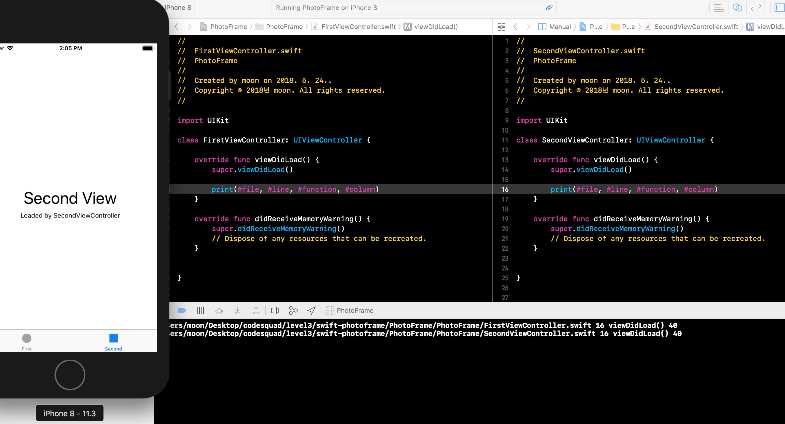
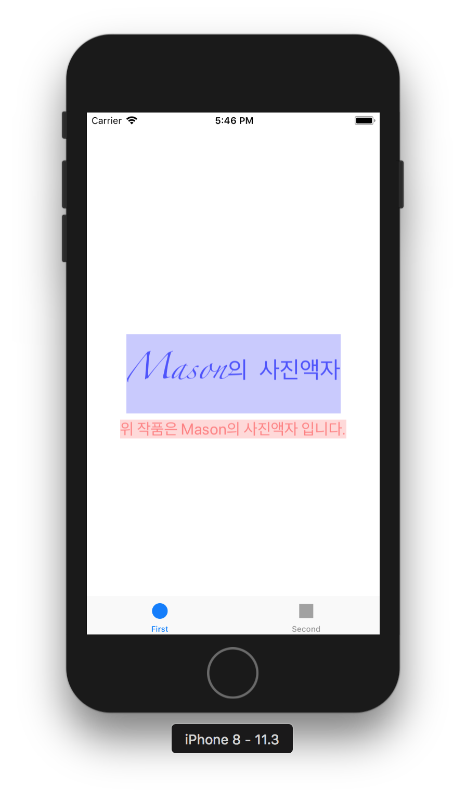
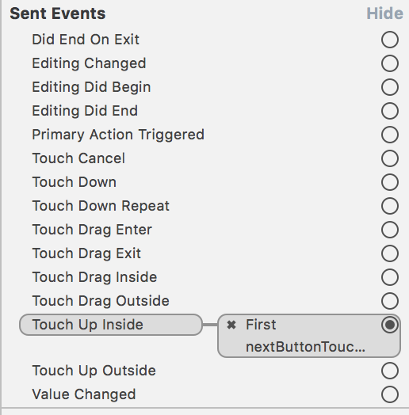
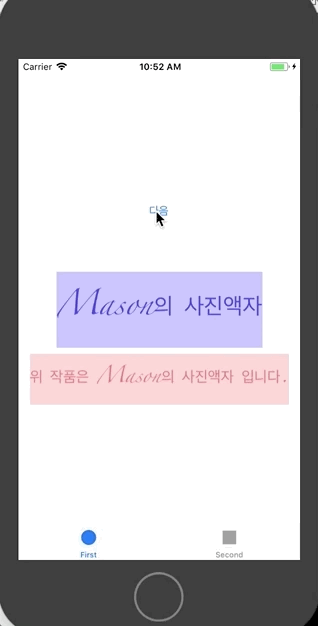

# PhotoFrame App

## Step1 - 시작하기 Tabbed App 템플릿

1. 프로그래밍 요구사항
	- 자동 생성된 ViewController 클래스 viewDidLoad() 함수에서 print(#file, #line, #function, #column) 코드를 추가하고 실행하면 콘솔 영역에 무엇이 출력되는지 확인한다.
2. UITabBarController와 UITabBar에 대해 학습한다.
3. UITabBar와 UITabbarController의 차이점은 무엇인가?

### 진행사항 (완성날짜: 2018/05/24 14:00)

## Step2 - IBOutlet

1. 프로그래밍 요구사항
	- Xcode 프로젝트 내비게이터에서 Main.storyboard 파일을 선택하고 First Scene 에 있는 'First View' 레이블(Label)을 선택하고 Assistant Editor 모드로 변경한다.
	- 레이블을 선택하고 Control + 드래그해서 ViewController 코드에 IBOutlet으로 연결한다.
	- 코드로 Label의 속성을 변경해본다. (글자색, 배경색, 투명도, 글자 크기)
2. UILabel클래스 속성(property)는 어떤게 있는지 학습한다.

### 진행사항 (완성날짜: 2018/05/25 12:07)

## Step3 - IBAction

1. 프로그래밍 요구사항
	- Main.storyboard 에서 First Scene에 UIButton을 추가한다.
	- 버튼을 ViewController 코드에 IBAction으로 연결한다.
	- `nextButtonTouched()`메소드를 구현한다.(textColor, backgroundColor, alpha 속성 변경)
2. 학습꺼리에 대한 짧은 요약
	- IBAction과 IBOutlet 연결 구조에 대해 이해한 내용을 정리한다.
		- IBAction : 인터페이스빌더의 뷰로부터 이벤트 발생 시 뷰컨트롤러의 액션메서드를 통해 이벤트처리를 위해 사용. (특히 IBAction은 UIControl클래스를 상속받은 클래스들만 연결가능)
		- IBOutlet : 뷰컨트롤러에서 인터페이스빌더에 있는 뷰에 대한 참조. 이를 통해 뷰컨트롤러에서 인터페이스빌더에 있는 뷰에 접근하고 뷰를 업데이트하고 수정할 수 있다.
		- 뷰에서 발생한 이벤트를 IBAction을 통해 받고 액션메소드를 통해 처리 후 IBOutlet에 대한 접근을 통해 뷰를 업데이트한다.
	- 버튼에 IBAction을 추가할 때 이벤트(Event) 종류에는 어떤 것들이 있는지 학습한다.
		
		- 대부분 `UIControlEvents` 구조체에 정의되어 있다. (IBAction으로는 못받는 event도 있다.)
	- 버튼에 액션을 여러개 추가할 수 있을까?
		- 하나만 추가했을 때의 방법으로 여러 개를 추가할 수 있다.
	- 버튼이 여러일 때 하나의 액션에 추가할 수 있을까?
		- 있다. 액션메서드에서 `sender`를 인자로 받기 때문에 여러 버튼이 하나에 액션에 연결되어 있어도 액션안에서 sender를 통해 구분가능하다.

### 진행사항 (완성날짜: 2018/05/26 11:00)
