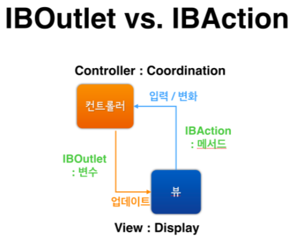
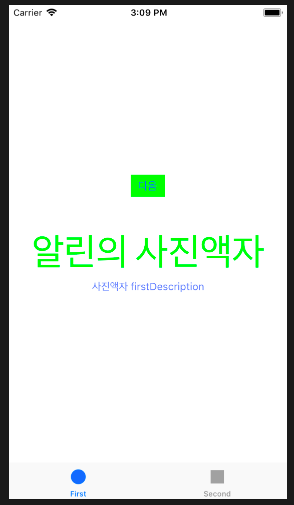
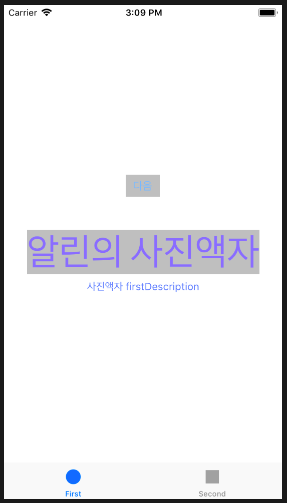
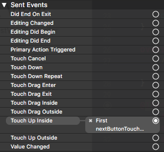

## 미션 진행사항
### Step1 - 시작하기 - Tabbed App 템플릿
#### viewDidLoad()
- Question: 자동 생성된 ViewController 클래스 viewDidLoad() 함수에서 print(#file, #line, #function, #column) 코드를 추가하고 실행하면 콘솔 영역에 무엇이 출력되는지 확인한다.
- Answer: 2018.03.09 16:50
  
#### UITabBarController 와 UITabBar
- Question: 애플 UIKit View Management 클래스 중에서 UITabBarController 와 UITabBar에 대해 학습한다.
- Answer: [UITabBarController 와 UITabBar에 대한 내용 정리 링크](https://jinios.github.io/ios/2018/03/09/difference_UITabBar_UITabBarController/)

### Step2 - IBOutlet
> Assistant Editor Mode에서 레이블을 선택하고 `control + 드래그`로 ViewController 코드에 IBOutlet으로 연결한다.

- 구현 화면: 2018.03.11 19:20
  

#### UILabel 클래스 속성 (계속 추가할 예정)
  - `vat text: String? { get set }`
  - `var textColor: UIColor! { get set }`
    - [Custom textColor를 사용하는 방법 정리](https://jinios.github.io/ios/2018/03/11/ios_color_literal/)
  - `var font: UIFont! { get set }`
    - font속성 사용예시 : `labelName.font = labelName.font.withSize(15)`

#### UI
User Interface의 약자로, 사용자와 직접 상호작용 하는 접점을 뜻한다. 모바일 앱 개발에서는 사용자가 보는 화면이라고 생각하면 됨.

#### Interface Builder & Storyboard
***Interface Builder:*** Xcode에서, 앱의 UI요소들을 visualized해서 컨트롤 할 수 있도록 해주는 인터페이스 빌더.

***Storyboard:*** device상에서 사용자에게 나타나는 UI를 보여주는 파일. <br/>템플릿으로부터 만들어진 모든 프로젝트들은 Main.storyboard파일과 iOS앱의 경우 LaunchScreen.storyboard파일이 있다.(앱이 런칭될 때 화면) 이 스토리보드 파일은 뷰컨트롤러와 뷰를 가지고있는데 스토리보드 파일 내의 UI요소들을 확인하면서 인터페이스 빌더를 통해 이를 변경/확인할 수 있다.

#### IBOutlet과 IBAction의 관계


- ***IBOutlet과 IBAction:***
  - 화면(View)와 컨트롤러를 연결하고 매핑시키는 작업을 할 때 사용한다.
  - 사용자는 View와 상호작용한다.
  - IBAction은 사용자를 통해 발생한 이벤트를 감지해서 Controller에 메시지를 보낸다.
  - 컨트롤러는 특정 로직을 수행하고 뷰에 변경사항이 있으면 어떤 것을 변경하라는 지시를 내린다.
  - IBOutlet은 처리 결과를 View단에 알려서 원하는 동작을 이끌어낸다.


`IBOutlet(ex. 코드와 연결된 버튼) -> 코드는 그 버튼을 조정할 수 있게 됨 -> IBAction(버튼을 동작시켰을때 어떻게 변화해야하는지에 대한 동작을 담고있는 메소드)`
스토리보드에 있는 UI요소들과 연결하고싶은 속성을 코드로 정의했다면 아래의 키워드를 이용해서 연결시킬 수 있다.
  - ***IBOutlet :***
  인터페이스 빌더에서 사용되는 타입 한정자로, 코드가 UI 엘리먼트에 메시지를 보낼 수 있도록 하기 위한 연결점같은 개념이다. 속성이나 객체변수를 선언할때 객체 변수의 앞에 쓴다.
    ```swift
    @IBOutlet weak var photoLabel: UILabel!
    ```
  - ***IBAction:***
  인터페이스 빌더에서 사용되는 타입 한정자로, 메소드를 UI 엘리먼트와 코드 간의 연결점해주기 위한 개념이다. 메소드 선언 시 `void` 리턴타입 대신 사용한다.
    ```swift
    @IBAction func likedThis(sender: UIButton) {
      ...
    }
    ```
  [IBOutlet과 IBAction 참고링크](https://thatthinginswift.com/ibaction-and-iboutlet/)


### Step3 - IBAction
> First Scene에 버튼(UIButton)을 추가하고 IBAction으로 연결한다.

- 구현화면 : 2018.03.12 14:30
  - 버튼 클릭 전
    
  - 버튼 클릭 후
    


#### 버튼에 IBAction을 추가할 때 이벤트(Event) 종류


- touchDown
  - A touch-down event in the control.

- touchDownRepeat
  - A repeated touch-down event in the control; for this event the value of the UITouch tapCount method is greater than one.

- touchDragInside
  - An event where a finger is dragged inside the bounds of the control.

- touchDragOutside
  - An event where a finger is dragged just outside the bounds of the control.

- touchDragEnter
  - An event where a finger is dragged into the bounds of the control.

- touchDragExit
  - An event where a finger is dragged from within a control to outside its bounds.

- touchUpInside
  - A touch-up event in the control where the finger is inside the bounds of the control.

- touchUpOutside
  - A touch-up event in the control where the finger is outside the bounds of the control.

- touchCancel
  - A system event canceling the current touches for the control.

- valueChanged
  - A touch dragging or otherwise manipulating a control, causing it to emit a series of different values.

- primaryActionTriggered
  - A semantic action triggered by buttons.

- editingDidBegin
  - A touch initiating an editing session in a UITextField object by entering its bounds.

- editingChanged
  - A touch making an editing change in a UITextField object.

- editingDidEnd
  - A touch ending an editing session in a UITextField object by leaving its bounds.

- editingDidEndOnExit
  - A touch ending an editing session in a UITextField object.

#### 버튼에 액션을 여러개 추가할 수 있을까?
  - 연결은 가능하지만, 메소드 내부에서 절차적으로 실행되기때문에 결과적으로 view에는 가장 마지막 코드만 적용되어 보여지게된다.
#### 버튼이 여러일 때 하나의 액션에 추가할 수 있을까?
  - 하나의 메소드를 재활용이 가능한 구조로 설계하여 여러 객체에 사용하게 만들 수 있는 것처럼 마찬가지로 여러 IBOutlet과 연결이 가능하지만, 만약 IBOutlet의 종류마다 다르게 동작하도록 만들고싶다면 IBAction메소드 내부에서 `switch-case`를 사용해서 만들 수 있다. [(참고링크)](https://stackoverflow.com/questions/37870701/how-to-use-one-ibaction-for-multiple-buttons-in-swift)
