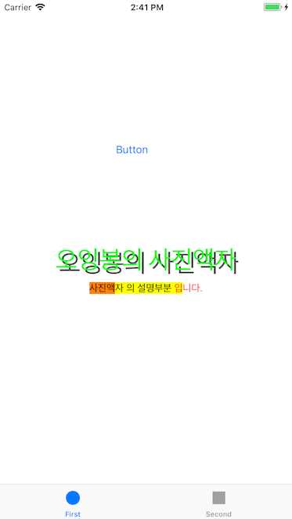
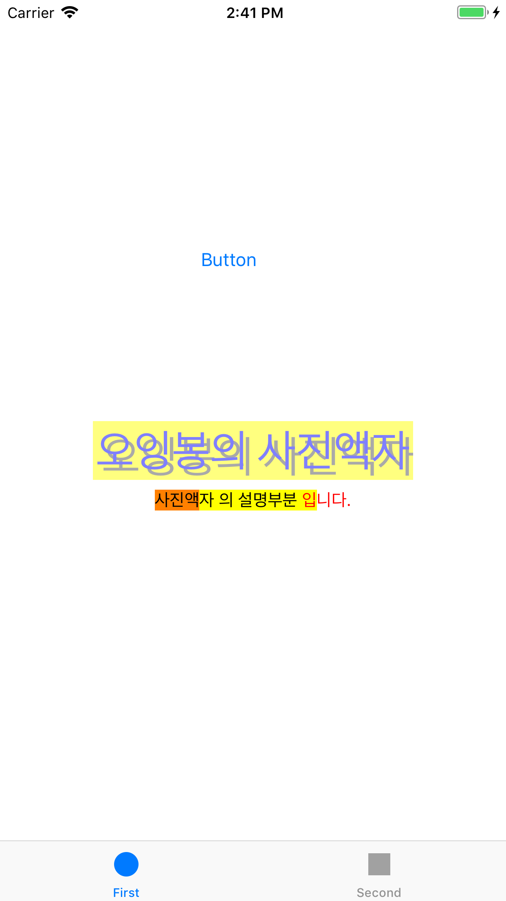
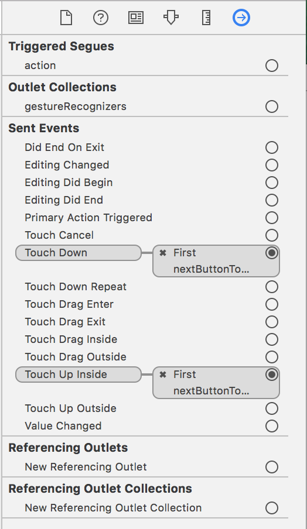

# PhotoFrame

## Step1 - Tabbed App 템플릿


### Console
`First :  /Users/oingbong/Documents/CodeSquad/Level3/swift-photoframe/PhotoFrame/PhotoFrame/FirstViewController.swift 17 viewDidLoad() 58`

`Second :  /Users/oingbong/Documents/CodeSquad/Level3/swift-photoframe/PhotoFrame/PhotoFrame/SecondViewController.swift 16 viewDidLoad() 57`


### UITabbarController
 - UITabbar 를 포함해 UITabbar 에서 선택한 View 까지 포함하는 전체적인 의미

### UITabbar
 - 여러 View 중에 하나를 선택할 수 있게 하단 혹은 화면 끝단에 존재하는 라디오 버튼 형식의 바

---

## Step2 - IBOutlet

### UILabel

> 하나 이상의 읽기 전용 텍스트 행을 표시하는 보기 , 의도된 목적을 설명하기 위해 컨트롤과 함께 사용되는 경우가 많습니다.

 - 개요
 : 레이블 모양을 구성할 수 있으며, 레이블 내의 문자열도 사용자가 지정할 수 있습니다.  

 - 국제화
 : 레이블은 많은 사용자와 통신할 수 있는 중요한 컨트롤 중 하나이므로 국제화가 중요합니다. 따라서 국제화 구현도 가능합니다. ( 아래 URL 참조 )
[About Internationalization and Localization](https://developer.apple.com/library/archive/documentation/MacOSX/Conceptual/BPInternational/Introduction/Introduction.html#//apple_ref/doc/uid/10000171i)

### Topics

---
##### Accessing the Text Attributes (텍스트 속성 엑세스)
| 이름 | 내용 |
| --- | :---: |
| `var text: String?` | 레이블에 표시되는 텍스트 |
| `var attributedText: NSAttributedString?` | 레이블로 표시되는 현재 스타일 텍스트 |
| `var font: UIFont!` | 텍스트를 표시하는데 사용되는 글꼴 |
| `var textColor: UIColor!` | 텍스트 색상 |
| `var textAlignment: NSTextAlignment` | 텍스트를 정렬하는데 사용하는 기술 |
| `var lineBreakMode: NSLineBreakMode` | 레이블의 텍스트를 줄바꿈하고 자르는데 사용하는 기술 |
| `var isEnabled: Bool` | 레이블의 텍스트를 그릴 때 사용할 활성화 상태 |
---
##### Sizing the Label's Text (레이블 텍스트 크기 조정)
| 이름 | 내용 |
| --- | :---: |
| `var adjustsFontSizeToFitWidth: Bool` | 제목 문자열을 레이블의 경계 사각형에 맞추기 위해 글꼴 크기를 줄여야 하는지 여부를 나타내는 부울 값 |
| `var allowDefaultTighteningForTruncation: Bool` | 레이블을 잘라내기 전에 텍스트를 고정하는지 여부를 나타내는 부울 값 |
| `var baselineAdjustment: UIBaselineAdjustment` | 레이블에 맞게 텍스트를 축소해야 할 때 텍스트 기준선이 조정되는 방식을 제어 |
| `var minimumScaleFactor: CGFloat` | 라벨의 텍스트에 지원되는 최소 축척 비율 |
| `var numberOfLines: Int` | 텍스트 렌더링에 사용할 최대 줄 수 |
---
##### Managing Highlight Values (하이라이트 값 관리)
| 이름 | 내용 |
| --- | :---: |
| `var highlightedTextColor: UIColor?` | 레이블의 텍스트에 적용된 강조 표시 색상 |
| `var isHighlighted: Bool` | 강조 표시로 레이블을 그릴지 여부를 나타내는 부울 값 |
---
##### Drawing a Shadow (그림자 그리기)
| 이름 | 내용 |
| --- | :---: |
| `var shadowColor: UIColor?` | 텍스트의 그림자 색상 |
| `var shadowOffset: CGSize` | 텍스트의 그림자 오프셋(점 단위로 측정) |
---
##### Drawing and Positioning Overrides (중첩 그리기 및 배치)
| 이름 | 내용 |
| --- | :---: |
| `func textRect(forBounds: CGRect, limitedToNumberOfLines: Int) -> CGRect` | 레이블의 텍스트에 대한 직사각형을 반환 |
| `var drawText(in: CGRect)` | 지정된 사각형에 레이블의 텍스트(또는 그림자)를 그립니다. |
---
##### Getting the Layout Constraints (레이아웃 제약 조건 가져오기)
| 이름 | 내용 |
| --- | :---: |
| `var preferredMaxLayoutWidth: CGFloat` | 다중 행 레이블의 기본 최대 너비(점) |
---
##### Setting and Getting Attributes (특성 설정 및 가져오기)
| 이름 | 내용 |
| --- | :---: |
| `var isUserInteractionEnabled: Bool` | 사용자 이벤트를 무시하고 이벤트 대기열에서 제거할지 여부를 결정하는 부울 값 |
---
##### Related Types (관련유형)
| 이름 | 내용 |
| --- | :---: |
| `enum NSTextAlignment` | 이 상수는 텍스트 정렬을 지정 |
---
##### Instance Properties (인스턴스 특성) - Beta
| 이름 | 내용 |
| --- | :---: |
| `var enablesMarqueeWhenAncestorFocused: Bool` | - |
---

#### NSMutableAttributedString & NSAttributedString 차이
: NSMutableAttributedString 은 변경 가능한 문자열 객체로써 append 등 가능 , NSAttributedString 는 변경 못함

#### 순환참조
 - strong : `Defalut` 로써 아무것도 명시하지 않으면 설정되며 `강한참조`라고도 합니다.
 - weak : `약한참조` 이며 옵셔널입니다.
 - unowned : `weak` 와 동일한 `약한참조` 이지만 옵셔널이 아닙니다.
 ```
클래스의 메모리와 관련된 용어들이며 Swift 는 자동으로 메모리 관리를 해줍니다. 따라서, ARC(Automatic Reference Counting) 라는 
용어 아래 많은 관련 용어들이 있지만 그 중 기본적으로 strong , weak , unowned 용어가 있습니다.
레퍼런스 카운팅을 계산하여 메모리를 해제하는 여부를 결정하는데 사용되는 것들이며 strong 을 잘못쓰게 되면
영원히 메모리상에서 지울 수 없는 인스턴스가 존재하게 되며 이를 보완하기 위해 weak 와 unowned 을 사용합니다.
weak 는 옵셔널이기 때문에 참조하는 값이 없다면 nil 로 값이 설정되지만 unowned은 항상 값이 있다는 것을 전제로 하기 때문에 참조값이 없는 경우에는 
크러시가 발생하게 될 것입니다.
```
#### 참고
 - [fonts - How do I make an attributed string using Swift? - Stack Overflow](https://stackoverflow.com/questions/24666515/how-do-i-make-an-attributed-string-using-swift)
 - [때로는 까칠하게.. :: Swift ARC(Automatic Reference Counting)](http://kka7.tistory.com/21)
 - [스위프트 ARC와 순환참조와 클로저 · Out of Bedlam](https://outofbedlam.github.io/swift/2016/01/31/Swift-ARC-Closure-weakself/)


---

## Step3 - IBAction

### IBAction 이벤트 종류
| 이름 | 내용 |
| --- | :---: |
| Did End On Exit | 

| Editing Changed | UITextField 객체에서 편집 변경을 수행하는 터치 |
| Editing Did Begin | UITextField 객체에서 해당 경계에 들어서면서 편집 세션을 시작하는 터치 |
| Editing Did End | UITextField 객체에서 해당 경계를 벗어나 편집 세션을 종료하는 터치 |
| Primary Action Triggered | 버튼에 의해 트리거(시작)된 의미 동작 |
| Touch Cancel | 컨트롤의 현재 터치를 취소하는 시스템 이벤트 |
| Touch Down | 버튼을 누를 때의 상태 이벤트 |
| Touch Down Repeat | 컨트롤에서 반복된 터치다운 이벤트 (이 이벤트의 경우 UITouch tapCount 메소드의 값이 1보다 큽니다) |
| Touch Drag Enter | 제어 범위로 손가락을 끄는 이벤트 |
| Touch Drag Exit | 제어 범위내에서 밖으로 손가락을 끄는 이벤트 |
| Touch Drag Inside | 제어 범위내에서 손가락을 끄는 이벤트 |
| Touch Drag Outside | 제어 범위 바로 밖에서 손가락을 끄는 이벤트 |
| Touch Up Inside (Default) | 제어 범위내에서 버튼을 누르고 땠을 때의 상태 이벤트 |
| Touch Up OutSide | 제어 범위밖에서 버튼을 누르고 땠을 때의 상태 이벤트 |
| Value Changed | 터치를 드래그하거나 다른 방식으로 조작하여 일련의 다른 값을 방출하도록하는 컨트롤 |

### 버튼 클릭 Before & After 스크린샷



### 버튼에 액션을 여러개 추가할 수 있을까?
 - 가능 : 아래 스크린샷 참고
 

### 버튼이 여러일 때 하나의 액션에 추가할 수 있을까?
 - 가능 : 하나의 액션을 만들고 추가적으로 버튼을 해당 액션에 드래그해서 중복 설정이 가능합니다.

#### 참고
 - [UIControl.Event - UIControl | Apple Developer Documentation](https://developer.apple.com/documentation/uikit/uicontrol/event)

---

## Step4 - Scene 과 Segue
 > 화면의 직사각형 영역에 대한 내용을 관리하는 객체입니다.

### Overview
 - 뷰는 앱의 사용자 인터페이스의 기본 구성 요소이며 UIView클래스는 모든 뷰에 공통된 동작을 정의합니다.
 - 뷰 객체는 경계 사각형 내에 내용을 렌더링하고 해당 내용과의 상호 작용을 처리합니다.
 - 이 UIView클래스는 인스턴스화하여 고정 된 배경색을 표시하는데 사용할 수 있는 구체적인 클래스입니다.
 - 보다 정교한 컨텐츠를 그리기 위해 서브 클래스화 할 수도 있습니다.
 - 앱에서 흔히 볼 수 있는 라벨, 이미지, 버튼 및 기타 인터페이스 요소를 표시하려면 직접 정의하려는 것이 아니라 UIKit 프레임 워크에서 제공하는 보기 하위 클래스를 사용하십시오.
 
### Creating a View
  - 일반적으로 라이브러리에서 캔버스로 드래그하여 스토리보드에 뷰를 만듭니다.
  - 프로그래밍 방식으로 뷰를 만들 수도 있습니다. (아래 코드 참고)
  - 보기를 작성 할 때 대개 미래의 수퍼 뷰와 관련된 초기 크기 및 위치를 지정합니다. 
```
let rect = CGRect(x: 10, y: 10, width: 100, height: 100)
let myView = UIView(frame: rect)
```

 - 다른 뷰에서 하위 뷰를 추가하려면 수퍼뷰에서 `addSubview` 메소드를 호출하십시오.
 - 뷰에 여러 개의 하위 뷰를 추가할 수 있으며, iOS에서 아무런 문제 없이 형제(같은계층) 뷰가 서로 겹칠 수도 있습니다.
 - `addSubview` 메소드에 대한 각 호출은 새 뷰를 다른 모든 형제(같은계층) 뷰 위에 배치합니다.
 - `insertSubview(_:aboutSubview:)` 및 `insertSubview(_:bowSubview:)` 방법을 사용하여 하위 뷰의 상대적 z 순서를 지정 할 수 있습니다.
 - 또한 `ExchangeSubview` 메소드를 사용하여 이미 추가된 하위 뷰의 위치를 교환할 수도 있습니다.
 - 뷰를 생성한 후 자동 레이아웃 규칙을 생성하여 보기 계층의 나머지 변경 사항에 따라 뷰의 크기와 위치가 어떻게 변경되는지 제어합니다.
 - 자세한 내용은 [Auto Layout Guide: Understanding Auto Layout](https://developer.apple.com/library/archive/documentation/UserExperience/Conceptual/AutolayoutPG/index.html#//apple_ref/doc/uid/TP40010853) 참고하십시오.
 
### The View Drawing Cycle
 - 뷰 그리기는 필요에 따라 수행됩니다.
 - 뷰가 처음 표시되거나 레이아웃 변경으로 인해 전체 또는 일부가 표시되면 시스템은 뷰에 내용을 그리도록 요청합니다.
 - UIKit 또는 Core Graphics를 사용하여 사용자 지정 컨텐츠를 포함하는 뷰의 경우 시스템은 뷰의 그리기 방법을 호출합니다.
 - 이 방법을 구현하려면 이 방법을 호출하기 전에 시스템이 자동으로 설정하는 현재 그래픽 컨텍스트에 뷰 내용을 그려야 합니다.
 - 그러면 화면에 표시할 수 있는 뷰 컨텐츠의 정적 시각적 표시가 만들어집니다.
 
### Animations
 - 여러 뷰 특성에 대한 변경 사항을 애니메이션화 할 수 있습니다. 즉, 특성을 변경하면 현재 값에서 시작하여 지정한 새 값으로 끝나는 애니메이션이 생성됩니다.
 - UIView 클래스의 다음 속성은 애니메이션에 적합합니다.
    - frame
    - bounds
    - center
    - transform
    - alpha
    - backgroundcolor
 - 변경 사항을 애니메이션으로 적용하려면 객체를 만들고 해당 핸들러 블록을 사용하여 뷰의 속성 값을 변경합니다.
 - 이 클래스를 사용하면 애니메이션의 재생 시간과 타이밍을 지정할 수 있지만 실제 애니메이션을 수행합니다.
 - 애니메이션을 중단하고 대화식으로 구동하기 위해 현재 실행중인 속성 기반 애니메이터를 일시중시 할 수 있습니다.
 - 자세한 내용은 [UIViewPropertyAnimator - UIKit | Apple Developer Documentation](https://developer.apple.com/documentation/uikit/uiviewpropertyanimator) 을 참고하십시오.
 
### Threading Considerations
  - 응용 프로그램의 사용자 인터페이스에 대한 조작이 메인 스레드에서 수행되어야 합니다.
  - 따라서 애플리케이션의 메인 스레드에서 실행되는 코드에서 항상 UIView 클래스의 메소드를 호출해야 합니다.
  - 이것이 엄격히 필요하지 않을 수 있는 유일한 시간은 뷰 객체 자체를 생성할 때 뿐이지만 다른 모든 조작은 메인 스레드에서 수행되어야 합니다.
 
### Subclassing Notes
  - UIView 클래스는 사용자 상호 작용이 필요한 시각적 콘텐츠의 핵심 하위 분류 지점이다.
  - UIView를 하위 등급으로 분류하는 데는 여러 가지 좋은 이유가 있지만, 기본 UIView 클래스나 표준 시스템 보기가 필요한 기능을 제공하지 않는 경우에만 그렇게 하는 것이 좋습니다.
  - 하위 분류를 위해서는 뷰를 구현하고 성능을 조정하기 위해 더 많은 작업이 필요합니다.
  - 하위 분류를 피하는 방법에 대한 자세한 내용은 [UIView - UIKit | Apple Developer Documentation](https://developer.apple.com/documentation/uikit/uiview#1652896) 을 참고하십시오.
  
### Methods to Override
  - UIView를 하위 분류하는 경우, 재정의 해야되는 메소드가 몇가지 있으며 필요에 따라 재정의 할 수 있는 여러가지 방법이 있습니다.
  - UIView는 구성이 매우 뛰어난 클래스이기 때문에 하위 분류 섹션의 대안 섹션에서 설명하는 사용자 지정 방법을 재정의하지 않고 정교한 뷰 동작을 구현하는 방법도 많습니다.

### Alternatives to Subclassing
 - 대부분의 뷰 동작은 하위 분류 없이도 구성할 수 있습니다.
 - 재정의를 시작하기 전에 다음 속성 또는 동작을 수정하면 필요한 동작을 제공할 수 있는지 고려하십시오.
    - addConstraint(_:) : 뷰 및 해당 하위 뷰에 대한 자동 레이아웃 동작을 정의합니다.
    - autoresizingMask : 수퍼 뷰의 프레임이 변경될 때 자동 레이아웃 동작을 제공합니다. 이러한 행동들은 제약조건과 결합될 수 있습니다.
    - contentMode : 뷰 프레임이 아닌 뷰 컨텐츠에 대한 레이아웃 동작을 제공합니다. 또한 이 속성은 보기에 맞게 콘텐츠 크기를 조정하는 방법 및 컨텐츠가 캐시되었는지 또는 다시 그려졌는지 여부에도 영향을 줍니다.
    - isHidden or alpha : 뷰의 렌더링된 내용에 알파를 숨기거나 적용하는 대신 뷰의 투명성을 전체적으로 변경합니다.
    - backgroundColor : 직접 색을 칠하는 대신 뷰의 색상을 설정합니다.
    - Subviews : 메소드를 사용하여 내용을 그리는 대신 표시할 내용과 함께 이미지 및 레이블 하위 보기를 포함합니다.
    - Gesture recognizers : 직접 터치 이벤트를 가로채는 하위 클래스가 아니라 제스처 인식기를 사용하여 대상 객체에 대상 동작을 보낼 수 있습니다.
    - Animations : 스스로 변화를 애니메이션화하려고 하기보다는 내장된 애니메이션 지원을 사용합니다.
    - Image-based backgrounds : 비교적 정적 컨텐츠를 표시하는 뷰의 경우 하위 분류 및 이미지 그리기 대신 제스처 인식기가 포함된 uIImageView 객체를 사용하는 것이 좋습니다. 또는 일반 UIView 객체를 사용하고 이미지를 뷰의 CALayer 객체의 컨텐츠로 할당 할 수도 있습니다.

 - 애니메이션은 복잡한 그리기 코드를 세분화하고 구현할 필요 없이 뷰를 시각적으로 변경하는 또 다른 방법입니다.
 - UIView 클래스의 많은 특성은 animatable , 이러한 속성을 변경하면 시스템 생성 애니메이션이 트리거 될 수 있습니다.
 - 애니메이션을 시작하려면 코드 한 줄만 있으면 후속 변경 사항이 애니메이션으로 표시되어야 합니다.
 - 뷰에 대한 애니메이션 지원에 대한 자세한 내용은 [UIView - UIKit | Apple Developer Documentation](https://developer.apple.com/documentation/uikit/uiview#1652828) 을 참고하십시오.
 
 ### Topic
  - [UIView - UIKit | Apple Developer Documentation](https://developer.apple.com/documentation/uikit/uiview) 참고하십시오.

### Segue 종류

#### Show 
 - 가장 일반적인 세그웨이이며 새 화면으로 이동 , Stack 구조로서 새 화면이 원래 화면 위를 덮는 구조
 - View 컨트롤러가 UINavigationController 에 있을 때 다음 View 컨트롤러를 탐색하고 스택으로 푸시하는 방법  
 - 이렇게 하면 사용자가 뒤로 버튼을 클릭하여 이전화면으로 돌아갈 수 있습니다.
 - 화면에 보여지고 있는 마스터 또는 디테일 영역에 뷰를 로드합니다.
 - 마스터와 디테일 영역 모두 화면에 보여지고 있을 경우 로드되는 새로운 컨텐츠 뷰는 디테일 영역의 네비게이션 스택에 푸시됩니다.
 - 마스터와 디테일 영역 중 하나만 보여지고 있을 경우 현재 뷰 컨트롤러 스택의 최상단에 푸시됩니다.

#### Show Detail
 - SplitView 구조에서 원래 화면을 Master , 새 화면을 Detail로 표시합니다. 
 - 아이폰에서는 똑같아 보이지만 아이패드로 보면 화면이 둘로 분할되서 보이게 됩니다.
 - View 컨트롤러가 UISplitViewController에 있는 경우 UISplitView의 세부 보기 측면이 다음 뷰 컨트롤러로 대체되는 방법
 - show 와 비슷하지만 푸시가 아닌 교체(replace) 됩니다. 마스터와 디테일 영역 모두 화면에 보여지고 있을 경우 로드되는 뷰는 디테일 여역을 교체하게 되며 둘 중 하나만 보여지고 있을 경우 현재 뷰컨트롤러 스택의 최상단 뷰를 교체합니다.
 
 #### Present Modally
 - 새 화면이 모달처럼 원래 화면 위 전체를 뒤덮습니다. 원래 화면은 새 화면 뒤에 그대로 존재하게 됩니다.
 - 이 컨트롤러는 일반적으로 UINavigationController 또는 UISplitView Controller의 일부일 필요는 없습니다.
 - 이것은 보통 사용자가 마침이나 취소를 해야 할 때 사용됩니다.
 - 또한 , Presentation(보여지는 스타일) & Transition(트랜지션 스타일) 설정을 통해 추가적인 애니메이션 구성도 가능합니다.

#### Popover Presentation
 - 아이패드에서 팝업 형태로 컨텐츠 뷰를 띄웁니다. 아이폰 앱에서는 Show Detail 과 마찬가지로 효과가 나타나지 않습니다.
 - UIPopoverArrowDirection 옵션을 사용하여 창에 붙어있는 엣지의 방향을 설정 할 수 있습니다.

#### Custom
 - 사용자 정의 Segue
 
 ##### 참고
 - [[iOS Swift] 화면이동 - Segue : 네이버 블로그](https://m.blog.naver.com/jdub7138/220393890771)
 - [Segue between Swift View Controllers — Coding Explorer Blog](http://www.codingexplorer.com/segue-swift-view-controllers/)
 - [XCode 스토리보드 사용시에 Segue 이용방법 3가지 | 아이군의 블로그](http://theeye.pe.kr/archives/2292)

---

## Step5 - ViewController 프로그래밍

#### View Controller 라이프 사이클 용어
1. ViewDidLoad
 - 해당 뷰 컨트롤러 클래스가 생성될 때 실행됩니다.
 - Low memory와 같은 특별한 경우가 아니라면 딱 한번만 실행되기 때문에 초기화 할 때 사용합니다.
 
2. ViewWillAppear
 - 뷰 컨트롤러가 화면에 나타나기 직전에 실행됩니다. 
 - 뷰 컨트롤러가 나타나기 전에 항상 실행되기 때문에 해당 뷰 컨트롤러가 나타나기 직전마다 일어나는 작업들을 해당 부분에 배치합니다.
 
3. ViewDidAppear
 - 뷰 컨트롤러가 화면에 나타난 직후에 실행됩니다.
 - 화면에 적용될 애니메이션을 그리거나 API로부터 정보를 받아와 화면을 업데이트 할 때 이곳에 로직을 위치시키면 좋습니다.
 - 왜냐하면 지나치게 빨리 애니메이션을 그리거나 API에서 정보를 받아와 뷰 컨트롤러를 업데이트 할 경우 화면에 반영되지 않습니다.

4. ViewWill / DidDisappear
 - 뷰 컨트롤러가 화면에 나타난 직전 / 직후에 실행됩니다.

#### Yellow & Blue View 이동 할 때의 라이프 사이클 변화
```
1. in YellowView
- viewDidLoad
- viewWillAppear
- viewDidAppear

2. out YellowView & in BlueView
- viewDidLoad (Blue)
- viewWillDisappear (Yellow)
- viewWillAppear (Blue)
- viewDidAppear (Blue)
- viewDidDisappear (Yellow)

3. out BlueView & back YellowView
- viewWillDisappear (Blue)
- viewWillAppear (Yellow)
- viewDidAppear (Yellow)
- viewDidDisappear (Blue)
```

#### StoryBoard 사용하지 않고 다음 화면으로 넘기는 방법
```
@IBAction func nextButtonTouched(_ sender: Any) {
    if let blueVC = self.storyboard?.instantiateViewController(withIdentifier: "BlueViewController") as? BlueViewController {
        self.present(blueVC, animated: true, completion: nil)
    }
}
```

#### 참고
- [UIViewController - UIKit | Apple Developer Documentation](https://developer.apple.com/documentation/uikit/uiviewcontroller)
- [앱 생명주기(App Lifecycle) vs 뷰 컨트롤러 생명주기(ViewController Lifecycle) in iOS](https://medium.com/ios-development-with-swift/%EC%95%B1-%EC%83%9D%EB%AA%85%EC%A3%BC%EA%B8%B0-app-lifecycle-vs-%EB%B7%B0-%EC%83%9D%EB%AA%85%EC%A3%BC%EA%B8%B0-view-lifecycle-in-ios-336ae00d1855)
