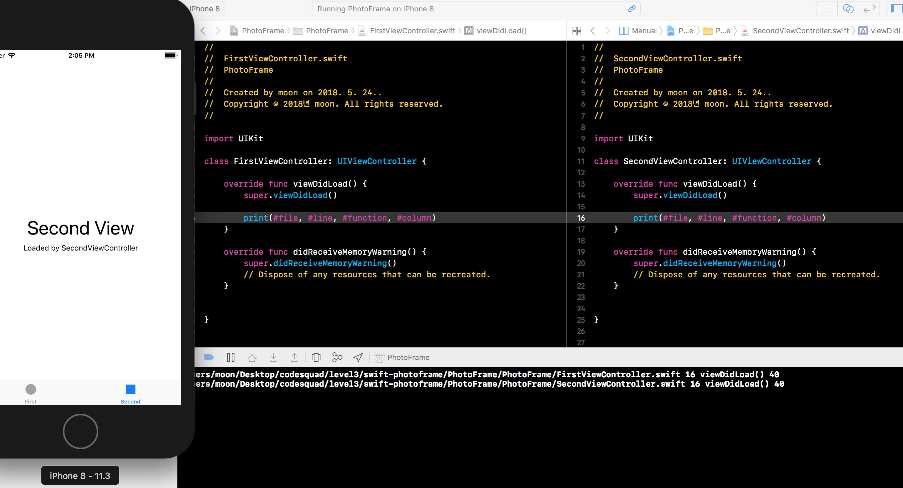

# PhotoFrame App

## Step1 - 시작하기 Tabbed App 템플릿

1. 프로그래밍 요구사항
	- 자동 생성된 ViewController 클래스 viewDidLoad() 함수에서 print(#file, #line, #function, #column) 코드를 추가하고 실행하면 콘솔 영역에 무엇이 출력되는지 확인한다.
2. UITabBarController와 UITabBar에 대해 학습한다.
3. UITabBar와 UITabbarController의 차이점은 무엇인가?

### 진행사항 (완성날짜: 2018/05/24 14:00)
