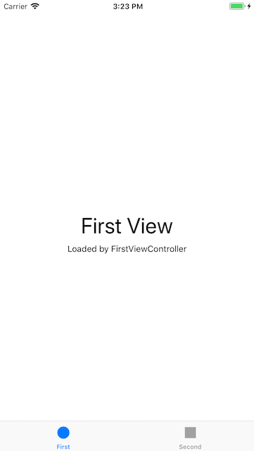
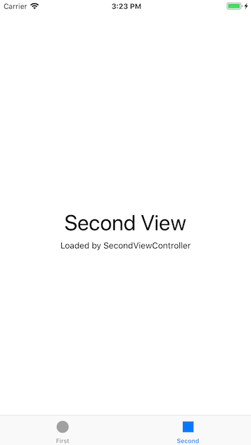

# PhotoFrame

## Step1 - Tabbed App 템플릿

### Console
`First :  /Users/oingbong/Documents/CodeSquad/Level3/swift-photoframe/PhotoFrame/PhotoFrame/FirstViewController.swift 17 viewDidLoad() 58`

`Second :  /Users/oingbong/Documents/CodeSquad/Level3/swift-photoframe/PhotoFrame/PhotoFrame/SecondViewController.swift 16 viewDidLoad() 57`

