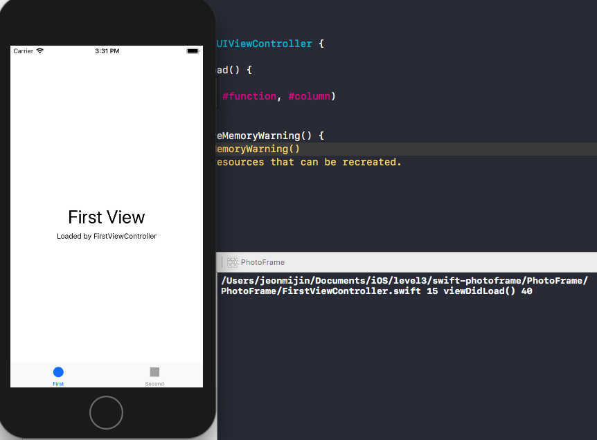
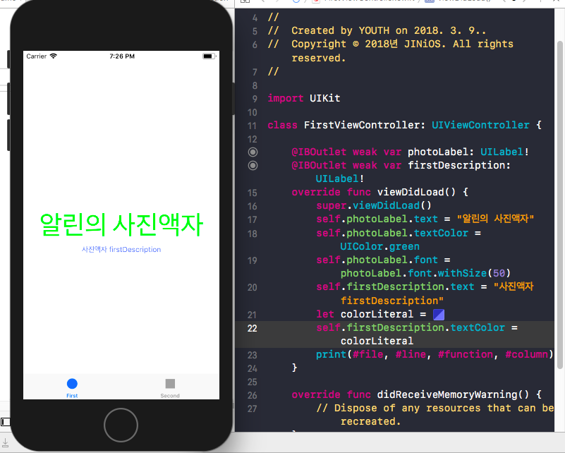

## 미션 진행사항
### Step1 - 시작하기 - Tabbed App 템플릿
#### viewDidLoad()
- Question: 자동 생성된 ViewController 클래스 viewDidLoad() 함수에서 print(#file, #line, #function, #column) 코드를 추가하고 실행하면 콘솔 영역에 무엇이 출력되는지 확인한다.
- Answer: 2018.03.09 16:50
  
#### UITabBarController 와 UITabBar
- Question: 애플 UIKit View Management 클래스 중에서 UITabBarController 와 UITabBar에 대해 학습한다.
- Answer: [UITabBarController 와 UITabBar에 대한 내용 정리 링크](https://jinios.github.io/ios/2018/03/09/difference_UITabBar_UITabBarController/)

### Step2 - IBOutlet
- Question: Assistant Editor Mode에서 레이블을 선택하고 `control + 드래그`로 ViewController 코드에 IBOutlet으로 연결한다.
- Answer: 2018.03.11 19:20
  

#### 알게 된 것들
- UILabel 클래스 속성 (계속 추가할 예정)
  - `vat text: String? { get set }`
  - `var textColor: UIColor! { get set }`
  - `var font: UIFont! { get set }`
    - font속성 사용 : `labelName.font = labelName.font.withSize(15)`
- IBOutlet과 IBAction : 스토리보드와 코드를 연결해준다. 스토리보드에 있는 UI요소들과 연결하고싶은 속성을 코드로 정의했다면 아래의 키워드를 이용해서 연결시킬 수 있다.
  - IBOutlet :
  인터페이스 빌더에서 사용되는 타입 한정자로, 코드가 UI 엘리먼트에 메시지를 보낼 수 있도록 하기 위한 연결점같은 개념이다. 속성이나 객체변수를 선언할때 객체 변수의 앞에 쓴다.
    ```swift
    @IBOutlet weak var photoLabel: UILabel!
    ```
  - IBAction:
  인터페이스 빌더에서 사용되는 타입 한정자로, 메소드를 UI 엘리먼트와 코드 간의 연결점해주기 위한 개념이다. 메소드 선언 시 `void` 리턴타입 대신 사용한다.
    ```swift
    @IBAction func likedThis(sender: UIButton) {
      ...
    }
    ```
  [IBOutlet과 IBAction 참고링크](https://thatthinginswift.com/ibaction-and-iboutlet/)
