# Step1 - UITabBarController, UITabBar (2019.6.25)

## View Controllers

- View Controllers는 **단일 루트 뷰를 관리**하며, 그 자체에는 임의의 개수의 하위 뷰가 포함될 수 있다.
- 해당 뷰 계층과의 사용자 상호 작용은 필요에 따라 앱의 다른 개체와 조정되는 View Controllers에 의해 처리 된다.
- 모든 앱에는 콘텐츠가 메인 창을 채우는 **View Controllers가 하나 이상 있다.(무조건)**
- 앱이 한 번에 화면에 들어갈 수 있는 것보다 더 많은 콘텐츠를 가지고 있는 경우 **multiple View Controllers**를 사용하여 해당 콘텐츠의 다른 부분을 관리한다.

## UIKit

- 특정 유형의 콘텐츠 탐색 및 관리를 위한 몇 가지 표준 View Controllers 제공한다.
- 앱의 사용자 지정 콘텐츠를 포함하는 View Controller를 정의할 수 있다.
- 새로운 탐색 체계를 구현하기 위해 사용자 정의 Container View Controller를 정의할 수 있다.

## UITabBarController와 UITabBar

- 앱을 개발할 때 흔히 쓰이는 View Controller 중 Tab은 아래와 같이 Tab에 있는 콘텐츠를 선택함으로써 다른 화면을 보여줄 수 있다.
- 이 처럼 같은 앱이지만 다루고 싶은 콘텐츠가 화면마다 확연히 다른 경우 또는 같은 콘텐츠지만 인터페이스이스가 다른 경우는 Tab 방식을 활용하는 것이 좋다.

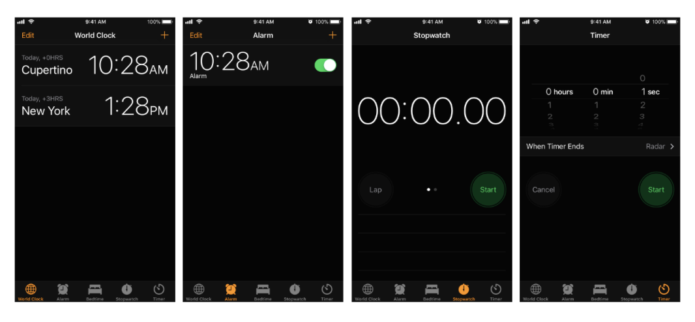

- Tab Bar Controller의 Tab bar 보기에 직접 엑세스하면 안 된다. Tab 표시줄 Controller 의 Tab을 구성하려면 각 tab에 대한 root view를 제공하는 View Controller **(UIViewController)를 상속** 받아야한다.
- Tab Bar 항목은 해당 View Controller를 통해 구성된다. Tab Bar 항목을 View Controller와 연결하려면 UITabBarItem 클래스의 새 인스턴스를 생성하고 View Controller에 맞게 구성한 다음 **View Controller의 Tab Bar에 할당**한다.
- 아이템 속성, View Controller에 사용자 정의 Tab 표시줄 항목을 제공하지 않는 경우 View Controller는 제목 속성에서 이미지와 텍스트를 포함하지 않는 기본 항목을 생성한다.
- Tab Bar 인터페이스와 상호 작용할 때 Tab Bar Controller 객체는 상호 작용에 대한 책임을 넘긴다. 책임을 넘겨 받은 객체는 **UITabBarContrrollerDelegate 프로토콜을 준수**해야 한다.

### UITabBarController

- UITabBarController 클래스는 **UIViewController 클래스에서 상속**되기 때문에, Controller 자체가 내부 View 속성에 접근할 수 있는 하나의 View를 가진다.
- TabBarItem을 품고 있는 TabBar 라는 View를 품고 있기에 각 Tab 별로 화면 전환이 가능하다.
- 여러 하위 View Controller를 포함하고 있는 Container지만 선택권을 사용자들에게 넘겨 사용자들이 원하는 한가지 하위 View만을 보여주는 방식
- UITabBarController를 사용한다면 Tab이 항상 화면 최하위에 위치 한다.

아래 그림은 View가 전체 Tab Bar 인터페이스를 나타내기 위해 어떻게 조립되는지 보여준다.

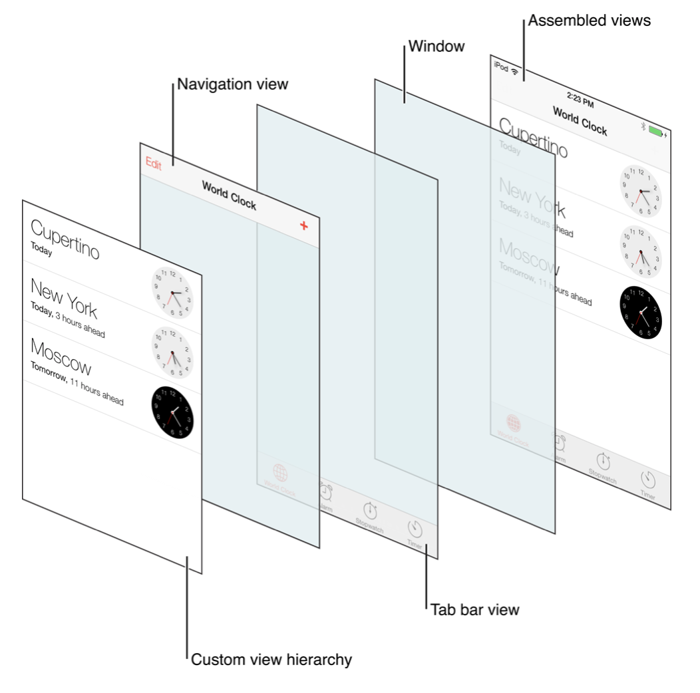

각 View에 Layer가 있어서 구분되며, TabBar View를 통해 Tab을 선택한다면 위에서 여러 겹쳐져 있는 화면 중에 오직 가장 최상단에 올라와 있는 Custom View부분만 변경되면서 현재 어떤 Tab이 선택되었는지를 나타낸다.

## UITabBar

- **UIView를 상속 받음**
- Tab Bar View에 해당하는 부분이며 UIView로, 사용자에게 탭들을 어떻게 보여주고 탭 클릭 시 어떻게 반응할 건지  알고 있다.
- UITabBar는 보통 UITabBarController와 함께 사용하지만 **혼자 쓰일 수도 있으며**, 각 탭을 구분하는 버튼을 포함한다.
- 각각의 버튼은 탭의 종류를 뜻하며 item이라고 하며, **TabBarItem은 TabBar에 최소 1개 이상**이다.
- 종류가 6가지가 넘어간다면 처음 4가지만 표시되고 나머지는 the standard More item(보통 `∙∙∙`) 이라는 버튼으로 표시된다.
- TabBar의 Item들을 구성할때는 Interface Builder(Storyboard)를 활용하는 방식과 프로그래밍으로 직접 처리하는 방식 두가지가 있다.

|         속성         |                             내용                             |
| :------------------: | :----------------------------------------------------------: |
|    **Background**    | Bar에 표시할 배경 이미지. 확장 가능한 이미지를 지정하면 사용 가능한 공간에 맞게 영상이 확장되고 그렇지 않으면 이미지가 타일링된다. 배경 이미지를 구성할 때 탭 표시줄은 색조 정보를 무시한다. 이 속성을 프로그래밍 방식으로 설정하려면 **backageImage** 속성을 사용하면된다. |
|      **Shadow**      | Tab 표시줄의 사용자 정의 Shadow 이미지. Tab 표시줄에 사용자 지정 배경 이미지가 없을 경우 이 특성은 무시된다. 이 속성을 프로그래밍 방식으로 설정하려면 **shadowImage** 속성을 사용하면된다. |
|    **Selection**     | 선택한 Tab에 사용할 이미지. 이 특성을 프로그래밍 방식으로 설정하려면**IndicatorImage** 속성을 사용하면된다. |
|    **Image Tint**    | 선택한 항목에 적용할 틴트 색상. 이 특성을 프로그래밍 방식으로 설정하려면 **tintColor** 속성을 사용하면된다. |
|      **Style**       | Bar에 적용할 기본 스타일. 어둡거나 밝은 스타일로 Tab Bar를 구성할 수 있으며 막대는 불투명하거나 반투명할 수 있다. 스타일을 프로그래밍 방식으로 설정하려면 **barStyle** 및 **isTranslucent** 속성을 사용하면된다. |
|     **Bar Tint**     | 막대에 적용할 틴트 색상. 이 특성을 프로그래밍 방식으로 설정하려면 **barTintColor** 속성을 사용하면된다. |
| **Item Positioning** | 항목에 적용할 위치. 이 특성을 사용하여 항목이 탭 막대의 길이에 걸쳐 간격을 두는 방법을 구성해야한다. 이 속성을 프로그래밍 방식으로 설정하려면 **itemPositioning** 속성을 사용하면된다. |

# Step2 - UILabel (2019.6.26)

## UILabel

: 문자열을 화면에 보여주고 싶을 때 사용하는 클래스

|             속성             | 설명                                                         |
| :--------------------------: | :----------------------------------------------------------- |
|          **alpha**           | 투명도를 설정하는 프로퍼티로 0~1 사이의 값을 가지며 0은 완전히 안 보이게, 1은 완전히 보이게 된다. |
|          **frame**           | 위치를 설정하는 프로퍼티. **CGRect** 클래스 형태로 설정      |
|     **backgroundColor**      | 배경색을 설정하는 프로퍼티. **UIColor** 클래스 형태로 설정   |
|           **text**           | 문자열의 내용을 설정하거나 바꾸고, 설정된 값을 가져올 수 있는 프로퍼티 |
|        **textColor**         | 문자열의 색깔을 바꾸고 현재 설정된 문자열의 색깔을 가져올 수 있는 프로퍼티. **UIColor** 클래스로 설정 |
|      **textAlignment**       | 문자열의 정렬 방식을 선택하는 프로퍼티.  - **UITextAlignmentLeft**: 문자열을 왼쪽으로 정렬  - **UITextAlignmentCenter**: 문자열을 가운데로 정렬  - **UITextAlignmentRight**: 문자열을 오른쪽으로 정렬 |
|           **font**           | 문자열에 적용할 폰트를 설정하고 가져올 때 사용하는 프로퍼티. **UIFont** 클래스에서 폰트의 종류와 크기를 설정해 적용할 수 있다. |
|      **numberOfLines**       | 표시할 줄의 개수를 설정하고 가져올 때 사용하는 프로퍼티. 기본값은 1 |
| **adjustFontSizetoFitWidth** | 글씨의 길이가 설정해 놓은 크기보다 커질 경우 폰트 크기를 줄일 것인지를 결정하는 프로퍼티  - **Yes**: 설정해 놓은 크기보다 글씨의 길이가 길 경우 폰트 크기를 줄인다.  - **No**: 설정해 놓은 크기보다 글씨의 길이가 길 경우 **'…'**으로 대체 |

### UILabel의 주요 메서드

- **initWithFrame**: 초기화하는 메서드로 위치와 크기를 설정해 초기화 한다. **CGRect** 값으로 설정

## UILabel 코드작성 및 결과

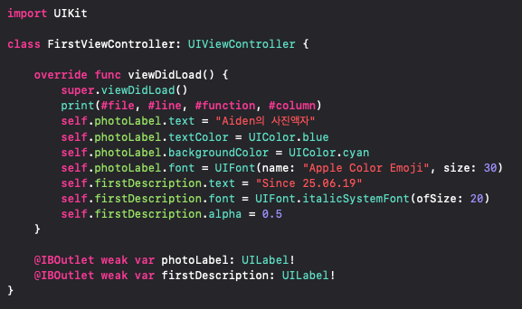

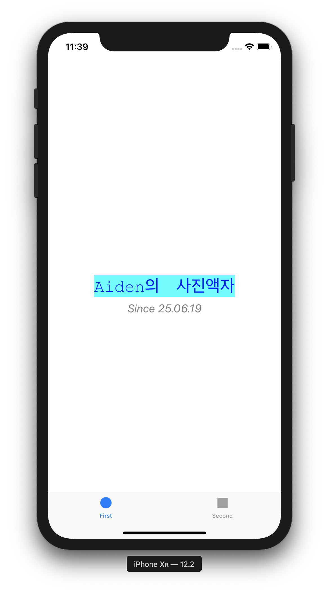

# Step3 - IBAction vs. IBOutlet (2019.6.26)

## UIButton

: 버튼에 연결된 모든 동작을 수행하고싶을 때 사용하는 클래스

## IBOutlet

- 객체의 속성을 제어할 목적으로 클래스의 프로퍼티에 연결
- 컨트롤러 헤더 파일에 선언한 객체를 인터페이스 빌더가 알아 볼 수 있도록 하는 역할
- 인터페이스 빌더의 객체와 클래스의 프로퍼티는 서로 타입이 일치해야한다.

## IBAction

- 객체의 이벤트 제어 ( 터치, 쿨릭 등 동적인 상태를 처리하는 메소드와 연결)
- 특정 객체에서 지정된 이벤트가 발생했을 때 일련의 프로세스를 실행하고자 할 때
- 해당 메소드가 액션 메소드라는 것을 인터페이스 빌더에게 알려주게 되며, 컨트롤러를 통해서 호출이 가능해진다. 
- **하나의 액션에 여러 버튼을 설정할 수 있다.**

### IBAction의 Event 종류

|       Event        | 설명                                          |
| :----------------: | --------------------------------------------- |
|  Did End On Exit   | 편집 후 포커스 없어짐                         |
|  Editing changed   | 편집                                          |
| Editing Did Begin  | 편집을 시작할 떄                              |
|  Editing Did End   | 편집을 종료할 때                              |
|    Touch Cancel    | 터치 취소 시                                  |
|     Touch Down     | 터치 다운 시                                  |
| Touch Down Repeat  | 여러번 터치 다운 시                           |
|  Touch Drag Enter  | 드래그하여 객체에 들어갔을 때                 |
|  Touch Drag Exit   | 드래그하여 객체를 벗어날 때                   |
| Touch Drag Inside  | 객체를 터치 후 드래그할 때                    |
| Touch Drag Outside | 객체를 터치 후 드래그하여 객체 밖으로 나올 때 |
|  Touch Up Inside   | 컨트롤에서 터치 업할 때                       |
|  Touch Up Outside  | 통제가 안되는 영역에서 터치 업할 때           |
|   Value Changed    | 값이 변경될 때                                |

- **하나의 버튼에 여러 액션을 추가할 수 있다.**

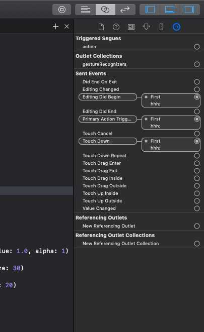

## UIButton 코드 작성 및 결과

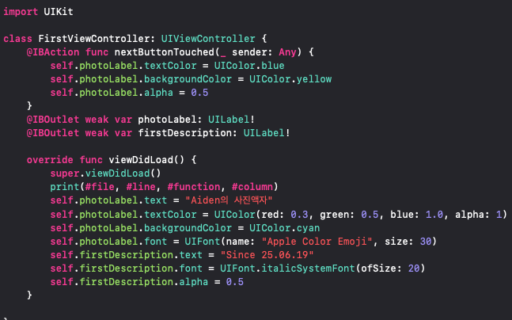

- 버튼 클릭 전

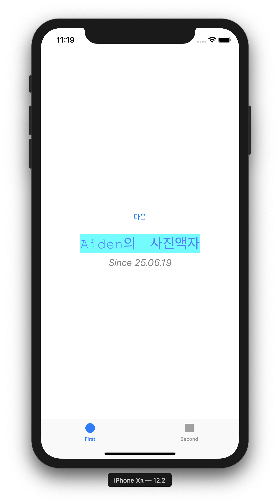

- 버튼 클릭 후

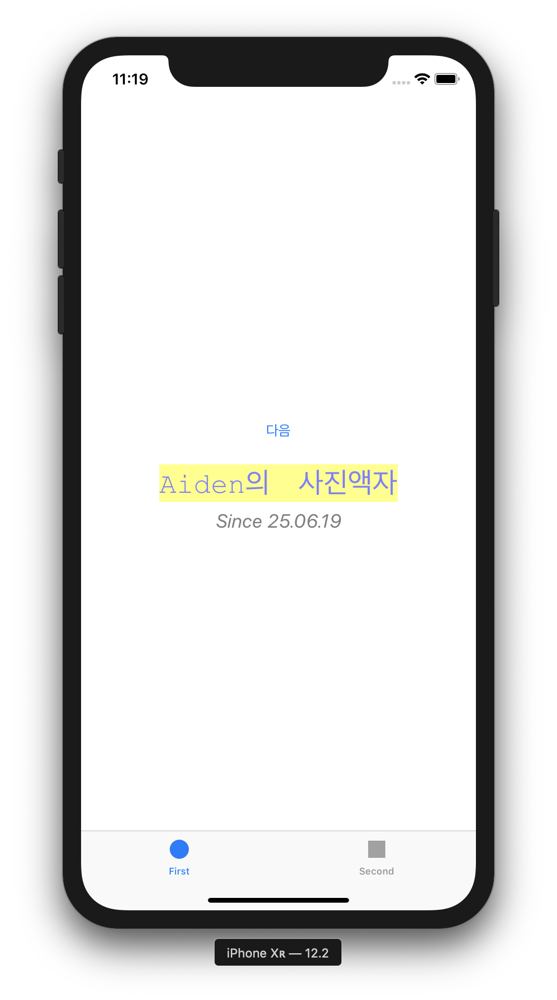

# Step4 - Scene과 Segue (2019.6.26)

## Scene

: 앱의 화면

## Segue

: Scene 간의 이동을 정의하고, 어떤 효과로 변할 것인지 정의하는 것

|       Seque        | 설명                                                         |
| :----------------: | ------------------------------------------------------------ |
|        Show        | 새 화면으로 이동. Stack 구조로서 새 화면이 원래 화면 위를 덮는 구조 |
|    Show Detail     | SplitView 구조에서 원래 화면은 Master, 새 화면은 Detail로 표시하는 구조. 아이폰에서는 똑같아 보이지만 아이패드로 보면 화면이 둘로 분할되서 보이게 된다. |
|  Present Modally   | 새 화면이 모달처럼 원래 화면 위 전체를 덮는 구조. 원래 화면은 새 화면 뒤에 그대로 존재하게 된다. |
| Present As Popover | 아이패드에서 팝업창을 띄운다. 아이폰에서는 큰 의미가 없다.   |
|       Custom       | 사용자 정의 Segue를 만든다.                                  |

## Scene, Segue 결과

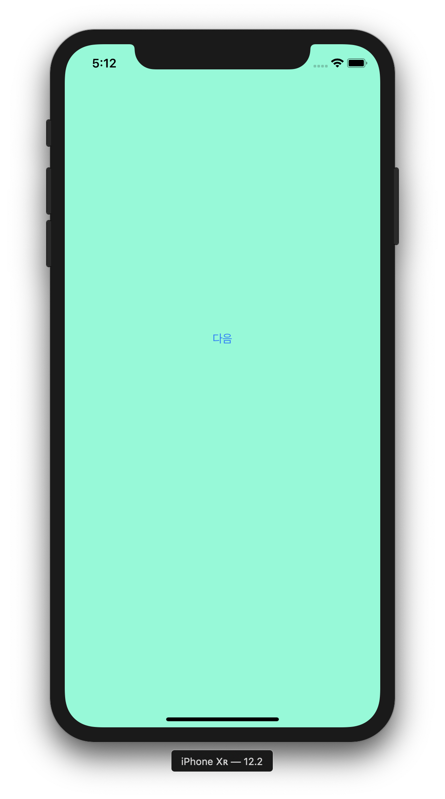

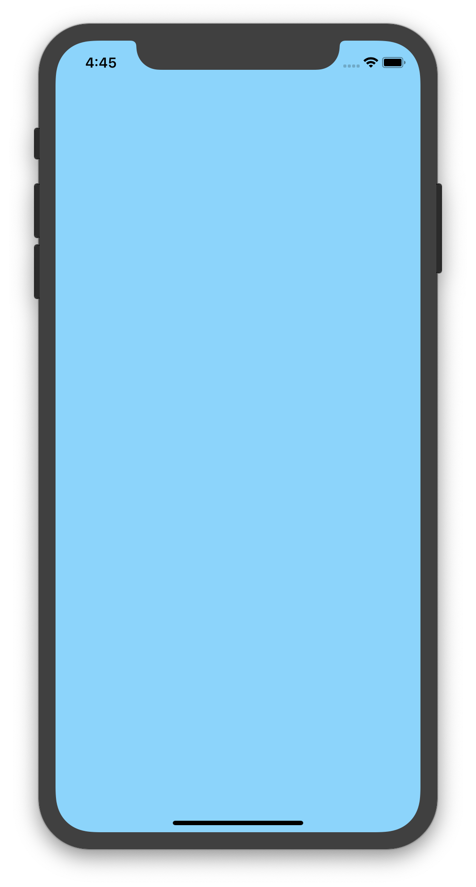

# Step5 - ViewController Programming (2019.6.26)

## ViewController의 라이프사이클

1. Init
2. loadView :
   - Controller가 관리하는 View를 만드는 역할
   - loadView가 View를 만들고 메모리에 올린 후 ViewDidLoad가 호출됨
3. viewDidLoad : 
   - View의 컨트롤러가 메모리에 로드되고 난 후 호출
   - View의 로딩이 완료 되었을 떄 **시스템에 의해 자동으로 호출**
   - 화면이 처음 만들어질 때 한번만 실행 (처음 한 번만 실행해야 하는 초기화 코드를 작성)
4. viewWillAppear :
   - View가 나타나기 직전 호출
   - viewDidLoad와 유사하게 볼 수도 있지만 가장 큰 차이는 다른 View에 갔다가 다시 돌아오는 상황의 경우 viewDidLoad는 호출되지 않는다 (viewWillAppear은 호출됨)
5. viewDidAppear : 
   - View가 나타났다는 것을 알림
6. viewWillDisappear :
   - View가 사라지기 직전 호출되는 함수
7. viewDidDisappear : (다시 4. viewWillAppear로 갈 수 있다.)
   - View가 제거되었다는 것을 알림
8. viewDidUnload (다시 2. loadView로 갈 수 있다.) **ios6부터 안 씀**

## Step을 진행하면서 발생한 문제점과 해결방법

새로운 버튼에 IBOutlet을 연결하여 코드작성 후 해당 코드를 지우고 빌드했을 때 해당 버튼을 누르자 아래와 같은 에러 발생

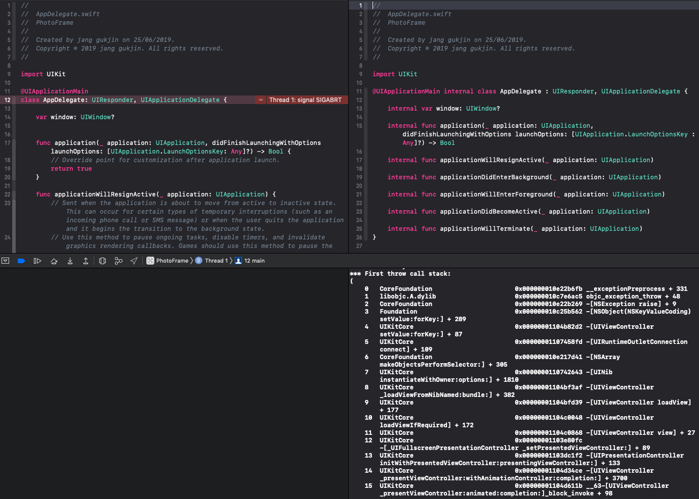

원인: 코드상으로는 지웠지만 연결이 남아있었다. (이점 꼭 유의하자!)

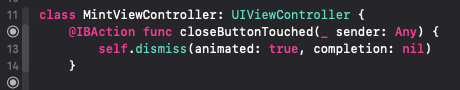

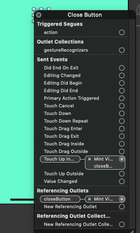

## ViewController Programming 결과

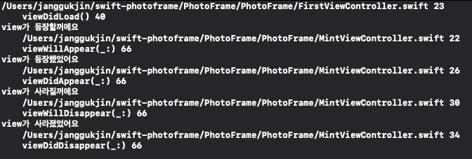

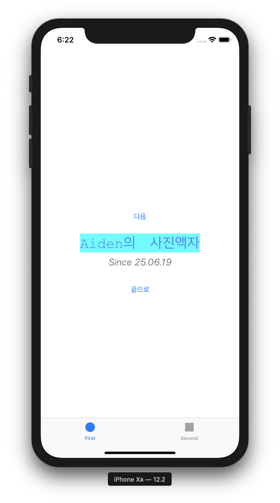

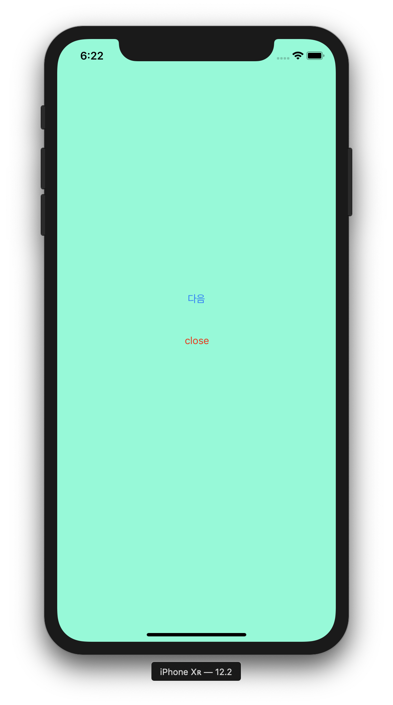

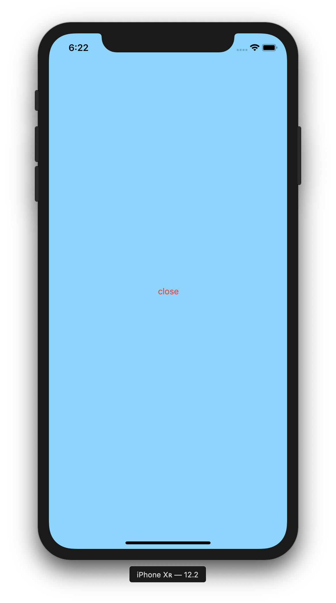

## 추가학습 결과

Segue를 제거하고 다음 화면을 보여줄 때 코드로 보여주는 방법을 찾아보고 적용해본다.

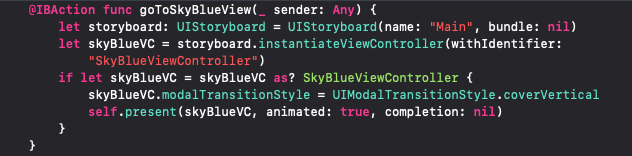

- 유의사항: 반드시 utility Bar의 identitiy에 storyboardID와 restoraionID를 등록해야한다.

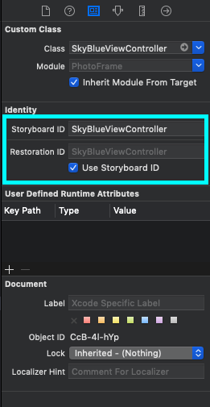

# Step6 - Container ViewController (2019.6.27)

## Container ViewController

: 여러 ViewController를 단일 사용자 interface로 결합하는 방법

- **자신이 소유한 다른 ViewController(Child ViewController)의 presentation을 관리**
- Child View는 **그대로 표시**하거나 Container View Controller가 **소유한 View와 같이 표시**한다.
- Container View Controller의 서브클래스는 **public interface**를 선언하여 하위 인터페이스를 연결해야 한다.
- Child ViewController 간에 공유관계를 Container View Controller가 정의한다.
- 사용자가 만드는 컨테이너의 의미에 따라 달라진다.
- Container ViewController를 **생성할 때 메소드를 재정의할 필요 없다.**
- 가장 대표적인 객체:
  1. **UINavigationController**: stack구조로 한번에 하나의 ViewController만 볼 수 있고, 하나 이상의 ViewController를 관리
  2. **UISplitViewController**: masrter - detail 두개의 하위 ViewController를 관리
  3. **UITabbarController**: 탭을 표시하여 여러 모드 중 선택하고 해당 모드의 보기를 표시
  4. **UIPageViewController**: 페이지 간의 탐색을 관리 

## 필수로 사용해야 할 메소드

- **addChild(_ childController: UIViewController)** : 지정한 ViewController를 현재 ViewController의 하위로 추가
- **removeFromParent( )** : ViewController를 상위 Contoller에서 제거
- **willMove(toParent parent: UIViewController? )** : ViewController가 Container ViewController에 추가 또는 제거 되기 직전에 호출
- **didMove(toParent parent: UIViewController? )** : ViewController가 Container ViewController에 추가 또는 제거된 후 호출

## Navigation Controller

- 계층별 컨텐츠 탐색을 위한 Stack 기반 구조를 정의하는 viewController Container 중 하나
- 한번에 하나의 하위 View Controller만 볼 수 있다.
- Delegate 객체를 사용하여 동작을 조정한다.

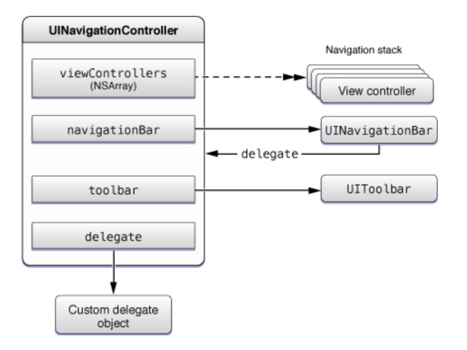

### Navigation Controller 관련 메서드가 push/pop인 이유?

- 배열의 가장 첫번쨰는 Root View Controller가 가장 아래에 깔려있고 그 위로 View Controller들이 쌓이는 구조라 **Stack의 구조와 같다**. 그렇기 때문에 pushViewController를 사용하게 되면 해당 viewController가 위로 쌓이면서 보여지게 되고 popViewController를 하게되면 해당 viewController가 사라지게 되는 것이다.

## NavigationController 결과

### 코드

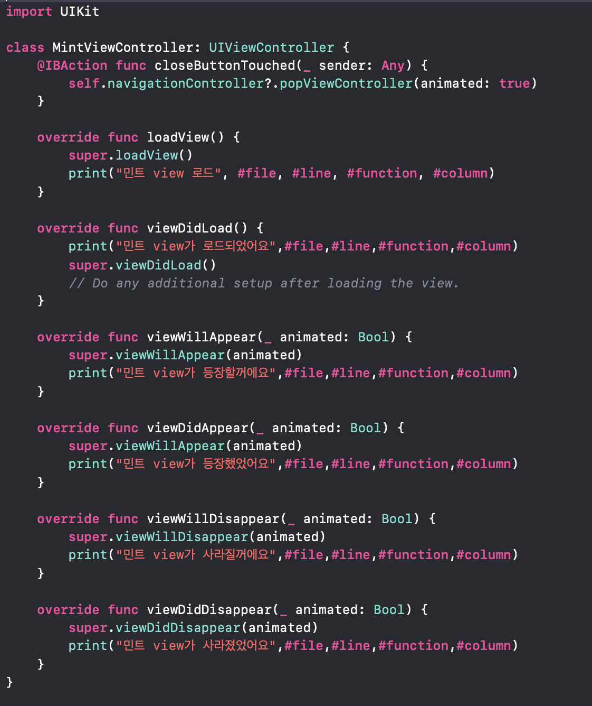

### 결과

: NavigationController를 적용한 경우 화면 전환이 오른쪽에서 왼쪽으로 동작하였다.

#### 콜백함수들의 동작 순서

1. FirstView**(loadView)**

2. FirstView**(viewDidLoad)**

3. FirstView**(viewWillAppear)**

4. FirstView**(viewDidAppear)**

   **(다음 버튼 클릭)**

5. MintView**(loadView)**

6. MintView**(viewDidLoad)**

7. FirstView**(viewWillDisappear)**

8. MintView**(ViewWillAppear)**

9. FirstView**(viewDidDisappear)**

10. MintView**(viewDidAppear)**

    **(close 버튼 클릭)**

11. MintView**(viewWillDisappear)**

12. FirstView**(viewWillAppear)**

13. MintView**(viewDidDisappear)**

14. FirstView**(viewDidAppear)**