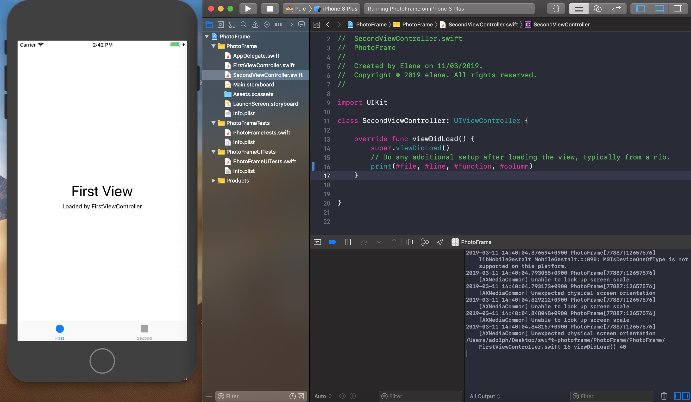
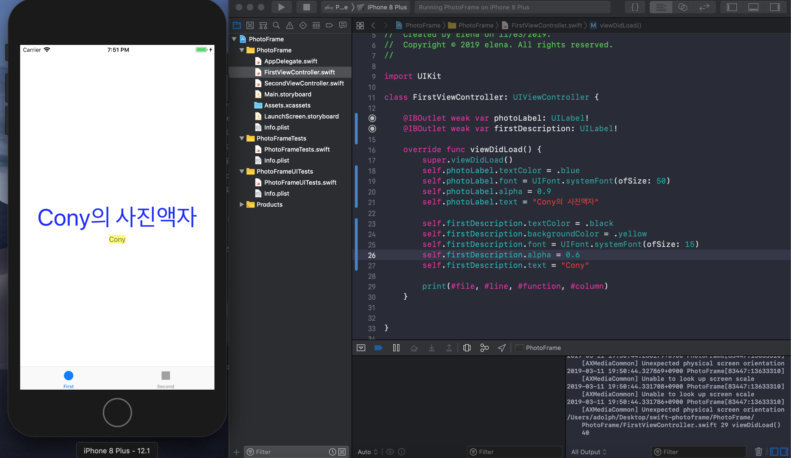
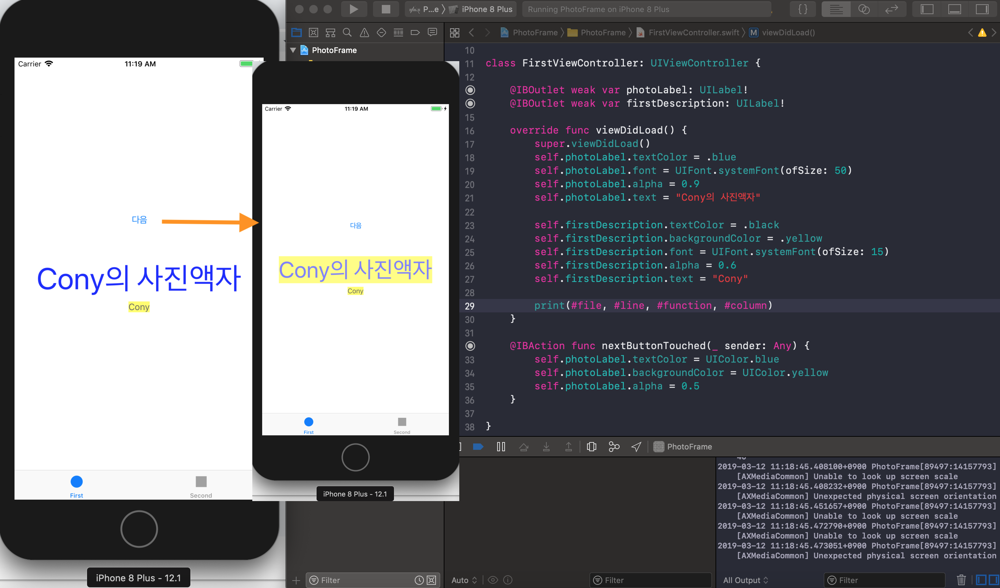
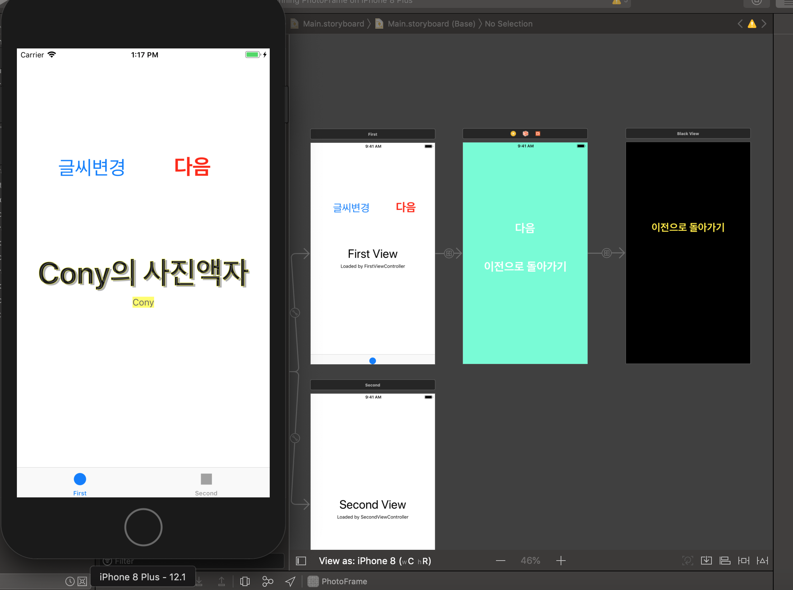
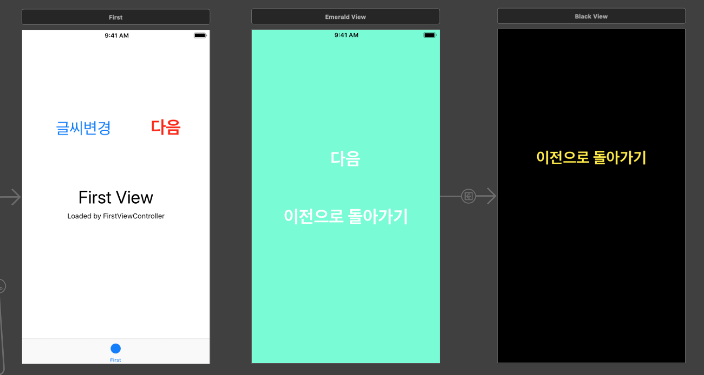
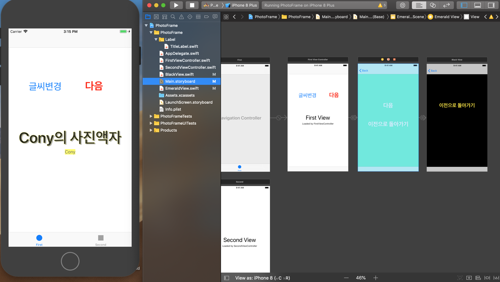

# Cony PhotoFrame


## step1. Tabbed App 템플릿
- 요구사항 : 자동 생성된 ViewController 클래스 viewDidLoad() 함수에서 print(#file, #line, #function, #column) 코드를 추가하고 실행하면 콘솔 영역에 무엇이 출력되는지 확인한다.
- 실행화면
- 

- 애플 UIKit View Management 클래스 중에서 UITabBarController 와 UITabBar에 대해 학습한다.
- 각 클래스 역할(및 UITabBar과 UITabBarController의 차이점)은 무엇인가?
> https://github.com/conyconydev/conyconydev.github.io/blob/master/_posts/ios/2019-03-11-UITabBarController_UITabBar.md

## step2. IBOutlet
- 요구사항 : First Scene에 만들어져 있는 레이블을 IBOutlet으로 연결한다.
- 연결한 아웃렛 변수에 값을 변경한다.
- 실행화면
- 

- UILabel 클래스 속성(Property)는 어떤게 있는지 학습한다.
>https://github.com/conyconydev/conyconydev.github.io/blob/master/_posts/ios/2019-03-12-UILabel.md

## step3. IBAction
- Main.storyboard 에서 First Scene에 UIButton을 추가하고, IBAction으로 연결한다.
- 실행화면
- 

- IBAction 과 IBOutlet 연결 구조에 대해 이해한 내용을 정리한다.
- 버튼에 IBAction을 추가할 때 이벤트(Event) 종류에는 어떤 것들이 있는지 학습한다.
> https://github.com/conyconydev/conyconydev.github.io/blob/master/_posts/ios/2019-03-12-IBAction_IBOutlet.md

## step4. Scene과 Segue
  - 스토리보드 구성 요소에 대해 학습하고 새로운 Scene과 Segue(화면전환)를 추가한다.
- 실행화면
- 

- Segue에 액션에 있는 여러 항목들은 어떤 효과가 있는지 값을 바꿔보며 실행해서 학습한다.
- Segue의 종류
1. show : Show는 Navication Controller에서 push/pop의 push를 의미한다. Navigation Controller의 스택 상에 Destination ViewContoller를 삽입하여 쌓게 된다. 참고로 iOS7부터 등장한 'UINavigationControllerDelegate'을 사용하면 보다 다양한 Transition effect를 구현할 수 있다.
2. show detail (iPad만 해당) : UISplitViewController를 사용할 때, 사용하는 Segue이다. 아이패드에서 화면을 가로로 눕히면 등장하는 Detail View상에 ViewController를 밀어 넣게 된다. Navigation Contoller의 스택에는 전혀 영향을 주지 않는다. 아래의 이미지의 오른 쪽 View 영역에 해당된다.
3. present modally : 일전의 presentViewController: 메소드와 동일한 동작을 하게된다. 옵션에 따라 ViewController를 띄우는 애니메이션에 변화를 줄 수 있다. Navigation Controller의 스택에는 전혀 영향을 주지 않는다. 단, 'Modally'라는 단어에서 알 수 있듯이 이미 Presentation을 한 ViewController에서 다른 ViewContller를 presentation할 수 없다. Show에서와 같은 맥락으로 'UIViewControllerTransitioningDelegate'를 사용하면 보다 다양한 Presantation effect를 구현할 수 있다.
4. popover presentation(iPad만 해당) : Show Detail과 같이 iPad에서만 볼 수 있는 View Transition이다. 작은 팝업 뷰 혹은 context menu 형식으로 ViewController를 띄우는 방법이다. 아이폰에서도 사용은 가능하지만 단순한 Modal View처럼 표시된다.
5. custom : 사용자 정의 세그웨이를 만듭니다.


## step5. ViewController 프로그래밍
- 스토리보드 구성 요소와 클래스 코드와 연결해서 동작을 확장한다.
- 실행화면
- 

- 화면 전환이 이루어지는 사이에 뷰컨트롤러 라이프사이클이 어떻게 변화하는지 학습한다.
>  https://github.com/conyconydev/conyconydev.github.io/blob/master/_posts/ios/2019-03-13-ViewController.md
- 뷰컨트롤러와 관련된 새로운 용어들에 대해 학습한다.

- YellowViewController에서 Segue를 제거하고 다음 화면을 보여줄 때 코드로 보여주는 방법을 찾아보고 적용해본다.

```
// FirstViewController 적용
//storyboard를 이용하지 않고, 코드상으로 연결하는 방법

@IBAction func nextEmeraldViewBtn(sender: UIButton) {
    let storyboardFind = self.storyboard?.instantiateViewController(withIdentifier: "emeraldView")as! EmeraldView
    present(storyboardFind,animated: true , completion: nil)
}
```
## step6. Container ViewController
- 내비게이션 컨트롤러(Navigation Controller)를 Embed 시켜서 동작하도록 개선한다.
- 실행화면
- 

- 뷰컨트롤러 컨테이너 동작을 이해한다.
    - 컨테이너 뷰 컨트롤러는 한 개의 view와 여러 개의 child ViewController를 다루고, ViewController에 의지할 수 있다는 것이 장점.
    
- 뷰컨트롤러 컨테이너는 또 어떤 클래스가 있는지 찾아보고 학습한다.
    - UINavigationController, UISplitViewController, UITabBarController,UIViewController
    
- 내비게이션 컨트롤러가 있을 경우와 없을 경우 화면 전환 동작이 어떻게 다른지, 화면들 포함관계가 있는지 학습한다.
    - storyboard object 사용해서 구현 : 세그로 연결하면 코드 작성 없이 화면 전환 가능, Back 버튼이 자동으로 생성된다.
    - 코드 구현 : push, pop을 이용하여 내비게이션 스택에 쌓는다. Back 버튼은 push된 ViewController에 자동으로 생긴다.

- 내비게이션 컨트롤러 관련 메서드가 왜 push / pop 인지 학습한다.
    - UINavigationController : 계층 적 컨텐츠를 탐색하기위한 스택 기반 스키마를 정의하는 컨테이너 뷰 컨트롤러.
   >  https://developer.apple.com/documentation/uikit/uinavigationcontroller

