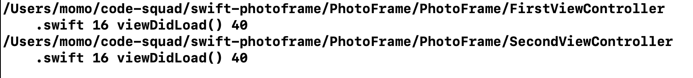
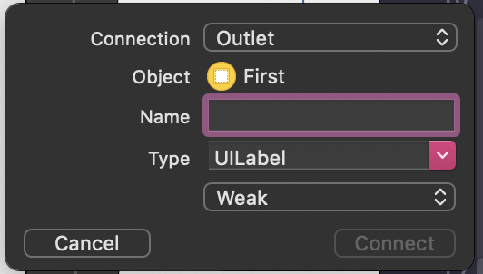
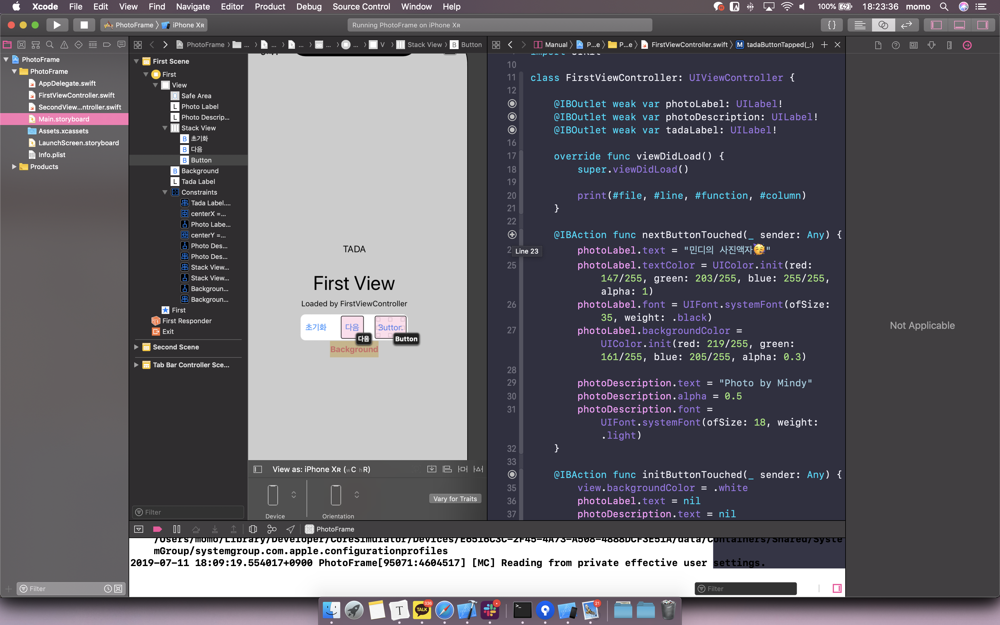
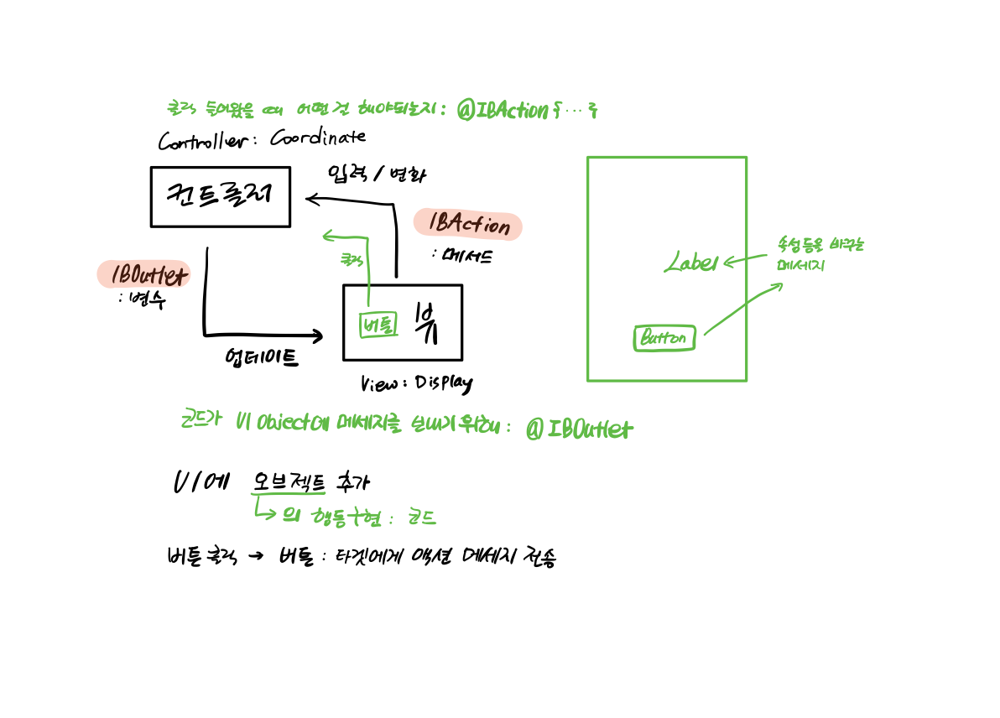

# PHOTO FRAME

- (바뀐 화면 이미지, 핵심 기능 설명)과 완성 날짜시간을 기록한다.
- 실행한 화면을 캡처해서 readme.md 파일에 포함한다.

<br>

1. [STEP 11-1](#step-11-1.-tabbed-app-템플릿)
2. [STEP 11-2](#step-11-2.-iboutlet)
3. [STEP 11-3](#step-11-3.-ibaction)

## STEP 11-1. Tabbed App 템플릿

<br>

### 실행 결과



- 첫번째 탭: FirstViewController
- 두번째 탭: SecondViewController

<br>

### UITabBarController

> radio-style 선택 인터페이스를 관리하기 위한 컨테이너 뷰 컨트롤러. 선택시 표시할 차일드 뷰 컨트롤러를 결정한다.

<br>

#### Declaration

```swift
class UITabBarController: UIViewController
```

<br>

#### Overview

탭 바 인터페이스는 스크린의 아래에 탭을 표시해 여러 다른 모드를 선택하고 해당 모드의 뷰를 보여준다.

이 클래스는 일반적으로 있는 그대로 사용되지만 서브클래싱될 수도 있다. 

탭 바 컨트롤러 인터페이스의 각각의 탭들은 커스텀 뷰 컨트롤러와 연관되어 있다. 

사용자가 특정 탭을 선택하면 탭 바 컨트롤러는 이전의 모든 뷰를 대체하면서 해당 뷰 컨트롤러의 루트 뷰를 보여준다. (이전에  어떤 탭이 선택되어있든지 유저가 tap을 하면 항상 해당 탭의 루트뷰를 보여준다. 탭이 이미 선택되어 있는 경우에도 마찬가지이다.)

탭을 선택하는 것은 인터페이스의 컨텐츠를 대체하기때문에 각 탭에서 관리되는 인터페이스의 타입이 유사할 필요는 없다. 

탭 바 인터페이스는 보통 다른 타입의 정보를 보여주거나 같은 정보를 완전히 다른 스타일의 인터페이스로 보여줄 때 이용된다. 

탭바 컨트롤러에서는 탭바 뷰에 직접적으로 접근을 할 수 없다. 

탭바 컨트롤러의 탭들을 관리하기 위해서는 각 탭의 루트뷰를 제공하는 뷰 컨트롤러를 뷰 컨트롤러의 프로퍼티로 지정해야 한다.

뷰 컨트롤러들을 특정하는 순서가 탭 바에 나타나는 순서가 된다. 

프로퍼티를 설정할 때, 초기에 어떤 뷰 컨트롤러가 설정되어있는지 나타내는 `selectedViewController` 프로퍼티에 값을 할당해야한다. 

<br>

#### The views of a Tab Bar Controller

`UITabBarController` 클래스는 `UIViewController` 클래스를 상속받기 때문에, 탭 바 컨트롤러는 `view` 속성을 통해 접근할 수 있는 탭 바 컨트롤러의 뷰를 갖는다.

탭 바 컨트롤러를 위한 뷰는 탭바 뷰와 커스텀 컨텐츠를 포함하고 있는 뷰의 컨테이너일 뿐이다. 

탭 바 뷰는 사용자와 한 개 이상의 탭 바 아이템을 위한 선택 컨트롤을 제공한다. 

탭바의 아이템들과 툴바 뷰가 바뀌더라도 이들을 관리하는 뷰들은 바뀌지 않는다. 

현재 선택된 탭을 보여주기 위해 커스텀 컨텐츠 뷰만이 바뀐다. 


<br>

### UITabBar

> 앱의 다른 서브태스크, 뷰들, 모드들을 선택하기 위해 탭바에 하나 이상의 버튼을 표시하는 컨트롤

<br>

#### Declaration

```swift
class UITabBar: UIView
```

<br>

#### Overview

보통, 탭 바는 `UITabBarController` 오브젝트와 결합해서 사용한다. 그러나 앱에서 UITabBar를 독립적으로 사용할 수도 있다. 

탭 바는 항상 스크린의 아래 가장자리에 나타나고 하나 이상의 `UITabBarItem` 오브젝트를 보여준다. 

인터페이스의 요구에 맞게 탭바의 모양은 배경 이미지 또는 틴트 색깔등을 변경할 수 있다.

<br>

#### Responding to Tab Selections

탭바 컨트롤러와 연결된 탭바는 컨트롤러가 자동으로 선택 항목을 관리하고 적절한 뷰 컨트롤러를 보여준다.

유일하게 선택 항목을 직접 관리해야할 때는 탭 바 컨트롤러 없이 탭바를 생성했을 때이다. 

탭바는 선택 변경에 대해 응답할 수 있는 델리게이트 오브젝트의 `tabBar(_:didSelect:)` 메서드에 선택항목을 보고한다. 

<br>


### UIViewController와 UIView의 차이점

- 뷰는 스크린에 그리기 위한 오브젝트. 다른 서브뷰들을 포함할 수도 있다. 

- 터치 이벤트를 갖고 시각적 상태를 변경할 수 있다.

- 뷰는 앱의 구조를 알지 못하고 디스플레이에게 어떤 상태만을 말해준다.

  

- 뷰컨트롤러는 스크린에 직접적으로 그리지 못한다. 뷰 오브젝트들의 모음을 관리한다. 
- 뷰 컨트롤러는 보통 여러개의 서브뷰들을 갖고 있는 한 개의 view 를 갖고 있다. 
- 뷰 컨트롤러는 이 뷰들의 상태를 관리한다. 
- 뷰컨트롤러는 앱의 내부 동작을 알 수 있다. 뷰 오브젝트에게 무엇을 해야할지와 어떻게 그들을 보여줄지 알려준다.


<br>

### UITabBarController와 UITabBar의 차이점

- UITabbar 객체는 뷰이기 때문에 데이터를 사용자에게 표시하고 사용자 입력을 허용하는 방법을 알고 있다.
- UITabBar는 UIView의 하위 클래스이며 사용자에게 탭 항목 목록을 표시하고 사용자가 탭과 상호 작용할 때 사용자에게 피드백을 표시하는 방법이다.


- UITabbarController 객체는 컨트롤러이기때문에 사용자에게 표시 할 데이터와 사용자 입력으로 수행할 작업을 알고 있다. 
- UITabBarController는 UIViewController의 하위 클래스이며 사용자에게 표시 할 탭과 사용자가 탭을 선택할 때 수행 할 작업을 알고 있다

<br>


## STEP 11-2. IBOutlet

<br>

### 실행 결과


<br>

### IBOutlet

> UI object에 메세지를 보내기 위해 필요한 연결을 위한 클래스 프로퍼티, 인터페이스 빌더와 연결을 위한 객체의 속성

- 코드가 유저 인터페이스 객체에 메세지를 보낼 수 있게 하려면 유저 인터페이스 객체에서 *outlet*이라고 불리는 클래스의 특수한 프로퍼티에 연결을 해야한다.
- Interface Builder는 아울렛에 대한 선언을 클래스에 추가하고 클래스 인스턴스를 아울렛에 연결한다. 
- IBOutlet 에서 IB는 Interface Builder



- IBOutlet은 default로 `weak`
  - `strong` 을 쓰는 경우: 복잡한 뷰 hierarchy를 가졌을 때, 중간에 있는 뷰가 dealloc 되면 하위뷰들도 같이 dealloc 된다. 그렇게 되면 의도치 않은 nil이 발생할 수 있다. 
  - 그렇지만 일반적인 상황에서는 `weak`가 메모리 관리 차원에서 유리하다.
  - 메모리가 부족하게 되면 메인 뷰를 nil 처리하게 되면서 main view와 subview들까지 dealloc 해서 메모리를 확보하게 된다. 이 때 strong이면 reference count가 절대 1 이하로 내려가지 않아서 parent 뷰가 dealloc 되어도 child view들은 dealloc 되지 않는다. 
- Outlet이 옵셔널로 선언되는 이유
  - 클래스나 구조체의 인스턴스가 초기화를 완료하기 전에 모든 저장 프로퍼티는 유효한 값을 가져야 한다.
  - 뷰는 뷰 컨트롤러가 초기화 된 후에 로드된다. 그렇기 때문에 뷰 컨트롤러 클래스에 정의된 아웃렛들도 뷰 컨트롤러가 초기화된 직후에 바로 값을 갖지 않는다.
  - 따라서 outlet은 implicitly unwrapped 옵셔널이다. (!)
  - outlet이 확실히 연결되어 있다는 것을 알고 있기 때문에 !를 사용할 수 있다.
  - 그러나 !로 사용했는데, 인터페이스 빌더와 아울렛을 연결하는 것을 까먹거나 하게되면 앱은 크래쉬가 나게 된다. 
  - 값을 설정하기 전에 아울렛 변수에 접근하는 것은 위험할 수 있다. 뷰 컨트롤러가 뷰를 로드하기 전이나 뷰를 로드하는 중에 아울렛 변수에 접근하게 되면 런타임 에러가 발생한다.
  - 필요에 따라 !, ? 를 사용

<br>

### UILabel Property

- var text: String? : 레이블이 표시할 문자열
  - text 프로퍼티에 값을 할당하면 attributedText 프로퍼티에도 똑같은 내용의 문자열이 할당
- var attributedText: NSAttributedString? : 레이블이 표시할 속성 문자열
  - NSAttributed 클래스를 사용한 속성 문자열 중 특정 부분의 속성을 변경 가능 (일부 글자만 변경 가능)
  - attributedText 프로퍼티에 값을 할당하면 text 프로퍼티에도 똑같은 내용의 문자열이 할당
- var textColor: UIColor! : 문자 색상
- var font: UIFont! : 문자 폰트
- var textAlignment: NSTextAlignment: 문자열의 가로 정렬
  - left, right, center, justified, natural
- var numberOfLines: Int : 문자를 나타내는 최대 라인 수
  - 기본값 1
  - 문자열을 모두 표시하고 싶을 때: 0
  - 최대 라인 수를 초과하면 lineBreakMode 프로퍼티의 값에 따라 적절히 잘라서 표현
  - adjustsFontSizeToFitWidth 프로퍼티 활용해 폰트 사이즈를 레이블의 넓이에 따라 자동 조절
- var baselineAdjustment: UIBaselineAdjustment: 문자열이 autoshrink 되었을 때의 수직 정렬 방식
  - Align Baseline: 문자가 작아졌을 때 기존 문자열의 기준선에 맞춤
  - Align Center: 작아진 문자의 중앙선에 맞춤
  - None: 기존 문자열의 위쪽 선에 맞춤
- var lineBreakMode: NSLineBreakMode: 레이블의 경계선을 벗어나는 문자열에 대응하는 방식
  - 기본값 Truncate tail
  - Character wrap: 여러 줄 레이블에 주로 적용, 글자 단위로 줄 바꿈을 결정
  - Word wrap: 여러 줄 레이블에 주로 적용, 단어 단위로 줄 바꿈을 결정
  - Truncate head: 한 줄 레이블에 주로 적용, 앞쪽 텍스트를 자르고 '...' 으로 표시
  - Truncate middle: 한 줄 레이블에 주로 적용, 중간 텍스트를 자르고 '...' 으로 표시
  - Truncate tail: 한 줄 레이블에 주로 적용, 끝쪽 텍스트를 자르고 '...' 으로 표시

<br>

## STEP 11-3. IBAction

- 초기화면


- **다음** 버튼 터치


- 오른쪽 **Button** 버튼 터치
  - Button -> TADA
  - TADA -> 쨔쟈쟈쟈쟌 등장


- **Background** 버튼 드래그 (Drag Outside)


- **초기화** 버튼 터치


### 버튼에 액션을 여러개 추가

- **Button** 버튼에는 nextButtonTouched(), tadaButtonTouched() 두가지 액션이 있다.
- 민디의 사진 액자와 Photo By Mindy 레이블을 띄운다.
- 자신의 텍스트를 TADA로 바꾸고 TADA 레이블은 💃쨔쟈쟈쟈쟌💃 으로 바꾼다.


### 버튼이 여러개일 때 하나의 액션에 추가

- 
- nextButtonTouched() 는 **다음** 버튼과 **Button** 버튼에 연결되어 있다.

### IBAction

> 컨트롤의 이벤트가 발생했을 때 실행될 행동

### IBOutlet과 IBAction의 연결 구조



- UI에 오브젝트를 추가한다.

- 오브젝트의 행동을 구현하기 위해서 코드를 사용한다. (@IBAction)

  - ex. 버튼을 클릭하면 버튼은 타겟에게 액션 메세지를 전송한다.

- 컨트롤 이벤트가 발생하면 뷰가 감지해 컨트롤러에게 전달한다. 

- 컨트롤러는 뷰를 업데이트한다.

  - IBOutlet을 이용해 타겟의 속성등을 변경한다. (IBAction의 수행 내용)

  

### IBAction Control Event의 종류

| Control Event          | 설명                              |
| ---------------------- | --------------------------------- |
| touchDown              | 컨트롤을 터치했을 때              |
| touchDownRepeat        | 컨트롤을 연속 터치했을 때         |
| touchDragInside        | 컨트롤 범위 내에서 드래그 했을 때 |
| touchDragOutside					| 컨트롤 범위 바깥쪽에서 드래그 했을 때 |
| touchDragEnter					| 컨트롤의 범위 바깥쪽으로 나갔다가 다시 들어왔을 때 |
| touchDragExit					| 컨트롤의 범위 바깥쪽으로 나갔을때 |
| touchUpInside          | 컨트롤 영역 안쪽에서 터치 후 뗐을 때 |
| touchUpOutside         | 컨트롤 영역 안쪽에서 터치 후 컨트롤 바깥에서 뗐을 때 |
| touchCancel            | 컨트롤의 현재 터치를 취소하는 이벤트 |
| valueChanged           | 컨트롤을 드래깅이나 다른 방법으로 조작해서 값이 변경됐을 때 |
| primaryActionTriggered | 버튼이 눌릴때 |
| editingDidBegin        | UITextField에서 입력을 시작할 때 (텍스트 필드 눌렀을 때) |
| editingChanged         | UITextField에서 값이 바뀔 때 |
| editingDidEnd          | UITextField에서 입력이 끝났을 때 (텍스트 필드 바깥을 눌렀을 때) |
| editingDidEndOnExit    | UITextField의 편집상태에서 키보드의 return을 눌렀을 때 |
| allTouchEvents         | 모든 터치 이벤트 |
| allEditingEvents       | UITextField에서 모든 편집 이벤트 |
| applicationReserved    | 앱의 사용에 따라 지정할 수 있는 컨트롤 이벤트 값의 범위 |
| systemReserved         | 내부 프레임워크 내에서 사용되는 예약된 컨트롤 이벤트 값의 범위 |
| allEvents              | 시스템 이벤트를 포함한 모든 이벤트 |


---

### Reference

http://monibu1548.github.io/2018/05/03/iboutlet-strong-weak/

https://cocoacasts.com/should-outlets-be-optionals-or-implicitly-unwrapped-optionals

https://developer.apple.com/documentation/uikit/uicontrol/event

https://help.apple.com/xcode/mac/current/#/devc06f7ee11

