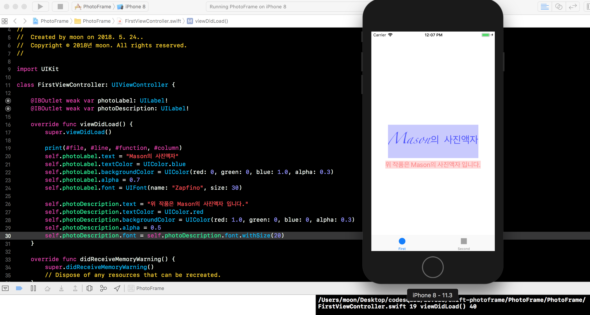

# PhotoFrame App

## Step1 - 시작하기 Tabbed App 템플릿

1. 프로그래밍 요구사항
	- 자동 생성된 ViewController 클래스 viewDidLoad() 함수에서 print(#file, #line, #function, #column) 코드를 추가하고 실행하면 콘솔 영역에 무엇이 출력되는지 확인한다.
2. UITabBarController와 UITabBar에 대해 학습한다.
3. UITabBar와 UITabbarController의 차이점은 무엇인가?

### 진행사항 (완성날짜: 2018/05/24 14:00)

## Step2 - IBOutlet

1. 프로그래밍 요구사항
	- Xcode 프로젝트 내비게이터에서 Main.storyboard 파일을 선택하고 First Scene 에 있는 'First View' 레이블(Label)을 선택하고 Assistant Editor 모드로 변경한다.
	- 레이블을 선택하고 Control + 드래그해서 ViewController 코드에 IBOutlet으로 연결한다.
	- 코드로 Label의 속성을 변경해본다. (글자색, 배경색, 투명도, 글자 크기)
2. UILabel클래스 속성(property)는 어떤게 있는지 학습한다.

### 진행사항 (완성날짜: 2018/05/25 12:07)
