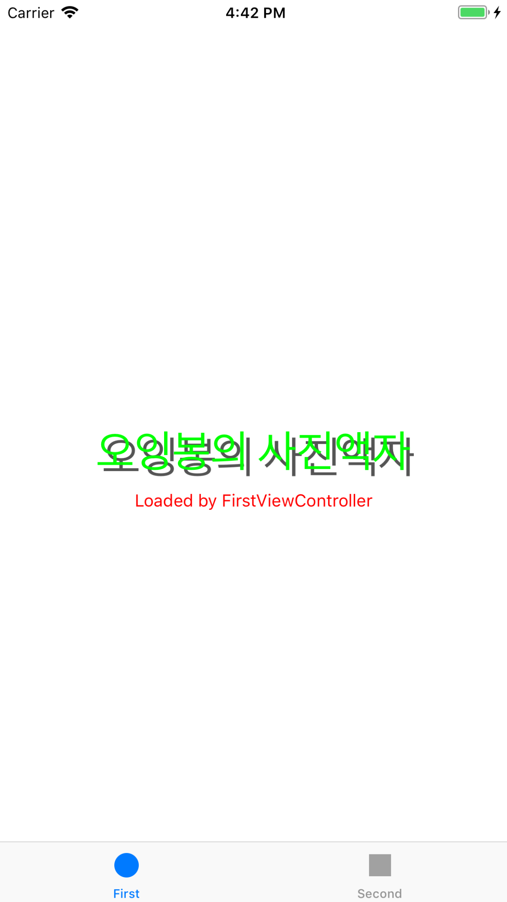

# PhotoFrame

## Step1 - Tabbed App 템플릿

### Console
`First :  /Users/oingbong/Documents/CodeSquad/Level3/swift-photoframe/PhotoFrame/PhotoFrame/FirstViewController.swift 17 viewDidLoad() 58`

`Second :  /Users/oingbong/Documents/CodeSquad/Level3/swift-photoframe/PhotoFrame/PhotoFrame/SecondViewController.swift 16 viewDidLoad() 57`

### UITabbarController
 - UITabbar 를 포함해 UITabbar 에서 선택한 View 까지 포함하는 전체적인 의미

### UITabbar
 - 여러 View 중에 하나를 선택할 수 있게 하단 혹은 화면 끝단에 존재하는 라디오 버튼 형식의 바

---

## Step2 - IBOutlet

### UIOutlet

---

