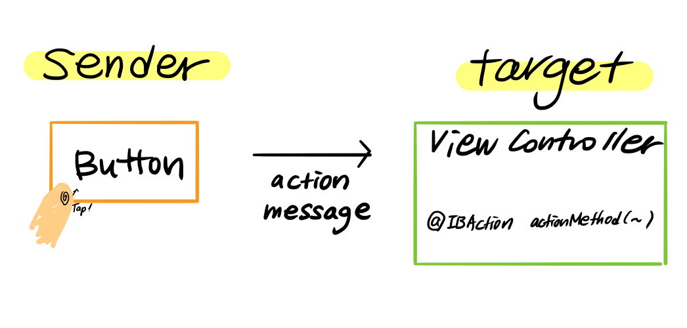
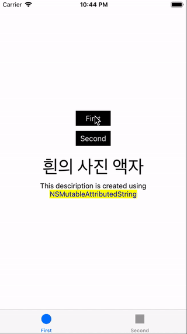
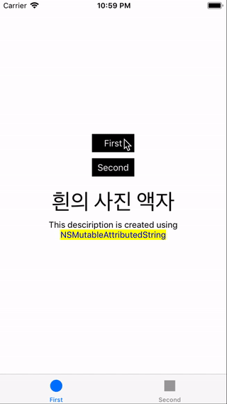
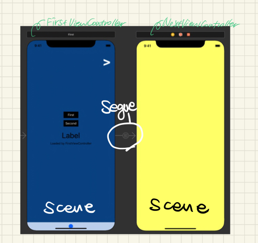
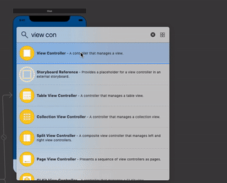

# PhotoFrame (Step 11)

- [Step 11-1  Tabbed App 템플릿](#-step-11-1--tabbed-app-템플릿)
- [Step 11-2  IBOutlet](#-step-11-2--iboutlet)
- [Step 11-3  IBAction](#-step-11-3--ibaction)
- [Step 11-4 Segue & Scene](#-step-11-4--segue--scene)

&nbsp;

## 📍 Step 11-1  Tabbed App 템플릿

- [Interface 인터페이스란?](#interface-인터페이스란)
- [ViewController](#viewcontroller)
- [Tab View Interface](#tab-view-interface)
- [viewDidLoad()](#viewdidload)

### Interface 인터페이스란?

계속해서 나오는 `인터페이스` 란 단어에 대해 용어 정리를 먼저 하고 들어가려고 한다. 사전적 의미는 다음과 같다. 

> 접촉(면), 경계(면)<br>
>
> The **interface** between two subjects or systems is the area in which they [affect](https://www.collinsdictionary.com/dictionary/english/affect) each other or have links with each other.

공통적으로 나오는 의미는 link(연결, 접촉) 이다. 인터페이스는 주로 중간에서 연결해주는 역할을 하는 장치나 소프트웨어에서 많이 사용되는 용어다. 

app 에서는 <u>사용자와 view</u> 가 서로 접촉한다. 앱에 display 되는 여러 view 중 하나를 선택하면 그에 맞는 처리가 되도록 view controller에 view 가 알려준다. User - Controller 사이에서 연결을 담당하는 것이 view가 된다. 따라서 **사용자와 앱이 서로 의사소통 할 수 있도록 중간에서 연결을 담당하는 모든 것이 app에서의 인터페이스이다.** 그 중에 하나가 view 이다. 

&nbsp;

### ViewController

> Manage your interface using view controllers and facilitate navigation around your app's content

view controller는 `UIKit` 앱의 사용자 인터페이스를 관리한다. view가 사용자로부터 user interaction을 받아 vc에 넘기면 그에 맞는 적절한 처리를 한다. 한 개의 view controller 는 한 개 이상의 view를 관리하며, 한 개의 app은 최소 한 개 이상의 view controller를 가지고 있다. 

view controller는 다시 2가지로 나눌 수 있다 - 일반적인 view controller 그리고 container view controller

**container view controller**는 다른 view controller를 자신의 root view 에 심는다(넣는다). view controller 한 개 이상을 자신이 감싸는 형태이므로 **container** 용어가 사용한 것으로 추측된다. 자신 안에 다른 view controller들을 가지고 있다가 특정 조건 혹은 인터랙션에 맞는 view controller를 보여주는 역할을 한다. navigation bar 의 처리를 담당하는 `UINavigationController` , tab bar 아이템 선택(모드)에 따라 지정된 view controller의 root view를 보여주는 `UITabBarController` 등이 이에 속한다. 일종의 view controller

&nbsp;

### Tab View Interface

tab bar 는 화면 가장 하단에 위치하여, 모드 선택에 따라 그에 맞는 view를 보여주는 인터페이스이다. 

#### UITabBarController

```swift
class UITabBarController : UIViewController
```

> A **container view controller** that manages a radio-style selection interface, where the selection determines which child view controller to display.

tab bar 선택에 따라서 보여질 child view controller 를 결정하고, 관련된 처리를 담당하는 container view controller 이다. tab bar view(화면 하단) 과 선택하면 나올 view 들을 감싸는 container이다. tab bar 에 보여지는 tab bar item 은 각각 view controller 와 연결되어 있다. 

- `var viewControllers: [UIViewController]? ` 
  - tab bar controller 에 의해 보여질 child view 들의 root view 를 가지고 있는 속성
  - 이 배열의 순서 == 연관된 tab bar item 순서 (tab bar 에서 보여지는 순서)
- `var selectedViewController: UIViewController?`
  - 맨 처음 보여지는 view 의 view contoller
  - 현재 보여지는 view의 view controller
- `var tabBar: UITabBar` : tab bar view 를 관리하는 controller
- [`UITabBarControllerDelegate`](https://developer.apple.com/documentation/uikit/uitabbarcontrollerdelegate) : tab bar interface 와 user 간의 interaction 이 발생하면 tab bar controller가 delegate에 알림을 보낸다.

#### UITabBar

> A control that displays one or more buttons in a tab bar for selecting between different subtasks, views, or modes in an app.

tab bar view 안에서 tab bar item 의 관리와 

&nbsp;

##### :mag: tool bar & tab bar

둘 다 화면 bottom edge 에 보여지는 bar

- Tool bar는 현재 화면에 대한 추가적인 조작 버튼을 담은 bar 

  (contains buttons for performing actions relevant to the current view or content within it)

- tab bar는 화면을 item에 맞게 다른 섹션 전환해주는 radio button 기능을 담은 bar. 흐름이 완전 바뀐다.

  (provides the ability to quickly switch between different sections of an app)

&nbsp;

### viewDidLoad()

`UIViewController` 의 method로 **메모리에 view controller 가 올라오면 가장 먼저 실행**된다. 주로 추가적인 초기화 작업을 구현하기 위해 오버라이딩 되어 사용된다. 

#### print(#file, #line, #function, #column) 을 viewDidLoad() 안에서 실행한 결과

해당 함수는 어떤 파일 몇번째 줄에서 어떤 어떤 함수가 실행되고 있는지를 출력해준다.

- tab bar controller 에 2개의 view controller 가 연결된 상태
- 실행하면 `FirstViewController` 의 `viewDidLoad()` 실행됨
- Tab bar에서 두번째 선택시, `SecondViewController` 의 `viewDidLoad()` 실행됨
- 그 뒤로는 아무리 tab bar item 바꿔도 어떤 vc `viewDidLoad()` 도 실행되지 않는다.
- 해석: view controller object 가 처음 메모리에 올라올 때만 `viewDidLoad()`가 실행되고, 그 뒤의 전환은 이미 메모리의 객체를 사용하기 때문. 메모리에 두 개의 view controller가 올라와 있음을 확인할 수 있다.

```
/Users/allwhite/Desktop/Codesquad/swift-photoframe/PhotoFrame/PhotoFrame/FirstViewController.swift 15 viewDidLoad() 40 <- 맨 처음 실행시
/Users/allwhite/Desktop/Codesquad/swift-photoframe/PhotoFrame/PhotoFrame/SecondViewController.swift 15 viewDidLoad() 40 <- second item 맨 처음 선택시
```


## 📍 Step 11-2  IBOutlet

- [View & UIView](#view--uiview)
- [UILabel](#uilabel)
- [NSAttributedString & NSMutableAttributedString](#nsattributedstring--nsmutableattributedstring)
- [Interface Builder](#interface-builder)
- [Attribute](#attribute)
- [Declaration Attibutes Used by Interface Builder](#declaration-attibutes-used-by-interface-builder)
- [IBOutlet](#iboutlet)

### View & UIView

앱에서 user interface 중 가장 기초, 기반이 되는 구성요소이다. view 는 다시 다른 view 를 안에 내재할 수 있다. (embedded view)

그 중 `UIView` 는 모든 view 의 최상위 class(root) class 로 공통 behavior 를 정의해 놓았다. 또한 사각형의 컨텐츠를 스크린에 표시할 수 있도록 관리를 담당하는 객체이다. 

### UILabel

> read-only text 를 보여주는 view

```swift
@interface UILabel : UIView
```

- the appearance of labels is configurable : 설정 가능하다
- customize 가능

설정 가능한 attributes

| attribute                               |                                                              |
| --------------------------------------- | ------------------------------------------------------------ |
| `text`, `attributedText`                | label content 지정<br />attributedText(NSAttributedString) string 내에서 일부만, 부분만 스타일링 속성을 바꿀 수 있다 |
| `textColor`                             | label 안 text 의 색상 지정                                   |
| `font`                                  | 폰트 `UIFont` type                                           |
| `textAlignment`                         | alignment 정렬                                               |
| `numberOfLines`                         | lines. 최대 줄 개수를 설정<br />기본값은 1. 문자열을 짤림없이 모두 표시하고 싶다면 0으로 설정 |
| `isHighlighted`, `highlightedTextColor` | highlighted 된 상태로 그려져야 하는지 지정<br />그 때의 highlight 색상 지정 |
| `lineBreakMode`                         | contents 가 label 크기보다 클 때, 어떻게                     |

이외에도 label 크기, 그림자 관련 설정도 가능

&nbsp;

### NSAttributedString & NSMutableAttributedString

`NSAttributedString` 관련 속성(스타일, 색상 등)을 가지고 있는 string 을 표현하는 클래스

- 지정한 위치의 attribute 를 가져올 수 있다
- `NSAttributedString.Key` : attributed string 의 text 에 적용할 수 있는 특성들을 선언함

`NSMutableAttributedString` 은 `NSAttributedString` 의 하위 클래스

- Attributed string 을 mutating(변하게, 수정하게) 하기 위한 용도로 만들어진 클래스
- attribute 를 추가하여 지정할 수 있다
- 기존의 `NSAttributedString` 의 메소드 + 수정/변동 관련 메소드 추가
- [Apple document - NSMutableAttributedString](https://developer.apple.com/documentation/foundation/nsmutableattributedstring)
- [NSAttributedString by Example](https://www.hackingwithswift.com/articles/113/nsattributedstring-by-example)

```swift
let description = "NSMutableAttributedString 을 사용하여 설정되었습니다."
let attributedString = NSMutableAttributedString(string: description)
let yellowBackgroundAttribute: [NSAttributedString.Key : Any] = [
            NSAttributedString.Key.backgroundColor : UIColor.yellow,
            NSAttributedString.Key.foregroundColor : UIColor.blue
            ]
let convertedFirstLabelString = NSString(string: description)
attributedString.setAttributes(yellowBackgroundAttribute
            , range: convertedFirstLabelString.range(of: "NSMutableAttributedString"))
self.firstDescription.attributedText = attributedString
```


&nbsp;

### Interface Builder

- 앱의 user interface 를 생성하는 툴
- user interface file : user interface builder 에서 만든 interface 에 대한 정보를 저장하는 형식
  - extension : `.storyboard` or `.xib`
  - `.storyboard` : 여러 개의 view controller 와 그 사이를 잇는 segues
  - `.xib` : 한 개의 view controller or menu bar
- [참조](https://developer.apple.com/library/archive/documentation/ToolsLanguages/Conceptual/Xcode_Overview/UsingInterfaceBuilder.html#//apple_ref/doc/uid/TP40010215-CH42-SW1)

&nbsp;

### Attribute

Swift 에서 Attribute 은 **선언(declaration) 혹은 타입에 대한 추가적인 정보를 제공**한다. `@`기호와 함께 사용되며, 선언 혹은 타입 앞에 쓰여 추가적인 정보를 전달하는 역할을 한다. ([참조](https://docs.swift.org/swift-book/ReferenceManual/Attributes.html))

```
@ attribute_name
@ attribute_name(attribute_arguments)
```

&nbsp;

### Declaration Attibutes Used by Interface Builder

그 중, interface builder 에서 사용되는 declaration attributes 는 다음과 같다. 이는 interface builder 의 object 와 코드의 선언부를 동기화(synchronize), 즉, 연결하기 위해 사용한다.

- `IBAction`, `IBSegueAction`, `IBOutlet`, `IBDesignable`, and `IBInspectable`

- *Example*

  ```swift
  @IBOutlet weak var firstLabel: UILabel!
  ```


### IBOutlet

- interface builder 에서 생성한 객체와 소스코드를 연결하기 위해 사용하는 attribute
- 주로 객체의 속성을 제어할 목적으로 클래스의 프로퍼티에 연결
- 연결된 객체의 속성을 소스코드에서 변경할 수 있다.
- [참조](https://velog.io/@sogih/IBOutlet%EA%B3%BC-IBAction-1djvdhxlhc)

&nbsp;

## 📍 Step 11-3  IBAction

### UIKit Framework

- window and view architecture for implementing user interface
- event handling infrastructure for delivering Multi-Touch and other types of input to your app
- main run loop needed to manage interactions among the user, the system, and your app
- and other features..
- UIKit app의 core objects 를 제공
  - system 과 의사소통
  - 앱의 main event loop 실행하기
  - 보이는 스크린에 콘텐츠 보여주기 등..


- MVC 구조를 기반으로 한다.

  - model : 앱의 데이터와 비즈니스 로직 관리
  - view : 데이터의 시각적 표현을 제공
  - controller : model 과 view 사이의 연결자, 중재자

- `UIApplication` : app 의 main event loop 를 실행시키고, 앱의 전반적인 라이프 사이클을 관리한다 
- 들어오는 user event 를 그에 맞는 곳으로 연결해준다. 
  - action message 를 적절한 target 객체로 보낸다. 
  - UIApplication 는 UIWindow 객체 리스트를 가지고 있는데, 여기서 알맞은 UIWindow 객체에 event 를 보내서 맞는 UIView 객체가 받도록 한다. 
  - `sendEvent(_ event: UIEvent)` method 통해서 적절한 reponder 객체가 받도록 함
  - UIEvent : event 에 대한 정보를 캡슐화 한 클래스
  
- `UIWindow` : app user interface 의 배경, view 에 event 를 보내는 역할

  - Storyboard 는 app delegate 객체에서 `window` property가 반드시 있도록 요구함
  - 주로 한 앱당 한 window 객체만 필요한데, 다른 외부 스크린에 contents 를 표시해야된다면 추가 window 가 사용될 수 있다. 
  - window 그 자체로는 시각적으로 보이지 않고, 대신에 다른 view 들을 보여주는 역할을 한다. 


### Event - Reponse

- event 는 [`UIResponder`](https://developer.apple.com/documentation/uikit/uiresponder) 혹은 그 subclass 타입의 객체에서 응답/반응할 수 있다.
- UIResponder subclass : UIView, UIApplication, UIWindow 등


### Target - Action Design Pattern 

[`UIControl`](https://developer.apple.com/documentation/uikit/uicontrol) 객체가 이벤트에 응답하는 방식

control 이 직접 이벤트를 처리하지 않고, 처리할 target 과 처리하는 방식인 action method 로 넘기는 방식이다. UIControl 및 그 subclass 에서 이 방식으로 이벤트를 처리한다. 하위 클래스로 `UIButton`, `UIDatePicker`, `UISlider` 등이 있다. 

#### terminology

- **sender** : action message 를 보내는 객체. event handling 담당
- **target** : action 이 호출될 객체. action message 를 받는 객체
- **action** : event 발생했을 때, 그에 응답하여 호출될 method
- **action message** : 이벤트 발생시 전송된, 불려지는 메세지

#### How it works



- `UIControl.Event` : control 이 감지하고 응답할 수 있는 event

- 이 event 중, 특정 event 에 응답할 target 과 응답하는 방식을 구현한 action method 를 설정한다. 

- 설정하는 방법

  1. 코드 : control.addTarget() - **target, action method, event** 를 설정한다

     ```swift
     func addTarget(_ target: Any?, 
             action: Selector, 
                for controlEvents: UIControl.Event)
     
     //Example - view controller 내에서 IBOutlet 으로 연결된 button 객체
     button.addTarget(self, #selector(ViewController.touchActionMethod()), touch)
     ```

  2. Interface Builder : `@IBAction` 을 method 선언 앞에 명시한 뒤, 해당 method 와 인터페이스 빌더의 control 객체에서 원하는 event 와 연결한다.

     ```swift
     @IBAction func doSomething()
     @IBAction func doSomething(sender: UIButton)
     @IBAction func doSomething(sender: UIButton, forEvent event: UIEvent)
     ```

- target 은 어떤 object 도 될 수 있다. 주로 해당 control 을 가진 최상위 view 의 view controller 로 설정함

- user 가 control 과 상호작용 -> UIControl.Event type 에 연결된 이벤트가 그에 맞는 action method 를 trigger -> UIApplication 객체에 의해 처리를 담당할 알맞은 객체를 찾아 전달됨. 


### IBAction

- 특정 객체에서 지정된 **이벤트** 발생시 일련의 프로세스를 실행

- 인터페이스 빌더의 객체의 특정이벤트 발생시 실행될 action method 앞에 붙여 인지할 수 있도록 해주는 역할

- Example : touchUpInside event 발생시, button title 바꾸기

  ```swift
  @IBAction func changeTitle(sender: UIButton) {
  	sender.title = "touched"
  }
  // changeTitle() 을 interface builder 에서 touchUpInside event 와 연결하기
  ```


### UIButton

- 구현 

  

  - First : firstLabel background color - yellow 로 설정
  - Second: firstLabel text color - purple 로 설정

- 버튼 한 event 에 액션 여러 개 추가 가능할 수 있을까? - 가능 

  ```swift
  secondButton.addTarget(self, action: #selector(FirstViewController.setTextColorPurple), for: .touchUpInside)
  
  secondButton.addTarget(self, action: #selector(FirstViewController.setBackgroundColorYellow(_:)), for: .touchUpInside)
  ```

  - touchUpInside event 에 action method 두 개 추가 -> 정상 동작함

- 버튼이 여러 개일 때 하나의 액션에 추가할 수 있는가? - 가능

  - 서로 다른 button 의 event 에 같은 action method 등록 가능

- `UIControl.Event` : control 이 감지하고 응답할 수 있는 event

  | UIControl.Event        |                                                              |
  | :--------------------- | ------------------------------------------------------------ |
  | touchDown              | 컨트롤을 터치했을 때 발생하는 이벤트                         |
  | touchDownRepeat        | 컨트롤을 연속 터치 할 때 발생하는 이벤트                     |
  | touchDragInside        | 컨트롤 범위 내에서 터치한 영역을 드래그 할 때 발생하는 이벤트 |
  | touchDragOutside       | 터치 영역이 컨트롤의 바깥쪽에서 드래그 할 때 발생하는 이벤트 |
  | touchDragEnter         | 터치 영역이 컨트롤의 일정 영역 바깥쪽으로 나갔다가 다시 들어왔을 때 발생하는 이벤트 |
  | touchDragExit          | 터치 영역이 컨트롤의 일정 영역 바깥쪽으로 나갔을 때 발생하는 이벤트 |
  | touchUpInside          | 컨트롤 영역 안쪽에서 터치 후 뗐을때 발생하는 이벤트          |
  | touchUpOutside         | 컨트롤 영역 안쪽에서 터치 후 컨트롤 밖에서 뗐을때 이벤트     |
  | touchCancel            | 터치를 취소하는 이벤트 (touchUp 이벤트가 발생되지 않음)      |
  | valueChanged           | 터치를 드래그 및 다른 방법으로 조작하여 값이 변경되었을때 발생하는 이벤트 |
  | primaryActionTriggered | 버튼이 눌릴때 발생하는 이벤트 (iOS보다는 tvOS에서 사용)      |
  | editingDidBegin        | `UITextField`에서 편집이 시작될 때 호출되는 이벤트           |
  | editingChanged         | `UITextField`에서 값이 바뀔 때마다 호출되는 이벤트           |
  | editingDidEnd          | `UITextField`에서 외부객체와의 상호작용으로 인해 편집이 종료되었을 때 발생하는 이벤트 |
  | editingDidEndOnExit    | `UITextField`의 편집상태에서 키보드의 `return` 키를 터치했을 때 발생하는 이벤트 |
  | allTouchEvents         | 모든 터치 이벤트                                             |
  | allEditingEvents       | `UITextField`에서 편집작업의 이벤트                          |
  | applicationReserved    | 각각의 애플리케이션에서 프로그래머가 임의로 지정할 수 있는 이벤트 값의 범위 |
  | systemReserved         | 프레임워크 내에서 사용하는 예약된 이벤트 값의 범위           |
  | allEvents              | 시스템 이벤트를 포함한 모든 이벤트                           |

  - *Example* : touchUpOutside event 발생시 버튼 색 gray 로 변경

   

&nbsp;

## 📍 Step 11-4  Segue & Scene



### Scene

> A *scene* contains a top-level view controller that represents an onscreen content area. On iPhone and Apple TV, a screen generally contains a single scene. On iPad and macOS, a screen can be composed of more than one scene. The top-level view controller can be a container such as a navigation controller, or can be content such as a table view controller.

**화면에서 컨텐츠가 보여지는 공간을 Scene** 이라 한다. scene 은 최상위 view controller 를 가지고 있다(연결되어있다). 아이폰에서는 보통 single scene 을 갖고 있고, 아이패드와 맥에서는 한 개 이상의 scene 이 화면을 구성할 수 있다.

최상위 view controller는 navigation controller 같은 view controller 가 될 수도 있고, table view controller 같은 컨텐츠도 될 수 있다.

### Segue

> A *segue* is a connection that represents a transition from one scene to another scene, such as one scene sliding over another. The connection is between an object in one scene that a user touches to initiate the transition, and a scene or a storyboard reference that is the target of the transition.

Segue 는 **한 scene 에서 다른 scene 으로의 변환/연결/이동**이다. segue 는 scene 과 scene 사이, 그리고 storyboard 와 storyboard 간의 전환에도 사용할 수 있다. 주로 *seg-way* 라고 부른다.

Storyboard 에서 segue 는 scene 사이에 화살표로 표시되고, 화살표 중간에 어떤 타입의 segue 인지 알려주는 symbol 이 포함되어 있다. 

- [Segue Types](https://help.apple.com/xcode/mac/current/#/dev564169bb1) 

- Segue 생성하는 두 가지 방법 : 전화면 → 후화면 으로 전환하는 segue 만들기

  Interface Builder - Object Library - view controller 추가 (후화면)

  1. 전환을 trigger 해줄 button 으로 바로 연결하는 방법 

     전화면에 전환을 trigger 할 button 추가 후, 해당 버튼을 control + 드래그 하여 후화면으로 이동 → 전환 효과 선택

     

  2. 전화면 - 후화면 연결만 하고 어떤 button 이 전환할지는 code 에서 정하는 방법

     전화면 view controller icon 과 후화면을 control + 드래그로 연결 → segue 에 identifier 설정 후 button action method 에서 `performSegue()` 메소드로 전환 구현

     ```swift
     @IBAction func nextButtonPressed(_ sender: UIButton) {
     	perforeSegue(withIdentifier: "goToSecondScreen", sender: self)
     }
     ```

     

- 다시 이전 scene 으로 돌아가기 : `dismiss()`

  - 연속으로 여러개의 view controller 를 보여주면, stack 구조로 view controller 가 쌓인다. 즉, 앱에서 새로운 scene 을 여러개 보여주는 과정에서 view controller 는 stack 구조로 쌓인다.

  - 현재 보여지는 scene 의 view controller 가 stack top 에 있게 된다.

  - `dismiss()` view controller의 method로 호출시 가장 top 에 있는 한개의 view controller 만 stack에서  제거된다(dismissed)

  - `presentingViewController` property : 현재 보여지고 있는 view controller 의 reference. 이 속성을 사용해서 전 scene 으로 돌아갈 수 있다.

    ```swift
    self.presentingViewController?.dismiss(animated: true, completion: {
                print("view controller successfully dismissed")
            })
    ```

    

### Reference

- [About storyboard - Xcode help](https://help.apple.com/xcode/mac/current/#/dev62c993289)
- [dismiss method](https://developer.apple.com/documentation/uikit/uiviewcontroller/1621505-dismiss)
- [scene navigation](https://digitalleaves.com/segues-navigation-ios-basics/)