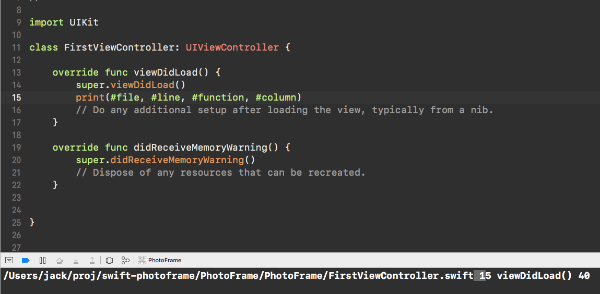
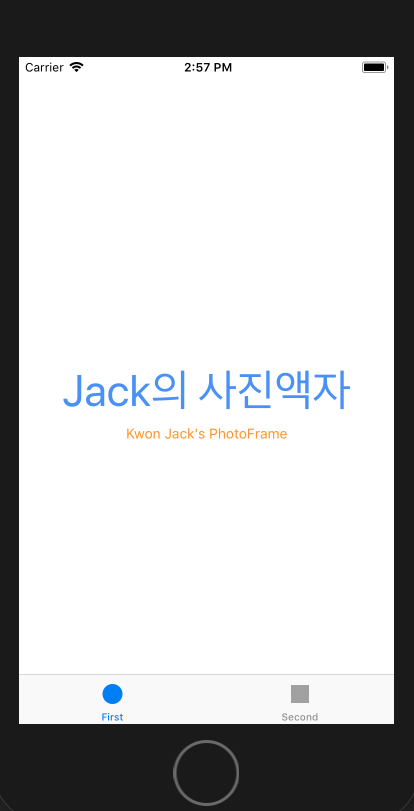
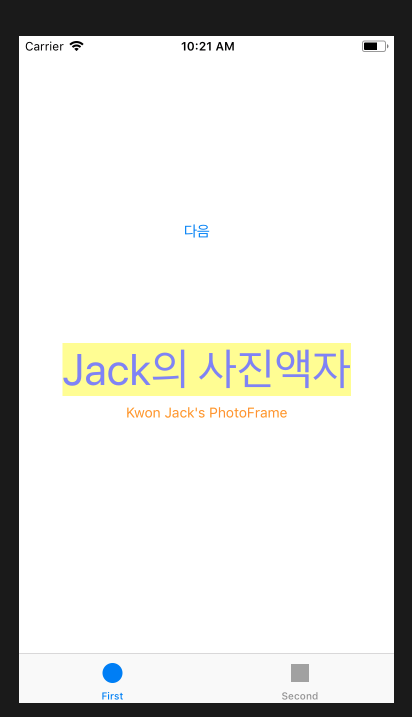
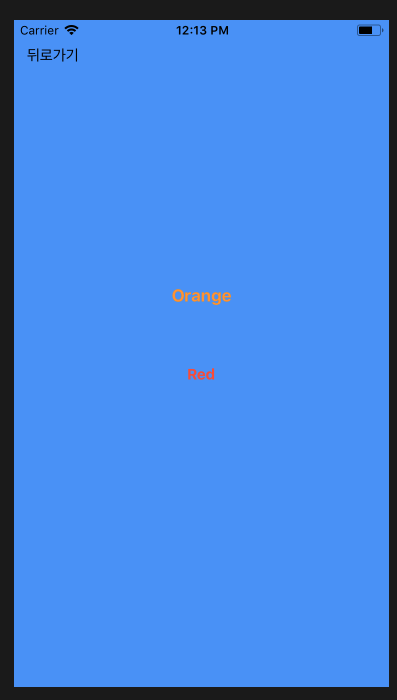
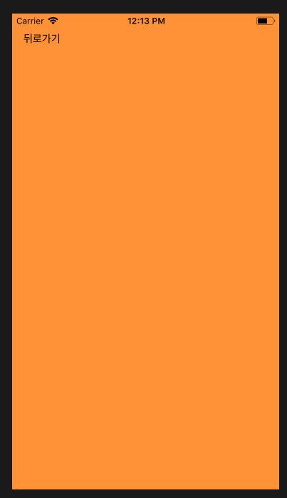
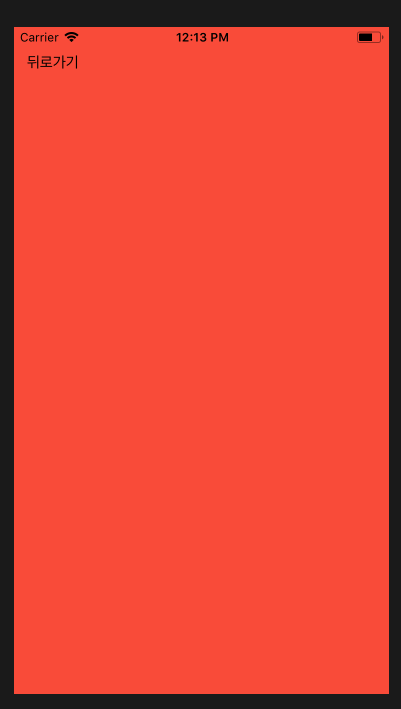
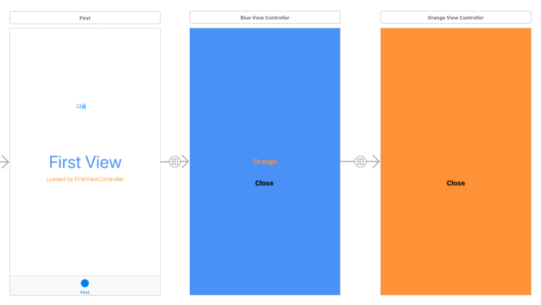
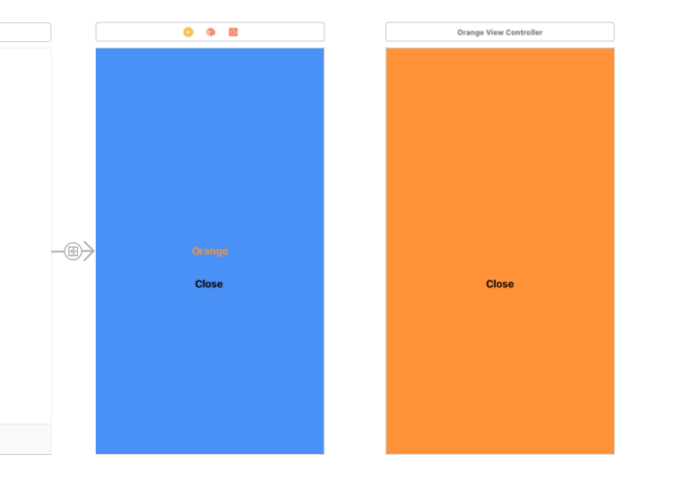

# Jack's PhotoFrame

## Step1. 시작하기 (Tabbed App 템플릿)
  - 요구사항 : 자동 생성된 ViewController 클래스 viewDidLoad() 함수에서 print(#file, #line, #function, #column) 코드를 추가하고 실행하면 콘솔 영역에 무엇이 출력되는지 확인한다.
  - 실행화면
  - 

  - 애플 UIKit View Management 클래스 중에서 UITabBarController 와 UITabBar에 대해 학습한다.
    - 각 클래스 역할(및 UITabBar과 UITabBarController의 차이점)은 무엇인가?
      - UITabBarController : Tab에 대한 Action을 담당(즉, 무엇을 보여주고, 무엇을 할지)
      - UITabBar : Tab의 전체적인 View구조를 담당(보여지는 부분, 즉. 어떻게 보이고 어떻게 반응할것인지)

## Step2. IBOutlet
  - First Scene에 만들어져 있는 레이블을 IBOutlet으로 연결한다.
  - 실행화면
  - 

  - UILabel 클래스 속성(Property)는 어떤게 있는지 학습한다.
    - Attributes Inspector 활용

## Step3. IBAction
  - Main.storyboard 에서 First Scene에 UIButton을 추가하고, IBAction으로 연결한다.
  - 실행화면
  - 

  - IBAction 과 IBOutlet 연결 구조에 대해 이해한 내용을 정리한다.
    - IBOutlet : 연결통로라는 의미, 인터페이스빌더에서 프로그램과의 연결통로
    - IBAction : 조작과 메서드를 연결, 사용자가 부품을 조작했을 때 실행할 일을 지정

  - 버튼에 IBAction을 추가할 때 이벤트(Event) 종류에는 어떤 것들이 있는지 학습한다.
  를 추가한다.
  - 실행화면
  - 
  - 
  - 

  - Segue에 액션에 있는 여러 항목들은 어떤 효과가 있는지 값을 바꿔보며 실행해서 학습한다.
    - Segue의 종류
      1. show : 새화면으로 이동. 스택구조로 원래 화면위를 덮는다.
      2. show detail : split view구조에서 원래 화면을 Master, 새 화면을 Detail로 표시한다. (교체) 아이패드에서만 의미가 있다.
      3. present modally : 새 화면이 모달처럼 원래 화면 위를 덮는다.(기존 화면은 새화면 뒤에 그대로 존재한다.)
      4. popover presentation : 팝업창을 띄움. 아이패드에만 의미가 있다.
      5. custom

## Step5. ViewController 프로그래밍
  - 스토리보드 구성 요소와 클래스 코드와 연결해서 동작을 확장한다.
  - 기존 실행화면
    - 

  - 화면 전환이 이루어지는 사이에 뷰컨트롤러 라이프사이클이 어떻게 변화하는지 학습한다.
    1. ViewDidLoad - 해당 뷰컨트롤러 클래스가 생성될 때(ViewWillAppear전에 실행) 실행된다. Low memory와같은 특별한 경우가 아니라면 딱 한번만 실행되기 때문에 초기화 할 때 사용 할 수 있다.
    2. ViewWillAppear - 뷰 컨트롤러가 화면에 나타나기 직전에 실행된다. 뷰 컨트롤러가 나타나기 직전에 항상 실행되기 때문에 해당 뷰 컨트롤러가 나타나기 직전마다 일어나는 작업들을 여기에 배치 시킬 수 있다.
    3. ViewDidAppear - 뷰 컨트롤러가 화면에 나타난 직후에 실행된다. 화면에 적용될 애니메이션을 그리거나 API로 부터 정보를 받아와 화면을 업데이트 할 때 이곳에 로직을 위치시키면 좋다. 왜냐하면 지나치게 빨리 애니메이션을 그리거나 API에서 정보를 받아와 뷰 컨트롤러를 업데이트 할 경우 화면에 반영되지 않기 때문에.
    4. ViewWill/DidDisappear - 뷰 컨트롤러가 화면에 나타난 직전/직후에 실행된다.

  - 뷰컨트롤러와 관련된 새로운 용어들에 대해 학습한다.

  - YellowViewController에서 Segue를 제거하고 다음 화면을 보여줄 때 코드로 보여주는 방법을 찾아보고 적용해본다.
    1. 뷰 컨트롤러 직접 호출에 의한 화면 전환 (내가선택한 방법)
    ```swift
    let ViewController인스턴스 = self.storyboard?.instantiateViewController(withIdentifier: “Storyboard ID값”)
    ViewController인스턴스?.modalTransitionStyle = UIModalTransitionStyle.coverVertical
    self.present(ViewController인스턴스!, animated: true, completion: nil)  
    ```
    - 위 방법을 반영한 실행화면
    - 

    2. 내비게이션 컨트롤러를 사용하여 화면 전환하기
    ```swift
    let ViewController인스턴스 = self.storyboard?.instantiateViewController(withIdentifier: “Storyboard ID값”)
    self.navigationController?.pushViewController(ViewController인스턴스!, animated: true)
    ```
