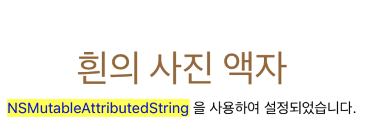

# PhotoFrame (Step 11)

## 📍 Step 11-1 Tabbed App 템플릿

- [Interface 인터페이스란?](#interface-인터페이스란)
- [ViewController](#viewcontroller)
- [Tab View Interface](#tab-view-interface)
- [viewDidLoad()](#viewdidload)

### Interface 인터페이스란?

계속해서 나오는 `인터페이스` 란 단어에 대해 용어 정리를 먼저 하고 들어가려고 한다. 사전적 의미는 다음과 같다. 

> 접촉(면), 경계(면)<br>
>
> The **interface** between two subjects or systems is the area in which they [affect](https://www.collinsdictionary.com/dictionary/english/affect) each other or have links with each other.

공통적으로 나오는 의미는 link(연결, 접촉) 이다. 인터페이스는 주로 중간에서 연결해주는 역할을 하는 장치나 소프트웨어에서 많이 사용되는 용어다. 

app 에서는 <u>사용자와 view</u> 가 서로 접촉한다. 앱에 display 되는 여러 view 중 하나를 선택하면 그에 맞는 처리가 되도록 view controller에 view 가 알려준다. User - Controller 사이에서 연결을 담당하는 것이 view가 된다. 따라서 **사용자와 앱이 서로 의사소통 할 수 있도록 중간에서 연결을 담당하는 모든 것이 app에서의 인터페이스이다.** 그 중에 하나가 view 이다. 

&nbsp;

### ViewController

> Manage your interface using view controllers and facilitate navigation around your app's content

view controller는 `UIKit` 앱의 사용자 인터페이스를 관리한다. view가 사용자로부터 user interaction을 받아 vc에 넘기면 그에 맞는 적절한 처리를 한다. 한 개의 view controller 는 한 개 이상의 view를 관리하며, 한 개의 app은 최소 한 개 이상의 view controller를 가지고 있다. 

view controller는 다시 2가지로 나눌 수 있다 - 일반적인 view controller 그리고 container view controller

**container view controller**는 다른 view controller를 자신의 root view 에 심는다(넣는다). view controller 한 개 이상을 자신이 감싸는 형태이므로 **container** 용어가 사용한 것으로 추측된다. 자신 안에 다른 view controller들을 가지고 있다가 특정 조건 혹은 인터랙션에 맞는 view controller를 보여주는 역할을 한다. navigation bar 의 처리를 담당하는 `UINavigationController` , tab bar 아이템 선택(모드)에 따라 지정된 view controller의 root view를 보여주는 `UITabBarController` 등이 이에 속한다. 일종의 view controller

&nbsp;

### Tab View Interface

tab bar 는 화면 가장 하단에 위치하여, 모드 선택에 따라 그에 맞는 view를 보여주는 인터페이스이다. 

#### UITabBarController

```swift
class UITabBarController : UIViewController
```

> A **container view controller** that manages a radio-style selection interface, where the selection determines which child view controller to display.

tab bar 선택에 따라서 보여질 child view controller 를 결정하고, 관련된 처리를 담당하는 container view controller 이다. tab bar view(화면 하단) 과 선택하면 나올 view 들을 감싸는 container이다. tab bar 에 보여지는 tab bar item 은 각각 view controller 와 연결되어 있다. 

- `var viewControllers: [UIViewController]? ` 
  - tab bar controller 에 의해 보여질 child view 들의 root view 를 가지고 있는 속성
  - 이 배열의 순서 == 연관된 tab bar item 순서 (tab bar 에서 보여지는 순서)
- `var selectedViewController: UIViewController?`
  - 맨 처음 보여지는 view 의 view contoller
  - 현재 보여지는 view의 view controller
- `var tabBar: UITabBar` : tab bar view 를 관리하는 controller
- [`UITabBarControllerDelegate`](https://developer.apple.com/documentation/uikit/uitabbarcontrollerdelegate) : tab bar interface 와 user 간의 interaction 이 발생하면 tab bar controller가 delegate에 알림을 보낸다.

#### UITabBar

> A control that displays one or more buttons in a tab bar for selecting between different subtasks, views, or modes in an app.

tab bar view 안에서 tab bar item 의 관리와 

&nbsp;

##### :mag: tool bar & tab bar

둘 다 화면 bottom edge 에 보여지는 bar

- Tool bar는 현재 화면에 대한 추가적인 조작 버튼을 담은 bar 

  (contains buttons for performing actions relevant to the current view or content within it)

- tab bar는 화면을 item에 맞게 다른 섹션 전환해주는 radio button 기능을 담은 bar. 흐름이 완전 바뀐다.

  (provides the ability to quickly switch between different sections of an app)

&nbsp;

### viewDidLoad()

`UIViewController` 의 method로 **메모리에 view controller 가 올라오면 가장 먼저 실행**된다. 주로 추가적인 초기화 작업을 구현하기 위해 오버라이딩 되어 사용된다. 

#### print(#file, #line, #function, #column) 을 viewDidLoad() 안에서 실행한 결과

해당 함수는 어떤 파일 몇번째 줄에서 어떤 어떤 함수가 실행되고 있는지를 출력해준다.

- tab bar controller 에 2개의 view controller 가 연결된 상태
- 실행하면 `FirstViewController` 의 `viewDidLoad()` 실행됨
- Tab bar에서 두번째 선택시, `SecondViewController` 의 `viewDidLoad()` 실행됨
- 그 뒤로는 아무리 tab bar item 바꿔도 어떤 vc `viewDidLoad()` 도 실행되지 않는다.
- 해석: view controller object 가 처음 메모리에 올라올 때만 `viewDidLoad()`가 실행되고, 그 뒤의 전환은 이미 메모리의 객체를 사용하기 때문. 메모리에 두 개의 view controller가 올라와 있음을 확인할 수 있다.

```
/Users/allwhite/Desktop/Codesquad/swift-photoframe/PhotoFrame/PhotoFrame/FirstViewController.swift 15 viewDidLoad() 40 <- 맨 처음 실행시
/Users/allwhite/Desktop/Codesquad/swift-photoframe/PhotoFrame/PhotoFrame/SecondViewController.swift 15 viewDidLoad() 40 <- second item 맨 처음 선택시
```


## 📍 Step 2 IBOutlet

- [View & UIView](#view--uiview)
- [UILabel](#uilabel)
- [NSAttributedString & NSMutableAttributedString](#nsattributedstring--nsmutableattributedstring)
- [Interface Builder](#interface-builder)
- [Attribute](#attribute)
- [Declaration Attibutes Used by Interface Builder](#declaration-attibutes-used-by-interface-builder)
- [IBOutlet](#iboutlet)

### View & UIView

앱에서 user interface 중 가장 기초, 기반이 되는 구성요소이다. view 는 다시 다른 view 를 안에 내재할 수 있다. (embedded view)

그 중 `UIView` 는 모든 view 의 최상위 class(root) class 로 공통 behavior 를 정의해 놓았다. 또한 사각형의 컨텐츠를 스크린에 표시할 수 있도록 관리를 담당하는 객체이다. 

### UILabel

> read-only text 를 보여주는 view

```swift
@interface UILabel : UIView
```

- the appearance of labels is configurable : 설정 가능하다
- customize 가능

설정 가능한 attributes

| attribute                               |                                                              |
| --------------------------------------- | ------------------------------------------------------------ |
| `text`, `attributedText`                | label content 지정<br />attributedText(NSAttributedString) string 내에서 일부만, 부분만 스타일링 속성을 바꿀 수 있다 |
| `textColor`                             | label 안 text 의 색상 지정                                   |
| `font`                                  | 폰트 `UIFont` type                                           |
| `textAlignment`                         | alignment 정렬                                               |
| `numberOfLines`                         | lines. 최대 줄 개수를 설정                                   |
| `isHighlighted`, `highlightedTextColor` | highlighted 된 상태로 그려져야 하는지 지정<br />그 때의 highlight 색상 지정 |
| `lineBreakMode`                         | contents 가 label 크기보다 클 때, 어떻게                     |

이외에도 label 크기, 그림자 관련 설정도 가능

&nbsp;

### NSAttributedString & NSMutableAttributedString

`NSAttributedString` 관련 속성(스타일, 색상 등)을 가지고 있는 string 을 표현하는 클래스

- 지정한 위치의 attribute 를 가져올 수 있다
- `NSAttributedString.Key` : attributed string 의 text 에 적용할 수 있는 특성들을 선언함

`NSMutableAttributedString` 은 `NSAttributedString` 의 하위 클래스

- Attributed string 을 mutating(변하게, 수정하게) 하기 위한 용도로 만들어진 클래스
- attribute 를 추가하여 지정할 수 있다
- 기존의 `NSAttributedString` 의 메소드 + 수정/변동 관련 메소드 추가
- [참조](https://developer.apple.com/documentation/foundation/nsmutableattributedstring)

```swift
let description = "NSMutableAttributedString 을 사용하여 설정되었습니다."
let attributedString = NSMutableAttributedString(string: description)
let yellowBackgroundAttribute: [NSAttributedString.Key : Any] = [
            NSAttributedString.Key.backgroundColor : UIColor.yellow,
            NSAttributedString.Key.foregroundColor : UIColor.blue
            ]
let convertedFirstLabelString = NSString(string: description)
attributedString.setAttributes(yellowBackgroundAttribute
            , range: convertedFirstLabelString.range(of: "NSMutableAttributedString"))
self.firstDescription.attributedText = attributedString
```



&nbsp;

### Interface Builder

- 앱의 user interface 를 생성하는 툴
- user interface file : user interface builder 에서 만든 interface 에 대한 정보를 저장하는 형식
  - extension : `.storyboard` or `.xib`
  - `.storyboard` : 여러개의 view controller 와 그 사이를 잇는 segues
  - `.xib` : 한 개의 view controller or menu bar
- [참조](https://developer.apple.com/library/archive/documentation/ToolsLanguages/Conceptual/Xcode_Overview/UsingInterfaceBuilder.html#//apple_ref/doc/uid/TP40010215-CH42-SW1)

&nbsp;

### Attribute

Swift 에서 Attribute 은 선언(declaration) 혹은 타입에 대한 추가적인 정보를 제공한다. `@`기호와 함께 사용되며, 선언 혹은 타입 앞에 쓰여 추가적인 정보를 전달하는 역할을 한다. ([참조](https://docs.swift.org/swift-book/ReferenceManual/Attributes.html))

```
@ attribute_name
@ attribute_name(attribute_arguments)
```

&nbsp;

### Declaration Attibutes Used by Interface Builder

그 중, interface builder 에서 사용되는 declaration attributes 는 다음과 같다. 이는 interface builder 의 object 와 코드의 선언부를 동기화(synchronize), 즉, 연결하기 위해 사용한다.

- `IBAction`, `IBSegueAction`, `IBOutlet`, `IBDesignable`, and `IBInspectable`

- *Example*

  ```swift
  @IBOutlet weak var firstLabel: UILabel!
  ```

&nbsp;

### IBOutlet

- interface builder 에서 생성한 객체와 소스코드를 연결하기 위해 사용하는 attribute
- 주로 객체의 속성을 제어할 목적으로 클래스의 프로퍼티에 연결
- 연결된 객체의 속성을 소스코드에서 변경할 수 있다.
- [참조](https://velog.io/@sogih/IBOutlet%EA%B3%BC-IBAction-1djvdhxlhc)