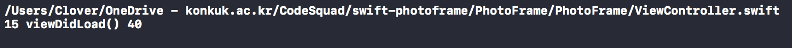

## Tabbed App 탬플릿

- #file : 자신의 경로를 반환
- #line : 해당 코드의 라인을 반환
- #function : 해당 코드를 실행하는 함수명을 반환
- #column : 해당 코드의 가로 수?를 반환

### Step1

요구 사항
- 애플 UIKit View Management 클래스 중에서 UITabBarController 와 UITabBar에 대해 학습한다.
  - 각 클래스 역할은 무엇인가? 어떤 경우에 사용하나?
  - UITabBar와 UITabBarController의 차이점은 무엇인가?
관련 클래스는 무엇이 있나?

  - UITabBarController 이란?

    - A container view controller that manages a radio-style selection interface, where the selection determines which child view controller to display.

    - radio-style interface : radio-style 이란 여러가지 선택할 수 있는 보기가 있을떄 선택한 하나만 선택 할 수 있는 방식

    - UIViewController 상속 : UITabBarController는 UIViewController를 상속 받고 있음

  - UITabBar 이란?

    - A control that displays one or more buttons in a tab bar for selecting between different subtasks, views, or modes in an app

    - TabBar View는 UIView로 되어있음

    - TabBarItem은 TapBar에 최소 1개 이상 있어야됌
