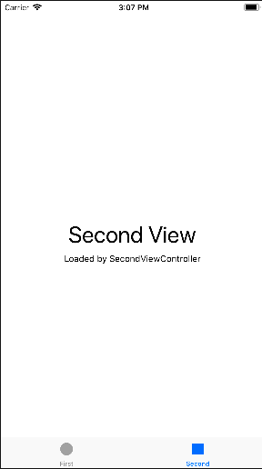

# PhotoFrame App

## Tabbed App 템플릿 시작

### Tabbed App 템플릿 초기화면
</img>&nbsp;&nbsp;&nbsp;&nbsp;&nbsp;</img>

<br/>

### viewDidLoad()에 print(#file, #line, #function, #column) 수행

```swift
class FirstViewController: UIViewController {

    override func viewDidLoad() {
        super.viewDidLoad()
        print(#file, #line, #function, #column)
    }

}
```
- 결과: 
 


- SecondViewController 에 적용 시, Second 탭 선택 후 출력됨.

<br/>

### 학습거리
- ***View*** : 
	- 데이터를 **어떻게** 보여주고 유저와 상호작용 시 **어떻게** 입력값을 받고 피드백을 보여줄지 아는 객체. 
- ***Controller*** : 
	- **무슨** 데이터를 보여주고 유저 입력값으로 **무엇을** 해야 하는 지 아는 객체.
- ***View와 Controller의 차이점*** : 
	- **How**와 **What**의 차이
- ***UITabBar*** : 
	- UIView로, 유저에게 **탭들을 어떻게 보여주고** 탭 클릭 시 **어떻게 반응할 건지 (피드백을 어떻게 보여줄지)** 안다.
	- 보통 UITabBarController와 함께 사용하지만, 혼자 쓰일 수도 있다.
	- 탭바는 항상 앱 아래쪽에 위치한다.
	- **UITabBarItem** 객체들을 보여준다.
	- **배경화면**이나 **틴트색** 변경으로 커스터마이즈 할 수 있다.
	- **UIToolBar**와 비슷하게 생겼지만, 쓰이는 **목적이 다르다**. 탭바는 주로 전체 앱의 모드를 변경할 때 쓰이고, 툴바는 현재 보여지는 콘텐츠 내에서 관련된 액션들을 보여주기 위해 사용한다.
	- 탭바는 선택값들이나 커스터마이즈된 값들을 **delegate 객체**에 알려준다. 이 때, 탭바를 직접 만든 경우 탭 선택/추가/제거/순서변경 등의 액션에 대해  어떻게 반응할 지를 UITabBarDelegate 구현하여 넘겨줘야 한다. **UITabBarController를 사용한 경우, 컨트롤러가 delegate 객체처럼 행동한다.**
	- 탭바를 선택했을 때, 탭바 컨트롤러는 자동으로 어떤 뷰컨트롤러를 보여줄 지 관리한다. 탭바의 탭이 선택되면 **tabBar(_:didSelect:)** 메소드가 호출되어 반응한다.(커스텀 탭바인 경우, 모두 구현해줘야 한다.)
- ***UITabBarController*** : 
	- UIViewController로, **어떤 탭들을 보여주고** 탭 클릭 시 **무엇을 할 지** 안다.
	- 특정 탭 선택 시, 해당 뷰컨트롤러의 **루트뷰**를 보여준다. (이전에 어떤 뷰를 봤건 상관없이 항상 루트뷰를 보여준다.)
	- UITabBarItem을 뷰컨트롤러와 연결시키려면, UITabBarItem 객체를 생성한 후 뷰컨트롤러의 **tabBarItem** 프로퍼티에 할당한다.(커스텀뷰가 아니면 디폴트 Item이 생성됨)
	- 유저가 **탭 선택 시, 탭바 컨트롤러는 상호작용 내용을 delegate 객체에 전달**한다.(delegate는 어떤 객체든 상관없지만, UITabBarControllerDelegate를 채택해야 함) delegate를 사용하면 다른 탭들이 선택되지 않도록 제어하거나 특정 작업을 수행하게 만들 수 있다. 또한, **탭 내부의 뷰컨트롤러가 NavigationController로 구성되어 있으면 여기서 일어나는 변화를 감지할 수 있다.**
	- 탭바 개수가 4개 이상되면, 처음 **4개 + '...'(standard More item) 탭**만 보여진다.
	- 탭바 컨트롤러의 구성:
	- 