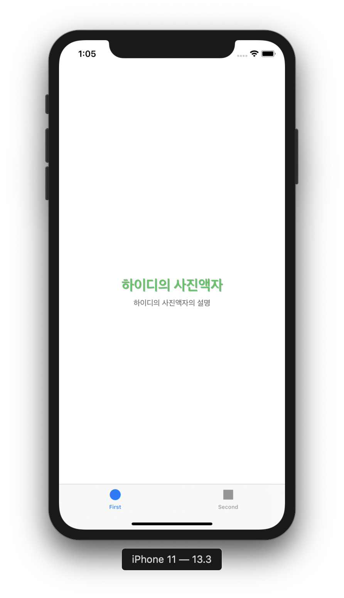
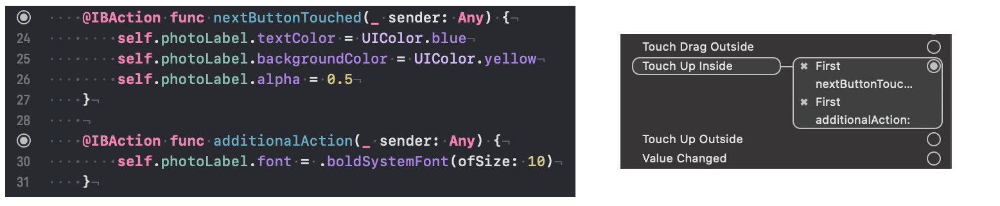
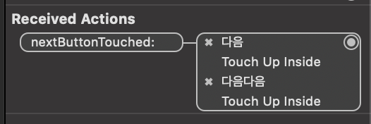
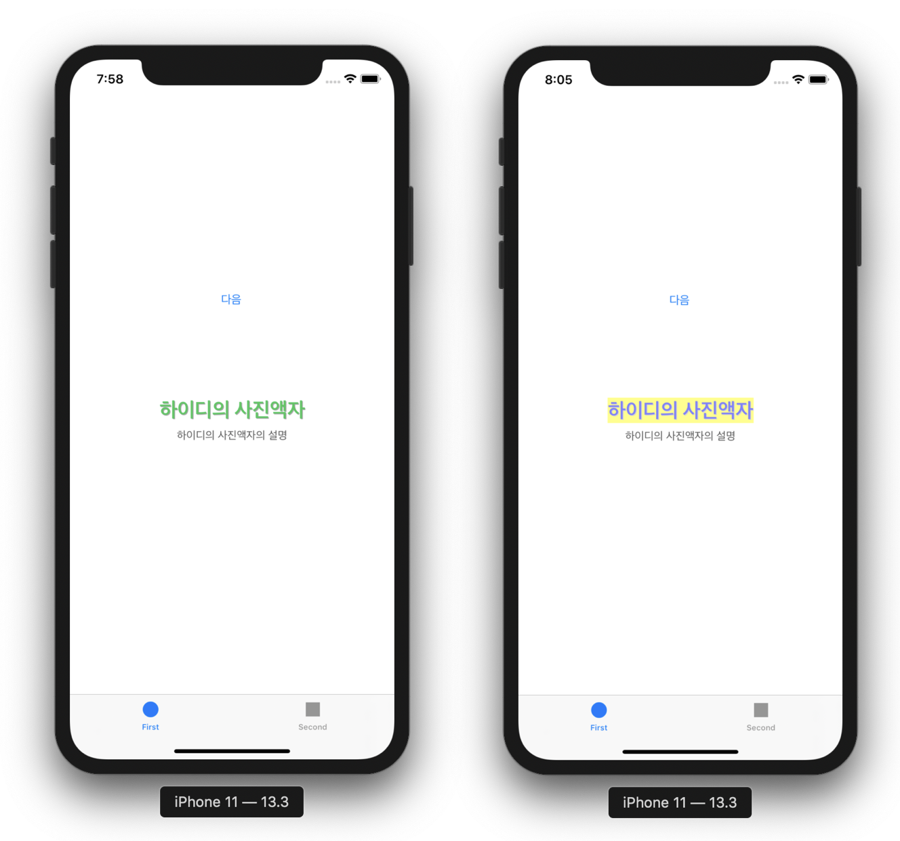
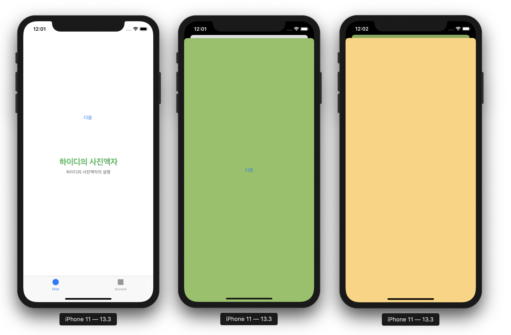
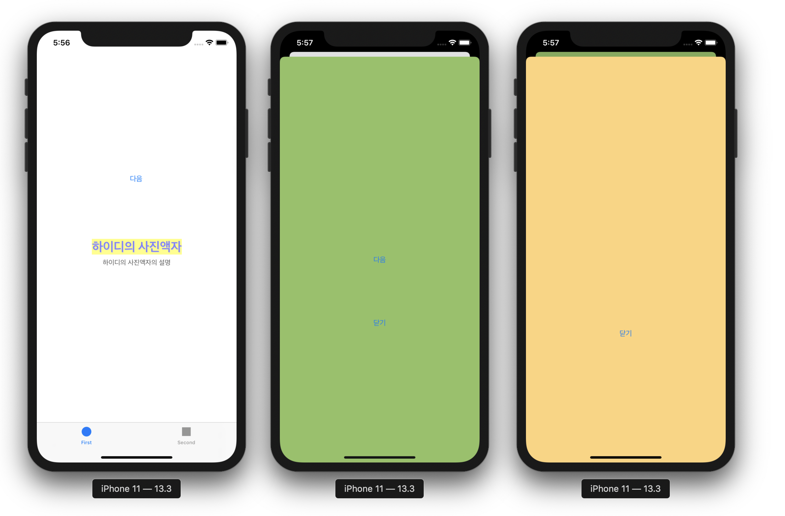

# STEP1. 사진액자 앱

코드스쿼드 마스터즈 iOS 클래스 PhotoFrame 프로젝트

## STEP1-1 Tabbed App 프로젝트 생성

* Tabbed App 템플릿으로 프로젝트 생성
* `viewDidLoad` 함수에 코드 추가하여 호출 확인
    * `viewDidLoad`는 화면이 처음 보일 때 뷰가 메모리에 로드되며 호출된다.

## STEP1-2 Photo Labels 셋업

* 첫 번째 화면의 레이블들을 IBOutlet으로 ViewController와 연결
* 아웃렛 변수를 통해 레이블 설정
    * 시스템 폰트, 텍스트 색상 등 변경
        * bold 서체를 반환하는 `boldSystemFont(ofSize:)` 타입 메서드를 통해 폰트 설정
    * 그림자 색상과 offset 설정
        * `shadowOffset` 프로퍼티는 `CGSize` 타입이므로 해당 타입으로 생성하여 할당

**실행 화면**


## STEP1-3 버튼을 눌러서 레이블 프로퍼티 변경

* IBAction으로 버튼에 일어나는 Touch up 이벤트와 메서드를 연결
    * Touch up 이벤트 외에도, Touch down, Touch Drag 등의 이벤트들이 있다.

* 스토리보드의 Connection Inspector를 이용하여 다음과 같이 하나의 이벤트에 여러 액션 메서드들을 연결할 수 있다.


* 여러 개의 버튼을 하나의 액션에 연결할 수도 있다.


* 또한 다음과 같이 여러 개의 이벤트를 하나의 버튼에 연결할 수도 있다.


**실행 화면**


## STEP1-4 세그를 통한 화면 전환

* 버튼과 뷰 컨트롤러를 세그 객체로 연결하여 화면 전환 구현
    * 세그 형식을 Show로 설정
* 전환된 뷰 컨트롤러의 배경 색상을 바꾸어 명확하게 나타냄
* 또다른 뷰 컨트롤러를 세그 객체로 연결하여 그 다음으로의 화면 전환을 구현
* 해당 뷰 컨트롤러의 배경 색상도 바꾸어 표시

**실행 화면**


## STEP1-5 뷰 컨트롤러 닫기 기능 구현

* 두 개의 뷰 컨트롤러에 닫기 버튼 추가
* 닫기 버튼이 터치됐을 때 액션 메서드를 통해 화면을 닫도록 구현
* 뷰의 상태 변화 관련 메서드들을 오버라이드하여 호출되는 시점 관찰

### 학습한 내용

#### 뷰의 상태 변화 관련 메서드들 정리

* `viewDidLoad` — 뷰가 메모리에 로드될 때 호출된다.
* `viewWillAppear` — 뷰 컨트롤러의 뷰가 뷰 계층 구조에 추가되기 직전에 호출되며, 화면 전환 애니메이션 등이 설정되기 전에 호출된다. 화면을 보여주는 작업과 관련된 일들을 수행하기에 적합하다.
* `viewDidAppear` — 뷰 컨트롤러의 뷰가 뷰 계층 구조에 추가되었음을 알리기 위해 호출된다. 뷰의 presenting하는 것과 관련된 추가적인 일을 하기에 적합하다.
* `viewWillDisappear` — 뷰 컨트롤러의 뷰가 뷰 계층 구조에서 제거되기 직전에 호출된다. `viewWillAppear`와 마찬가지로, 실제 뷰가 제거되기 이전에 애니메이션(여기서는 화면이 닫히는 애니메이션)이 설정되기 전에 호출된다.
* `viewDidDisappear` — 뷰 컨트롤러의 뷰가 뷰 계층 구조에서 제거되었음을 알리기 위해 호출된다. 뷰가 사라지는 것과 관련된 추가적인 작업을 하기에 적합하다.

#### 세그웨이를 이용하지 않고 화면 전환을 구현하는 방법 정리

스토리보드에서 Green View Controller에 Storyboard ID를 `GreenViewController`라고 추가한 뒤에, presenting view controller에서 다음 코드를 추가하면 세그웨이에게 뷰 컨트롤러의 인스턴스 생성을 맡기는 것이 아니라 직접 코드에서 생성하여 보여지게 할 수 있다.

```swift
guard let viewController = storyboard?.instantiateViewController(
    identifier: "GreenViewController") as? GreenViewController else {
    return
}
show(viewController, sender: self)
```

**실행 화면**

