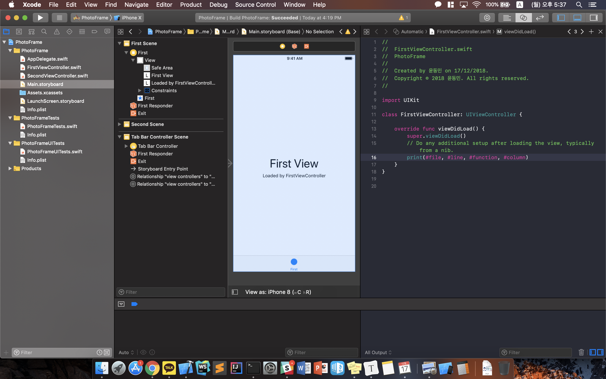
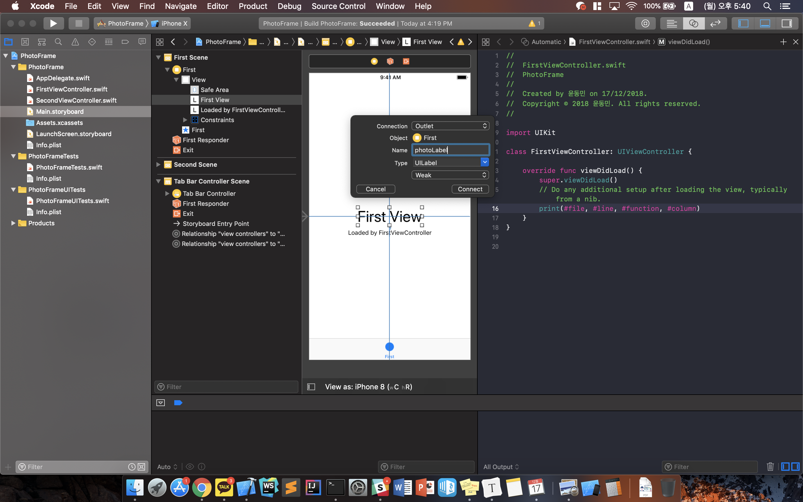
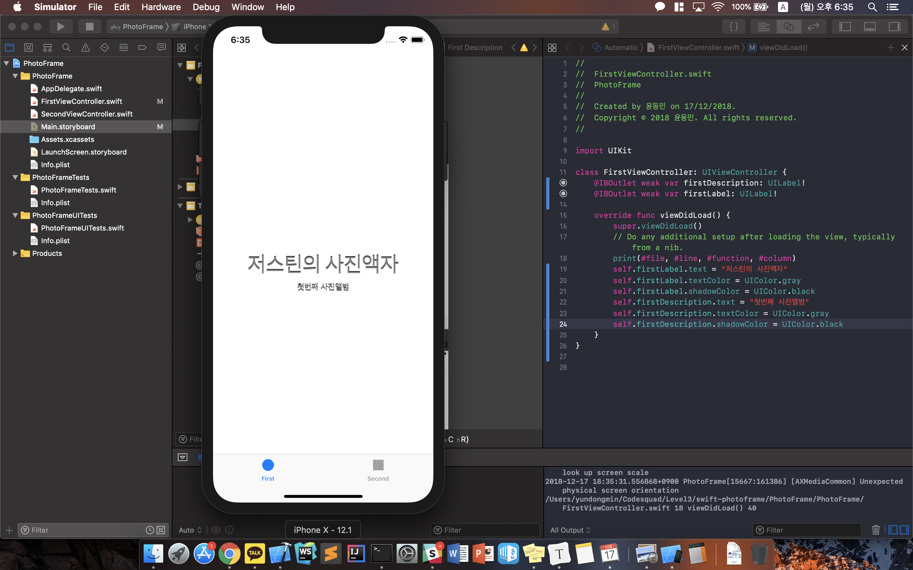

### 사진액자 앱

##### **Step 1** 

* 파일의 위치,  명령어가 쓰인 라인, 명령어가 쓰인 함수, 명령어 실행되는 Column을 콘솔창에 출력한다.

##### **Step 2** 

 앱의 UI 화면을 변경하기 위해선 **Story Board** 파일을 열어야 한다. (LaunchScreen.storyboard 는 앱이 실행될 때, main.storyboard 는 그 외의 경우에 다룬다.)
 * IBOutlet, IBAction : Colletion 타입 중 하나이다. 각각 프로퍼티, 메소드로 생성되어 화면 요소들을 컨트롤할 수 있는 연결고리가 된다.
 * IBOutlet : 처리 결과를 View 단에 알리고 원하는 동작을 이끌어 내게한다 -> View에 존재하는 요소와 Controller를 연결하기 위한 변수이다.
 * IBAction : 유저를 통한 특정 이벤트를 감지해서 Controller에 알리는 역할을 한다 -> 특정 이벤트 발생 시 실행될 액션이다.
 
 
 
* 작업한 내용의 결과를 쉽게 확인할 수 있는 Assistant Editor 모드로 전환해 준다.

* first Label을 IBOutlet으로 `Control + Drag` 하여 연결시켜 준다.

* 연결된 Outlet 변수를 통해 프로퍼티의 속성을 바꾸어 준다.
