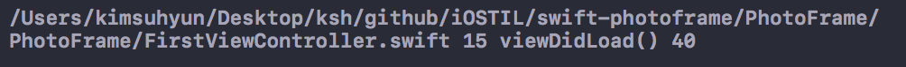
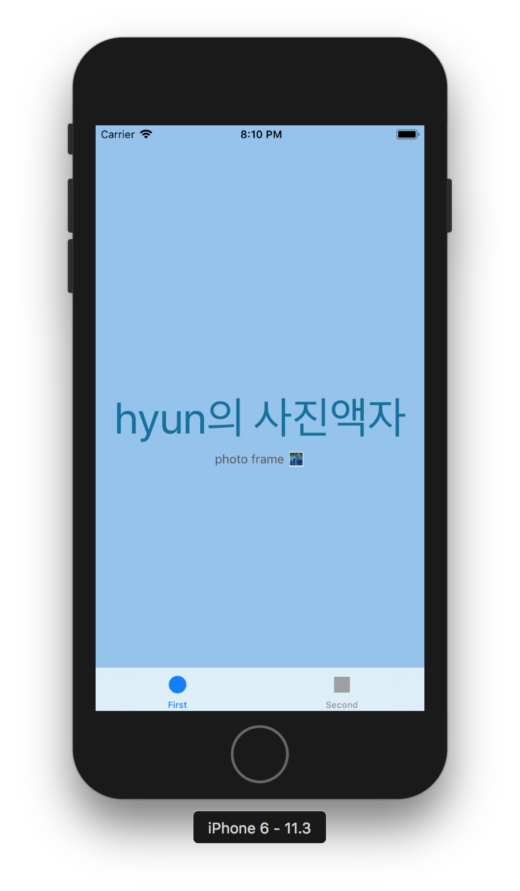
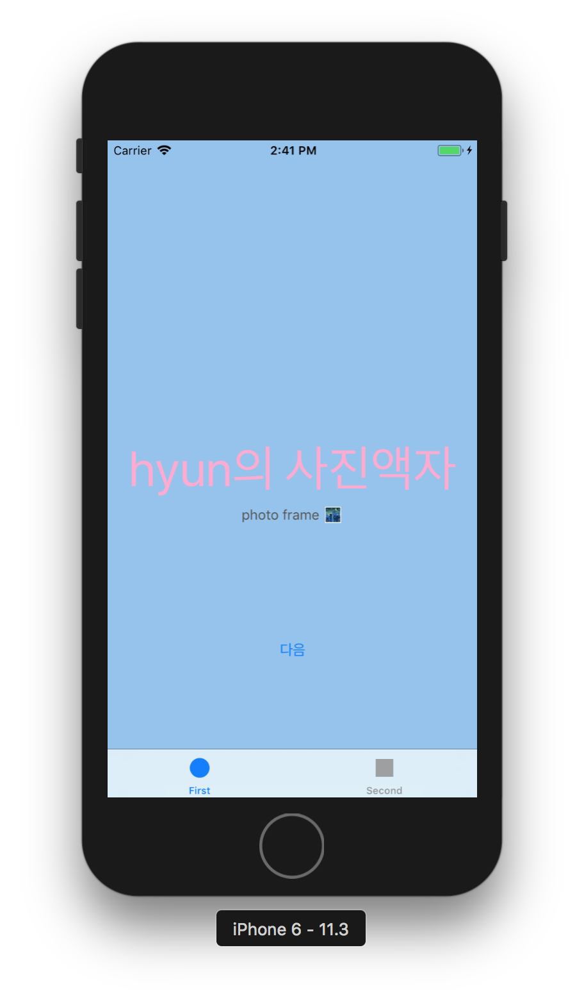
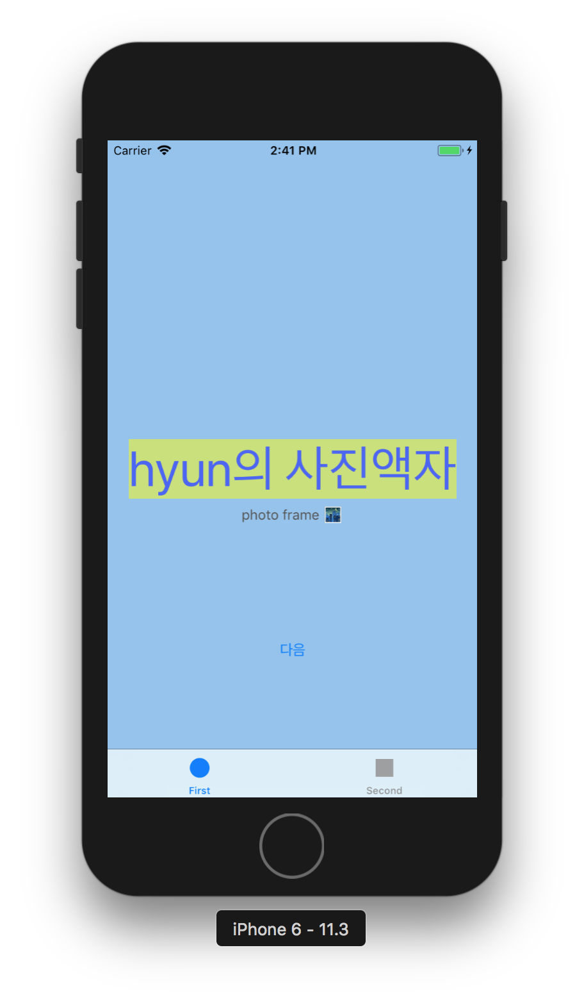
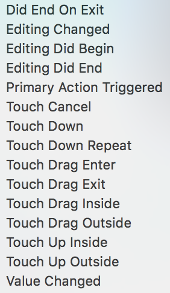

## PhotoFrame - step1

### 프로그래밍 요구사항

자동 생성된 ViewController 클래스 viewDidLoad() 함수에서 print(#file, #line, #function, #column) 코드를 추가하고 실행하면 콘솔 영역에 무엇이 출력되는지 확인한다.

### 콘솔 화면

* 애플 UIKit View Management 클래스 중에서 UITabBarController 와 UITabBar에 대해 학습한다.
	* 각 클래스 역할은 무엇인가? 어떤 경우에 사용하나?
	* UITabBar와 UITabBarController의 차이점은 무엇인가?
	* 관련 클래스는 무엇이 있나?

* UITabBar  
일반적으로 화면의 아랫부분에 위치하며 여러 다른 내용의 뷰를 사용자들이 선택할 수 있도록 문자열과 부가적인 아이콘들을 표시한다.
탭 바는 수평적 화면 이동을 제공하는 인터페이스이다. 내비게이션 바가 수직적 화면 이동에 사용되는 것과 달리, 동등한 수준의
여러 화면으로 이동할 때 사용된다. 탭 바 내부에 나열된 각각의 탭들은 터치했을 때 그에 연결된 화면으로 이동함을 의미한다. 
탭바의 탭은 일반적으로 5개 미만으로만 사용하는 것이 적절한데, 그 이상 늘어나면 사용자가 터치할 충분한 공간 확보가
어렵기 때문이다. 만약 그 이상으로 늘어나야 한다면 탭 바 대신 다른 인터페이스를 사용하거나 또는 더보기 방식으로 나머지
메뉴를 숨김 처리하는 것이 좋다.
탭바는 탭 바 컨트롤러를 통해 다루는 것이 좋다.

* UITabBarController  
선택된 탭 항목에 따라 표시할 뷰를 결정하는 컨테이너 컨트롤러이다.

#### 참고링크  
[UITabBarController](https://developer.apple.com/documentation/uikit/uitabbarcontroller)   
[UITabBar](https://developer.apple.com/documentation/uikit/uitabbar)

  
      

## PhotoFrame - step2

### 요구사항  
* 사진액자 앱 - 시작하기 요구사항을 구현한 상태로 시작한다.
* First Scene에 만들어져 있는 레이블을 IBOutlet으로 연결한다.
* 연결한 아웃렛 변수에 값을 변경한다.
* 실행한 화면을 캡처해서 readme.md 파일에 포함한다.
  
### 프로그래밍 요구사항
* Xcode 프로젝트 내비게이터에서 Main.storyboard 파일을 선택하고 First Scene 에 있는 'First View' 레이블(Label)을 선택하고 Assistant Editor 모드로 변경한다.
* 레이블을 선택하고 Control + 드래그해서 ViewController 코드에 IBOutlet으로 연결한다.
* Outlet 이름으로 photoLabel을 입력한다.
* ViewController 클래스 viewDidLoad() 함수에서 위에 추가한 아웃렛 변수에 값을 변경하고 다시 실행한다.
* 위와 같이 코드로 firstLabel의 속성을 변경해본다. 글자색, 배경색, 투명도, 글자 크기를 바꿔본다.
* firstLabel 아래 있는 레이블도 firstDescription 아웃렛으로 연결한다.
	* 마찬가지 방식으로 값을 변경해서 꾸며본다.

  

* UILabel 클래스 속성(Property)는 어떤게 있는지 학습한다.

### UILabel  
text - Label 내용을 지정  
textColor - text color를 지정  
font - 문자열의 글꼴을 지정  
textAlignment - 문자의 가로정렬 왼쪽, 오른쪽, 가운데정렬 선택  
numberOfLines - 문자를 렌더링할때 최대 line 수를 지정 

#### 참고링크  
[UILabel](https://developer.apple.com/documentation/uikit/uilabel)  
[RGB to UIColor Converter](http://uicolor.xyz/#/rgb-to-ui)  

## PhotoFrame - step3  
  
### 요구사항    
* 사진액자 - IBOutlet 요구사항을 구현한 상태로 시작한다.
* First Scene에 버튼(UIButton)을 추가하고 IBAction으로 연결한다.
* 연결한 액션에 대한 메서드를 구현한다.
* 실행하고 버튼을 터치하기 이전/이후 화면을 캡처해서 readme.md 파일에 포함한다.  

### 프로그래밍 요구사항  
* Main.storyboard 에서 First Scene에 UIButton을 추가한다.
	* 우측 유틸리티 영역 하단 3번째 탭 - 객체 라이브러리(Object Library)에서 Button 을 찾아서 View로 드래그한다.
	* 방금 추가한 버튼을 선택하고 우측 유틸리티 영역 상단 4번째 탭 - 속성(Attributes)에서 Title을 `다음`으로 변경한다.
* 버튼을 선택하고 `Control + 드래그`해서 ViewController 코드에 IBAction으로 연결한다. 
* 다음과 팝업에서 Connection 항목에서 IBOutlet 대신 IBAction 으로 변경한다.
* 액션 이름을 `nextButtonTouched` 로 지정한다.
* ViewController 클래스에 추가된 nextButtonTouched() 메서드에 아래처럼 구현을 추가한다.   

### 학습꺼리
* IBAction 과 IBOutlet 연결 구조에 대해 이해한 내용을 정리한다.  

  

  
IBAction과 IBOutlet은 iOS 프로그래밍에서 MVC 패턴을 구현하기 위한 개념으로 사용된다

MVC 패턴이란 데이터를 소유한 Model과 사용자에게 보여지는 View 그리고 View에서 발생되는 Event를 받아서 Model을 갱신하는 Controller를 의미하는데 View와 ViewController를 연결해주는 역할을 하는 것이 IBAction과 IBOutlet이다

MVC(Model View Controller)의 약자로 에플리케이션을 세가지의 역할로 구분한 개발 방법론이다. 아래의 그림처럼 사용자가 Controller를 조작하면 Controller는 Model을 통해서 데이터를 가져오고 그 정보를 바탕으로 시각적인 표현을 담당하는 View를 제어해서 사용자에게 전달하게 된다. 

  

IBAction은 View에서 Event가 발생되었을 때 호출되는 함수이며 IBOutlet은 Controller 함수에서 Button 등 View의 Control에 접근하기 위한 변수이다  

* 버튼에 IBAction을 추가할 때 이벤트(Event) 종류에는 어떤 것들이 있는지 학습한다.  

  

* 버튼에 액션을 여러개 추가할 수 있을까?
	* 버튼에 액션을 여러개 추가할 수 있다
	* sender를 이용해서 구분해서 사용할수 있다
* 버튼이 여러개일 때 하나의 액션에 추가할 수 있을까?
	*  여러개의 버튼에 하나의 액션을 추가할 수 있다

#### 참고링크    
[IBAction과 IBOutlet](http://blog.devez.net/59)  
[MVC 생활코딩](https://opentutorials.org/course/697/3828)  
[UIButton](https://developer.apple.com/documentation/uikit/uibutton)  
[UIControl](https://developer.apple.com/documentation/uikit/uicontrol?changes=latest_minor&preferredLanguage=occ)  
[iOS IBAction](https://m.blog.naver.com/PostView.nhn?blogId=itperson&logNo=220972510635&proxyReferer=https%3A%2F%2Fwww.google.co.kr%2F)