# 사진액자 앱

1. <a href="#1-시작하기---tabbed-app-템플릿">시작하기 - Tabbed App 템플릿</a>
2. <a href="#2-IBOutlet">IBOutlet</a>
3. <a href="#3-IBAction">IBAction</a>
4. <a href="#4-Scene과-Segue">Scene과 Segue</a>
5. <a href="#5-ViewController-프로그래밍">ViewController 프로그래밍</a>
6. <a href="#6-Container-ViewController">Container ViewController</a>
7. <a href="#7-Second-Scene-화면">Second Scene 화면</a>
8. <a href="#8-마무리하기">마무리하기</a>

<br>

## 1. 시작하기 - Tabbed App 템플릿

### 추가 내용

자동 생성된 두 개의 `ViewController` 클래스에 추가한 내용입니다.

```swift
class FirstViewController: UIViewController {
    override func viewDidLoad() {
        super.viewDidLoad()
        print(#file, #line, #function, #column)
    }
}
```

```swift
class SecondViewController: UIViewController {
    override func viewDidLoad() {
        super.viewDidLoad()
        print(#file, #line, #function, #column)
    }
}
```

<br>


### 사용된 코드 내용

- `viewDidLoad()` : `UIViewController` 의 인스턴스 메소드로, 해당 컨트롤러의 뷰가 메모리에 로드된 이후 호출되는 메소드이다.

- 디버깅 식별자 : 실행 중 디버깅을 할 때 유용하게 사용할 수 있는 식별자
  - `#file` : 현재 코드가 실행 중인 파일 이름
  - `#line` : 현재 코드가 실행되고 있는 줄 위치
  - `#function` : 현재 코드를 실행하고 있는 함수의 이름
  - `#column` : 현재 코드가 실행되고 있는 줄에서의 칸 위치

<br>


###  콘솔 실행 결과

```
/Users/yxxjy/DevNote/swift-photoframe/PhotoFrame/PhotoFrame/FirstViewController.swift 15 viewDidLoad() 40
/Users/yxxjy/DevNote/swift-photoframe/PhotoFrame/PhotoFrame/SecondViewController.swift 15 viewDidLoad() 40
```

<br>


### UITabBarController와 UITabBar

- **`UITabBarController`** : 보여줄 자식 뷰 컨트롤러를 라디오스타일 셀렉션으로 관리하는 뷰 컨트롤러
- **`UITabBar`** : 탭 아이템을 보여주고 제어하는 뷰

<br>


## 2. IBOutlet

### 추가 내용

1. `@IBOutlet` 을 사용하여 `FirstViewController` 내 두 개의 `UILabel` 을 코드와 연결해주었습니다.

```swift
@IBOutlet weak var photoLabel: UILabel!
@IBOutlet weak var photoDescription: UILabel!
```

- **`IBOutlet`** 속성은 위에 선언한 `photoLabel` 과 `photoDescription` 프로퍼티가 **Interface Builder** 와 연결된 것임을 Xcode가 알 수 있게 해줍니다.
-  **`weak`** 키워드를 사용하면 레퍼런스 카운트를 올리지않아, 참조순환이 발생하는 것을 방지해줍니다.

<br>

2. `UILabel` 클래스 프로퍼티를 활용해 텍스트 내용과 스타일을 변경했습니다.

- `var text: String?` : 텍스트 내용
- `var attriutedText: NSAttributedString?` 
  - `NSAttributedString` : 하이퍼링크나 데이터 접근, 스타일 등의 여러 관련 속성을 갖고있는 문자열입니다. `[NSAttributedString.Key : Any]?` 의 속성 딕셔너리로 초기화합니다.
- `var font: UIFont!` : 텍스트 폰트
- `var textColor: UIColor!` : 텍스트 컬러
- `var shadowColor: UIColor?` : 텍스트 그림자 컬러
- `var shadowOffset: CGSize` : 텍스트 그림자 두께

<br>

3. 세부적인 뷰 표현을 위해 `UILabel` 을 상속받는 Custom Class를 추가했습니다. 

```swift
@IBOutlet weak var photoLabel: TitleLabel!
@IBOutlet weak var photoDescription: SubTitleLabel!
```

<br>

### 실행 화면

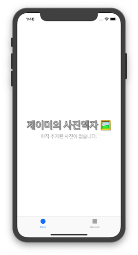

<br>

## 3. IBAction

### 추가 내용

1. 버튼에 `@IBAction` 으로 아래에 기재한 터치 이벤트를 추가했습니다.

- **UIControl.Event**
  -  `touchUpInside` : **터치업**(터치 후 손가락을 떼는 행위) 이벤트가 컨트롤 경계 **내부**에서 일어났을 때.
  - `touchUpOutside` : **터치업** 이벤트가 컨트롤 경계 **외부**에서 일어났을 때.
  - `touchDown` : 터치다운. 단어 그대로 손가락이 **터치** 행위를 하고 있을 때.
  - `touchDownRepeat` : 터치다운 이벤트가 **반복**해서 일어났을 때. 이 때는 UITouch의 `tapCount` 가 1보다 크다.
  - `touchDragInside` : 컨트롤 경계 **내부**에서 **드래그**를 했을 때.
  - `touchDragOutside` : 컨트롤 경계 **외부**에서 **드래그**를 했을 때.
  - `touchDragEnter` : **드래그** 이벤트가 컨트롤 경계 외부에서 일어나다가 **내부로 진입**했을 때.
  - `touchDragExit` : **드래그** 이벤트가 컨트롤 경계 내부에서 일어나다가 **외부로 나갔**을 때.
  - `touchCancel` : 현재 터치 이벤트를 **중단**시키는 **시스템 이벤트**가 일어났을 때.

<br>

### 실행 화면

추가한 터치 이벤트 액션이 실행되는 것을 확인하기 위해, 액션마다 아래의 메소드를 실행해주었습니다.

```swift
private func showResult(of result: String) {
	resultOfButtonAction.text = result
	print(result)
}
```

- 시뮬레이터

`다음` 버튼에 `TOUCH UP INSIDE` 이벤트가 일어난 것을 보여줍니다.

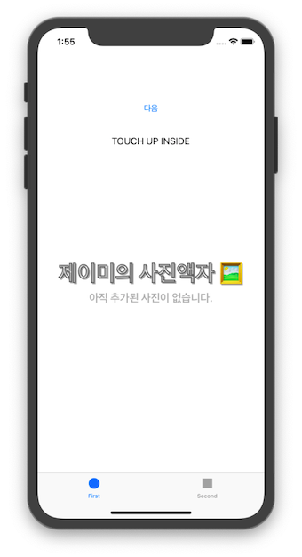

- 콘솔

위의 `다음` 버튼에 일어난 터치 이벤트가 콘솔에 기록됩니다.

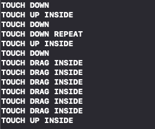


<br>

## 4. Scene과 Segue

### 추가 내용

1. First Scene 옆에 ViewController를 드래그하여 새로운 Scene을 추가하여, 다음 버튼을 Ctrl+Drag해 새로 추가한 Scene에 연결해주었습니다.
2. Action Segue에서 `Show` 항목을 선택했습니다. 
3. 다른 여러 Segue 액션 또한 실행해보았습니다.

- **UIStoryboardSegue**

  - 두 개의 뷰 컨트롤러 사이에서 **visual transition** 을 만들어주는 클래스입니다.

  - Segue의 시작점은 버튼이나 테이블 로우, 제스처를 인식하는 부분이 될 수 있습니다. Segue의 도착점은 보여주고자하는 뷰 컨트롤러입니다.

  - Segue Type

    - **`Show (e.g. Push)`**

      대부분의 뷰 컨트롤러에서 모달 형식으로 연결합니다. 타겟 뷰의 `showViewContorller:sender:` 메소드를 오버라이드하여 다른 방식을 시행하기도 합니다. `UINavigationController` 의 경우, 다음 뷰 컨트롤러를 내비게이션 스택에 쌓아, 왼쪽 상단에 back 버튼이 나타나도록 합니다.

    - **`Show Detail (e.g. Replace)`**

      뷰 컨트롤러가 `UISplitViewController` 일 경우에, 두 번째 자식 뷰 컨트롤러 자리를 split 뷰 컨트롤러가 **대체**합니다. 이 경우 외에는 위와 마찬가지로 모달 형식으로 연결합니다.

    - **`Present Modally`**

      보여질 뷰 컨트롤러가 이전의 뷰 컨트롤러 위에 모달 형식으로 보여집니다.

    - **`Present as Popover`**

      현재 뷰 위에 팝오버 형태로 연결합니다.

<br>

### 실행 화면

 `다음` 버튼 ——*Segue*——> Yellow-background `Scene` 의 `다음` 버튼 ——*Segue*——> Pink-background `Scene`

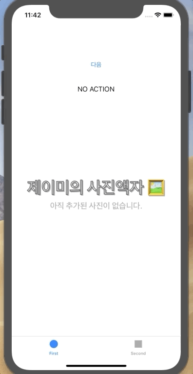

<br>

### 추가 학습 내용

#### Unwind Segue

Segue를 사용하면 연결되는 뷰 컨트롤러가 스택구조에 계속해서 쌓이게 된다. **Unwind Segue** 를 사용하면 트랜지션 전에 보여졌던 뷰 컨트롤러를 해제할 수 있다.

```swift
@IBAction func unwindToFirstViewController(unwindSegue: UIStoryboardSegue) {
    // no need to add anything
}
```

`FirstViewController` 에 위의 `IBAction` 을 추가한 후, Yellow-background Scene에 새로 추가한 `이전` 버튼을  아래의 Exit으로 Ctrl-Drag하여 만들어놓은 메소드를 선택한다.

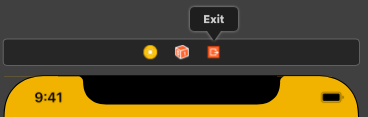

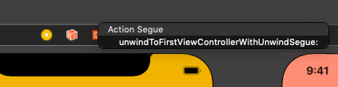

#### Unwind Segue 실행 화면

위의 실행화면과 비교해보았을 때, First Scene과 Yellow-background Scene 사이의 `Segue` 와 `Unwind Segue` 는 트랜지션 애니메이션 차이로도 다름을 알 수 있다.

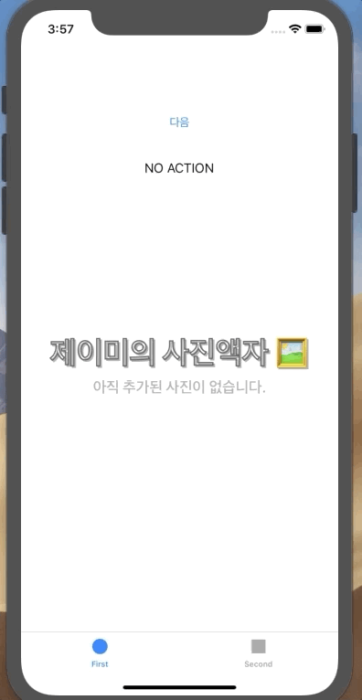

<br>

## 5. ViewController 프로그래밍

### 추가 내용

1. 위 단계에서 추가했던 두 개의 새로운 Scene에 대해 `UIViewController` 를 상속받는 `YellowViewController` , `PinkViewController`  클래스를 새로 만들어 각 화면에 지정해주었습니다. 또한, 두 화면에  `닫기` 버튼을 추가하여 아래의 IBAction을 추가해주었습니다.

```swift
@IBAction func closeButtonTouched(_ sender: Any) {
    self.dismiss(animated: true, completion: nil)
}
```

<br>

2. 각 뷰 컨트롤러에 화면 관련 주요 콜백 메소드를 추가해 화면 전환이 이루어지는 과정을 확인해보았습니다.

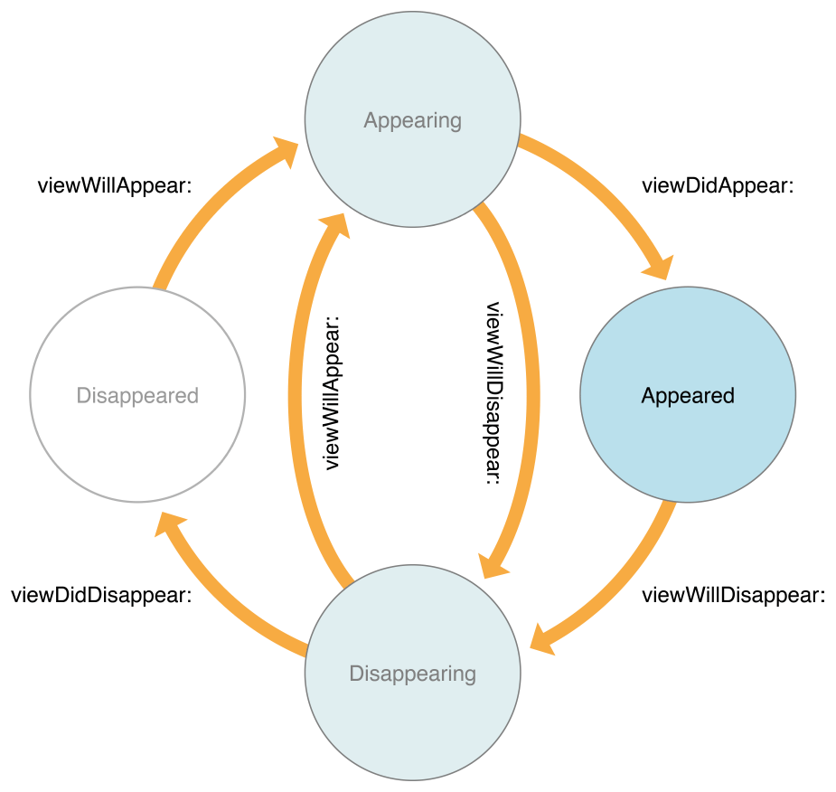

<a href="https://developer.apple.com/documentation/uikit/uiviewcontroller">이미지 출처</a>

- `viewWillAppear()` : 뷰 컨트롤러의 뷰가 뷰 계층(view hierarchy)에 **포함될 예정**임을 알려준다.
- `viewDidAppear()` : 뷰 컨트롤러의 뷰가 뷰 계층(view hierarchy)에 **포함되었음**을 알려준다.
- `viewWillDisappear()` : 뷰 컨트롤러의 뷰가 뷰 계층(view hierarchy)에서 **빠질 예정**임을 알려준다.
- `viewDidDisappear()` : 뷰 컨트롤러의 뷰가 뷰 계층(view hierarchy)에서 **빠졌음**을 알려준다.

<br>

### 실행 화면

위에 추가한 화면 관련 뷰 컨트롤러 콜백 메소드 실행 부분에 Debug Identifier를 출력하여 화면 전환시에  이루어지는 동작을 확인해보았습니다.

```swift
// First Scene의 "다음" 버튼 클릭 시
YellowViewController.viewWillAppear()
YellowViewController.viewDidAppear()

// Yellow-background Scene의 "다음" 버튼 클릭 시
YellowViewController.viewWillDisappear()
PinkViewController.viewWillAppear()
PinkViewController.viewDidAppear()
YellowViewController.viewDidDisappear()

...

// Pink-background Scene의 "닫기" 버튼 클릭 시
PinkViewController.closeButtonTouched()
PinkViewController.viewWillDisappear()
YellowViewController.viewWillAppear()
YellowViewController.viewDidAppear()
PinkViewController.viewDidDisappear()
```


<br>

### 추가 학습 내용

Storyboard에서 `YellowViewController` 의 Segue를 제거한 후, `present(_:animated:completion:)` 메소드를 활용하여 다음 화면으로  `PinkViewController` 를 보여주도록 수정했습니다.

```swift
@IBAction func nextButtonTouched(_ sender: Any) {
	if let pinkViewController = self.storyboard?.instantiateViewController(withIdentifier: "PinkViewController") as? PinkViewController {
		self.present(pinkViewController, animated: true, completion: nil)
	}
}
```

<br>

## 6. Container ViewController

### 추가 내용

1. 스토리보드에서 FirstScene에 Navigation Controller를 추가했습니다. 

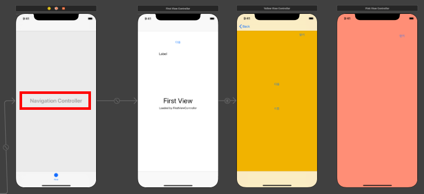

<br>

2. Navigation Stack에 뷰 컨트롤러를 push/pop 하는 메소드를 필요한 부분에 추가했습니다.

- 전 단계에서 `YellowViewController` 에서 `PinkViewController` 로의 Segue를 삭제하고 `present()` 를 사용해서 화면 전환을 시켰기때문에, navigation stack에 push하는 부분을 따로 추가하여 명시해주었습니다.

```swift
@IBAction func nextButtonTouched(_ sender: Any) {
    if ... {
        ...
    	self.navigationController?.pushViewController(pinkViewController, animated: true)
    }
}
```

- `YellowViewController` 와 `PinkViewController` 의 닫기 버튼을 누르면, navigation stack 에서 pop되도록 수정해주었습니다. 

```swift
@IBAction func closeButtonTouched(_ sender: Any) {
	self.navigationController?.popViewController(animated: true)
}
```

<br>

### 실행 화면

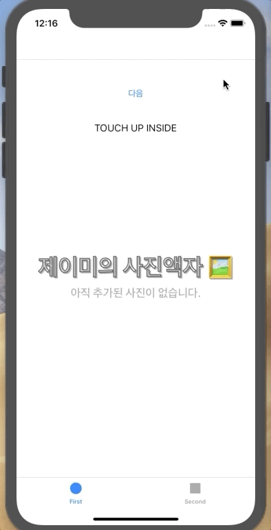

<br>

### 추가 학습 내용

#### Container View Controller

- 컨테이너 뷰 컨트롤러는 여러 개의 뷰 컨트롤러를 하나의 유저 인터페이스로 모아주는 역할을 합니다. 
- `UIKit` 에 있는 컨테이터 뷰 컨트롤러 예시입니다.
  - `UINavigationController`
  - `UITabBarController`
  - `UISplitViewController`

<br>

#### Navigation Controller

아래 이미지는 내비게이션 인터페이스의 구조입니다. 내비게이션 컨트롤러는 한 번에 하나의 자식 뷰 컨트롤러만 보여줍니다. 


<a href="https://developer.apple.com/library/archive/featuredarticles/ViewControllerPGforiPhoneOS/ImplementingaContainerViewController.html">이미지 출처</a>

- 내비게이션 컨트롤러 관련 메소드 명이 `push` 와 `pop` 을 사용한 이유

  내비게이션 컨트롤러는 내부에서 `var viewControllers: [UIViewController]` 라는 프로퍼티에 뷰 컨트롤러를 담아 **Navigation Stack** 으로 관리하기 때문입니다.

<br>

## 7. Second Scene 화면

### 추가 내용

1. 앱에 포함할 이미지 리소스를 프로젝트에 포함시켰습니다. 이미지를 담고있는 폴더를 프로젝트로 드래그하여 포함시킬 때, 아래와 같은 사항을 유의해야합니다.

#### Options for adding files

- Destination
  - **Copy items if needed** : 해당 옵션을 체크하면 리소스 파일을 복사하여 프로젝트에 포함시키고, 체크하지 않는다면 현재 리소스 파일이 존재하는 경로를 포함시키게 됩니다.
- Added folders
  - **Create groups** : 추가하고자하는 모든 리소스 파일을 프로젝트 번들 최상위 단계에 포함시키는   방법으로, 프로젝트 내에서 해당 리소스 파일을 접근할 때 파일 명만으로도 탐색이 가능해집니다.
  - Create folder references : 추가하고자하는 리소스 파일의 **폴더** 아래에 포함시키는 방법으로, 해당 리소스 파일에 접근할 때 폴더명까지 명시해주어야 파일을 인식할 수 있습니다.

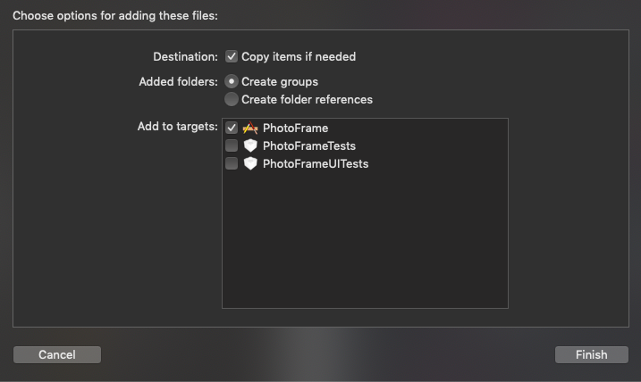

<br>

2. Second Scene에 새로운 `ImageView` 를 추가하고, 버튼 클릭 시 데모 이미지를 랜덤하게 보여주도록 추가했습니다.

```swift
@IBAction func nextImageButtonTouched(_ sender: Any) {
	let randomImage = makeRandomImage()
    // makeRandomImage() 메소드 반환값 예시 : "07.jpg"
	self.photoImageView.image = UIImage(named: randomImage)
}
```

- **`UIImage`**
  - 앱에서 이미지 데이터를 관리하는 객체
  - `init?(named: String)` : 파일명으로 이미지 객체를 생성하여 반환합니다.

<br>

### 실행 화면


<br>

### 추가 학습 내용

- **`UIImageView`**
  - 인터페이스에 하나의 이미지나 애니메이션 효과를 입힌 이미지 여러 개를 보여주는 객체입니다.
  - `UIImage` 로 init 합니다.
  - `[UIImage]` 으로 애니메이션을 보여줄 수 있습니다.
    - 애니메이션 될 이미지들은 모두 같은 `size` 와 같은 `content scale factor` 를 가지고 있어야합니다. 
  - 이미지 스캐일링은 상대적으로 많은 리소스를 소모하기 때문에 성능을 위해서 몇 가지를 더 고려해주면 좋습니다.
    - 자주 쓰이는 이미지 파일이 너무 크다면, 미리 사이즈를 줄리고 사용하는 것이 좋습니다.
    - 사용하는 이미지 뷰와 비슷한 사이즈의 이미지를 사용하는 것이 좋습니다.

<br>

## 8. 마무리하기

### 추가 내용

1. Second Scene에 `photoFrameImageView` 를 추가하고 기존 `photoImageView` 보다 뒤에 위치할 수 있도록 `photoFrameImageView.layer.zPosition` 값을 수정해주었습니다. 

```swift
var zPoisition: CGFloat { get set }
```

디폴트 값은 0이며, zPsition이 높은 값일수록 낮은 값의 뷰 보다 더 위쪽에 위치합니다.

<br>

2. `UIImagePickerController` 를 사용하여 사진 앱 - 카메라 롤 이미지를 사진 액자로 가져올 수 있도록 추가했습니다.

- `사진 선택하기` 버튼을 추가했습니다.

- 위 버튼에 클릭 IBAction 메소드를 추가했습니다

  ```swift
  @IBAction func selectButtonTouched(_ sender: Any) {
  	let sourceType = UIImagePickerController.SourceType.savedPhotosAlbum
  	guard UIImagePickerController.isSourceTypeAvailable(sourceType) else { return }
  	let imagePickerController = UIImagePickerController()
  	imagePickerController.delegate = self
  	imagePickerController.sourceType = sourceType
  	self.present(imagePickerController, animated: true, completion: nil)
  }
  ```

- `SecondViewController` 가 `UIImagePickerControllerDelegate` 와 `UINavigationControllerDelegate` 프로토콜을 채택하도록 추가했습니다.

  ```swift
  extension SecondViewController: UIImagePickerControllerDelegate, UINavigationControllerDelegate {
  
      // 유저가 이미지를 선택했을 때 호출되는 메소드
      func imagePickerController(_ picker: UIImagePickerController, didFinishPickingMediaWithInfo info: [UIImagePickerController.InfoKey : Any]) {
          if let imageSelected = info[UIImagePickerController.InfoKey.originalImage] as? UIImage {
              self.photoImageView.image = imageSelected
          }
          picker.dismiss(animated: true, completion: nil)
      }
  
      // 유저가 피커창을 취소했을 때 호출되는 메소드
      func imagePickerControllerDidCancel(_ picker: UIImagePickerController) {
          picker.dismiss(animated: true, completion: nil)
      }
  
  }
  ```

<br>

### 실행 화면

