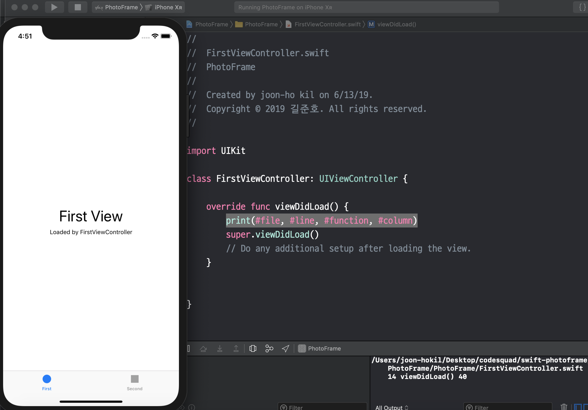
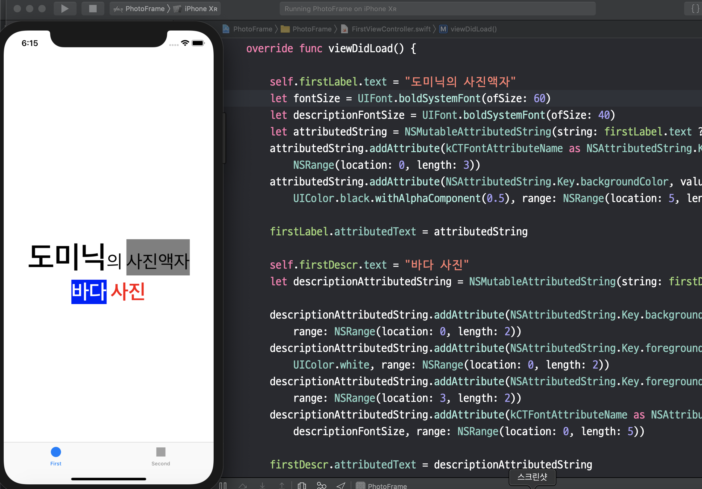

# 포토프레임

## 2019.06.13 16:52

* print(#file, #line, #function, #column) 코드를 추가 시 콘솔에 아래 문자열 출력

/Users/joon-hokil/Desktop/codesquad/swift-photoframe/PhotoFrame/PhotoFrame/FirstViewController.swift 14 viewDidLoad() 40

## 2019.06.13 17:54

* 글자 크기

위에 소스를 통해 firstLabel 의 폰트를 60 으로, firstDescription 의 폰트를 40 으로 변경

* 글자색

위에 소스를 통해 firstDescription 의 앞에 두글자를 흰색으로, 뒤에 두글자를 빨간색으로 색상 변경

* 배경색

위에 소스를 통해 firstDescription 에 앞에 두글자의 배경색을 파란색으로 변경

* 투명도

위에 소스를 통해 firstLabel 에 뒤 네글자의 배경색을 50% 투명도의 검정색으로 변경

## 2019.06.13 18:22
.png)
.png)

* 버튼 클릭 시 속성 변경

## 2019.06.13 19:08

### Action Segue
* Show : 가장 일반적인 세그웨이, 새 화면으로 이동하며 stack 구조로서 새 화면이 원래 화면 위를 덮는 구조입니다.

* Show Detail : SplitView 구조에서 원래 화면을 Master, 새 화면을 Detail 로 표시합니다. 아이폰에서는 똑같이 보이지만 아이패드로 보면 화면이 둘로 분할되어 보입니다

* Present Modally : 새 화면이 모달처럼 원래 화면 위 전체를 덮습니다. 원래 화면은 새 화면 뒤에 그대로 존재하게 됩니다.

* Present As Popover : 아이패드에서 팝업창을 띄웁지다. 아이폰 앱에서는 Show Detail 과 마찬가지로 큰 의미가 없습니다.

## 2019.06.17 14:47

### 화면 관련 콜백 함수
* viewDidLoad() : 뷰가 나타나기 전에 실행됩니다. 화면이 처음 만들어질 때 한 번만 실행됩니다.

* viewWillAppear() : viewDidLoad 와 같이 뷰가 나타나기 전에 실행되지만 viewDidLoad 와 달리 화면이 다시 나타날 때마다 반복적으로 실행됩니다.

* viewDidAppear() : 뷰가 화면에 나타난 직후에 실행됩니다.

* viewWillDisappear() : 뷰가 화면에 사라지기 직전에 실행됩니다.

* viewDidDisappear() : 뷰가 화면에 사라진 직후에 실행됩니다.

### 참고 : https://zeddios.tistory.com/43

