# 📷PhotoFrame

## Step01 - Tapped App

- 프로젝트 이름을 PhotoFrame으로 지정한다.

- TapBar Controller를 추가하고 기존 View Controller는 삭제한다.

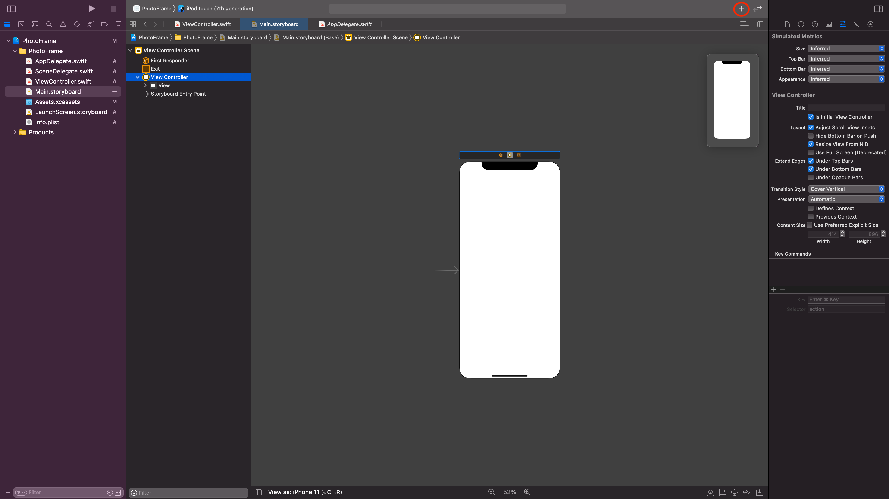

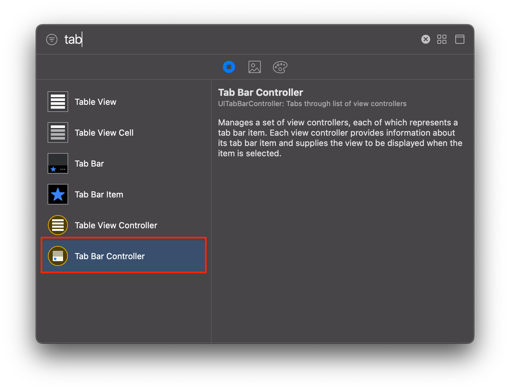

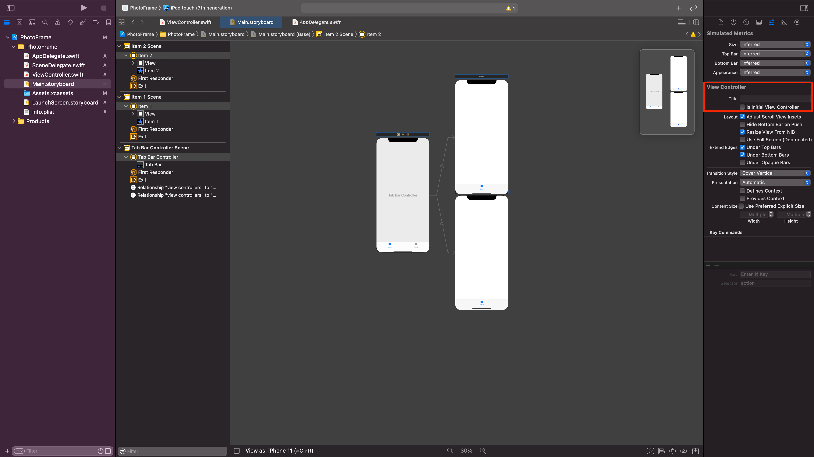

- viewDidLoad() 함수에서 `print("#file, #line, #function, #column")` 코드를 추가하면 콘솔 영역에 무엇이 출력되는지 확인한다.

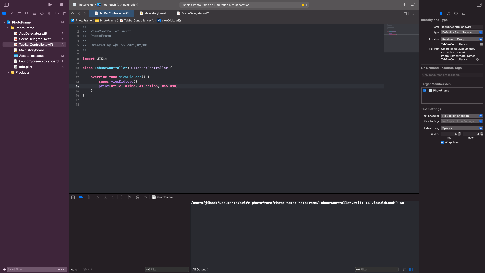

  

 ### ViewController Class

 ViewController를 사용하여 인터페이스를 관리하고 앱 콘텐츠 탐색을 용이하게합니다.
 >Manage your interface using view controllers and facilitate navigation around our app's content.
 **Responsibility (뷰컨트롤러의 책임)**

 - 주요한 데이터의 변화에 응답으로 뷰들의 컨텐트들을 업데이트 한다.
 - 뷰들과 함께 사용자와의 대화에 응답한다. - 이벤트 핸들링
 - 뷰들의 사이즈 재조정과 전반적인 인터페이스의 레이아웃을 관리한다.
 - 다른 객체(뷰컨트롤러 등)들과 함께 앱을 구성한다.

 	[참고](https://o-o-wl.tistory.com/43)
 
 Content View Controller와 Container View Controller로 구분된다.

 ### UITabBar vs UITabBarController
 - `UITabBar`는 `UIView`를 상속받는다
 - `UITabBarController`는 `UIViewController`를 상속받는다.

**관련 클래스**

- UITabBarItem

## Step02 - IBOutlet

### 실행 화면
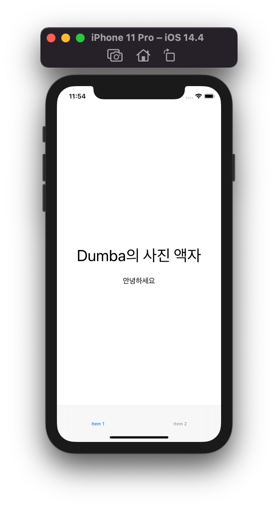

### UILabel

- **Accessing the Text Attributes (텍스트 속성 엑세스)**

- **Sizing the Label's Text (레이블 텍스트 크기 조정)**

- **Managing Highlight Values (하이라이트 값 관리)**

- **Drawing a Shadow (그림자 그리기)**

- **Drawing and Positioning Overrides (중첩 그리기 및 배치)**

- **Getting the Layout Constraints (레이아웃 제약 조건 가져오기)**

- **Setting and Getting Attributes (특성 설정 및 가져오기)**

- **Related Types (관련유형)**

[출처](https://roeldowney.tistory.com/74)

### AutoLayout

❗️ AutoLayout을 설정해주지 않으니 storyboard에서 Label을 아무리 정렬해줘도 실행했을 때 정렬이 되지 않은채로 출력된다.

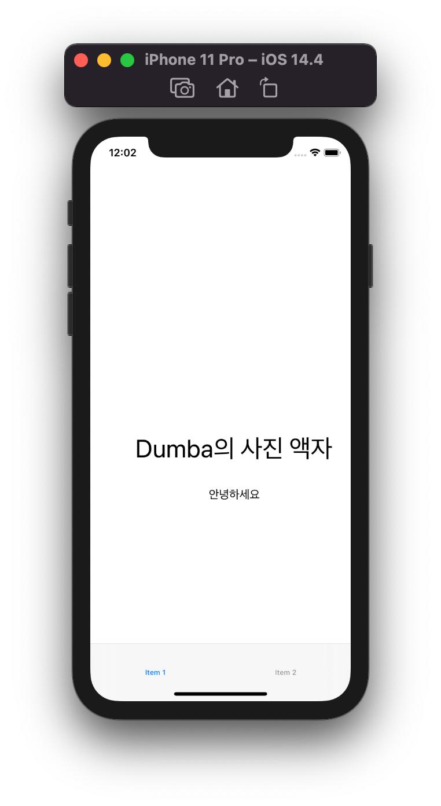

Todo : AutoLayout 설정에 대해 알아보자.

## Step03 - IBAction
### 실행 영상
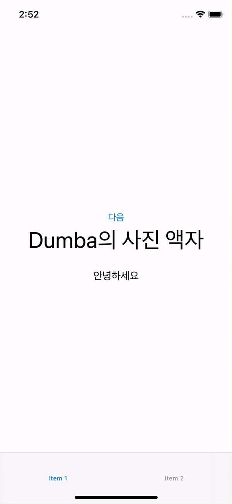

### IBAction Event
|Event|	Description|
|---|---|
|touchDown|	컨트롤을 누를 때 발생하는 이벤트|
|touchDownRepeat|	컨트롤을 연속해서 누를 때 발생하는 이벤트|
|touchDragInside|	컨트롤 내부에서 드래그가 이루어질 때 발생하는 이벤트|
|touchDragOutside|	컨트롤 외부에서 드래그가 이루어 질 때 발생하는 이벤트|
|touchDragEnter	|컨트롤이 외부에서 드래그를하며 내부로 드래그를 할 때 발생하는 이벤트|
|touchDragExit	|컨트롤의 외부로 드래그를 할 때 발생하는 이벤트|
|touchUpInside	|컨트롤 영역 안쪽에서 터치하고 손을 뗏을 때 발생하는 이벤트|
|touchUpOutside	|컨트롤 영역 안쪽에서 터치 후 컨트롤 외부에서 손을 뗏을 때 발생하는 이벤트|
|touchCancel	|컨트롤의 현재 터치를 취소햇을 때 발생하는 시스템이벤트|
|valueChanged	|컨트롤을 드래깅이나 다른 방법으로 조작해서 값이 변경됐을 때 발생하는 이벤트|
|primaryActionTriggered	|버튼이 눌릴때|
|editingDidBegin	|UITextField에서 수정이 시작될 때 발생하는 이벤트 ( 텍스트 필드를 터치했을 때)|
|editingChanged	|UITextField에서 텍스트가 변경되었을 때 발생하는 이벤트|
|editingDidEnd	|UITextField에서 수정이 끝났을 때 발생하는 이벤트 (텍스트 필드에서 포커싱이 사라질 때)|
|editingDidEndOnExit|	UITextField의 편집중에 키보드의 return을 눌렀을 때 발생하는 이벤트|
|allTouchEvents|	모든 터치 이벤트|
|allEditingEvents|	UITextField에서 모든 편집 이벤트|
|applicationReserved|	앱의 사용에 따라 지정할 수 있는 컨트롤 이벤트 값의 범위|
|systemReserved	|내부 프레임워크 내에서 사용되는 예약된 컨트롤 이벤트 값의 범위|
|allEvents|	시스템 이벤트를 포함한 모든 이벤트|

[출처](https://o-o-wl.tistory.com/45?category=326739)

### 하나의 버튼 여러액션, 버튼이 여러개일때 하나의 액션?

- 하나의 버튼은 이벤트를 전달할 여러 개의 액션 메소드를 지정할 수 있다!

- 하나의 IBAction에 다수의 Button 또한 등록 할 수 있다. 비슷한 유형의 작업을 하는 버튼들에게 적용하면 효율적으로 사용 할 수 있을 것 같다.

## Step04 - Scene과 Segue

- 스토리보드 구성 요소에 대해 학습하고 새로운 Scene과 Segue를 추가한다.

### 실행 영상
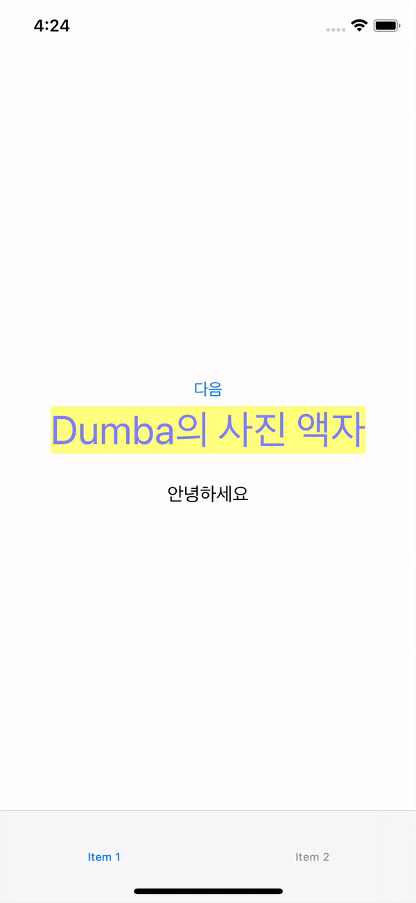

## Step05 - ViewController 프로그래밍

### 실행 영상

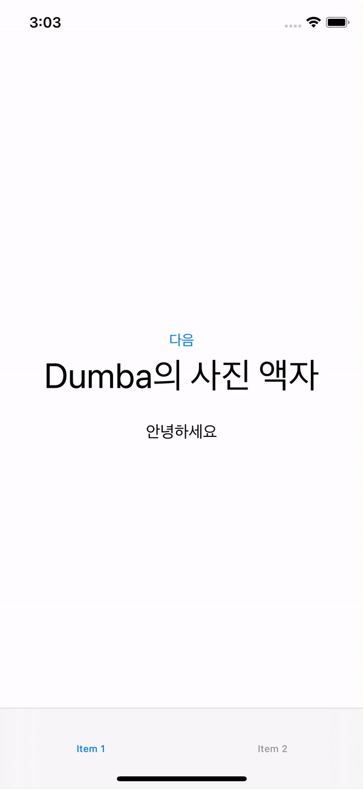

### ❗️ ViewController Life - Cycle

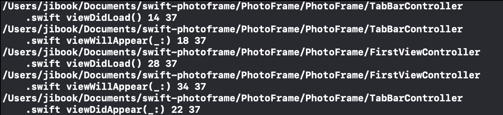

TabBarController는 `viewDidAppear`이 되었지만, FirstViewController는 `viewWillApear()`까지만 완료되고 `viewDidAppear()`은 출력되지 않는다..? 왜그러는지 학습해야한다.

### Segue 제거 후 Code로 ViewController 호출 하기
`let newVC = self.storyboard?.instantiateViewController(identifier:)` 이때 identifier는 storyboard에 있는 ViewController의 storyboard ID이다. (class 이름이 아니라 따로 지정해줘야한다.)
- **UIModalPresentationStyle**
- **UIModalTransitionStyle**

`self.present(nextVC, animated: true)`

## Step06 - Container ViewContatiner

### 실행 영상

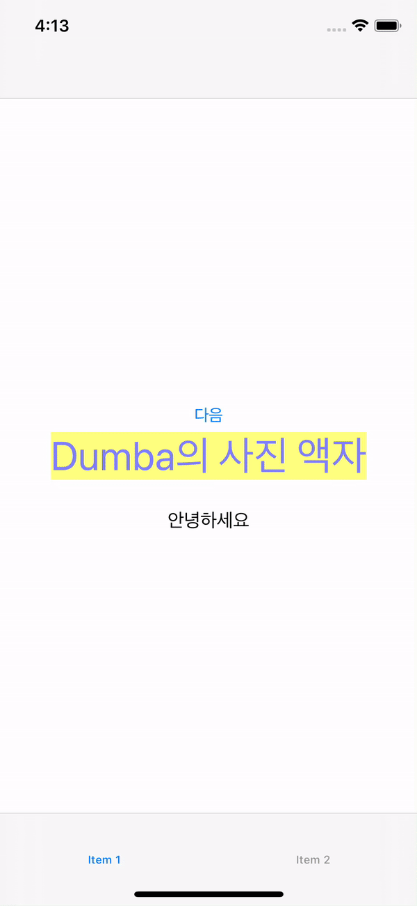

**ViewController Container**
- Split View Controller
- TabBar Controller
- Navigation Controller

### Navigation Controller
Navigation Controller는 자식 Container들을 스택 형식으로 쌓기 때문에 관련 메소드들이 `push`, `pop`이다.
