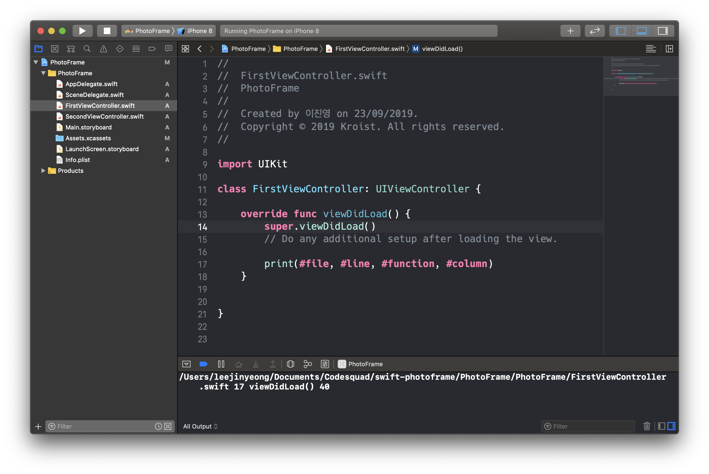
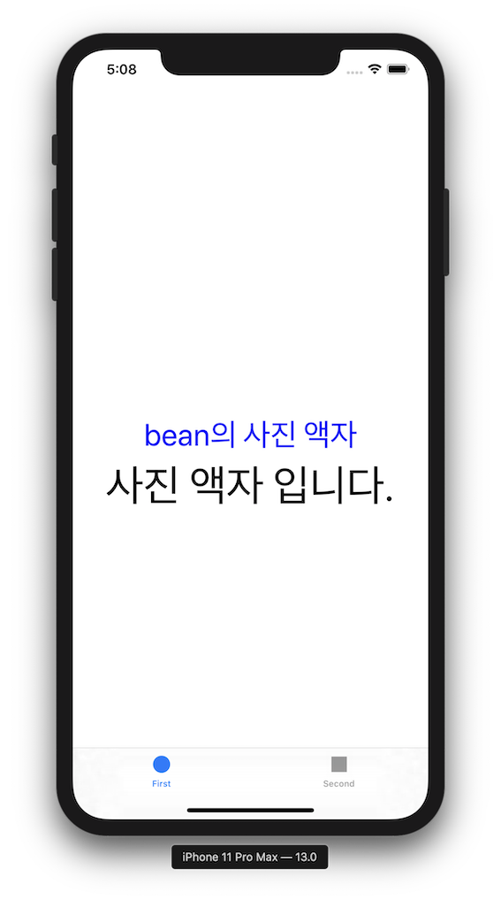

# PhotoFrame

## PhotoFrame - 1
### 실행 결과

### Literal Expression

- **special literals**

| Literal | Type | value |
| ------- | ---- | ----- |
| `#file` | `String` | `#file` 코드가 실행된 파일의 이름입니다. | 
| `#line` | `Int` | `#line` 코드가 실행된 줄의 번호입니다. |
| `#function` | `String` | `#function` 코드가 실행된 함수의 이름입니다. |
| `#column` | `Int` | `#column` 코드가 시작되는 열의 번호입니다. |

 

## PhotoFrame - 2
### 실행 결과

### UILabel
> 한 줄 이상의 읽기 전용 텍스트를 표시하는 뷰

- **UILabel 속성**

| 속성 | 설명 |
| ---- | ---- |
|`text`| label이 표시하는 텍스트 |
|`attributedText`| label이 표시하는 속성 텍스트 |
|`font`| 텍스트의 폰트 |
|`textColor`| 텍스트의 색상 |
|`textAlignment`| 텍스트의 정렬 기준 |
|`lineBreakMode`| label의 텍스트를 줄 바꿈하고 잘라내는 기준 |

- **text와 attributedText**  
`text`는 텍스트 전체에 같은 속성을 부여  
`attributedText`는 텍스트 내에서 원하는 부분만 속성 부여 가능