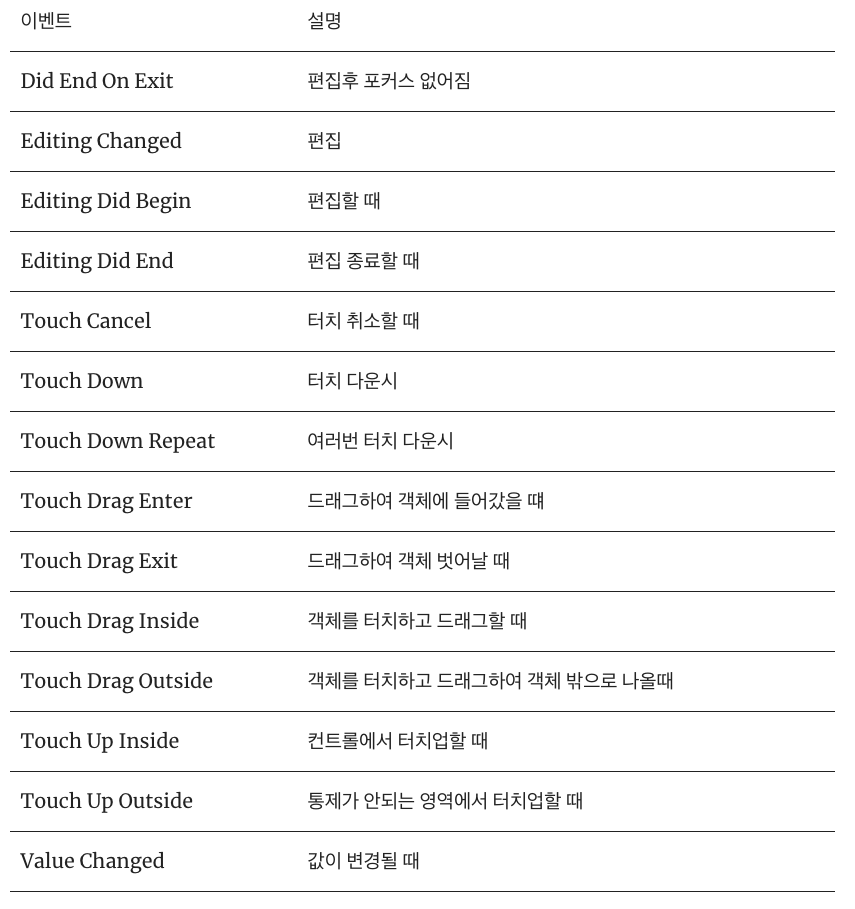

# Jack's PhotoFrame

## Step1. 시작하기 (Tabbed App 템플릿)
  - 요구사항 : 자동 생성된 ViewController 클래스 viewDidLoad() 함수에서 print(#file, #line, #function, #column) 코드를 추가하고 실행하면 콘솔 영역에 무엇이 출력되는지 확인한다.
  - 실행화면
    

  - 애플 UIKit View Management 클래스 중에서 UITabBarController 와 UITabBar에 대해 학습한다.
    - 각 클래스 역할(및 UITabBar과 UITabBarController의 차이점)은 무엇인가?
      - UITabBarController : Tab에 대한 Action을 담당(즉, 무엇을 보여주고, 무엇을 할지)
      - UITabBar : Tab의 전체적인 View구조를 담당(보여지는 부분, 즉. 어떻게 보이고 어떻게 반응할것인지)

## Step2. IBOutlet
  - First Scene에 만들어져 있는 레이블을 IBOutlet으로 연결한다.
  - 실행화면
    

  - UILabel 클래스 속성(Property)는 어떤게 있는지 학습한다.
    - Attributes Inspector 활용

## Step3. IBAction
  - Main.storyboard 에서 First Scene에 UIButton을 추가하고, IBAction으로 연결한다.
  - 실행화면
  

  - IBAction 과 IBOutlet 연결 구조에 대해 이해한 내용을 정리한다.
    - IBOutlet : 연결통로라는 의미, 인터페이스빌더에서 프로그램과의 연결통로
    - IBAction : 조작과 메서드를 연결, 사용자가 부품을 조작했을 때 실행할 일을 지정
    
  - 버튼에 IBAction을 추가할 때 이벤트(Event) 종류에는 어떤 것들이 있는지 학습한다.
  
