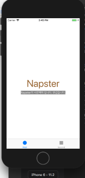

# 사진액자 앱
## 시작하기 - Tabbed App 템플릿 step1
* 최초 Tabbed App 프로젝트 생성, git의 issue, 프로젝트 설정. 사진앱 프로젝트를 시작하기위한 기본작업 완료.
{: width="250" height="400"}
<br>> step1_firstTapView_Screen_shot 17.12.21
<br>
{: width="250" height="400"}
<br>> step2_SecondTapView_Screen_shot 17.12.21
* 콘솔 창엔 프로그램 요구사항인 ```print(#file, #line, #function, #column)```가 출력되고있다.

* [UITapBar와 UITapBarController의 차이](http://llldddjjj.tistory.com/entry/iOSUITapBar%EC%99%80-UITapBarController%EC%9D%98-%EA%B0%84%EB%8B%A8%ED%95%9C-%EC%B0%A8%EC%9D%B4)

## 시작하기 - IBOutlet step2
* UILabel의 여러가지 속성을 변경해보았다. 
```swift
self.photoLable.text = "Napster"
self.photoLable.font = UIFont.systemFont(ofSize: 50)
self.photoLable.textColor = UIColor.brown
self.firstDescription.text = "Napster의 사진액자 입니다. 반갑습니다."
self.firstDescription.textColor = UIColor(red: CGFloat(255), green: CGFloat(255), blue: CGFloat(102), alpha: CGFloat(20))
self.firstDescription.backgroundColor = UIColor.gray
```
{: width="250" height="400"}
<br>
> Step2의 UILabel을 이용하여 변경한 모습. 