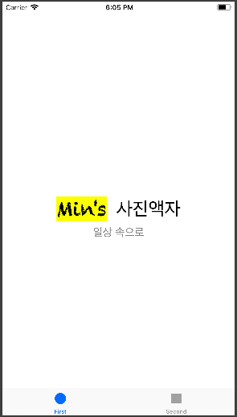
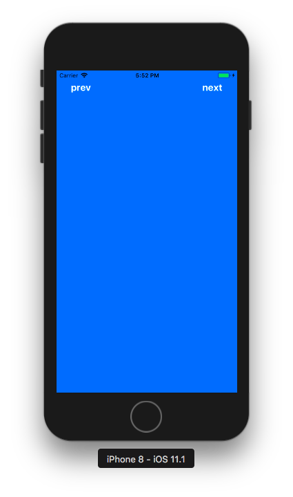

# PhotoFrame App

## Tabbed App 템플릿 시작

### Tabbed App 템플릿 초기화면
</img>&nbsp;&nbsp;&nbsp;&nbsp;&nbsp;</img>

<br/>

### viewDidLoad()에 print(#file, #line, #function, #column) 수행

```swift
class FirstViewController: UIViewController {

    override func viewDidLoad() {
        super.viewDidLoad()
        print(#file, #line, #function, #column)
    }

}
```

- 결과: 
 


- SecondViewController 에 적용 시, Second 탭 선택 후 출력됨.

<br/>

### UITabBar와 UITabBarController의 차이: How와 What의 차이
- ***View*** : 
	- 데이터를 **어떻게** 보여주고 유저와 상호작용 시 **어떻게** 입력값을 받고 피드백을 보여줄지 아는 객체. 
- ***Controller*** : 
	- **무슨** 데이터를 보여주고 유저 입력값으로 **무엇을** 해야 하는 지 아는 객체.
- ***View와 Controller의 차이점*** : 
	- **How**와 **What**의 차이
- ***UITabBar*** : 
	- UIView로, 유저에게 **탭들을 어떻게 보여주고** 탭 클릭 시 **어떻게 반응할 건지 (피드백을 어떻게 보여줄지)** 안다.
	- 보통 UITabBarController와 함께 사용하지만, 혼자 쓰일 수도 있다.
	- 탭바는 항상 앱 아래쪽에 위치한다.
	- **UITabBarItem** 객체들을 보여준다.
	- **배경화면**이나 **틴트색** 변경으로 커스터마이즈 할 수 있다.
	- **UIToolBar**와 비슷하게 생겼지만, 쓰이는 **목적이 다르다**. 탭바는 주로 전체 앱의 모드를 변경할 때 쓰이고, 툴바는 현재 보여지는 콘텐츠 내에서 관련된 액션들을 보여주기 위해 사용한다.
	- 탭바는 선택값들이나 커스터마이즈된 값들을 **delegate 객체**에 알려준다. 이 때, 탭바를 직접 만든 경우 탭 선택/추가/제거/순서변경 등의 액션에 대해  어떻게 반응할 지를 UITabBarDelegate 구현하여 넘겨줘야 한다. **UITabBarController를 사용한 경우, 컨트롤러가 delegate 객체처럼 행동한다.**
	- 탭바를 선택했을 때, 탭바 컨트롤러는 자동으로 어떤 뷰컨트롤러를 보여줄 지 관리한다. 탭바의 탭이 선택되면 **tabBar(_:didSelect:)** 메소드가 호출되어 반응한다.(커스텀 탭바인 경우, 모두 구현해줘야 한다.)
- ***UITabBarController*** : 
	- UIViewController로, **어떤 탭들을 보여주고** 탭 클릭 시 **무엇을 할 지** 안다.
	- 특정 탭 선택 시, 해당 뷰컨트롤러의 **루트뷰**를 보여준다. (이전에 어떤 뷰를 봤건 상관없이 항상 루트뷰를 보여준다.)
	- UITabBarItem을 뷰컨트롤러와 연결시키려면, UITabBarItem 객체를 생성한 후 뷰컨트롤러의 **tabBarItem** 프로퍼티에 할당한다.(커스텀뷰가 아니면 디폴트 Item이 생성됨)
	- 유저가 **탭 선택 시, 탭바 컨트롤러는 상호작용 내용을 delegate 객체에 전달**한다.(delegate는 어떤 객체든 상관없지만, UITabBarControllerDelegate를 채택해야 함) delegate를 사용하면 다른 탭들이 선택되지 않도록 제어하거나 특정 작업을 수행하게 만들 수 있다. 또한, **탭 내부의 뷰컨트롤러가 NavigationController로 구성되어 있으면 여기서 일어나는 변화를 감지할 수 있다.**
	- 탭바 개수가 4개 이상되면, 처음 **4개 + '...'(standard More item) 탭**만 보여진다.
	- **탭바 컨트롤러의 구성**:


<br/>

## IBOutlet으로 UILabel 적용

<center></img></center>

<br/>

### UILabel
#### Core Attributes
- Text: 
	- 텍스트 내용(이하 콘텐츠)은 **NSString** 또는 **NSAttributedText** 객체를 **text, attributedText 속성**에 할당할 수 있다.
	- attributedText는 NSAttributedString을 사용해서 개별 글자나 글자 그룹을 커스터마이즈 할 수 있다. 
	- **[How to make an attributed string in Swift](https://stackoverflow.com/questions/24666515/how-do-i-make-an-attributed-string-using-swift)**

<center></img></center>

- Color
- Font
- Alignment
- Lines: 
	- **numberOfLines**: 라벨에 들어갈 최대 라인 수를 제한할 수 있다. 0으로 설정 시, 라벨 범위 내에서 최대한 들어갈 수 있는 만큼 들어가게 된다. 
- Behavior: isEnabled, isHighlighted

#### Text Spacing Attributes
- Baseline: 
	- **baselineAdjustment**: 서체 크기가 조절될 때 텍스트가 어느 위치에 들어갈지 보정해주는 속성
- Line Breaks: 
	- **lineBreakMode**: 문단에서 다음 행으로 넘어갈 시 텍스트가 잘리는 경우 어떻게 자를지, 마지막 줄에서 안 보이는 부분을 어떻게 처리할지를 결정
	- **라벨의 디폴트 크기**는 **콘텐츠가 한 줄에 다 보이는 크기**이다. 만약 오토레이아웃으로 위치 및 **가로크기만 설정해 놓으면 라벨은 자동으로 모든 콘텐츠를 보이게끔 세로 사이즈를 조정**한다.
	- 하지만 가로, 세로 모든 사이즈를 설정하게 되면 콘텐츠가 잘리는 상황에 대해 대처할 필요가 있다. 이를 해결하기 위해 Auto Shrink 속성을 활용한다.
- Auto Shrink: 라벨 내 글자 사이즈 줄이기
	- **adjustsFontSizeToFitWidth**: 라벨의 너비에 맞춰 텍스트가 모두 보일 수 있도록 해준다. true로 설정한다. 하지만 글자크기가 너무 줄어들 수 있는데, 이 때 사용하는 것이 minimumScaleFactor 속성이다. 
	- **minimumScaleFactor**: 글자 크기를 줄이는 최소 비율을 설정한다. 0 ~ 1 사이 값을 준다. 
	- **allowsDefaultTighteningForTruncation**: true로 설정 시, 글자를 자르기 전에 글자 사이의 간격을 줄이도록 한다.
	- **[UILabel 다루기 참고](http://padgom.tistory.com/category/개발/iOS)**

<center></img></center>

#### Advanced Attributes
- Highlighted: highlightedTextColor
- Shadow: shadowColor
- Shadow Offset: shadowOffset

<br/>

## IBAction으로 버튼 동작 적용

</img>
</img>

<br/>

### IBOutlet과 IBAction의 연결 구조
- 뷰와 컨트롤러는 IBOutlet 또는 IBAction으로 연결된다.
- **사용자는 뷰 객체와 상호작용**하며, 뷰에 변화가 생기면 **해당 뷰와 연결되어있는 IBAction에 메시지**를 보낸다. 이 때, 해당 뷰의 포인터를 파라미터로 전달한다.
- 컨트롤러는 특정 로직을 수행하여 뷰에 변경사항이 생기면 **어떤 것을 변경하라는 지시**를 내린다. 이 때, **해당 뷰의 포인터인 IBOutlet을 사용**한다.


### IBAction 이벤트 종류
- ***Touch Up Inside***: 
	- A **touch-up** event in the control where **the finger is inside the bounds** of the control.
- ***Touch Up Outside***: 
	- A **touch-up** event in the control where **the finger is outside the bounds** of the control.
- ***Touch Cancel***: 
	- A **system event** canceling the current touches for the control.
- ***Touch Down***: 
	- A **touch-down** event in the control.
- ***Touch Down Repeat***: 
	- A repeated touch-down event in the control; for this event **the value of the UITouch tapCount method is greater than one**.
- ***Touch Drag Enter***: 
	- An event where a **finger is dragged into the bounds** of the control.
- ***Touch Drag Inside***: 
	- An event where a **finger is dragged inside the bounds** of the control.
- ***Touch Drag Outside***: 
	- An event where a **finger is dragged just outside the bounds** of the control.
- ***Touch Drag Exit***: 
	- An event where a **finger is dragged from within a control to outside its bounds**.
- ***Value Changed***: 
	- A touch dragging or otherwise manipulating a control, **causing it to emit a series of different values**.
- ***PrimaryActionTriggered***: 
	- A semantic action triggered by buttons.
- ***Editing Did Begin***: 
	- **A touch initiating an editing session** in a UITextField object **by entering its bounds**.
- ***Editing Changed***: 
	- **A touch making an editing change** in a 
UITextField object.
- ***Editing Did End***: 
	- **A touch ending an editing session** in a UITextField object **by leaving its bounds**.
- ***(Editing) Did End On Exit***: 
	- **A touch ending an editing session** in a 
UITextField object.

**[참고: UIControlEvents](https://developer.apple.com/documentation/uikit/uicontrolevents)**


<br/>

## Scene과 Segue로 화면 전환
</img>
</img>
</img>

### 에러 발생
- 에러코드:

```swift
*** Terminating app due to uncaught exception 'NSUnknownKeyException', reason: '[<UIViewController 0x7fae44423860> setValue:forUndefinedKey:]: this class is not key value coding-compliant for the key subtitleLB.'
```
- 해결방법: 특정 뷰와 컨트롤러를 연결한 후, 연결 삭제/재연결/수정 등을 했을 때 기존 연결이 IB에 남아있으므로 지워줘야 함.

<br/>

## 앱 인터페이스와 구성요소
### 화면을 구성하는 세 가지 주요객체
1. UIScreen: 기기에 연결되는 물리적인 화면을 정의하는 객체
2. UIWindow: 화면 그리기 지원 도구를 제공하는 객체. 
	- 디바이스 스크린을 빈틈없이 채우기 위한 객체
	- 항상 유저 인터페이스 표현 계층의 최상위에 위치한다. 
	- 뷰의 일종이지만 직접 콘텐츠를 가지지 않는다. UIView들이 콘텐츠를 표현하면 디바이스 스크린에 이를 표현한다.
	- 화면이 전환되더라도 윈도우 객체는 전환되지 않는다. 내부에 배치된 뷰의 콘텐츠만 변경된다.
3. UIView: 그리기를 수행할 객체 세트
	- 콘텐츠를 담아 스크린상에 표시한다. 
	- 사용자의 입력에 반응한다. 
	- 윈도우의 일부를 자신의 영역으로 정의하고, 이에 필요한 콘텐츠를 채워넣는다.
	- 윈도우로부터 전달된 사용자 입력에 반응하고 그에 맞는 결과를 처리한다.


<br/>

## 뷰 컨트롤러 프로그래밍
### VC1 ➤ VC2
</img>
</img>

### VC2 ➤ VC3
</img>
</img>

### VC3 ➤ VC2
</img>
</img>

### VC2 ➤ VC1
</img>
</img>


### 뷰 컨트롤러 생명주기
- Not Running(Disappeared) --> Inactive(Appearing) --> Active(Appeared) --> Suspended(Disappearing) --> Not Running(Disappeared)
- 뷰 컨트롤러의 생명주기는 **씬의 전환과 복귀에 밀접하게 관련**이 있다. 뷰컨트롤러 객체의 생성과 소멸이 발생하기 때문.
- 앱의 화면 상태에 따라 메모리를 효율적으로 관리(튜닝)해야 한다.
- 뷰 컨트롤러 상태 변화에 따른 API 호출:
	
	- **Appearing**: 뷰컨트롤러 **등장 - 등장완료 직전**까지의 상태. 이 때 퇴장중인 다른 뷰컨트롤러의 상태는 Disappearing이 된다.
	- **Appeared**: 뷰컨트롤러가 스크린 전체에 **완전히 등장**한 상태.
	- **Disappearing**: 뷰컨트롤러가 스크린에서 **가려지(퇴장하)기 시작 - 완전히 가려지(퇴장하)기 직전**까지의 상태. 이 때 등장중인 다른 뷰컨트롤러의 상태는 Appearing이 된다.
	- **Disappeared**: 뷰컨트롤러가 스크린에서 **완전히 가려졌거나 퇴장**한 상태.
- **Appearing이나 Disappearing 상태**가 있는 것은 **애니메이션을 적용할 경우** 수 초에 걸쳐 천천히 진행되기 때문에 **진행 중에 있는 상태를 나타내는 상태값이 필요**하기 때문이다.
	- 예를 들어, 스크린으로부터 화면이 퇴장하는 도중에 사용자의 액션에 의해 재등장하는 경우가 있다. (스와이핑하여 화면을 넘기려다가 만 경우 등)
- 생명주기를 이용하면 다음과 같은 문제를 쉽게 해결할 수 있다.
	- 특정 화면 진입 시 로그인이나 권한 여부 체크
	- 화면이 표시될 때마다 최신 데이터로 업데이트
	- 메모리 부족을 체크하여 가용 메모리를 확보하는 코드 작성
	- 화면이 완전히 표시되었는지 체크하여 알림창 공지
	- 저장 버튼을 누르지 않아도 현재 화면 상태 유지

#### [참고] 앱 런칭 후 수행 과정
- Launch.storyboard 스크린 표시 -> AppDelegate 클래스의 application() 메소드 호출 -> Main.storyboard 스크린 표시

#### [참고] 뷰 컨트롤러의 didReceiveMemoryWarning() 역할
- 메모리가 부족할 때 시스템에서 자동으로 호출하는 메소드.
- 메모리 부족 경고가 발생할 경우 메모리 확보를 위해 필요 없는 객체의 메모리를 해제하여 재사용 가능하도록 만들어주는 처리를 해줘야 한다.

<br/>

## 화면전환의 종류
### 1. 뷰를 이용한 화면 전환 (지양)
- 하나의 뷰 컨트롤러 안에서 두 개의 루트뷰를 두고 바꿔치기/덮어쓰기 하는 방법.
	- iOS는 하나의 뷰 컨트롤러 아래에 하나의 루트뷰(view)를 관리하는 MVC 패턴을 기본으로 하기 때문에 좋은 방식은 아님.
- 다른 뷰 컨트롤러의 루트뷰를 가져와 표시하는 방법도 있음.
	- 다른 뷰 컨트롤러로 옮겨가면 뷰를 제어할 책임을 지는 컨트롤러가 모호해짐.
- 결론: **뷰를 이용한 화면 전환은 지양한다.** 단, 이 방법이 필요한 경우, **커스텀 세그**를 사용한다.

### 2. 뷰 컨트롤러 직접 호출에 의한 화면 전환
- 현재 뷰 컨트롤러에서 **이동할 대상 뷰 컨트롤러를 직접 호출하여 표시**하는 방식으로, **프레젠테이션 방식**이라고 함.
- **화면을 표시하는 모든 뷰 컨트롤러는 UIViewController를 상속**받는데, 이 클래스에 정의된 present() 메소드를 사용하면 됨.
- **present(_:animated:completion:)**
	- completion을 쓰는 이유는 바로 다음 라인에 작성된 코드가 화면전환 과정이 끝나기를 기다리지 않고 바로 실행될 수 있기 때문. 따라서 화면전환이 끝난 후 작업할 것들은 completion에 작성한다.
	- 이렇게 하나의 처리가 끝나기를 기다리지 않고 다음 작업을 바로 이어서 수행하는 방식을 **비동기 방식**이라고 부름.

	```
	@IBAction func nextButtonClicked(_ sender: UIButton) {
		guard let nextVC = self.storyboard?.instantiateViewController(withIdentifier: "BlueViewController") else { return }
		nextVC.modalTransitionStyle = UIModalTransitionStyle.coverVertical
		self.present(nextVC, animated: true)
	}
	```

- 프레젠테이션 방식으로 화면 전환 시, **iOS 시스템은 두 뷰 컨트롤러 사이에 참조할 수 있는 포인터를 생성하여 서로 참조할 수 있게 한다.**
	- 현재 뷰 컨트롤러는 **presentedViewController 속성**에 대상 뷰 컨트롤러의 포인터를, 대상 뷰 컨트롤러는 **presentingViewController 속성**에 현재 뷰 컨트롤러의 포인터를 저장한다.
	- 이렇게 서로 참조하는 이유는, 이전화면으로 복귀하는 등의 상황에 필요하기 때문이다. 
	- 복귀 메소드는 **dismiss(animated:completion:)**을 사용한다. 여기서의 completion은 화면 복귀가 완전히 처리되고 실행할 구문을 넣는다. 
	- 화면 복귀 시 자신을 띄우고 있는 **이전 뷰 컨트롤러가 새 화면을 걷어낸다.** 즉 새 뷰 컨트롤러가 이전 뷰 컨트롤러에게 복귀를 요청해야 하는데, 이 때 요청대상인 presentingViewController 속성이 필요하다. 즉 dismiss() 함수는 이전 뷰 컨트롤러가 수행해야 하므로, **self.presentingViewController.dismiss()** 라고 사용해야 한다. (self.dismiss()도 동작은 하지만, 세 번째 인자인 complete 동작에 문제가 생길 수 있다. self가 사라지고 나서 어떤 동작을 수행한다는 게 이상하기 때문)

	```
	@IBAction BlueViewController: UIViewController {
		self.presentingViewController?.dismiss(animated: true)
	}
	```
	
- **Unwind**: iOS 앱에서 이전 화면으로 돌아가는 것을 지칭하는 말. **화면 전환 방식이 달라지만 그에 따른 Unwind 메소드도 달라진다.** 예를 들어, 프레젠테이션 방식으로 이동하면 프레젠테이션 체인에 저장된 뷰 컨트롤러를 제거하는 방식으로 Unwind가 이뤄진다.

### 3. 내비게이션 컨트롤러를 이용한 화면 전환
- ***UINavigationController***: **계층적인 성격을 띄는 콘텐츠 구조를 관리**하기 위한 뷰컨트롤러.
	- **뷰 컨트롤러의 전환을 직접 컨트롤**
	- **내비게이션 인터페이스**: 내비게이션 정보 표시.
	- 화면 전환이 발생하는 **뷰 컨트롤러들의 포인터를 스택으로 관리** → 원하는 화면에 접근 쉬움.
	- 자신만의 화면을 가지지 않는 대신, 자신이 제어하는 모든 뷰 컨트롤러에 **내비게이션 바를 생성**.
- **루트 뷰 컨트롤러**: 콘텐츠 계층 구조의 시작점 역할을 하는 하는 뷰 컨트롤러. **Navigation controller에 직접 연결된 컨트롤러**로, 화면 UI 상단에 내비게이션 바가 표시된다. **루트 뷰 컨트롤러에서 화면 전환이 발생해도 상단의 내비게이션 바는 그대로 유지된다.**
- 최상위 뷰 컨트롤러는 화면에 표시되므로, **스택의 최상위 뷰 컨트롤러를 더하거나 빼는 것은 화면을 전환하는 것**과 같다.
	- **pushViewController(_:animated:)** - 새 화면 표시.
	- **popViewController(_:animated:)** - 이전 화면 되돌아감.
	- 뷰 컨트롤러 자신이 호출하는 **self.present()**와 달리, 위 메소드들은 내비게이션 컨트롤러가 호출해야 하기 때문에 **self.navigationController.pushViewController()**로 써야 한다. 따라서 뷰 컨트롤러(self)에 내비게이션 컨트롤러가 연결돼있지 않으면 nil을 반환한다.
	- 각 뷰 컨트롤러에 내비게이션 컨트롤러가 추가되어 있어도, **뷰 컨트롤러를 이용하여 화면전환을 하지 않으면 내비게이션 바가 추가되지 않는다.**


### 4. 세그웨이를 이용한 화면 전환
#### 스토리보드의 강점
- **화면의 연결과 처리에 대한 편의성**. 코드를 줄일 수 있을 뿐 아니라, 뷰 컨트롤러의 흐름을 관리하기 쉬우며, 뷰 컨트롤러 사이에 새로운 뷰 컨트롤러를 삽입하기도 쉽다. 특히 화면의 전환과 연결 관계를 관리하는 **세그웨이 객체**를 사용하면 생산성을 높일 수 있다.

#### 세그웨이 특징
- 스토리보드에서 뷰컨트롤러 사이의 연결관계 및 화면전환을 관리하는 역할을 하는 객체. 
- 뷰컨트롤러 사이를 직접 연결하기 때문에 소스코드가 필요하지 않음.
- 출발지와 목적지가 있으나, 일방통행만 가능.
- 스토리보드상의 연결정보를 이용하여 대상 뷰 컨트롤러의 인스턴스를 자동으로 만들어주기 때문에 뷰컨트롤러 객체를 생성할 필요가 없다.
- 목적지는 당연히 뷰 컨트롤러지만, 출발점은 두 종류로 나눌 수 있다.

#### 세그의 종류
- **액션 세그** 또는 트리거 세그: 트리거와 세그웨이가 직접 연결된 것으로, 출발점이 컨트롤(버튼이나 테이블 셀 등 이벤트 트리거)인 경우.
	- 버튼 터치 등의 **이벤트가 세그웨이 실행으로 바로 연결**됨.
	- 코드가 일절 필요하지 않음.
	- Action Segue의 연결옵션은 **Show / Show Detail / Present Modally / Present As Popover / Custom**이 있다.
	- **Present Modally** 항목은 **present() 메소드를 이용한 화면전환과 같은 기능**을 한다.
	- **Show** 항목은 내비게이션 컨트롤러에 적용하는 옵션으로, **내비게이션 컨트롤러가 없을 땐 Present Modally 방식으로 실행**된다.
- **매뉴얼 세그**: 수동실행 세그웨이로, 출발점이 뷰 컨트롤러 자체인 경우.
	- 실행 시 **performSegue(withIdentifier:<세그웨이 식별자>, sender:<세그웨이 실행 객체>)** 사용
	- 뷰컨트롤러에서 뷰컨트롤러의 전환에 사용되기 때문에, 스토리보드 상의 뷰컨트롤러 상단의 도크 바에서 첫번째 아이콘을 드래그하여 다음 뷰컨트롤러에 연결한다.
	- 또한, 세그에 performSegue()의 파라미터로 쓸 Identifier를 부여한다.

#### 화면 전환 효과
- [Storyboard Segue]-[Transition] 항목에서 선택. Cover Vertical / Flip Horizontal / Cross Dissolve / Partial Curl 이 있다.

#### 세그 복귀(unwind) 방법
- 복귀 시에는 역방향으로 세그를 연결하면 되지 않을까 생각할 수도 있지만, 세그는 목적지가 되는 뷰컨트롤러의 객체를 자동으로 생성하기 때문에, 두번째 뷰컨트롤러에서 첫번째로 뷰컨트롤러로 연결 시 첫번째 뷰컨트롤러의 객체를 만들게 되는데, 이미 첫번째 뷰컨트롤러가 있기 때문에 오류가 난다.
- 세그 복귀 방법?
	1. 프레젠테이션 방식의 dismiss(), 내비게이션 컨트롤러 방식의 popViewController() 메소드 사용
	2. Unwind Segue 사용
- **Unwind Segue 사용방법**:
	- 이전 뷰컨트롤러에서 **UIStoryboardSegue 타입 인자**를 받는 **액션 메소드**를 정의한다. 현재 뷰컨트롤러에서 화면 복귀 버튼을 만들어 **도크 바의** 세번째 아이콘인 **Exit**으로 드래그하면 이전 뷰컨트롤러에서 정의한 액션 메소드를 선택하여 트리거를 생성한다. 이렇게 하면 Exit에 연결된 버튼은 이전 뷰컨트롤러의 액션 메소드를 인식하여 **Unwind Segue로 자동생성** 해준다.
	- 코코아 터치 시스템은 앱 내부에 정의된 모든 메소드를 스캔하여 UIStoryboard 타입 인자를 받는 액션 메소드를 모두 수집하여 Exit 아이콘 목록으로 출력한다. 이 중 하나를 선택하여 연결하면 해당 메소드가 정의된 뷰 컨트롤러도 돌아가는 Unwind 메소드가 만들어진다.

	```swift
	@IBAction func unwindToVC(_ segue: UIStoryboardSegue) { 
	
	}
	```

#### 한꺼번에 여러 페이지 복귀하기
- 여러 페이지에 걸쳐 단계적으로 이동하고 있을 때 한 방에 원하는 화면으로 돌아가기 위해서는, 돌아가기 원하는 뷰컨트롤러에 unwind 메소드를 정의하고, 현재 뷰컨트롤러의 특정 버튼(홈버튼이라든지)을 Exit에 드래그하여 아까 정의한 unwind 메소드를 선택하면 된다.
	- ***dealloc***: 스택 중간에 차례대로 쌓여있던 뷰 컨트롤러 인스턴스들은 메모리에서 모두 해제된다.
	- **Unwind 메소드 이름**은 앱 프로젝트 영역에서 구분될 수 있어야 하며, **각 뷰컨트롤러를 대표할 수 있는 이름**으로 만드는 것이 좋다.
#### 커스텀 세그
- UIKit 프레임워크는 **UIStoryboardSegue 클래스를 서브클래싱**하여 새로운 기능을 갖춘 세그웨이 객체를 정의할 수 있도록 지원한다.
- 커스텀 클래스 작성: UIStorybaordSegue 클래스에서 **세그웨이의 실행을 처리하는 메소드: perform()** → **오버라이드**한다.
	- 출발지: **self.source**
	- 목적지: **self.destination**
	- 뷰전환방식 정의: **UIView.transition(from:to:duration:options)**
- 스토리보드에서 액션 세그웨이 연결: Custom 선택.
	
	```swift
	// 세그웨이 클래스인 것에 주목하자.
	class CustomSegue: UIStoryboardSegue {
		override func perform() {
			UIView.transition(from: self.source.view,
			to: self.destination.view,
			duration: 2,
			options: .transitionCurlDown)
		}
	}
	```
	
#### 전처리 메소드
- 화면전환 과정에서 특별한 처리를 해줘야 할 때 사용. 코코아 터치 프레임워크는 **세그웨이가 실행되기 전에 특정한 메소드를 호출**하도록 정해져 있는데, 이것을 전처리 메소드라고 한다.
- 전처리 메소드는 이미 UIViewController 클래스에 정의돼 있으나 **다음 화면으로 값을 전달**하거나, **경고창을 띄워줘야 하는 등**의 처리가 필요한 경우 오버라이드한다.
- **prepare(for segue: UIStoryboardSegue, sender: Any?) { ... }**
	- 이 메소드는 우리가 호출하는 것이 아니라, **구현해놓으면 시스템이 호출한다.** 시스템은 세그웨이를 실행된다는 것을 감지하면 실행 전에 처리해야 할 일은 없는지 전처리 메소드를 호출한다. **호출 시 필요한 인자값은 시스템이 알아서 입력해주므로 우리는 이 인자값을 받아 사용만 하면 된다.**
	- **첫 번째 매개변수**: 호출한 세그웨이 자체. **하나의 전처리 메소드는 해당 뷰컨트롤러에 연결된 여러 세그웨이가 공유하고 있다.** 따라서 (뷰컨트롤러에 연결된) 모든 세그웨이는 실행 전에 공유하고 있는 전처리 메소드를 호출한다. 이 때문에 **전처리 메소드는 어느 세그웨이가 자신을 호출하는 지를 알고 구분해줘야 한다.** 그에 대한 정보가 prepare() 메소드의 첫번째 매개변수를 통해 전달된다. 우리는 이 매개변수를 사용하여 어느 세그웨이가 실행되는 건지 알 수 있기 때문에 이를 이용하여 조건별 작업을 처리하면 된다.
	- **두 번째 매개변수**: 세그웨이를 실행하는 트리거에 대한 정보. 화면의 여러 트리거들은 동일한 세그웨이를 실행할 수 있는데, 따라서 **어느 객체가 트리거 역할을 했는지 알 필요가 있다.** 그에 대한 정보가 두번째 매개변수를 통해 전달된다. 액션 세그이면 버튼, 제스처 등의 객체가 전달되고, 매뉴얼 세그이면 뷰 컨트롤러 자신이 전달된다.

	```swift
	class ViewController: UIViewController {
		// 하나의 뷰컨트롤러는 하나의 전처리 메소드를 가지므로, 
		// 뷰컨트롤러에 연결된 모든 세그는 하나의 전처리 메소드를 공유한다.
		override func prepare(for segue: UIStoryboardSegue, sender: Any?) {
			NSLog("호출된 세그의 ID: \(segue.identifier)")
		}
	}
	```
- [참고] **NSLog**: 콘솔에 로그 출력 시 사용.
- 주로 전처리 메소드는 다음 화면에 값을 전달하기 위해 사용되는데, 전달된 값은 다음화면에서 상세한 콘텐츠를 보여주는 데 사용되거나, 추가 콘텐츠를 제공하기 위한 핵심 요소로 활용된다.

<br/>

## 다른 뷰 컨트롤러와 데이터 주고받기
### 화면 전환 시 값 전달하기
1. **동기 방식**: 뷰컨트롤러에서 다음 뷰컨트롤러로 값을 직접 전달하는 방법.
- 영속적으로 값을 저장할 필요가 없는 경우에 주로 사용됨.
- 단점: 값을 전달받는 쪽의 뷰컨트롤러가 전달받을 값의 명세를 모두 파악하고 이를 대입할 변수를 미리 생성해둬야 한다. 보내는 쪽의 뷰컨트롤러는 받는 뷰 컨트롤러에 대한 정보를 미리 확인할 수 있어야 한다.
2. **비동기 방식**: 공통 저장소를 만들어 현재 뷰컨트롤러에서 값을 저장하고 화면 전환 후 다음 뷰컨트롤러에서 값을 꺼내서 사용하는 방법.
- 지속적으로 값을 저장할 필요가 있는 경우에 주로 사용됨. ex. 로그인 정보가 필요한 경우
- 단점: 
	- 저장소에 데이터가 저장되는 시점과 화면 전환 시점이 일치하지 않으면 값 전달이 제대로 안 될 수도 있다. 특히, 저장소가 네트워크를 통한 외부에 있다면, 화면전환이 네트워크보다 빠르기 때문에 이럴 가능성이 크다. 따라서 이에 대한 처리를 해줘야 하기 때문에 동기방식에 비해 상대적으로 소스코드가 복잡해질 수 있다.
	- 보내는 쪽, 받는 쪽 모두 저장소의 위치를 사전에 공유하고 있어야 한다.

### 뷰 컨트롤러에 직접 값 전달하기 - 동기 방식
#### 프레젠테이션 방식 전환 시
1. VC1: 전달할 값을 준비한다.
2. VC2: 값을 대입받을 프로퍼티를 정의한다.
	- 전달받을 프로퍼티의 개수, 타입이 정확히 일치해야 한다.
	- Outlet 변수는 활용할 수 없는데, 외부에서 직접 참조할 수 없도록 제한되어 있기 때문이다.
3. VC1: VC2의 인스턴스를 생성하거나 참조를 읽어온다.
	- 프레젠테이션 또는 내비게이션 방식: **instantiateViewContoller()** 사용
		- instantiateViewController()로 생성된 인스턴스는 기본적으로 UIViewController 타입인데, 커스텀 클래스에서 정의한 특정 메소드나 프로퍼티 등을 사용하려면 해당 뷰컨트롤러 타입으로 다운캐스팅 해야 한다. 단순한 화면전환 시에는 그냥 사용해도 된다.
	
		```swift
		guard let rvc = self.storyboard?.instantiateViewController(withIdentifier: "RVC") as? ResultViewController else { return }
		```	
		
	- 세그웨이 사용: **.destination** 속성 사용
4. VC1: VC2가 정의한 인스턴스 프로퍼티에 값을 대입한다. 위에서 생성 또는 참조한 뷰컨트롤러 인스턴스의 속성변수에 직접 값을 대입하면 된다. 그리고나서 화면을 전환한다.
	```swift
	guard let rvc = self.storyboard?.instantiateViewController(withIdentifier: "RVC") as? ResultViewController else { return }
	// 다음 뷰컨트롤러 인스턴스의 속성변수에 전달할 값 대입
	rvc.paramEmail = self.email.text!
	rvc.paramUpdate = self.isUpdate.isOn
	rvc.paramInterval = self.interval.value
	// 화면 전환
	self.present(rvc, animated: true)
	```
5. VC2: 전달받은 값 표시
	- 전달된 값 표시 시점: 화면이 메모리에 로드되고 난 직후인 **viewDidLoad()**에 작성.

#### 내비게이션 컨트롤러 사용 시
- present()와 dismiss()를 pushViewController()와 pullViewController()로만 변경하면 된다.

#### 세그웨이 이용 시
1. 세그웨이 연결: 액션세그웨이든, 매뉴얼세그웨이든 값 전달 과정은 같다.
2. VC1: 값을 전달하는 코드 작성. 세그웨이 실행을 위한 준비 메소드(**prepare()**) 부분에 값을 전달한다.
3. VC1: 뷰 컨트롤러 인스턴스 참조. prepare()의 첫번째 인자 활용.

	```swift
	guard let rvc = segue.destination as? ResultViewController else { return }
	```
4. VC1: 값을 전달할 뷰컨트롤러 인스턴스의 속성에 직접 값 대입.

<br/>

### 이전 화면으로 값 전달하기 (VC2 -> VC1)

1. **이전 화면 인스턴스 참조**: 이전에 **VC1 -> VC2로 어떻게 전환했느냐에 따라** self.presentingViewController 또는 self.navigationController?.viewControllers를 사용한다.
2. **복귀 메소드 사용**: 위와 마찬가지로, 이전에 어떻게 전환했느냐에 따라 dismiss() 또는 popViewController()를 사용한다.
3. **값 표시하는 시점 결정**: 이전 화면의 인스턴스가 이미 있기 때문에 인스턴스 초기화 메소드인 viewDidLoad()가 호출되지 않음. 대신, 화면이 새로 그려질 때마다 호출되는 **viewWillAppear()** 메소드에 작성한다.

#### 이전 화면으로 돌아갈 때는, 값의 성격을 고려해야 한다.
- 동기 방식: 소실돼도 상관없는 값을 주고받을 때 사용. 주로 휘발성 값을 전달하는 VC1 -> VC2 과정에서 사용.
- **비동기 방식**: 반영구적으로 저장하는 값을 주고받을 때 사용. 주로 VC2 -> VC1 과정에서 사용. 공용저장소에 넣어두면 되므로, 뷰컨트롤러 인스턴스가 초기화되어도 저장돼 있는 데이터는 그대로 가져다 사용할 수 있다.

#### 공용 저장소를 사용하여 값 주고받기 - 비동기 방식
- 공용 저장소로 활용되는 객체
	- **AppDelegate 객체**: 앱 전체를 통틀어 단 하나만 존재하기 때문에 여러 뷰 컨트롤러에서 모두 접근할 수 있고, **앱이 종료되지 않는 한** 값을 계속 유지할 수 있다.
		- **AppDelegate에 저장할 변수 선언**: 뷰컨트롤러에 직접 값 전달 시 추가했던 변수들과 동일.
		- **AppDelegate 클래스의 인스턴스 참조**: AppDelegate는 앱 전체를 통틀어 하나의 인스턴스만 존재함(**싱글톤**). **UIApplication.shared.delegate** 사용.
		- **참조한 AppDelegate 인스턴스의 변수에 저장할 값 대입**
		- 이전 화면 복귀
	- **UserDefaults 객체**: 반영구 저장 가능(앱 삭제 전까지 유지). 비교적 간단한 데이터 저장 시 사용. ex. 로그인 여부, 간단한 설정 정보 등
		- **UserDefaults.standard 프로퍼티**를 통해 UserDefaults 객체 참조
		- **set() 메소드를 통해 값 저장**
		- 이전 화면 복귀
		- 저장된 값 사용 시에도 UserDefaults.standard 프로퍼티로 UserDefaults 객체를 가져와서 내부 속성값을 빼내면 된다.
		- **저장된 값의 타입을 정확히 알기 어렵거나 메소드를 공용으로 사용하는 경우**: AnyObject 타입을 반환하는 **.value()** 또는 **.object()** 메소드를 사용한다.
	- **Core Data 객체**: 반영구 저장 가능. 소규모 데이터베이스처럼 다소 복잡한 데이터를 저장하는 데 사용. (추후 설명)
	- **파일 저장**: 이미지, 미디어 파일 등 큰 사이즈의 데이터 저장. (추후 설명)
	- **네트워크 전송**: 서버에 데이터를 전송하여 저장. (추후 설명)

**[출처: 꼼꼼한 재은씨의 스위프트3](http://www.kyobobook.co.kr/product/detailViewKor.laf?ejkGb=KOR&barcode=9791186710104)**

<br/>

# .gitignore 설정하기
## 사용 목적
- **원격 저장소 폴더에 올리고 싶지 않은 파일 또는 폴더가 있을 때**, .gitignore파일에 해당 파일 또는 폴더를 추가하여 제외 가능하다.
- 한 번 제외된 파일 또는 폴더는 commit 대상에서 제외된다.
- **깃허브로 협업 시, SwiftLint를 cocoapod 으로 설치한 경우는 install 이후에 생기는 Pods 하위 디렉토리를 ignore 시켜야 한다. 다른 개발자도 pod install로 다운받아 빌드하는 것이 권장된다.**

## 커맨드라인에서 사용하기 (macOS, bash.sh 기준)
### 설치
```
$ echo "function gi() { curl -L -s https://www.gitignore.io/api/\$@ ;}" >> ~/.bash_profile && source ~/.bash_profile
```
### 사용 예시
```
gi cocoapods >> .gitignore
```

## 정상적으로 적용되지 않는 경우
- 이미 푸시한 레파지토리의 .gitignore에 내용 추가 시, **이미 저장소에 푸시된 내용이 삭제되지는 않는 경우**가 있음.
 
### 해결방법
 
```swift
$ git rm -r --cached .
$ git add .
$ git commit -m "fixed untracked files”
```
**[출처: 아이군의 블로그](http://theeye.pe.kr/archives/2091)**