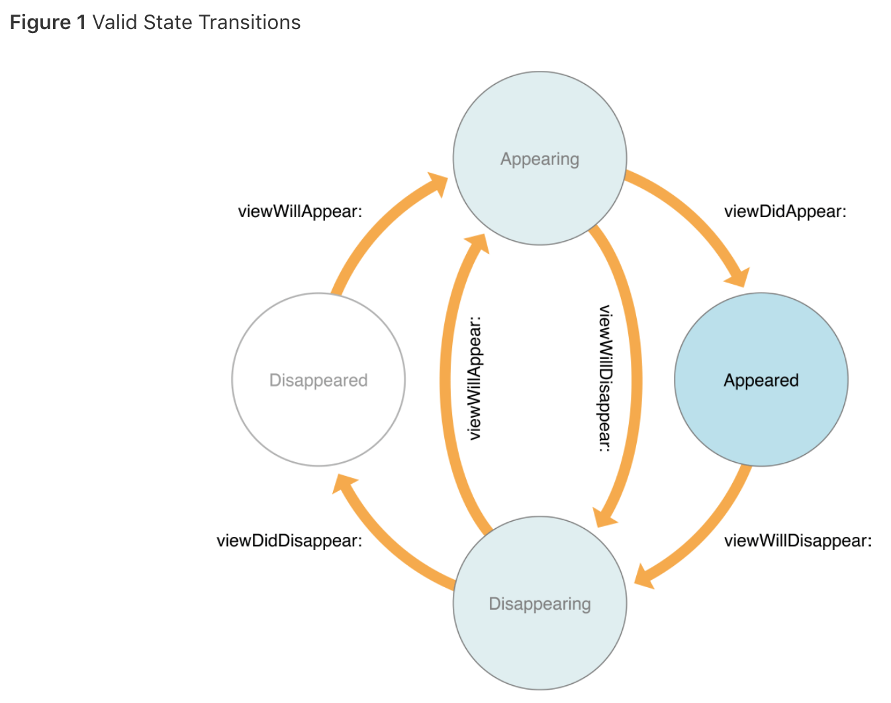

# PhotoFrame App

## Step1 - 시작하기 Tabbed App 템플릿

1. 프로그래밍 요구사항
	- 자동 생성된 ViewController 클래스 viewDidLoad() 함수에서 print(#file, #line, #function, #column) 코드를 추가하고 실행하면 콘솔 영역에 무엇이 출력되는지 확인한다.
2. UITabBarController와 UITabBar에 대해 학습한다.
3. UITabBar와 UITabbarController의 차이점은 무엇인가?

### 진행사항 (완성날짜: 2018/05/24 14:00)


## Step2 - IBOutlet

1. 프로그래밍 요구사항
	- Xcode 프로젝트 내비게이터에서 Main.storyboard 파일을 선택하고 First Scene 에 있는 'First View' 레이블(Label)을 선택하고 Assistant Editor 모드로 변경한다.
	- 레이블을 선택하고 Control + 드래그해서 ViewController 코드에 IBOutlet으로 연결한다.
	- 코드로 Label의 속성을 변경해본다. (글자색, 배경색, 투명도, 글자 크기)
2. UILabel클래스 속성(property)는 어떤게 있는지 학습한다.

### 진행사항 (완성날짜: 2018/05/25 12:07)


## Step3 - IBAction

1. 프로그래밍 요구사항
	- Main.storyboard 에서 First Scene에 UIButton을 추가한다.
	- 버튼을 ViewController 코드에 IBAction으로 연결한다.
	- `nextButtonTouched()`메소드를 구현한다.(textColor, backgroundColor, alpha 속성 변경)
2. 학습꺼리에 대한 짧은 요약
	- IBAction과 IBOutlet 연결 구조에 대해 이해한 내용을 정리한다.
		- IBAction : 인터페이스빌더의 뷰로부터 이벤트 발생 시 뷰컨트롤러의 액션메서드를 통해 이벤트처리를 위해 사용. (특히 IBAction은 UIControl클래스를 상속받은 클래스들만 연결가능)
		- IBOutlet : 뷰컨트롤러에서 인터페이스빌더에 있는 뷰에 대한 참조. 이를 통해 뷰컨트롤러에서 인터페이스빌더에 있는 뷰에 접근하고 뷰를 업데이트하고 수정할 수 있다.
		- 뷰에서 발생한 이벤트를 IBAction을 통해 받고 액션메소드를 통해 처리 후 IBOutlet에 대한 접근을 통해 뷰를 업데이트한다.
	- 버튼에 IBAction을 추가할 때 이벤트(Event) 종류에는 어떤 것들이 있는지 학습한다.
		
		- 대부분 `UIControlEvents` 구조체에 정의되어 있다. (IBAction으로는 못받는 event도 있다.)
	- 버튼에 액션을 여러개 추가할 수 있을까?
		- 하나만 추가했을 때의 방법으로 여러 개를 추가할 수 있다.
	- 버튼이 여러일 때 하나의 액션에 추가할 수 있을까?
		- 있다. 액션메서드에서 `sender`를 인자로 받기 때문에 여러 버튼이 하나에 액션에 연결되어 있어도 액션안에서 sender를 통해 구분가능하다.

### 진행사항 (완성날짜: 2018/05/26 11:00)


## Step4 - Scene과 Segue

1. 프로그래밍 요구사항
	- Main 스토리보드에서 First Scene 옆에 ViewController를 드래그해서 새로운 Scene을 추가한다.
	- 앞 단계에서 추가한 [다음]버튼을 선택하고 Control + 드래그를 해서 새로 추가한 Scene에 연결한다.
	- 새로 추가한 Scene 속성에서 배경 색상(Background Color)을 원하는 색상으로 변경한다. 새로 앱을 실행해보고 [다음] 버튼을 누르면 새로운 화면이 나타나는지 확인한다.
	- 다시 스토리보드에서 위에 추가한 Scene (혹은 ViewController)에 [다음] 버튼을 추가한다. 우측 옆에 한 단계 더 표현하기 위한 ViewController를 추가하고 배경 색상을 다른 색상으로 변경한다. 위와 마찬가지로 [다음]버튼에서 새 Scene으로 Segue를 연결한다.
	- 예를 들어 First Scene 다음에 추가한 화면이 Yellow 화면이었다면, First Scene에서 [다음] 버튼을 누르면 Yellow 화면이 표시되고, Yellow 화면에서 [다음] 버튼을 누르면 Blue 화면이 나오는 방식으로 두 단계 표시한다.
	
### 진행사항 (완성날짜: 2018/05/28 17:14)


## Step5 - ViewController 프로그래밍

1. 프로그래밍 요구사항
	- 프로젝트에 새로운 ViewController 클래스를 추가한다. File > New... > File... 메뉴를 선택한다. 다음과 같은 화면에서 Cocoa Touch Class를 선택한다.
	- UIViewController에서 상속받도록 입력하고, 원하는 클래스명을 입력한다. (예시 YellowViewController)
	- 스토리보드에서 YellowViewController 화면에 [닫기] 버튼을 추가한다.
	- Assistant Editor를 선택하고 [닫기] 버튼에 대한 IBAction 액션을 연결한다.
	- ViewController를 dismiss하는 action method를 구현한다.
	- 위와 동일하게 세 번째 추가한 화면에 대해 ViewController 클래스를 지정하고, [닫기]버튼을 추가하고, 액션을 연결해서 화면을 닫는 동작이 동작하도록 구현한다.
	- 뷰 컨트롤러 강의 자료에 있는 화면 관련 콜백 함수들에 모두 print(#file, #line, #function, #column) 코드를 추가한다.
		- viewWillAppear()
		- viewDidAppear()
		- viewWillDisappear()
		- viewDidDisappear()
		
2. 학습꺼리
	- 화면전환의 사이에 뷰컨트롤러 라이프사이클이 어떻게 변화하는지 확인한다.
	- YelloViewController에서 Segue를 제거하고 코드로 다음화면을 보여주는 방법을 찾고 적용한다.
	
### 진행사항 (완성날짜: 2018/05/28 21:51)


### Summary
* 뷰 컨트롤러
	- 뷰 컨트롤러 : 화면을 구성하고 콘텐츠를 표현하는 기본 뷰 컨트롤러, UIViewController class
	- 내비게이션 컨트롤러 : 화면의 이동과 계층적 탐색을 위한 컨트롤러, UINavigationController
	- 테이블 뷰 컨트롤러 : 목록을 구현하기 위한 컨트롤러, UITableViewController
	- 탭 바 컨트롤러 : 병렬적(카테고리) 화면을 탭으로 구분하기 위한 컨트롤러, UITabbarController
	- 스플릿 뷰 컨트롤러 : 메인-서브 화면 분할용 컨트롤러, UISplitViewController
- View Controller Life Cycle


	* `viewDidLoad()`
		- 뷰 계층이 메모리에 로드된 직후 호출되는 메서드
		- 뷰의 추가적인 초기화 작업을 하기 좋은 시점, 메모리에 처음 로드될 때 한번만 호출된다.
	* `viewWillAppear(animated:)`
		- 뷰가 뷰 계층에 추가되고 화면이 표시되기 직전에 호출되는 메서드
		- viewDidLoad와 달리 뷰가 보일 때마다 호출 되므로 화면이 나타날때마다 해야하는 작업을 하기 좋다.
	* `viewDidAppear(animated:)`
		- 뷰가 뷰 계층에 추가되어 화면이 표시되면 호출되는 메서드
		- 뷰가 화면에 다 나타나고나서 해야하는 추가작업을 하기 좋음.
		- 특히 애니메이션, API정보를 받아와 화면을 업데이트할 때 이곳에 구현하면 좋다.
	* `viewWillDisappear(animated:)`
		- 뷰가 뷰 계층에서 사라지기 직전에 호출되는 메서드.
	* `viewDidDisappear(animated:)`
		- 뷰가 뷰 계층에서 사라진 후 호출되는 메서드.
	
* [화면전환 present 방식](./docs/화면전환.md)
* [화면전환 segue 방식](./docs/화면전환_세그웨이.md)
* 내비게이션 사용시 -> stack처럼 push와 pop의 개념
* 새로운 뷰 컨트롤러를 내리고 다시 이전 뷰 컨트롤러로 복귀하기
	- present로 구현 시 : `dismiss(animated:completion:)`
	- 내비게이션 컨트롤러 이용 시 : `popViewController(animated:)`사용

출처 : 꼼꼼한 재은씨, Apple Document, 코드스쿼드 강의자료, [UIViewController](https://developer.apple.com/documentation/uikit/uiviewcontroller?changes=_3), [View Controller Programming Guide for iOS](https://developer.apple.com/library/content/featuredarticles/ViewControllerPGforiPhoneOS/index.html#//apple_ref/doc/uid/TP40007457-CH2-SW1), [H.I.G](https://developer.apple.com/ios/human-interface-guidelines/overview/themes/), [UIModalPresentationStyle](https://developer.apple.com/documentation/uikit/uimodalpresentationstyle)


## Step6 - Container ViewController

1. 프로그래밍 요구사항
	- 스토리보드에서 First Scene을 선택하고, Editor > Embed In > Navigation Controller 항목을 선택한다.
	- 실행해보면 화면 상단에 내비게이션바(Navigation Bar)가 추가되고 [다음]버튼을 누르면 다음 화면이 우측에서 좌측으로 애니메이션되면서 표시된다.
	- [닫기]버튼에 연결된 closeButtonTouched 코드를 다음과 같이 수정한다.
		```
		 @IBAction func closeButtonTouched(_ sender: Any) {
		 self.navigationController?.popViewController(animated: true)
		 }
		```
	- 위와 동일하게 세 번째 추가한 화면에 [닫기]버튼도 코드를 수정한다.
	- 뷰 컨트롤러 콜백 함수들 동작도 동일한지 확인한다.
	
	```
	// 앱 실행
	FirstViewController.swift 19 viewDidLoad() 40
	FirstViewController.swift 27 viewWillAppear 40
	FirstViewController.swift 31 viewDidAppear 40
	
	// FirstViewController [다음] 클릭 후
	YellowViewController.swift 17 viewDidLoad() 40
	FirstViewController.swift 35 viewWillDisappear 40
	YellowViewController.swift 22 viewWillAppear 40
	FirstViewController.swift 39 viewDidDisappear 40
	YellowViewController.swift 26 viewDidAppear 40
	
	// YellowViewController [다음] 클릭 후 
	BlueViewController.swift 17 viewDidLoad() 40
	YellowViewController.swift 30 viewWillDisappear 40
	BlueViewController.swift 22 viewWillAppear 40
	YellowViewController.swift 34 viewDidDisappear 40
	BlueViewController.swift 26 viewDidAppear 40
	
	// BlueViewController [닫기] 클릭 후
	BlueViewController.swift 30 viewWillDisappear 40
	YellowViewController.swift 22 viewWillAppear 40
	BlueViewController.swift 34 viewDidDisappear 40
	YellowViewController.swift 26 viewDidAppear 40
	
	// YellowViewController [닫기] 클릭 후
	YellowViewController.swift 30 viewWillDisappear 40
	FirstViewController.swift 27 viewWillAppear 40
	YellowViewController.swift 34 viewDidDisappear 40
	FirstViewController.swift 31 viewDidAppear 40
	```
	
	* 내비게이션 컨트롤러를 사용하지 않았을 때와 다른점
		- 호출된 다음 뷰 컨트롤러의 `viewWillAppear`이 호출되자마자 이전 뷰 컨트롤러의 `viewDidDisappear`이 호출되면서 다음 뷰 컨트롤러가 `viewDidAppear`을 호출하기 전에 사라진다.
		- 기존의 내비게이션 컨트롤러를 사용하지 않았을 경우 : 다음 뷰 컨트롤러의 `viewWillAppear`과 `viewDidAppear`이 호출되고 나서 이전 뷰 컨트롤러의 `viewDidDisappear`이 호출되면서 사라진다.
	
2. 학습꺼리
	- 뷰컨트롤러 컨테이너 동작을 이해한다.
		- [View Controller Programming Guide](https://developer.apple.com/library/content/featuredarticles/ViewControllerPGforiPhoneOS/ImplementingaContainerViewController.html) 중에 Implementing a Container View Controller 참고하기
		- 컨테이너 뷰 컨트롤러는 뷰 컨트롤러 자체의 콘텐츠를 표시하는 것이 아닌 내비게이션 컨트롤러나 탭바 컨트롤러와 같이 뷰 컨트롤러가 다른 여러 뷰 컨트롤러를 포함하고 이를 관리한다. 이 중 내비게이션은 다른 뷰 컨트롤러를 스택과 같은 형태로 뷰 컨트롤러를 관리하며(pop, push로 뷰 컨트롤러 이동), 내비게이션 컨트롤러는 back button을 제공한다. 내비게이션 스택의 가장 최상위에 있는 뷰 컨트롤러의 콘텐츠를 화면에 표시하게 된다.
		- [왜 `addChildViewController`를 사용해야하는가?](http://minsone.github.io/mac/ios/why-use-addchildviewcontroller-_-implementing-a-container-view-controller)
	- 뷰컨트롤러 컨테이너는 또 어떤 클래스가 있는지 찾아보고 학습한다.
		- `UINavigationController`, `UITabBarController`, `UISplitViewController`
		- 아이폰에서는 보여주고자 하는 구조에 따라 Navigation과 TabBar을 적절히 선택하여 사용.(H.I.G 가이드라인 참조하기)
	- 내비게이션 컨트롤러가 있을 경우와 없을 경우 화면 전환 동작이 어떻게 다른지, 화면들 포함관계가 있는지 학습한다.
		- 내비게이션 컨트롤러가 있을 경우 내비게이션 stack을 통해 pop, push로 내비게이션 스택을 통해 뷰 컨트롤러를 관리할 수 있다. 다음 뷰 컨트롤러가 나타나도 이전 뷰 컨트롤러가 유지된다.
		- 내비게이션 컨트롤러를 사용안하고 present modally하게 보여줄 경우 호출된 새로운 뷰 컨트롤러가 보여지게 되면 이전 뷰 컨트롤러는 사라진다. (`overCurrrentContext`를 사용할 경우 이전 뷰 컨트롤러가 보여진다.)
	- 내비게이션 컨트롤러 관련 메서드가 왜 push / pop 인지 학습한다.
		- 내비게이션 스택으로 뷰 컨트롤러를 관리 (이 때문에 내비게이션 컨트롤러에서 push로 불려온 뷰 컨트롤러는 dismiss가 작동하지 않는다.)
	- view controller 참고하기 : [view controller programming guide](https://developer.apple.com/library/content/featuredarticles/ViewControllerPGforiPhoneOS/ImplementingaContainerViewController.html)
	- `var navigationController`: UINavigationController? : 뷰 컨트롤러 계층구조에서 가장 가까운 navigation controller를 가르킨다.