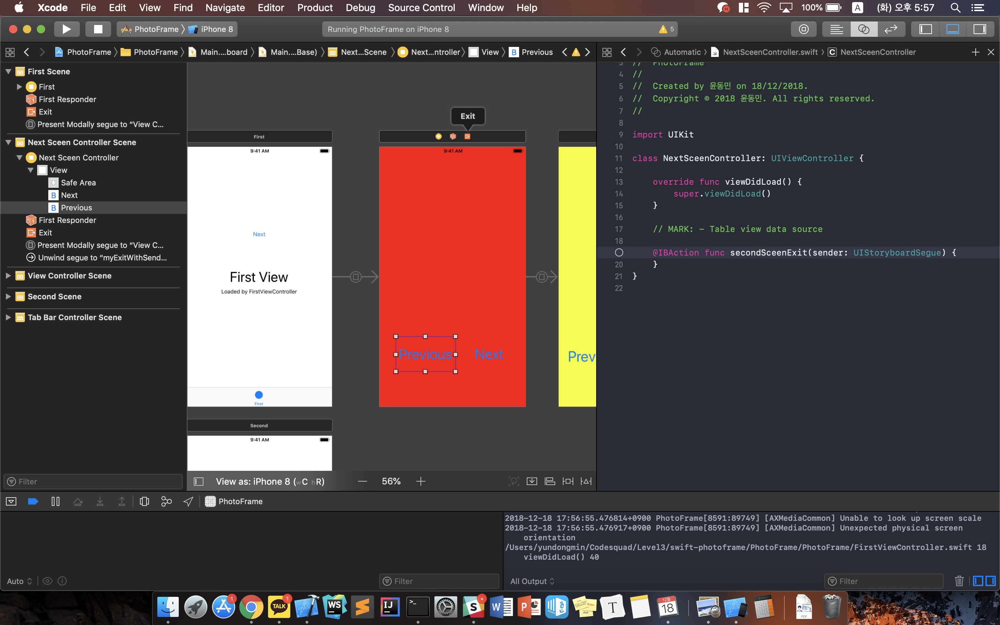

### 사진액자 앱

##### **Step 1** 

* 파일의 위치,  명령어가 쓰인 라인, 명령어가 쓰인 함수, 명령어 실행되는 Column을 콘솔창에 출력한다.

##### **Step 2** 

 앱의 UI 화면을 변경하기 위해선 **Story Board** 파일을 열어야 한다. (LaunchScreen.storyboard 는 앱이 실행될 때, main.storyboard 는 그 외의 경우에 다룬다.)
 * IBOutlet, IBAction : Colletion 타입 중 하나이다. 각각 프로퍼티, 메소드로 생성되어 화면 요소들을 컨트롤할 수 있는 연결고리가 된다.
 * IBOutlet : 처리 결과를 View 단에 알리고 원하는 동작을 이끌어 내게한다 -> View에 존재하는 요소와 Controller를 연결하기 위한 변수이다.
 * IBAction : 유저를 통한 특정 이벤트를 감지해서 Controller에 알리는 역할을 한다 -> 특정 이벤트 발생 시 실행될 액션이다.
 
 
 
* 작업한 내용의 결과를 쉽게 확인할 수 있는 Assistant Editor 모드로 전환해 준다.

* first Label을 IBOutlet으로 `Control + Drag` 하여 연결시켜 준다.

* 연결된 Outlet 변수를 통해 프로퍼티의 속성을 바꾸어 준다.

##### **Step 3**

* 버튼을 First View에 추가해주고, 버튼을 Ctrl + `드래그` 액션으로 IBAction을 추가해준다.

* Action이 일어났을 때 일어날 행동을 정의해준다.
* 글자색, 배경화면, 투명도를 변경해주었다.

* 버튼을 누르기 전 화면

* 버튼을 누른 후 바뀐 화면

##### **Step 4**

* ViewController 새로운 Sceen을 추가한다.
* First View의 다음 버튼을 `control + 드래그`하여 새로 만든 sceen에 연결한다.

* 연결된 화살표를 누르면 화면전환 효과를 설정할 수 있다.

* Segue를 통해 화면을 전환할 때에는 항상 새로운 ViewController 객체를 생성한다.
* 이전 화면으로 전환을 위해서 이전 화면에 IBAction을 스크린샷과 같이 구현한다.

* `Control + 드래그`를 사용하여 Exit로 드래그한다.

##### **Step 5**

 이전 화면으로 돌아가기 위한 방식을 구현하기 위한 방법에는 2가지가 있다. Unwind를 이용한 방식과 IBAction을 구현해 `dissmiss` 메소드를 사용하는 방법이다.
 이번 단계에서는 `Dismiss`를 사용하는 방식으로 구현해보았다.
 
 1. `File -> New -> Cocoa Touch Clss`를 생성해준다.
 
 
 2. 적당한 저장경로를 선택한다.
 
 
 3. `Dismiss`를 구현할 View로 이동하여 방금 생성한 Class로 `Custom Class`를 지정하여 준다.
 
 
 4. View에 `IBAction` 메소드를 구현하고 다음과 같은 코드를 추가하여 준다. 이렇게 완료되면 이전으로 돌아가기 버튼이 완성된다.
 
 
 
 * 추가적으로 Segue를 통해 화면전환이 일어나는 방식이 아닌, 코드를 통해 화면전환을 하는 방법을 사용해보았다.
 
 1. `instantiateViewController(withIdentifier: "YellowViewController")` 메소드를 사용하는데 withIdentifier에 ViewController의 ID가 필요하다. 이를 위해 ViewController의 Identifier를 설정해야 한다.
 
 
 2. 그 후 버튼을 생성 후 `IBAction` 을 구현한다. 코드에 밑 그림과 같이 추가해준다.
 
 
 * **ViewController 콜백 함수**
 1. `viewWillAppear() : View가 생성되기 전에 호출된다.
 2. `viewDidAppear() : View가 생성되면서 호출된다.
 3. `viewWillDisappear() : View가 버려지기 전에 호출된다.
 4. `viewDidAppear() : View가 버려지면서 호출된다.
 
 1 -> 2 -> 3 -> 4 순으로 콜백함수들이 호출된다.
 
 ##### **Step 6**
 
  이번 단계에서는 View Controller Container에 대해 학습하였다.
  
  우선 ContainerView를 사용하게 되면 View가 하위 View를 가질 수 있게 된다. 이를 통해 계층관계가 View사이에 형성된다. 
  IOS에서 사용되는 ContainerView에는 몇몇개가 있는데 우선 2가지를 먼저 찾아보았다.
  1. NavigationController
  2. TabbarController
  
  * Navigation Controller
  - 뷰 컨트롤러 사이 계층구조를 탐색할 수 있게 해주는 객체이다. 이 컨트롤러의 자식 뷰는 일종의 **Stack**으로 관리된다. 처음 표시되는 뷰 컨트롤러는 `rootViewController`라고 한다. 세부 항목으로 들어갈 때마다 다음 레벨 뷰 컨트롤러를 `Push`하고 반대로 나갈 때는 `Pop`을 하게 된다.
  1. `pushViewController(viewController: UIViewController, animated: Bool)`
  2. `popViewController(animated: Bool)`

 * Tab Bar Controller
 - 탭 바 컨트롤러는 네비게이션과는 다르게 서브 뷰컨트롤러의 사이가 수평적인 관계를 가지게 된다. 하단에 탭바 UI를 제공하고, 각각 선택하여 들어갈 수 있다.
 
 
  Step을 진행하면서 알아 보았다.
  
  1. FirstSceen을 클릭해 Editor > Embeded in > Navigation Controller 를 선택해, Navigation Controller를 추가해준다. 상단에 네이게이션 바가 생긴 것을 확인할 수 있다.
  
  
  
  2. 이렇게 바꾸고나면 Navigation Controller는 Stack형식으로 동작하기 때문에 이전에 동작했던 dismiss 메소드가 동작하지 않게 된다. 이전 화면으로 빠져나가기 위해 아래와 같은 코드로 바꾸어준다. 
  
  
 
