# Step1 - UITabBarController, UITabBar (2019.6.25)

## View Controllers

- View Controllers는 **단일 루트 뷰를 관리**하며, 그 자체에는 임의의 개수의 하위 뷰가 포함될 수 있다.
- 해당 뷰 계층과의 사용자 상호 작용은 필요에 따라 앱의 다른 개체와 조정되는 View Controllers에 의해 처리 된다.
- 모든 앱에는 콘텐츠가 메인 창을 채우는 **View Controllers가 하나 이상 있다.(무조건)**
- 앱이 한 번에 화면에 들어갈 수 있는 것보다 더 많은 콘텐츠를 가지고 있는 경우 **multiple View Controllers**를 사용하여 해당 콘텐츠의 다른 부분을 관리한다.

## UIKit

- 특정 유형의 콘텐츠 탐색 및 관리를 위한 몇 가지 표준 View Controllers 제공한다.
- 앱의 사용자 지정 콘텐츠를 포함하는 View Controller를 정의할 수 있다.
- 새로운 탐색 체계를 구현하기 위해 사용자 정의 Container View Controller를 정의할 수 있다.

## UITabBarController와 UITabBar

- 앱을 개발할 때 흔히 쓰이는 View Controller 중 Tab은 아래와 같이 Tab에 있는 콘텐츠를 선택함으로써 다른 화면을 보여줄 수 있다.
- 이 처럼 같은 앱이지만 다루고 싶은 콘텐츠가 화면마다 확연히 다른 경우 또는 같은 콘텐츠지만 인터페이스이스가 다른 경우는 Tab 방식을 활용하는 것이 좋다.


- Tab Bar Controller의 Tab bar 보기에 직접 엑세스하면 안 된다. Tab 표시줄 Controller 의 Tab을 구성하려면 각 tab에 대한 root view를 제공하는 View Controller **(UIViewController)를 상속** 받아야한다.
- Tab Bar 항목은 해당 View Controller를 통해 구성된다. Tab Bar 항목을 View Controller와 연결하려면 UITabBarItem 클래스의 새 인스턴스를 생성하고 View Controller에 맞게 구성한 다음 **View Controller의 Tab Bar에 할당**한다.
- 아이템 속성, View Controller에 사용자 정의 Tab 표시줄 항목을 제공하지 않는 경우 View Controller는 제목 속성에서 이미지와 텍스트를 포함하지 않는 기본 항목을 생성한다.
- Tab Bar 인터페이스와 상호 작용할 때 Tab Bar Controller 객체는 상호 작용에 대한 책임을 넘긴다. 책임을 넘겨 받은 객체는 **UITabBarContrrollerDelegate 프로토콜을 준수**해야 한다.

### UITabBarController

- UITabBarController 클래스는 **UIViewController 클래스에서 상속**되기 때문에, Controller 자체가 내부 View 속성에 접근할 수 있는 하나의 View를 가진다.
- TabBarItem을 품고 있는 TabBar 라는 View를 품고 있기에 각 Tab 별로 화면 전환이 가능하다.
- 여러 하위 View Controller를 포함하고 있는 Container지만 선택권을 사용자들에게 넘겨 사용자들이 원하는 한가지 하위 View만을 보여주는 방식
- UITabBarController를 사용한다면 Tab이 항상 화면 최하위에 위치 한다.

아래 그림은 View가 전체 Tab Bar 인터페이스를 나타내기 위해 어떻게 조립되는지 보여준다.


각 View에 Layer가 있어서 구분되며, TabBar View를 통해 Tab을 선택한다면 위에서 여러 겹쳐져 있는 화면 중에 오직 가장 최상단에 올라와 있는 Custom View부분만 변경되면서 현재 어떤 Tab이 선택되었는지를 나타낸다.

## UITabBar

- **UIView를 상속 받음**
- Tab Bar View에 해당하는 부분이며 UIView로, 사용자에게 탭들을 어떻게 보여주고 탭 클릭 시 어떻게 반응할 건지  알고 있다.
- UITabBar는 보통 UITabBarController와 함께 사용하지만 **혼자 쓰일 수도 있으며**, 각 탭을 구분하는 버튼을 포함한다.
- 각각의 버튼은 탭의 종류를 뜻하며 item이라고 하며, **TabBarItem은 TabBar에 최소 1개 이상**이다.
- 종류가 6가지가 넘어간다면 처음 4가지만 표시되고 나머지는 the standard More item(보통 `∙∙∙`) 이라는 버튼으로 표시된다.
- TabBar의 Item들을 구성할때는 Interface Builder(Storyboard)를 활용하는 방식과 프로그래밍으로 직접 처리하는 방식 두가지가 있다.

|         속성         |                             내용                             |
| :------------------: | :----------------------------------------------------------: |
|    **Background**    | Bar에 표시할 배경 이미지. 확장 가능한 이미지를 지정하면 사용 가능한 공간에 맞게 영상이 확장되고 그렇지 않으면 이미지가 타일링된다. 배경 이미지를 구성할 때 탭 표시줄은 색조 정보를 무시한다. 이 속성을 프로그래밍 방식으로 설정하려면 **backageImage** 속성을 사용하면된다. |
|      **Shadow**      | Tab 표시줄의 사용자 정의 Shadow 이미지. Tab 표시줄에 사용자 지정 배경 이미지가 없을 경우 이 특성은 무시된다. 이 속성을 프로그래밍 방식으로 설정하려면 **shadowImage** 속성을 사용하면된다. |
|    **Selection**     | 선택한 Tab에 사용할 이미지. 이 특성을 프로그래밍 방식으로 설정하려면**IndicatorImage** 속성을 사용하면된다. |
|    **Image Tint**    | 선택한 항목에 적용할 틴트 색상. 이 특성을 프로그래밍 방식으로 설정하려면 **tintColor** 속성을 사용하면된다. |
|      **Style**       | Bar에 적용할 기본 스타일. 어둡거나 밝은 스타일로 Tab Bar를 구성할 수 있으며 막대는 불투명하거나 반투명할 수 있다. 스타일을 프로그래밍 방식으로 설정하려면 **barStyle** 및 **isTranslucent** 속성을 사용하면된다. |
|     **Bar Tint**     | 막대에 적용할 틴트 색상. 이 특성을 프로그래밍 방식으로 설정하려면 **barTintColor** 속성을 사용하면된다. |
| **Item Positioning** | 항목에 적용할 위치. 이 특성을 사용하여 항목이 탭 막대의 길이에 걸쳐 간격을 두는 방법을 구성해야한다. 이 속성을 프로그래밍 방식으로 설정하려면 **itemPositioning** 속성을 사용하면된다. |


# Step2 - UILabel (2019.6.26)

## UILabel

: 문자열을 화면에 보여주고 싶을 때 사용하는 클래스

|             속성             | 설명                                                         |
| :--------------------------: | :----------------------------------------------------------- |
|          **alpha**           | 투명도를 설정하는 프로퍼티로 0~1 사이의 값을 가지며 0은 완전히 안 보이게, 1은 완전히 보이게 된다. |
|          **frame**           | 위치를 설정하는 프로퍼티. **CGRect** 클래스 형태로 설정      |
|     **backgroundColor**      | 배경색을 설정하는 프로퍼티. **UIColor** 클래스 형태로 설정   |
|           **text**           | 문자열의 내용을 설정하거나 바꾸고, 설정된 값을 가져올 수 있는 프로퍼티 |
|        **textColor**         | 문자열의 색깔을 바꾸고 현재 설정된 문자열의 색깔을 가져올 수 있는 프로퍼티. **UIColor** 클래스로 설정 |
|      **textAlignment**       | 문자열의 정렬 방식을 선택하는 프로퍼티. <br />- **UITextAlignmentLeft**: 문자열을 왼쪽으로 정렬 <br />- **UITextAlignmentCenter**: 문자열을 가운데로 정렬 <br />- **UITextAlignmentRight**: 문자열을 오른쪽으로 정렬 |
|           **font**           | 문자열에 적용할 폰트를 설정하고 가져올 때 사용하는 프로퍼티. **UIFont** 클래스에서 폰트의 종류와 크기를 설정해 적용할 수 있다. |
|      **numberOfLines**       | 표시할 줄의 개수를 설정하고 가져올 때 사용하는 프로퍼티. 기본값은 1 |
| **adjustFontSizetoFitWidth** | 글씨의 길이가 설정해 놓은 크기보다 커질 경우 폰트 크기를 줄일 것인지를 결정하는 프로퍼티 <br />- **Yes**: 설정해 놓은 크기보다 글씨의 길이가 길 경우 폰트 크기를 줄인다. <br />- **No**: 설정해 놓은 크기보다 글씨의 길이가 길 경우 **'…'**으로 대체 |


### UILabel의 주요 메서드

- **initWithFrame**: 초기화하는 메서드로 위치와 크기를 설정해 초기화 한다. **CGRect** 값으로 설정

## UILabel 코드작성 및 결과


# Step3 - IBAction vs. IBOutlet (2019.6.26)

## UIButton

: 버튼에 연결된 모든 동작을 수행하고싶을 때 사용하는 클래스

## IBOutlet

- 객체의 속성을 제어할 목적으로 클래스의 프로퍼티에 연결
- 컨트롤러 헤더 파일에 선언한 객체를 인터페이스 빌더가 알아 볼 수 있도록 하는 역할
- 인터페이스 빌더의 객체와 클래스의 프로퍼티는 서로 타입이 일치해야한다.

## IBAction

- 객체의 이벤트 제어 ( 터치, 쿨릭 등 동적인 상태를 처리하는 메소드와 연결)
- 특정 객체에서 지정된 이벤트가 발생했을 때 일련의 프로세스를 실행하고자 할 때
- 해당 메소드가 액션 메소드라는 것을 인터페이스 빌더에게 알려주게 되며, 컨트롤러를 통해서 호출이 가능해진다. 
- **하나의 액션에 여러 버튼을 설정할 수 있다.**

### IBAction의 Event 종류

|       Event        | 설명                                          |
| :----------------: | --------------------------------------------- |
|  Did End On Exit   | 편집 후 포커스 없어짐                         |
|  Editing changed   | 편집                                          |
| Editing Did Begin  | 편집을 시작할 떄                              |
|  Editing Did End   | 편집을 종료할 때                              |
|    Touch Cancel    | 터치 취소 시                                  |
|     Touch Down     | 터치 다운 시                                  |
| Touch Down Repeat  | 여러번 터치 다운 시                           |
|  Touch Drag Enter  | 드래그하여 객체에 들어갔을 때                 |
|  Touch Drag Exit   | 드래그하여 객체를 벗어날 때                   |
| Touch Drag Inside  | 객체를 터치 후 드래그할 때                    |
| Touch Drag Outside | 객체를 터치 후 드래그하여 객체 밖으로 나올 때 |
|  Touch Up Inside   | 컨트롤에서 터치 업할 때                       |
|  Touch Up Outside  | 통제가 안되는 영역에서 터치 업할 때           |
|   Value Changed    | 값이 변경될 때                                |

- **하나의 버튼에 여러 액션을 추가할 수 있다.**


## UIButton 코드 작성 및 결과


- 버튼 클릭 전


- 버튼 클릭 후


# Step4 - Scene과 Segue (2019.6.26)

## Scene

: 앱의 화면

## Segue

: Scene 간의 이동을 정의하고, 어떤 효과로 변할 것인지 정의하는 것

|       Seque        | 설명                                                         |
| :----------------: | ------------------------------------------------------------ |
|        Show        | 새 화면으로 이동. Stack 구조로서 새 화면이 원래 화면 위를 덮는 구조 |
|    Show Detail     | SplitView 구조에서 원래 화면은 Master, 새 화면은 Detail로 표시하는 구조. 아이폰에서는 똑같아 보이지만 아이패드로 보면 화면이 둘로 분할되서 보이게 된다. |
|  Present Modally   | 새 화면이 모달처럼 원래 화면 위 전체를 덮는 구조. 원래 화면은 새 화면 뒤에 그대로 존재하게 된다. |
| Present As Popover | 아이패드에서 팝업창을 띄운다. 아이폰에서는 큰 의미가 없다.   |
|       Custom       | 사용자 정의 Segue를 만든다.                                  |

## Scene, Segue 결과


# Step5 - ViewController Programming (2019.6.26)

## ViewController의 라이프사이클

1. Init
2. loadView :
   - Controller가 관리하는 View를 만드는 역할
   - loadView가 View를 만들고 메모리에 올린 후 ViewDidLoad가 호출됨
3. viewDidLoad : 
   - View의 컨트롤러가 메모리에 로드되고 난 후 호출
   - View의 로딩이 완료 되었을 떄 **시스템에 의해 자동으로 호출**
   - 화면이 처음 만들어질 때 한번만 실행 (처음 한 번만 실행해야 하는 초기화 코드를 작성)
4. viewWillAppear :
   - View가 나타나기 직전 호출
   - viewDidLoad와 유사하게 볼 수도 있지만 가장 큰 차이는 다른 View에 갔다가 다시 돌아오는 상황의 경우 viewDidLoad는 호출되지 않는다 (viewWillAppear은 호출됨)
5. viewDidAppear : 
   - View가 나타났다는 것을 알림
6. viewWillDisappear :
   - View가 사라지기 직전 호출되는 함수
7. viewDidDisappear : (다시 4. viewWillAppear로 갈 수 있다.)
   - View가 제거되었다는 것을 알림
8. viewDidUnload (다시 2. loadView로 갈 수 있다.) **ios6부터 안 씀**


## Step을 진행하면서 발생한 문제점과 해결방법

새로운 버튼에 IBOutlet을 연결하여 코드작성 후 해당 코드를 지우고 빌드했을 때 해당 버튼을 누르자 아래와 같은 에러 발생


원인: 코드상으로는 지웠지만 연결이 남아있었다. (이점 꼭 유의하자!)


## ViewController Programming 결과


## 추가학습 결과

Segue를 제거하고 다음 화면을 보여줄 때 코드로 보여주는 방법을 찾아보고 적용해본다.


- 유의사항: 반드시 utility Bar의 identitiy에 storyboardID와 restoraionID를 등록해야한다.


# Step6 - Container ViewController (2019.6.27)

## Container ViewController

: 여러 ViewController를 단일 사용자 interface로 결합하는 방법

- **자신이 소유한 다른 ViewController(Child ViewController)의 presentation을 관리**
- Child View는 **그대로 표시**하거나 Container View Controller가 **소유한 View와 같이 표시**한다.
- Container View Controller의 서브클래스는 **public interface**를 선언하여 하위 인터페이스를 연결해야 한다.
- Child ViewController 간에 공유관계를 Container View Controller가 정의한다.
- 사용자가 만드는 컨테이너의 의미에 따라 달라진다.
- Container ViewController를 **생성할 때 메소드를 재정의할 필요 없다.**
- 가장 대표적인 객체:
  1. **UINavigationController**: stack구조로 한번에 하나의 ViewController만 볼 수 있고, 하나 이상의 ViewController를 관리
  2. **UISplitViewController**: masrter - detail 두개의 하위 ViewController를 관리
  3. **UITabbarController**: 탭을 표시하여 여러 모드 중 선택하고 해당 모드의 보기를 표시
  4. **UIPageViewController**: 페이지 간의 탐색을 관리 

## 필수로 사용해야 할 메소드

- **addChild(_ childController: UIViewController)** : 지정한 ViewController를 현재 ViewController의 하위로 추가
- **removeFromParent( )** : ViewController를 상위 Contoller에서 제거
- **willMove(toParent parent: UIViewController? )** : ViewController가 Container ViewController에 추가 또는 제거 되기 직전에 호출
- **didMove(toParent parent: UIViewController? )** : ViewController가 Container ViewController에 추가 또는 제거된 후 호출

## Navigation Controller

- 계층별 컨텐츠 탐색을 위한 Stack 기반 구조를 정의하는 viewController Container 중 하나
- 한번에 하나의 하위 View Controller만 볼 수 있다.
- Delegate 객체를 사용하여 동작을 조정한다.


### Navigation Controller 관련 메서드가 push/pop인 이유?

- 배열의 가장 첫번쨰는 Root View Controller가 가장 아래에 깔려있고 그 위로 View Controller들이 쌓이는 구조라 **Stack의 구조와 같다**. 그렇기 때문에 pushViewController를 사용하게 되면 해당 viewController가 위로 쌓이면서 보여지게 되고 popViewController를 하게되면 해당 viewController가 사라지게 되는 것이다.

## NavigationController 결과

### 코드


### 결과

: NavigationController를 적용한 경우 화면 전환이 오른쪽에서 왼쪽으로 동작하였다.

#### 콜백함수들의 동작 순서

1. FirstView **(loadView)**

2. FirstView **(viewDidLoad)**

3. FirstView **(viewWillAppear)**

4. FirstView **(viewDidAppear)**

   **(다음 버튼 클릭)**

5. MintView **(loadView)**

6. MintView **(viewDidLoad)**

7. FirstView **(viewWillDisappear)**

8. MintView **(ViewWillAppear)**

9. FirstView **(viewDidDisappear)**

10. MintView **(viewDidAppear)**

    **(close 버튼 클릭)**

11. MintView **(viewWillDisappear)**

12. FirstView **(viewWillAppear)**

13. MintView **(viewDidDisappear)**

14. FirstView **(viewDidAppear)**

# Step7 - UIImage (2019.6.27)

## UIImageView

: interface에 단일 이미지 또는 일련의 애니메이션 이미지를 표시하는 객체, 애니메이션 이미지의 경우 이 클래스의 메소드를 사용해서 애니메이션을 시작 및 중지할 수 있다.

- UIView를 상속한다.
- **resizableInsers(withCapInsets: resizingMode: )**을 사용해서 이미지의 크기 및 방향조절이 가능하다
- **animatedImage(with: duration: )**을 사용해서 단일 UIImage 개체를 생성하면 영상을 만들 수 있다.
- 기본적으로 사용자 이벤트를 무시한다. 사용자 이벤트도 처리하도록 하려면  **isUserInteractionEnabled** 속성의 값을 **true**로 하면 된다.

### UIImageView의 속성

|      속성       | 설명                                                         |
| :-------------: | ------------------------------------------------------------ |
|    **Image**    | **표시할 이미지.** 독립 실행형 이미지 및 asstes 이미지를 포함하여 Xcode Project에 원하는 이미지를 지정할 수 있다. 이 속성을 프로그래밍 방식으로 설정하려면 **Image**나 **animationImages** 속성을 사용하면 된다. |
| **Highlighted** | 이미지 보기가 강조 표시될 때 표시할 이미지. 이 특성을 프로그래밍 방식으로 설정하려면 **hilightedImage**나 **highlightedAnimationImages** 속성을 사용하면 된다. |
|    **State**    | 이미지의 초기 상태. 이 특성을 사용하여 이미지를 강조 표시한다. 이 속성을 프로그래밍 방식으로 설정하려면 **isHighlighted** 속성을 사용하면 된다. |


### 성능 향상을 위한 Tip

: 이미지 크기 조정과 알파 blending은 앱 성능에 영향을 줄 수 있는 상대적으로 비용이 많이 드는 작업이다. 성능을 최대화하려면 다음 팁을 고려해야한다.

1. 축소된 축소 ImageView에 특정 대형 이미지가 자주 표시될 것으로 예상하는 경우 축소된 이미지를 미리 만들어 축소 이미지 캐시에 저장한다. 이렇게 하면 각 이미지 뷰가 개별적으로 크기를 조정할 필요가 완화된다.
2. 크기가 ImageView 크기에 가까운 이미지를 사용한다.
3. 가능할 때마다 ImageView를 불투명하게 만든다.

## UIImage

: 앱의 이미지 데이터를 관리하는 클래스

- 이미지 개체는 모든 플랫폼 형식을 지원하지만 앱의 대부분 이미지에 **PNG** 또는 **JPEG**파일을 사용하는 것이 좋다. (이 형식은 다른 이미지 형식보다 나은 성능을 제공하고, 특히 PNG는 무손실이기 때문 응용프로그램의 interface에 사용하는 이미지를 사용하는 것이 좋다.)

### 메소드

- **Init(namedin: compatibleWith: )**나 **init(named:** ) 앱의 기본 번들(또는 일부 알려진 번들)에 있는 assest 또는 이미지 파일에서 이미지를 만든다. 이러한 방법은 이미지 데이터를 자동으로 캐시하므로 자주 사용하는 이미지에 특히 권장한다.
- **imageWithContentsOfFile** 이나 **init(contentsOfFile: )**으로 초기 데이터가 번들에 포함되지 않은 이미지 개체를 만든다. 이 방법은 매번 디스크에서 이미지 데이터를 로드하므로 동일한 이미지를 반복적으로 로드하는데 사용하면 안 된다.
- **animatedImage(with: duration: )** 그리고 **animatedImageNamed(_: duration: )** 메소드로 다중 시퀀스로 구성된 단일 UIImage 객체를 생성한다.
- **isEqual(_: )** 메소드로 이미지 데이터를 비교한다.

### 주의사항

- 이미지 개체는 변경할 수 없기 때문에 생성 후 속성을 변경할 수 없다.
- 대부분의 이미지 속성은 함께 제공되는 이미지 파일 또는 이미지 데이터의 메타 데이터를 사용하여 자동으로 설정된다.
- 또한 이미지 개체의 불변성은 어떤 스레드에서도 안전하게 생성하고 사용할 수 있다는 것을 의미한다.

## UIImage 결과

### 코드

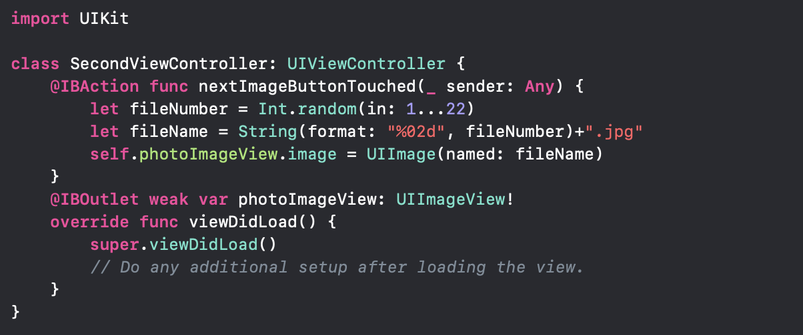

### 결과

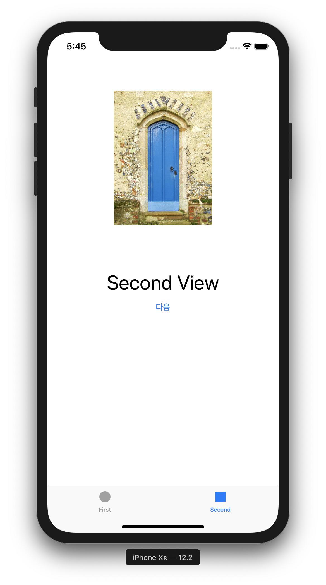

### Tip

1. Show the A\ttributes inspector - View - Content Mode 에서 보여지는 방식을 선택할 수 있다.


2. .xcassets에 이미지를 넣으면 경로에 대한 데이터를 줄 필요없이 파일명만으로 이미지를 찾을 수 있다. (결과 코드 참조) - 만약 해당 폴더에 이미지들을 넣지 않고 일반 폴더에 넣은 후 해당 폴더를 Xcode Project에 넣는다면 Bundle을 사용해 경로나 URL을 파악해서 이를 찾아야 한다.

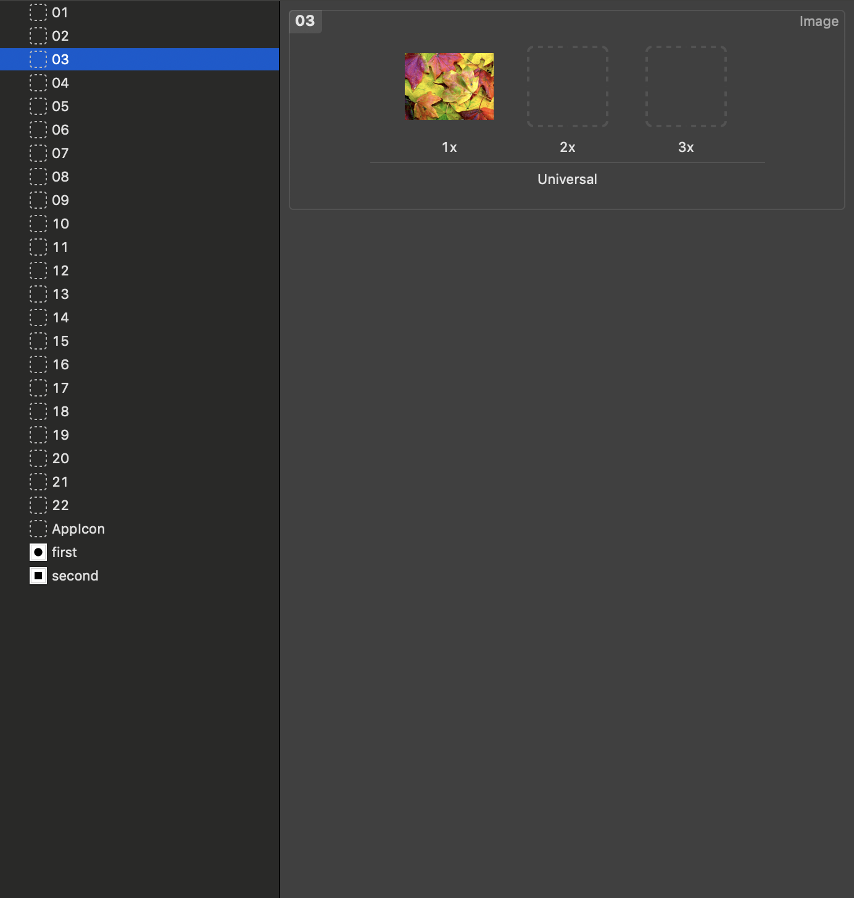

# FinalStep - UIImagePickerController (2019.6.28)

## UIImagePickerController

: 사용자의 미디어 라이브러리에서 사진을 찍고, 동영상을 녹화하고, 항목을 선택하기 위해 시스템 interface를 관리하는 ViewController

## UIImagePickerController 코드

### 전체 코드

```swift
import UIKit

class SecondViewController: UIViewController {
    let picker = UIImagePickerController()

  /// Step7에서 구현한 다음 버튼의 Action 이번 Step에서는 필요 없다.
    @IBAction func nextImageButtonTouched(_ sender: Any) {
        let fileNumber = Int.random(in: 1...22)
        let fileName = String(format: "%02d", fileNumber)+".jpg"
        self.photoImageView.image = UIImage(named: fileName)
    }
    @IBOutlet weak var photoImageView: UIImageView!
  
  /// 선택 버튼의 Action
    @IBAction func selectButtonTouched(_ sender: Any) {
        let alert = UIAlertController(title: "사진선택", message: "두가지 방법으로 선택해요", preferredStyle: .actionSheet)
        
        let library = UIAlertAction(title: "사진앨범", style: .default) {
            (action) in self.openLibrary()
        }
        
        let camera = UIAlertAction(title: "카메라", style: .default) {
            (action) in self.openCamera()
        }
        
        let cancel = UIAlertAction(title: "취소", style: .cancel, handler: nil)
        
        alert.addAction(library)
        alert.addAction(camera)
        alert.addAction(cancel)
        present(alert, animated: true, completion: nil)
    }
    
  /// 사진 앨범으로 이동하는 함수
    func openLibrary() {
        picker.sourceType = .photoLibrary
        present(picker, animated: false, completion: nil)
    }
    
  /// 카메라로 이동하는 함수
    func openCamera() {
        picker.sourceType = .camera
        present(picker, animated: false, completion: nil)
    }
    
  
    override func viewDidLoad() {
        super.viewDidLoad()
        picker.delegate = self
    }
}

extension SecondViewController: UIImagePickerControllerDelegate, UINavigationControllerDelegate {
  
  /// 선택한 이미지를 photoImageView에 나오도록 하는 함수
    func imagePickerController(_ picker: UIImagePickerController, didFinishPickingMediaWithInfo info: [UIImagePickerController.InfoKey : Any]) {
        if let image = info[UIImagePickerController.InfoKey.originalImage] as? UIImage{
            photoImageView.image = image
            print(info)
        }
        dismiss(animated: true, completion: nil)
    }
}

```

### 각 코드별 기능

1. **alert**

   - UIAlertController를 사용해 Alert 객체를 만들 수 있다. Title, message는 String? 타입으로 넣고 싶지않다면 nil을 입력해주면 된다.

   ```swift
   let alert = UIAlertController(title: "사진선택", message: "두가지 방법으로 선택해요", preferredStyle: .actionSheet)
   ```

   

   - **preferredStyle**은 두가지가 있다.

     1. **actionSheet** : 아래에서 위로 올리는 창 **(default)**

        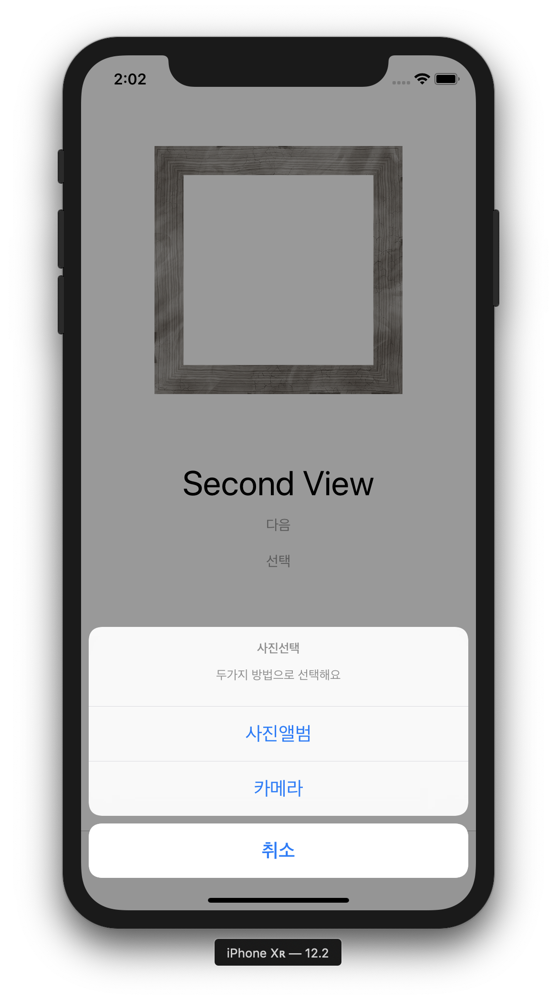

     2. **alert**: 권한설정의 허용, 허용 안함 같은 작은 창을 보여주는 창

        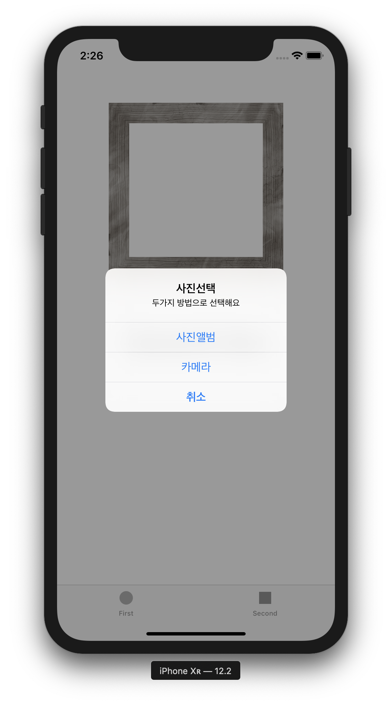

   - 액션 버튼만들기

     - **UIAlertAction**으로 만든다.
     - **title**에 이름, **style**에 스타일을 넣으면 되고 스타일은 총 세가지이다.
       1. **cancel**: default 보다 글씨가 더 굵고 맨 아래에 위치 (파란색으로 표시)
       2. **default**: 파란색으로 표시
       3. **destructive**: 빨간색으로 표시
     - **handler**는 버튼을 눌렀을 때 실행해야하는 행동이다. 만약 아무 행동도 안 할꺼라면 nil

   ```swift
   let library = UIAlertAction(title: "사진앨범", style: .default) {
     (action) in self.openLibrary()
   }
      
   let camera = UIAlertAction(title: "카메라", style: .default) {
     (action) in self.openCamera()
   }
           
   let cancel = UIAlertAction(title: "취소", style: .cancel, handler: nil)
   ```

   - 액션 버튼 추가 및 alert view 화면에 뜨게 만들기

   ```swift
   alert.addAction(library)
   alert.addAction(camera)
   alert.addAction(cancel)
   present(alert, animated: true, completion: nil)
   ```

   

2. **Delegate 채택 및 UIImagePickerController 인스턴스 생성**

   - **UINavigationControllerDelegate**를 같이 선언하는 이유는 **UIImagePickerControllerDelegate**의 **delegate** 속성이 두가지 프로토콜을 모두 구현하는 객체로 정의가 되어있기 때문이다.
   - 즉, 아래의 코드에 self를 picker.delegate에 할당하려면 self는 **UINavigationControllerDelegate** 타입이어야 한다.
   - extension으로 구현한 이유는 클래스가 바로 상속받아도 되지만 **Swift에서 Delegate 채택 작업은 extension으로 빼는것이 좋기 때문이다.**

   ```swift
   let picker = UIImagePickerController()
   ...
   override func viewDidLoad() {
     super.viewDidLoad()
     picker.delegate = self
   }
   ...
   extension SecondViewController: UIImagePickerControllerDelegate, UINavigationControllerDelegate {}
   ```

   

3. **사진앨범과 카메라로 이동하는 함수 구현**

   ```swift
   /// 사진 앨범으로 이동하는 함수
       func openLibrary() {
           picker.sourceType = .photoLibrary
           present(picker, animated: false, completion: nil)
       }
       
     /// 카메라로 이동하는 함수
       func openCamera() {
           picker.sourceType = .camera
           present(picker, animated: false, completion: nil)
       }
   ```

4. **Info.plist에서 권한 설정하기**

   - 카메라와 갤러리를 사용할 수 있게 권한을 설정한다.

     

5. **선택한 이미지를 photoImageView에 넣는 함수**

   - **imagePickerController()** 함수를 활용한다.

   - info의 값을 UIImage로 가져올 수 있다.

   - info를 프린트하면 아래와 같은 Dictionary타입의 데이터가 나온다 여기서 이미지를 가져오기 위해선 OriginalImage를 키로 가지는 값을 가져오면 된다.

     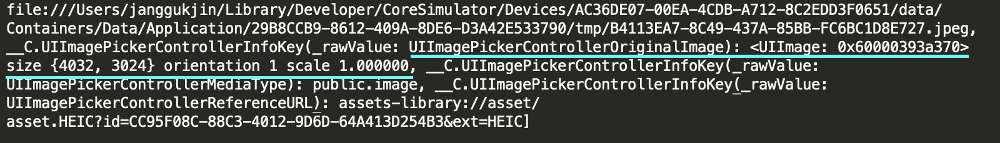

   - dismiss를 구현하지 않으면 imagePickerController가 사라지지 않는다.

```swift
extension SecondViewController: UIImagePickerControllerDelegate, UINavigationControllerDelegate {
  
  /// 선택한 이미지를 photoImageView에 나오도록 하는 함수
    func imagePickerController(_ picker: UIImagePickerController, didFinishPickingMediaWithInfo info: [UIImagePickerController.InfoKey : Any]) {
        if let image = info[UIImagePickerController.InfoKey.originalImage] as? UIImage{
            photoImageView.image = image
            print(info)
        }
        dismiss(animated: true, completion: nil)
    }
}
```

## 사이즈 조절

- 폰 별로 해상도가 달라서 내가 배치한 item들의 위치가 달라질 수 있다
- Constraint를 추가해서 비율을 맞춰줄 수 있다.

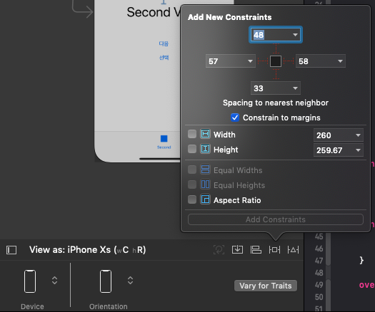

### 결과 (시뮬레이터에는 카메라 기능을 사용할 수 없기에 에러 발생)

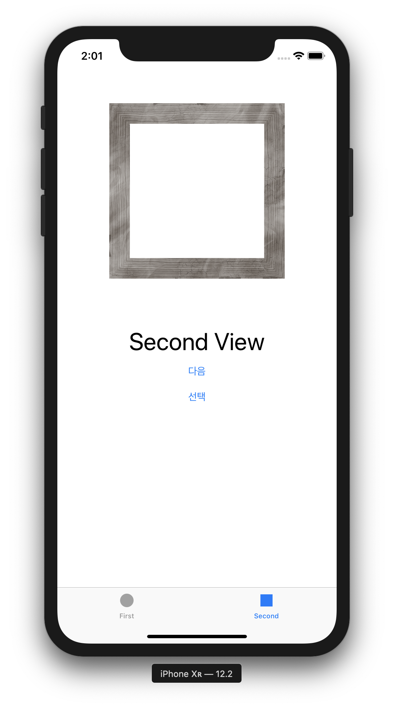


- **UIAlertController에 title과 message를 nil로 준 경우**

```swift
let alert = UIAlertController(title: nil, message: nil, preferredStyle: .actionSheet)
```

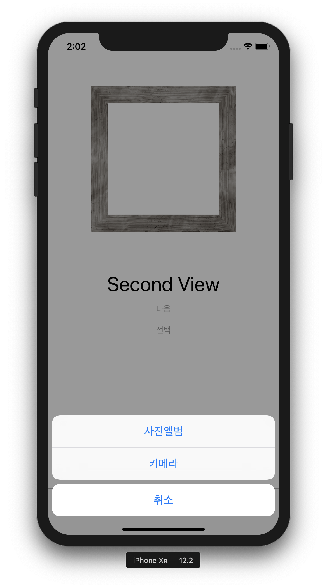

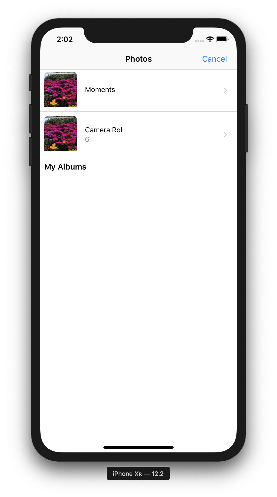

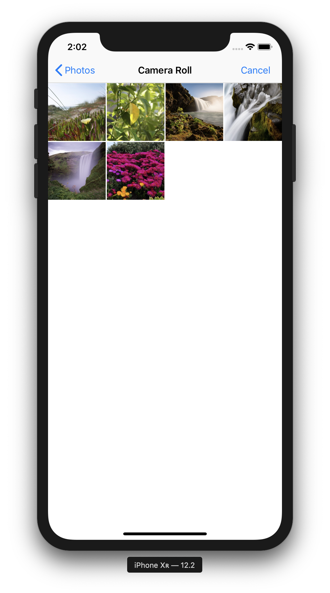

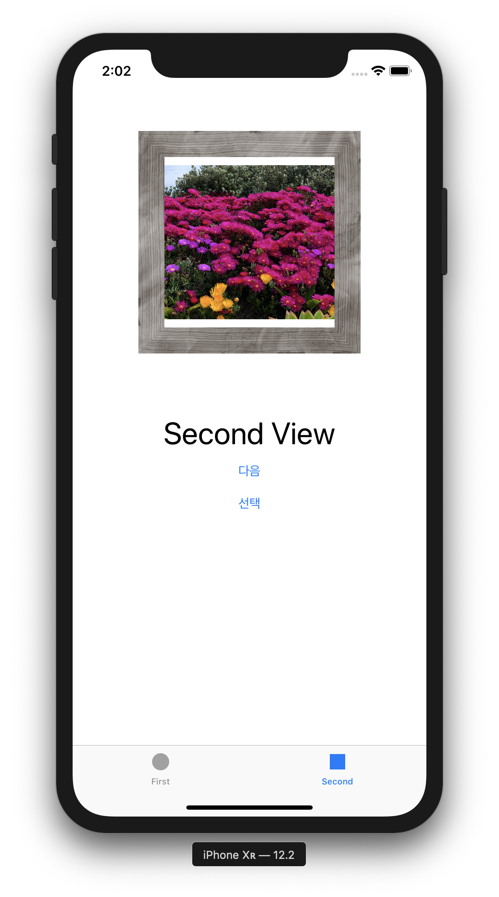

## 나의 IPhone으로 실행한 결과

### iPhone으로 빌드하는 방법

1. Xcode > Preference > Accounts에 들어가서 Apple ID를 등록

   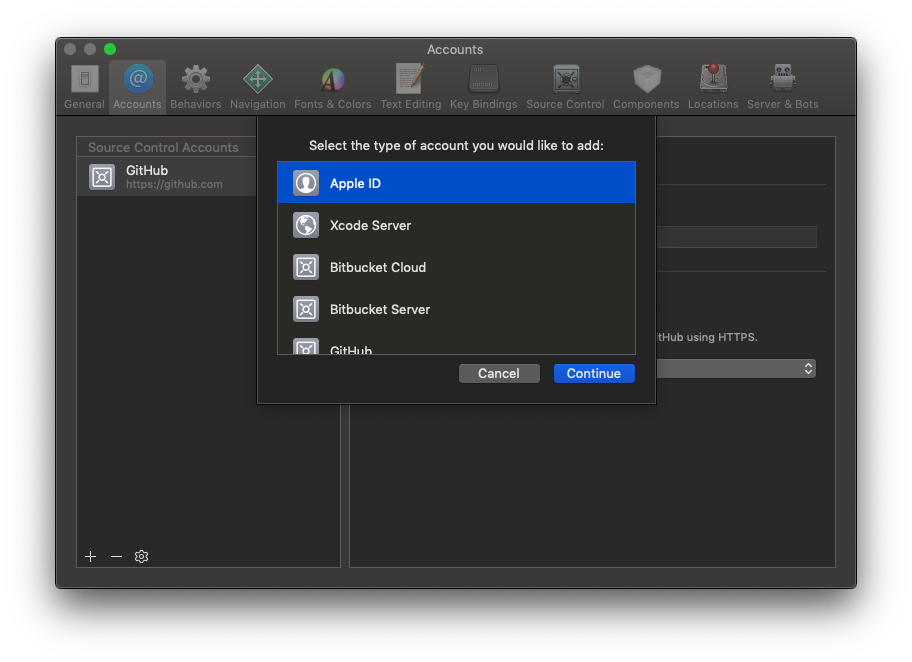

2. 진행중인 프로젝트를 누르고, Target, General로 들어가 Team (Personal Team) 설정

   

3. 아이폰을 맥과 연결 (아이폰은 잠금 해제)

4. Xcode 시뮬레이터할 디바이스를 iPhone으로 선택한 후 빌드하면 끝

   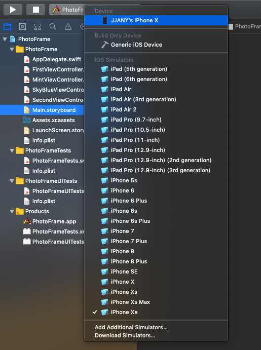

## 나의 IPhone으로 실행한 결과 (카메라 테스트)

### 앱 생성

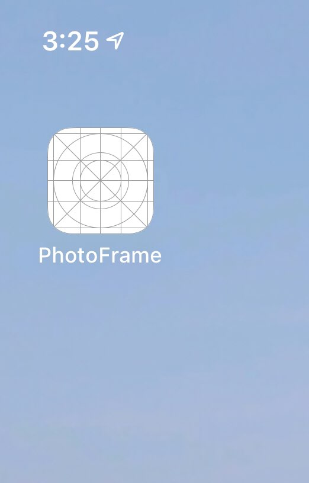

### 카메라 권한 설정

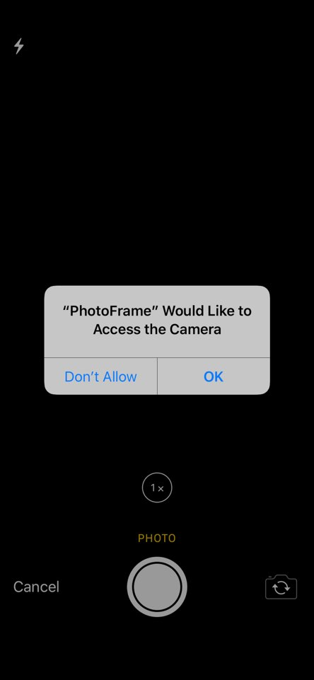

### 촬영한 사진을 쓸지말지 결정

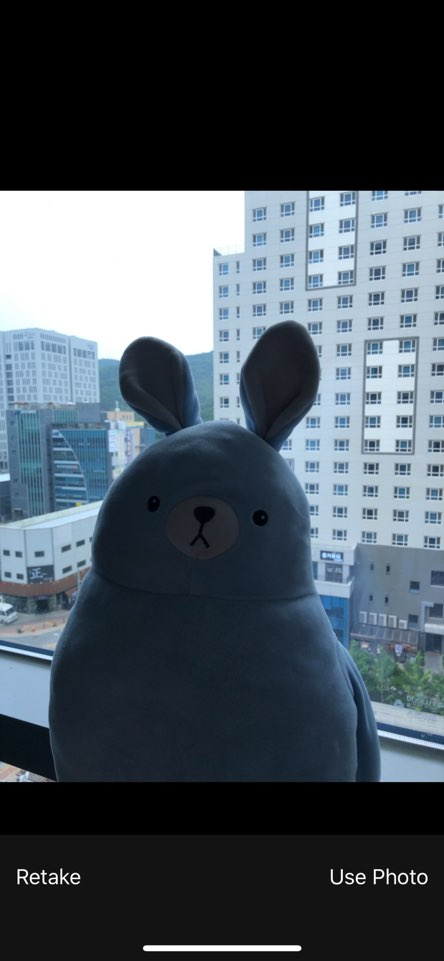

### 결과

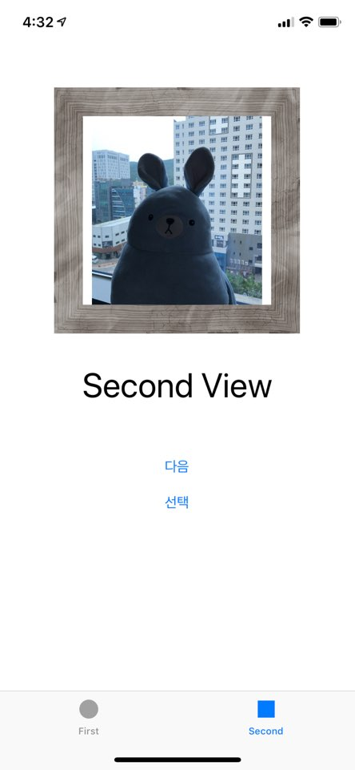