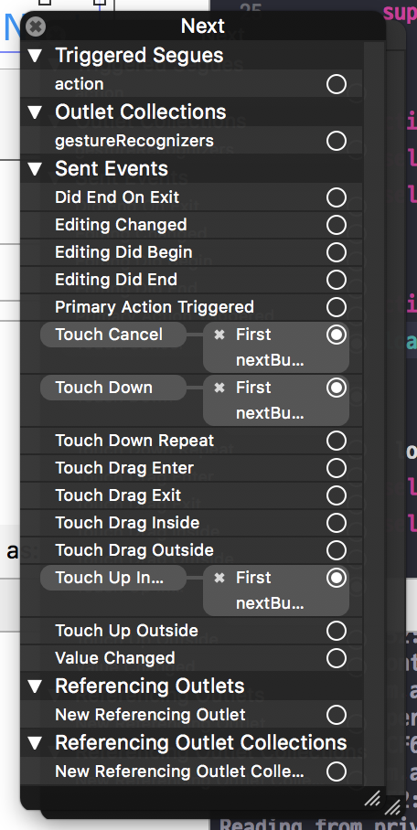

# Photo Frame

### 1단계

##### 요구사항
* iOS 프로젝트 Tabbed App 템플릿을 만들고, 프로젝트 이름을 _PhotoFrame_ 으로 지정함

##### 실행결과

```swift
import UIKit

class FirstViewController: UIViewController {
    override**** func viewDidLoad() {
        super.viewDidLoad()
        print(#file, #line, #function, #column)
    }

    override func didReceiveMemoryWarning() {
        super.didReceiveMemoryWarning()
        
    }
}
```

</img>

##### [View](https://developer.apple.com/library/content/documentation/WindowsViews/Conceptual/ViewPG_iPhoneOS/CreatingViews/CreatingViews.html)
* View objects are the main way your application interacts with the user, they have many responsibilities

##### [View Controllers](https://developer.apple.com/documentation/uikit/view_controllers)
* View를 제어하는 Controller 객체
* _View의 라이프 사이클을 관리함_
* [View Controller Programming Guide for iOS](https://developer.apple.com/library/content/featuredarticles/ViewControllerPGforiPhoneOS/index.html#//apple_ref/doc/uid/TP40007457-CH2-SW1)

</img>

##### [UITabBar](https://developer.apple.com/documentation/uikit/uitabbar)
* 일반적으로 [UITabBarController](https://developer.apple.com/documentation/uikit/uitabbarcontroller)와 함께 사용하지만, 독립적인 컨트롤 형태로도 사용할 수 있음
* 하단에 있으며 [UITabBarItem](https://developer.apple.com/documentation/uikit/uitabbaritem)객체를 보여줌
* UITabBar는 Interface Builder, 생성자, [setItems](https://developer.apple.com/documentation/uikit/uitabbar/1623455-setitems)를 통해 설정할 수 있지만 _UITabBarController는 TabBar에 제공하는 객체를 개발자가 직접 만들어야 함_
* [UIToolBar](https://developer.apple.com/documentation/uikit/uitoolbar)와 비슷하지만, 목적이 다름
    * UITabbar
        * 화면 전환 시 사용
    * UIToolbar 
        * 하나의 화면에서 탭 메뉴 사용
* TabBar는 선택 항목, 사용자 지정 항목에 대해 Delegate 객체에 알려야 함
* TabBar를 만들 때 TabBar 항목의 선택, 추가, 삭제, 정렬에 대한 정보를 Delegate([UITabBarDelegate](https://developer.apple.com/documentation/uikit/uitabbardelegate)) 객체에 알려야 함

##### [UITabBarController](https://developer.apple.com/documentation/uikit/uitabbarcontroller)
* 보이는 화면과 선택된 탭 관계는 일반적으로 AS-IS 관계지만, subclass일 수도 있음
* TabBarController Interface의 탭은 사용자가 선택하였을 때 RootView를 보여줌
* 이전 화면과 관계없이 RooView를 보여줌
* TabBar Interface는 서로 다른 유형의 화면을 보여줌
    * 아이폰의 시계 앱에서 하단 메뉴를 TabBar Interface로 이용하여 만듦

</img>

* TabBarController에 직접 접근하면 안 됨. [viewControllers](https://developer.apple.com/documentation/uikit/uitabbarcontroller/1621185-viewcontrollers) 프로퍼티를 이용해야 함
* 개발자가 지정한 순서대로 화면에 나타나며 [selectedViewController](https://developer.apple.com/documentation/uikit/uitabbarcontroller/1621172-selectedviewcontroller) 프로퍼티를 이용하여 먼저 보여줄 화면을 정할 수 있음
* 사용자가 TabBar Interface를 선택하였을 때 TabBarController 객체에서 일어나는 상호작용을 Delegate에게 알려야 함
* [UITabBarControllerDelegate](https://developer.apple.com/documentation/uikit/uitabbarcontrollerdelegate) 프로토콜에 준수해야 함
* Delegate는 TabBar를 선택할 때 작업을 추가하거나 선택하지 못하게 제어할 수 있음. 그리고 Navigation Controller로 구성된 TabBar의 변화를 알 수 있음
* UITabBarController는 UIViewController를 상속받았기 때문에 TabbarController는 [view](https://developer.apple.com/documentation/uikit/uiviewcontroller/1621460-view) 속성으로 접근할 수 있는 View를 소유할 수 있음
* TabBarController View는 TabBar View와 View 내용을 담는 컨테이너
* TabBar View는 항목에 대한 선택을 제어할 수 있음
* ToolBar View와 TabBar에 대한 항목은 변하지만, 그것을 관리하는 View는 변하지 않음
* 현재 선택된 Tab의 View Controller만 반영하여 View를 바꿈
* Navigation Controller와 Custom View Controller는 Tab의 RootViewController로 사용할 수 있음

</img>

### 2단계

##### 요구사항
* First Scene에 만들어져 있는 레이블을 `IBOutlet`으로 연결함
* 연결한 아웃렛 변수에 값을 변경함

##### 프로그래밍 요구사항
* Xcode 프로젝트 내비게이터에서 Main.storyboard 파일을 선택하고 First Scene 에 있는 'First View' 레이블(Label)을 선택하고 Assistant Editor 모드로 변경함
* 레이블을 선택하고 `Control + 드래그` 해서 ViewController 코드에 IBOutlet으로 연결함

</img>

* Outlet 이름으로 photoLabel을 입력함

</img>

* ViewController 클래스 viewDidLoad() 함수에서 위에 추가한 아웃렛 변수에 값을 변경하고 다시 실행함

```swift
self.firstLabel.text = "JK의 사진액자"
```

* 위와 같이 코드로 firstLabel의 속성을 변경해봄. 글자색, 배경색, 투명도, 글자 크기를 바꿔봄
* firstLabel 아래 있는 레이블도 firstDescription 아웃렛으로 연결함
    * 마찬가지 방식으로 값을 변경해서 꾸며봄

##### 실행결과 

```swift
self.photoLabel.text = "AMING의 사진액자"
self.photoLabel.textColor = UIColor(red: 0.333, green: 0.455, blue: 0.116, alpha: 1.0)
self.photoLabel.font = UIFont.boldSystemFont(ofSize: 40)
self.firstDescription.text = "AMING의 사진액자입니다 :)"
self.firstDescription.textColor = UIColor.green
```

### 3단계

##### 요구사항
* First Scene에 버튼(UIButton)을 추가하고 IBAction으로 연결함
* 연결한 액션에 대한 메서드를 구현함

##### 프로그래밍 요구사항
* Main.storyboard 에서 First Scene에 UIButton을 추가함
    * 우측 유틸리티 영역 하단 3번째 탭 - 객체 라이브러리(Object Library)에서 Button 을 찾아서 View로 드래그함
    * 추가한 버튼을 선택하고 우측 유틸리티 영역 상단 4번째 탭 - 속성(Attributes)에서 Title을 다음으로 변경함
* 버튼을 선택하고 `Control + 드래그` 해서 ViewController 코드에 `IBAction으로 연결함`
* 다음과 팝업에서 Connection 항목에서 IBOutlet 대신 IBAction 으로 변경함
* 액션 이름을 `nextButtonTouched` 으로 지정함

</img>

</img>

</img>


##### 실행결과

```swift
@IBAction func nextButtonTouched(_ sender: Any) {
    self.photoLabel.textColor = UIColor.white
    self.photoLabel.backgroundColor = UIColor.black
}
```
##### [IBOutlet](https://developer.apple.com/documentation/appkit/constants/interface_builder_constants/iboutlet)
* `IB- (Interface Builder)`
* 앱 코드에서 스토리 보드 객체로 연결함
* [Interface Builder Constants](https://developer.apple.com/documentation/appkit/constants/interface_builder_constants?language=objc)
* [IBOutlet](https://soooprmx.com/archives/5123)

> Type qualifier used by Interface Builder to expose a symbol as a connection point for sending messages from app code to a user interface element. Used immediately before an object type in a property or instance variable declaration. 

##### IBAction, IBOutlet 연결구조
* ViewController가 제어하려는 객체는 ViewController가 프로퍼티 등으로 지정하여 알고 있어야 함. Interface Builder 객체를 ViewController와 연결하기 위해서 해당 객체를 IBOutlet으로 연결함
* UI 요소는 ViewController에게 액션 메시지를 전달함. 사용자 동작에 대해 액션을 수행할 수 있음. 이 때 IBAction으로 연결함
* [ViewController Outlet, Action](https://soooprmx.com/archives/4486)

</img>

##### [UIControlEvents](https://developer.apple.com/documentation/uikit/uicontrolevents)
* [How to get event from IBAction method?](https://stackoverflow.com/questions/9344378/how-to-get-event-from-ibaction-method)

> The "event" is the one passed to your action method, but I assume your real question is which of the `UIControlEvents` caused the action. `UIEvent` and `UIControlEvents` are unrelated. The target/action pattern provides a `UIEvent`. If you want to handle different `UIControlEvents` differently, you should implement different actions for them.
> The target/action mechanism comes from `UIResponder`. `UIControlEvents` are related to `UIControl`.

##### IBAction에서 여러가지 이벤트 설정할 수 있음

</img>

### 4단계

##### 요구사항
* 사진액자 - IBAction 요구사항을 구현한 상태로 시작함
* 스토리보드 구성 요소에 대해 학습하고 새로운 Scene과 Segue를 추가함
* 실행하고 새로운 화면을 캡처해서 readme.md 파일에 포함함

##### 프로그래밍 요구사항
* Main 스토리보드에서 First Scene 옆에 ViewController를 드래그해서 새로운 Scene을 추가함
* 앞 단계에서 추가한 [다음]버튼을 선택하고 `Control + 드래그` 를 해서 새로 추가한 Scene에 연결함
* 팝업으로 표시되는 Action Segue에서 Show 항목을 선택함

</img>
</img>

* Scene과 Scene 사이에 화살표를 선택하면 Segue 속성을 변경할 수 있음
* 새로 추가한 Scene 속성에서 배경 색상(Background Color)을 원하는 색상으로 변경함. 새로 앱을 실행해보고 [다음] 버튼을 누르면 새로운 화면이 나타나는지 확인함
* 다시 스토리보드에서 위에 추가한 Scene (혹은 ViewController)에 [다음] 버튼을 추가함. 우측 옆에 한 단계 더 표현하기 위한 ViewController를 추가하고 배경 색상을 다른 색상으로 변경함. 위와 마찬가지로 [다음]버튼에서 새 Scene으로 Segue를 연결함
* 예를 들어 First Scene 다음에 추가한 화면이 Yellow 화면이었다면, First Scene에서 [다음] 버튼을 누르면 Yellow 화면이 표시되고, Yellow 화면에서 [다음] 버튼을 누르면 Blue 화면이 나오는 방식으로 두 단계 표시함

##### 실행결과

</img>

##### [Using Segues](https://developer.apple.com/library/content/featuredarticles/ViewControllerPGforiPhoneOS/UsingSegues.html)
* Show(Push)
    * A navigation controller pushes the new view controller onto its navigation stack.
    * `showViewController:sender:`
* Show Detail(Replace)
    * Only using a iPad  
    * This segue is relevant only for view controllers embedded inside a [UISplitViewController](https://developer.apple.com/documentation/uikit/uisplitviewcontroller) object. With this segue, a split view controller replaces its second child view controller (the detail controller) with the new content.
    * `showDetailViewController:sender:`
* Present Modally
    * This segue displays the view controller modally using the specified presentation and transition styles. 
    * The navigation stack has no effect.
* Present as Popover
    * Show simple pop-up on iPhone 
    * In a horizontally regular environment, the view controller appears in a popover.
* [What are the differences between segues: “show”, “show detail”, “present modally”, “present as popover”?](https://stackoverflow.com/questions/26287247/what-are-the-differences-between-segues-show-show-detail-present-modally)

### 5단계

##### 요구사항
* 사진액자 - Scene과 Segue 요구사항을 구현한 상태로 시작함
* 스토리보드 구성 요소와 클래스 코드와 연결해서 동작을 확장함

##### 프로그래밍 요구사항
* 프로젝트에 새로운 ViewController 클래스를 추가한다. File > New... > File... 메뉴를 선택함. 다음과 같은 화면에서 Cocoa Touch Class를 선택함
* 다음과 같이 UIViewController에서 상속받도록 입력하고, 원하는 클래스명을 입력함 (예시 YellowViewController)
* 다음 화면에서는 프로젝트내 어떤 경로에 저장하며, 프로젝트 그룹/타깃에 저장할 것인지 선택함
    * 하위 디렉토리가 있거나 원하는 하위 그룹이 있으면 변경할 수 있음
    * 빌드하는 타깃이 여러 개인 경우, 복수로 선택할 수도 있음
* 스토리보드에서 새로 추가한 Scene을 선택하고, 우측 유틸리티 영역 3번째 Identity 탭을 선택함
    * Custom Class > Class 항목에 YellowViewController (자신이 생성한 클래스 이름)을 지정함
    * 자동완성이 되야 클래스가 제대로 생성된 것! 자동완성이 안된다면 앞 단계를 다시 확인해서 UIViewController에서 상속 받도록 만들었는지 확인하고 클래스를 다시 만듦
* 이제 스토리보드에서 YellowViewController 화면에 [닫기] 버튼을 추가함
* Assistant Editor를 선택하고 [닫기] 버튼에 대한 IBAction 액션을 연결함
    * 만약 방금 추가한 YellowViewController (혹은 자신이 생성한 클래스)가 우측에 자동으로 연결되지 않으면 Custom Class가 정상적으로 연결되지 않았거나
    * 우측 Assistant 편집기 상단에 점프바(JumpBar)에 `Automatic` 이라고 선택되어 있는지 확인함. 다른 상태인 경우 `Automatic으로 변경함`

</img>
</img>
</img>
</img>

* IBAction 이름은 `closeButtonTouched` 로 지정하고 다음과 같이 코드를 작성함

```swift
@IBAction func closeButtonTouched(_ sender: Any) {
    self.dismiss(animated: true, completion: nil)
}
```

* 위와 동일하게 세 번째 추가한 화면에 대해 ViewController 클래스를 지정하고, [닫기]버튼을 추가하고, 액션을 연결해서 화면을 닫는 동작이 동작하도록 구현함
* 뷰 컨트롤러 강의 자료에 있는 화면 관련 콜백 함수들에 모두 print(#file, #line, #function, #column) 코드를 추가함
    * `viewWillAppear()`
    * `viewDidAppear()`
    * `viewWillDisappear()`
    * `viewDidDisappear()`

##### 실행결과
* [Trying to add 3rd tab to tabBarController](https://stackoverflow.com/questions/10054865/trying-to-add-3rd-tab-to-tabbarcontroller)

</img>

##### View Life Cycle
* [View Life Cycle 정리](https://github.com/yuaming/practice-swift/tree/master/AppLifeCycle)

##### YellowViewController에서 Segue를 제거하고 다음 화면을 보여줄 때 코드로 보여주는 방법을 찾아보고 적용함
* [UIStoryBoard](https://developer.apple.com/documentation/uikit/uistoryboard)
* [Instantiate and Present a viewController in Swift](https://stackoverflow.com/questions/24035984/instantiate-and-present-a-viewcontroller-in-swift)
* [Custom segue to a different storyboard](https://stackoverflow.com/questions/26189950/custom-segue-to-a-different-storyboard?rq=1)

```swift
@IBAction func nextPageButton(_ sender: UIButton) {
    let blueViewController: UIViewController = UIStoryboard(name: "Main", bundle: nil).instantiateViewController(withIdentifier: "BlueViewController")
    
    self.present(blueViewController, animated: true, completion: ({
        print("Segue 호출 확인:)")
    }))
}
```

### 6단계

##### 요구사항
* 내비게이션 컨트롤러(Navigation Controller)를 Embed 시켜서 동작하도록 개선함

##### 프로그래밍 요구사항
* 스토리보드에서 First Scene을 선택하고, Editor > Embed In > Navigation Controller 항목을 선택함
* 실행해보면 화면 상단에 내비게이션바(Navigation Bar)가 추가되고 [다음]버튼을 누르면 다음 화면이 우측에서 좌측으로 애니메이션되면서 표시됨

</img>

* [닫기]버튼에 연결된 closeButtonTouched 코드를 다음과 같이 수정함

```swift
@IBAction func closeButtonTouched(_ sender: Any) {
    self.navigationController?.popViewController(animated: true)
}
```

* 위와 동일하게 세 번째 추가한 화면에 [닫기]버튼도 코드를 수정함
* 뷰 컨트롤러 콜백 함수들 동작도 동일한지 확인함

##### 실행결과
* SecondViewController를 실행할 때 왼쪽 이미지처럼 실행되지만, BlueViewController에서 NavigationController에서 pushViewController로 SecondViewController를 호출하면 오른쪽 이미지의 결과를 확인할 수 있음
* [edgesForExtendedLayout](https://developer.apple.com/documentation/uikit/uiviewcontroller/1621515-edgesforextendedlayout)
```swift
class BlueViewController: UIViewController {
    
    // ...
    
    @IBAction func closedButtonTouched(_ sender: UIButton) {        
        self.navigationController?.popViewController(animated: true)
        
        let secondViewController: UIViewController = UIStoryboard(name: "Main", bundle: nil).instantiateViewController(withIdentifier: "SecondViewController")

        self.navigationController?.pushViewController(secondViewController, animated: true)
    }
}

// NavigationController를 추가하니 Main.storyboard 에서 아래 코드가 추가된 것을 확인할 수 있음
<extendedEdge key="edgesForExtendedLayout" top="YES"/>
```
</img>
</img>
</img>

##### [Implementing a Container View Controller](https://developer.apple.com/library/content/featuredarticles/ViewControllerPGforiPhoneOS/ImplementingaContainerViewController.html)
* 컨테이너 뷰 컨트롤러는 한 개의 View와 여러 개의 Child View Controller 를 다룸
* View를 재사용할 수 있고, Child View 들은 Child View Controller 들을 관리하므로, 뷰컨트롤러에 의존할 수 있는 것이 장점임
* UIKit에 미리 만들어져 있는 컨테이너 뷰컨트롤러의 종류로는 UINavigationController, UISplitViewController(아이패드 한정), UITabBarController 가 있음

##### iOS 다양한 화면 전환 방법
* View Controller의 View 위에 다른 View 교체하기
    * 기존 View를 제거하고 새로운 View를 추가하거나, 기존 View를 숨기고 숨기고 있던 View를 보여줌
    * View Controller에서 최소 두 개 이상의 View를 관리하기 때문에 좋은 방법이 아님
* View Controller를 직접 호출하여 화면 전환하기
    * 현재 View Controller에서 이동할 대상 View Controller를 직접 호출하여 화면을 표시함. 프레젠테이션 방식이라고 함

    ```swift
    @IBAction func nextPageButton(_ sender: UIButton) {
        // self.storyboard도 참조 가능함
        // if let uvc = self.storyboard?.instantiateViewControllerWithIdentifier("BlueViewController")

        // 스토리보드가 여러 개이거나 특정 번들에서 스토리보드를 가져올 때 아래와 같은 코드를 통해서 가져올 수 있음
        let blueViewController: UIViewController = UIStoryboard(name: "Main", bundle: nil).instantiateViewController(withIdentifier: "BlueViewController")
        
        self.present(blueViewController, animated: true, completion: ({
            print("Segue 호출 확인:)")
        }))
    }

    // BlueViewController 

    @IBAction func closeTouchedButton(sender: UIButton) {
        // 이전 화면으로 되돌아가기
        self.presentingViewController?.dismissViewControllerAnimated(true, completion: nil)
    }
    ```
 
* Navigation Controller를 사용하여 화면 전환하기
    * Navigation Controller는 반드시 시작이 되는 View Controller를 가져야 하는데, 이를 `Root View Controller` 라고 함

    ```swift
    class ViewController : UIViewController {
        // ...

        @IBAction func nextPageButton(sender: UIButton) {
            if let viewController = self.storyboard?.instantiateViewControllerWithIdentifier("SecondViewController") {
                // 화면을 전환할 때 애니메이션 정의
                viewController.modalTransitionStyle = UIModalTransitionStyle.CoverVertical

                // 화면을 전환함
                self.navigationController?.pushViewController(viewController, animated: true) 
            }
        }
    }

    class SecondViewController : UIViewController {
        // ...

        @IBAction func prevPageButton(sender: UIButton) {
            // 이전 화면으로 되돌아가기
            self.navigationViewController?.popViewControllerAnimated(true)
        }
    }
    ```

* 화면 전환용 객체 Segueway를 사용하여 화면 전환하기
    * 화면 전환과 뷰 컨트롤러의 연결을 관리하는 객체를 `Segueway 또는 Segue` 라고 함
    * 화면과 화면의 연결을 위한 소스 코드 없이도 스토리보드 상에서 화면 전환 기능을 직접 구현할 수 있는 장점이 있음
    * 출발점은 뷰 컨트롤러 자체가 될 수도 있고 버튼이나 테이블 셀 등의 컨트롤이 될 수도 있음. 출발점이 뷰 컨트롤러 자체인 경우를 Manual Segue, 컨트롤이 출발점인 경우를 Action Segue 또는 Trigger Segue라고 나누어 부르기도 함
    * Manual Segue를 실행하려면 UIKit 프레임워크에 정의된 `performSegueWithIdentifier(_:sender:)` 사용함. 소스 코드에서 적절한 시점에 이 메서드를 호출하기만 하면 세그웨이가 실행되어 화면 전환이 이루어짐
    * 반면 Action Segue는 버튼의 클릭/터치 이벤트가 세그 실행으로 자동 연결되므로 실행 메서드 없이 스토리보드에서 연결만 해도 화면 전환 기능을 구현할 수 있음
    * Segueway를 통해 이동한 화면에서 원래 화면으로 돌아오기 위해서는 Exit 아이콘을 통해 `Unwind Segue` 기능을 구현하여 연결하면 됨

    ```swift
    // Manual Segueway 예제 
    class ViewController : UIViewController {
        // ...
    
        @IBAction func wind(sender: AnyObject) {
            // 세그웨이를 실행함
            performSegueWithIdentifier("ManualWind", sender: self)
        }
    
        // Unwind Segue가 실행되면서 이 메서드를 호출함
        @IBAction func unwindToMainViewController(segue : UIStoryboardSegue) { }
    }

    // Action Segue, Manual Segue 호출하기 전 특정 메세드를 호출하는 것을 전처리 메서드라고 함
    override func prepareForSegue(segue: UIStoryboardSegue, sender: AnyObject?) {
        // ...
    } 

    // Segueway가 실행되기 전 호출되는 전처리 메서드에서 화면 이동 전 값을 저장하거나 전달해야 하는 경우에 많이 사용함
    override func prepareForSegue(segue: UIStoryboardSegue, sender: AnyObject?) {
        if (segue.identifier == "segue2") {
            // ...
        } else if (segue.identifier == "segue3") {
            // ...
        } else {
            // ...
        }
    } 
    ```
* `dismiss` 와 `뒤로 돌아가는 Segue 연결` 차이점
    * `Dismiss` deals with only single view-controller it will remove the current view-controller from memory.
    * `Unwind segue` can be used to navigate back through push, modal or popover segues, On top of that you can actually unwind through not only one but a series of push/modal/popover segues, e.g. "go back" multiple steps in your navigation hierarchy with a single unwind action.
    * [What's the difference between popping a view controller, dismissing a view controller, and using an unwind segue?](https://stackoverflow.com/questions/45318855/whats-the-difference-between-popping-a-view-controller-dismissing-a-view-contr)
    * `SecondViewController().dismiss(animated: true, completion: nil)`를 BlueViewController에서 호출할 때 반응이 없음
        * [dismiss(animated:completion:)](https://developer.apple.com/documentation/uikit/uiviewcontroller/1621505-dismiss) 에서 아래 내용을 확인함
        > If you present several view controllers in succession, thus building a stack of presented view controllers, calling this method on a view controller lower in the stack dismisses its immediate child view controller and all view controllers above that child on the stack.     
        * JK's feedbacks 
        * 포토프레임은 되는것만 확인하기 보다 이런저런 상황에서 자기 확신을 가질 수 있도록 이상하다? 싶으면 확인해보는게 중요합니다. 그래야 다른 경우에 실수를 안하게 됩니다. 현재 `presenting 되어있는 VC에서 self.dismiss() 하는 것과 이전에 presentedVC에서 띄워놓은 VC를 dismiss 하는 것과 차이`를 꼭 알고 넘어가세요.
* UIButton의 IBAction과 Segue 연결의 우선순위
    * IBAction이 먼저 실행되는 것을 확인할 수 있음 
        * JK's Feedbacks
            * UIButton에 IBAction 과 Segue를 둘 다 연결하면 어떻게 되나요? 둘 중에 어느게 우선일까요? 둘 다 연결해서 사용하는 경우가 있을까요?
            * _IBAction이 실행되고 performSegueWithIdentifier과 SegueID를 찾아가기 때문에 IBAction의 실행 순위가 Segue보다 높으며 실행 순서를 바꿀 수 없기 때문에 각각 사용하는 것이 좋음_
            * [Segues and Nevigation](https://digitalleaves.com/define-segues-programmatically/)
            * [Give IBAction priority instead of segue](https://stackoverflow.com/questions/15555384/give-ibaction-priority-instead-of-segue)

##### 내비게이션 컨트롤러 관련 메서드가 왜 `push, pop` 일까?
* [Navigation Controllers](https://developer.apple.com/library/content/documentation/WindowsViews/Conceptual/ViewControllerCatalog/Chapters/NavigationControllers.html)
* Figure 1-3 shows the relevant relationships between the navigation controller and the `objects on the navigation stack`. (Note that the top view controller and the visible view controller are are not necessarily the same. For example, if you present a view controller modally, the value of the `visibleViewController` property changes to reflect the modal view controller that was presented, but the `topViewController` property does not change.)
* 실행결과의 오른쪽 이미지의 결과가 나온 이유는 아래 이미지를 보면 왜 그런지 이해할 수 있었음

</img>
</img>

### 7단계

##### 요구사항
* 사진액자 - Container ViewController 요구사항을 구현한 상태로 시작함
* TabBar 두 번째 화면 (Second Scene) 디자인을 변경하고 액자 앱을 동작을 구현함

##### 프로그래밍 요구사항
* 스토리보드에서 Second Scene을 선택하고, 다음과 같이 보이도록 화면을 디자인함
    * 기존에 있던 두 번째 레이블은 삭제함
    * UIImageView를 화면 상단 중앙에 240 x 240 크기로 배치하고, `photoImageView` 아웃렛으로 연결함
    * 화면 하단에 [다음] 버튼을 추가하고 `nextImageButtonTouched` 액션으로 연결함

</img>

* 압축을 풀고 이미지 파일들을 Xcode 프로젝트로 드래그해서 추가함
    * 리소스 파일을 추가할 때는 Copy 옵션을 꼭 지정하고 Target을 체크되어 있는지 확인함
* [다음]버튼에 연결된 `nextImageButtonTouched` 에서는 01부터 22까지 랜덤으로 숫자를 선택해서 해당하는 이미지 파일을 photoImageView에 표시함. 이미지뷰에 표시하는 방법은 다음과 같음

```swift
self.photoImageView.image = UIImage(named: "01.jpg")
```

* 이미지뷰의 속성을 조정해서 이미지가 비율에 맞춰서 표시되도록 조정함

##### 실행결과

```swift
private func loadImages() {
    self.photoImage.image = UIImage(named: "1.jpg")
    self.photoImage.contentMode = .scaleAspectFit
}
```

</img>
</img>

##### UIImage, UIImageView 차이
* `UIImage store data` from an image(i.e. data from a png file)
* `UIImageView is a control that display UIImage data`

##### [UIImage](https://developer.apple.com/documentation/uikit/uiimage)
* Loading and Caching Images
    * `init?(named: String)`

##### [UIImageView](https://developer.apple.com/documentation/uikit/uiimageview)
* Animating a Sequence of Images
    * `func startAnimating()`
    * `func stopAnimating()`
    * `var isAnimating: Bool`
    * `var animationDuration: TimeInterval`

### 8단계

##### 추가 학습
* 화면 요소들을 겹쳐서 디자인 하는 경우 z축으로 위-아래를 구분해서 학습함
* UIImagePickerController처럼 이미 만들어놓은 시스템 컨트롤러들에 대해 학습함
    * [View Controllers](https://nextstep.camp/courses/-Kv6PmBDDnfeJOzqThWG/-Kv6V6bhwNBghOJqjGzy/lessons/-KvG09xWMcb4xPZt4xKc)
* 델리게이트(Delegate)와 프로토콜(Protocol)상관 관계에 대해 학습함
* 이미지 테두리 액자 화면을 추가함
* 사진 앨범에서 사진을 가져와서 보여줄 수 있도록 개선함

##### 추가 요구사항 1
* 스토리보드에서 Second Scene을 선택하고, 다음과 같이 화면을 개선함
    * 새로운 UIImageView를 추가하고, 기존 photoImageView보다 아래에 배치함

</img>

* 액자 이미지를 추가함
    * 리소스 파일을 추가할 때는 Copy 옵션을 꼭 지정하고 Target을 체크되어 있는지 확인함
* PhotoFrame 이미지 뷰의 Identity 항목중에 Document > Label 값을 `PhotoFrame` 처럼 입력하면 좌측 화면 항목에서 구분하기 쉬움 
* PhotoFrame 이미지 뷰의 Attributes 항목중에 Image View > Image 값을 다운로드 받은 `photoframe-border.png` 로 선택함

##### 추가 요구사항 2
* 스토리보드에서 Second Scene을 선택하고, [다음]버튼 아래 [선택] 버튼을 추가하고 IBAction을 `selectButtonTouched` 로 연결함
* `selectButtonTouched` 에서는 UIImagePickerController로 사진 앱 - 카메라롤에서 사진을 가져오도록 구현함
    * 카메라롤에서 사진을 가져오기 위해 해줘야 하는 동작들을 찾아서 구현함
    * 권한 설정이 필요하면 Info.plist에 추가함
    * 선택한 사진을 받기 위해서 구현해야 하는 메서드는 어떤게 있는지 찾아 구현함

##### 실행결과

</img>

##### 에러 처리
* 시뮬레이터에서 포토 라이브러리의 사진을 선택할 때 `Error Domain=PlugInKit Code=13 "query cancelled" UserInfo={NSLocalizedDescription=query cancelled}` 에러 메세지가 출력되는 것을 확인할 수 있음
    * [PhotoPicker discovery error: Error Domain=PlugInKit Code=13](https://exceptionshub.com/photopicker-discovery-error-error-domainpluginkit-code13.html)에 해결책이 몇 가지 있지만 해결이 되지 않음
    * 실제 폰으로 테스트함
* UIViewController 초기화 하는 방법

</img>

```swift
private var imagePicker: UIImagePickerController

require init?(coder aDecoder: NSCoder) {
    self.imagePicker = UIImagePickerController()
    super.init(coder: aDecoder)
}
```

```swift
// 정의
class ViewController: UIViewController {

    var tap: UITapGestureRecognizer?

    override init(nibName nibNameOrNil: String?, bundle nibBundleOrNil: Bundle?)   {
        print("init nibName style")
        super.init(nibName: nibNameOrNil, bundle: nibBundleOrNil)
        tap = UITapGestureRecognizer(target: self, action: Selector("handleTap:"))
    }

    required init?(coder aDecoder: NSCoder) {
        print("init coder style")
        super.init(coder: aDecoder)
        tap = UITapGestureRecognizer(target: self, action: Selector("handleTap:"))
    }

    // ...
}
```

##### [UIImagePickerController](https://developer.apple.com/documentation/uikit/uiimagepickercontroller), [UIImagePickerControllerDelegate](https://developer.apple.com/documentation/uikit/uiimagepickercontrollerdelegate)
* [Taking Pictures and Movies](https://developer.apple.com/library/content/documentation/AudioVideo/Conceptual/CameraAndPhotoLib_TopicsForIOS/Articles/TakingPicturesAndMovies.html#//apple_ref/doc/uid/TP40010406)
* Camera, Photo Library 가져오는 방법은 `UIImagePickerController Overview 참고`
* 이벤트 처리 방식에 [`Delegates and Data Sources`](https://developer.apple.com/library/content/documentation/General/Conceptual/CocoaEncyclopedia/DelegatesandDataSources/DelegatesandDataSources.html) 과 [`Target-Action`](https://developer.apple.com/library/content/documentation/General/Conceptual/CocoaEncyclopedia/Target-Action/Target-Action.html#//apple_ref/doc/uid/TP40010810-CH12-SW1) 두 가지 방식이 있음
    * The programming mechanism of delegation gives objects a chance to coordinate their appearance and state with changes occurring elsewhere in a program, changes usually brought about by user actions. More importantly, delegation makes it possible for one object to alter the behavior of another object without the need to inherit from it. The delegate is almost always one of your custom objects, and by definition it incorporates application-specific logic that the generic and delegating object cannot possibly know itself. 
    * Delegate 패턴을 쓰지 않고 객체 자체를 넘겨주거나 상속하게 되면 로직과 관련되지 않는 부분까지 신경써야 하지만, Delegate 패턴로 Protocol을 사용하면 위임받은 객체가 위임받은 부분 만 구현하기 때문에 관리 포인트가 줄어듬
    * 문서에서 *required* 표시된 부분은 필수로 구현해야 함

##### Delegate, DataSource 를 연결하는 방법은 2가지 존재
* 스토리 보드에서 연결하는 방법
    * `Control + 드래그` 하여 View Controller을 선택함 

</img>
</img>
    
* 코드로 연결하는 방법

```swift
extension SecondViewController: UIImagePickerControllerDelegate, UINavigationControllerDelegate {
    // ...
    
    private func openPhotoLibrary() {
        let imagePicker: UIImagePickerController = UIImagePickerController()
        imagePicker.delegate = self
        imagePicker.sourceType = .photoLibrary
        
        self.present(imagePicker, animated: true)
    }
    
    // ...
}
```
