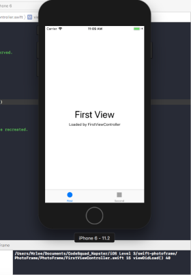

# 사진액자 앱
## 시작하기 - Tabbed App 템플릿 step1
* 최초 Tabbed App 프로젝트 생성, git의 issue, 프로젝트 설정. 사진앱 프로젝트를 시작하기위한 기본작업 완료.

<br>> step1_firstTapView_Screen_shot 17.12.21
<br>


<br>> step2_SecondTapView_Screen_shot 17.12.21
* 콘솔 창엔 프로그램 요구사항인 ```print(#file, #line, #function, #column)```가 출력되고있다.

* [UITapBar와 UITapBarController의 차이](http://llldddjjj.tistory.com/entry/iOSUITapBar%EC%99%80-UITapBarController%EC%9D%98-%EA%B0%84%EB%8B%A8%ED%95%9C-%EC%B0%A8%EC%9D%B4)

## IBOutlet step2
* UILabel의 여러가지 속성을 변경해보았다. 
```swift
self.photoLable.text = "Napster"
self.photoLable.font = UIFont.systemFont(ofSize: 50)
self.photoLable.textColor = UIColor.brown
self.firstDescription.text = "Napster의 사진액자 입니다. 반갑습니다."
self.firstDescription.textColor = UIColor(red: CGFloat(255), green: CGFloat(255), blue: CGFloat(102), alpha: CGFloat(20))
self.firstDescription.backgroundColor = UIColor.gray
```

<br>
> Step2의 UILabel을 이용하여 변경한 모습. 

## IBAction step3
* UIButton의 IBAction을 사용해보았다. IBAction은 유저가 버튼을 눌렀을때 메소드를 생성하여 그 메소드를 실행하게 하는데 다음의 특징을 가진다.

    * 버튼에 액션을 여러개 추가할 수 있을까?
    <br>한버튼에 여러가지 액션을 추가할 수 있다.(확인완료)
    * 버튼이 여러일 때 하나의 액션에 추가할 수 있을까?
    <br>여러번튼에 하나의 액션을 등록하는것도 가능하다.(확인완료)

* 버튼을 눌렀을때 Label의 변화를 주었다. 17.12.21
* Click Before<br>


* Click After<br>


## Scene과 Segue step4
* Button을 눌렀을때, 다음 Scene(ViewController)로 연결되는 Segue 셋팅한다.


## ViewController 프로그래밍 step5
* Button을 눌러서 연결되는 Scene에 ViewController Class 연결, 그리고 연결을 바탕으로 화면이 그려질때 화면 생명주기에 맞추어 메소드들이 호출되는 관계를 알아봄.
* Segue없이 코드로 View를 호출하는 방법을 학습.


## Container ViewController step6
* Navigation Controller를 추가하여 화면 변환 적용.
* 뷰컨트롤러 컨테이너 동작을 이해한다.
* 뷰컨트롤러 컨테이너는 또 어떤 클래스가 있는지 찾아보고 학습한다.


## 다양한 Container View들
 Container View는 다음과 같은 종류가 있다. 그중에 하나가 UINavigationController이다.
 * Collection Views
 * Table Views
 * UIStackView
 * UIScrollView<br>
----

<t>1. Collection Views<br>
애플 공식문서의 설명은 다음처럼 나와있다.
> Display nested views using a configurable and highly customizable layout.

커스터마이즈 할 수 있는 특정한 레이아웃을 사용하는 중첩된 뷰들을 보여준다. 말그대로 컬렉션 뷰이다.(사진첩 을 생각하면 쉽게 이해할 수 있다.)<br>

<t>2. TableView<br>
> Display data in a single column of customizable rows.
  
테이블뷰 또한 우리가 익히 알 고 있는 설정창을 대표로 이야기 할 수 있다.

<t>3. StackView<br>
> A streamlined interface for laying out a collection of views in either a column or a row.

처음보는 친구다. iOS 9.0이상에서 생긴 녀석이다. 보통의 뷰안에 여러 뷰들을 나열하여 표현할 수 있는 친구인것 같다. 하나의 뷰안에 여러 뷰들이 있을때 좀더 손쉽게 관리해주는 class이다. 

<t>4. UIScrollView<br>
> A view that allows the scrolling and zooming of its contained views.

스크롤뷰는 테이블뷰와 텍스트뷰를 포함 하고 있는 슈퍼클래스이다.
* 내비게이션 컨트롤러가 있을 경우와 없을 경우 화면 전환 동작이 어떻게 다른지, 화면들 포함관계가 있는지 학습한다.
## NavigationController와 아닌경우!
* 내비게이션 컨트롤러가 있을 경우와 없을 경우 화면 전환 동작이 어떻게 다른지, 화면들 포함관계가 있는지 학습한다.<br>
* dismiss 사용시
```
/GreenViewController.swift 27 viewWillDisappear 40
/RedViewController.swift 26 viewWillAppear 40
/RedViewController.swift 29 viewDidAppear 40
/GreenViewController.swift 30 viewDidDisappear 40
```
* Navigation Controller사용시, 아론 힐리가스의 iOS프로그래밍(244page)
```
/GreenViewController.swift 27 viewWillDisappear 40
/RedViewController.swift 26 viewWillAppear 40
/GreenViewController.swift 30 viewDidDisappear 40
/RedViewController.swift 29 viewDidAppear 40
```
네비게이션 컨트롤러를 사용하면 뷰의 생명주기는 달라진다. 네비게이션컨트롤러로 연결된 뷰는 전의 뷰가 사라지기전까지 완전 로드를 보장하지않는다. 대신 dismiss로 호출된 뷰는 이전뷰가 didDisappear되기 전까지 새로운 뷰의 호출을 보장한다음 사라진다.는 차이가 있음.<br>
    * **데이터의 변경을 유지하기위해 위와같은 순서로 실행된다.**
* 내비게이션 컨트롤러 관련 메서드가 왜 push / pop 인지 학습한다.
* UINavigationController<br>
 UINavigationController는 스택에서 관련 정보를 나타내는 뷰 컨트롤러의 배열을 유지한다. UIViewController가 스택 꼭대기에 있을때 그 컨트롤러의 view가 보인다.
 UINavigationController의 인스턴스를 초기화할 때, 인스턴스에 UIViewController를 전해줘야한다. 이때, UIViewController가 내비게이션 컨트롤러의 viewControllers 배열에 추가되고, 내비게이션 컨트롤러의 뷰 컨트롤러가 된다. 그래서 루트 뷰 컨트롤러는 항상 스택의 맨 바닥에 놓이고, pop, push연산으로 view들을 관리한다.
