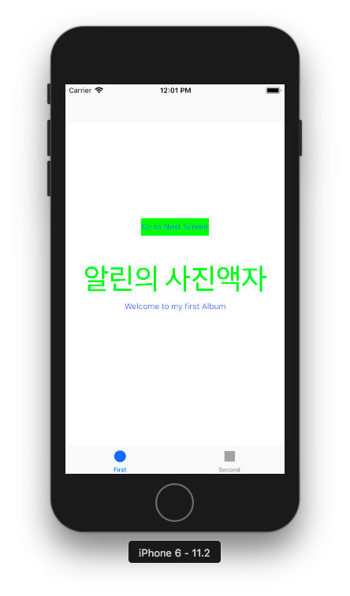

## 미션 진행사항
### Step1 - 시작하기 - Tabbed App 템플릿
#### viewDidLoad()
- Question: 자동 생성된 ViewController 클래스 viewDidLoad() 함수에서 print(#file, #line, #function, #column) 코드를 추가하고 실행하면 콘솔 영역에 무엇이 출력되는지 확인한다.
- Answer: 2018.03.09 16:50
  
#### UITabBarController 와 UITabBar
- Question: 애플 UIKit View Management 클래스 중에서 UITabBarController 와 UITabBar에 대해 학습한다.
- Answer: [UITabBarController 와 UITabBar에 대한 내용 정리 링크](https://jinios.github.io/ios/2018/03/09/difference_UITabBar_UITabBarController/)

### Step2 - IBOutlet
> Assistant Editor Mode에서 레이블을 선택하고 `control + 드래그`로 ViewController 코드에 IBOutlet으로 연결한다.

- 구현 화면: 2018.03.11 19:20
  

#### UILabel 클래스 속성 (계속 추가할 예정)
  - `vat text: String? { get set }`
  - `var textColor: UIColor! { get set }`
    - [Custom textColor를 사용하는 방법 정리](https://jinios.github.io/ios/2018/03/11/ios_color_literal/)
  - `var font: UIFont! { get set }`
    - font속성 사용예시 : `labelName.font = labelName.font.withSize(15)`

### UI
User Interface의 약자로, 사용자와 직접 상호작용 하는 접점을 뜻한다. 모바일 앱 개발에서는 사용자가 보는 화면이라고 생각하면 됨.

#### Interface Builder & Storyboard
***Interface Builder:*** Xcode에서, 앱의 UI요소들을 visualized해서 컨트롤 할 수 있도록 해주는 인터페이스 빌더.

***Storyboard:*** device상에서 사용자에게 나타나는 UI를 보여주는 파일. <br/>템플릿으로부터 만들어진 모든 프로젝트들은 Main.storyboard파일과 iOS앱의 경우 LaunchScreen.storyboard파일이 있다.(앱이 런칭될 때 화면) 이 스토리보드 파일은 뷰컨트롤러와 뷰를 가지고있는데 스토리보드 파일 내의 UI요소들을 확인하면서 인터페이스 빌더를 통해 이를 변경/확인할 수 있다.

#### IBOutlet과 IBAction의 관계


- ***IBOutlet과 IBAction:***
  - 화면(View)와 컨트롤러를 연결하고 매핑시키는 작업을 할 때 사용한다.
  - 사용자는 View와 상호작용한다.
  - IBAction은 사용자를 통해 발생한 이벤트를 감지해서 Controller에 메시지를 보낸다.
  - 컨트롤러는 특정 로직을 수행하고 뷰에 변경사항이 있으면 어떤 것을 변경하라는 지시를 내린다.
  - IBOutlet은 처리 결과를 View단에 알려서 원하는 동작을 이끌어낸다.


`IBOutlet(ex. 코드와 연결된 버튼) -> 코드는 그 버튼을 조정할 수 있게 됨 -> IBAction(버튼을 동작시켰을때 어떻게 변화해야하는지에 대한 동작을 담고있는 메소드)`
스토리보드에 있는 UI요소들과 연결하고싶은 속성을 코드로 정의했다면 아래의 키워드를 이용해서 연결시킬 수 있다.
  - ***IBOutlet :***
  인터페이스 빌더에서 사용되는 타입 한정자로, 코드가 UI 엘리먼트에 메시지를 보낼 수 있도록 하기 위한 연결점같은 개념이다. 속성이나 객체변수를 선언할때 객체 변수의 앞에 쓴다.
    ```swift
    @IBOutlet weak var photoLabel: UILabel!
    ```
  - ***IBAction:***
  인터페이스 빌더에서 사용되는 타입 한정자로, 메소드를 UI 엘리먼트와 코드 간의 연결점해주기 위한 개념이다. 메소드 선언 시 `void` 리턴타입 대신 사용한다.
    ```swift
    @IBAction func likedThis(sender: UIButton) {
      ...
    }
    ```
  [IBOutlet과 IBAction 참고링크](https://thatthinginswift.com/ibaction-and-iboutlet/)


### Step3 - IBAction
> First Scene에 버튼(UIButton)을 추가하고 IBAction으로 연결한다.

- 구현화면 : 2018.03.12 14:30
  - 버튼 클릭 전
    
  - 버튼 클릭 후
    


#### 버튼에 IBAction을 추가할 때 이벤트(Event) 종류


- touchDown
  - A touch-down event in the control.

- touchDownRepeat
  - A repeated touch-down event in the control; for this event the value of the UITouch tapCount method is greater than one.

- touchDragInside
  - An event where a finger is dragged inside the bounds of the control.

- touchDragOutside
  - An event where a finger is dragged just outside the bounds of the control.

- touchDragEnter
  - An event where a finger is dragged into the bounds of the control.

- touchDragExit
  - An event where a finger is dragged from within a control to outside its bounds.

- touchUpInside
  - A touch-up event in the control where the finger is inside the bounds of the control.

- touchUpOutside
  - A touch-up event in the control where the finger is outside the bounds of the control.

- touchCancel
  - A system event canceling the current touches for the control.

- valueChanged
  - A touch dragging or otherwise manipulating a control, causing it to emit a series of different values.

- primaryActionTriggered
  - A semantic action triggered by buttons.

- editingDidBegin
  - A touch initiating an editing session in a UITextField object by entering its bounds.

- editingChanged
  - A touch making an editing change in a UITextField object.

- editingDidEnd
  - A touch ending an editing session in a UITextField object by leaving its bounds.

- editingDidEndOnExit
  - A touch ending an editing session in a UITextField object.

#### 버튼에 액션을 여러개 추가할 수 있을까?
  - 연결은 가능하지만, 메소드 내부에서 절차적으로 실행되기때문에 결과적으로 view에는 가장 마지막 코드만 적용되어 보여지게된다.
#### 버튼이 여러일 때 하나의 액션에 추가할 수 있을까?
  - 하나의 메소드를 재활용이 가능한 구조로 설계하여 여러 객체에 사용하게 만들 수 있는 것처럼 마찬가지로 여러 IBOutlet과 연결이 가능하지만, 만약 IBOutlet의 종류마다 다르게 동작하도록 만들고싶다면 IBAction메소드 내부에서 `switch-case`를 사용해서 만들 수 있다. [(참고링크)](https://stackoverflow.com/questions/37870701/how-to-use-one-ibaction-for-multiple-buttons-in-swift)


### Step4 - Scene과 Segue
> 스토리보드 구성 요소에 대해 학습하고 새로운 Scene과 Segue를 추가한다.

- 구현 화면 2018.03.13 14:10


### Segue
Segue는 앱 인터페이스의 흐름이다. 즉 segue는 앱의 스토리보드 파일에서 두개의 뷰 컨트롤러 간 변환되는 과정 자체를 나타낸다고 볼 수 있다. Segue의 시작점을 버튼이나 table row, 또는 segue를 동작하게 하는 제스쳐이고, 종료지점은 보여주고 싶은 뷰 컨트롤러이다.
Segue는 항상 새로운 뷰 컨트롤러를 보여주지만 unwind segue를 이용하여 뷰 컨트롤러를 보이지 않게(화면에서 없어지게- 만약 현재 뷰 컨트롤러를 보이지 않게 만들때, 새로운 뷰 컨트롤러를 덮어서 안보이게 하는 것이 아니라 현재 뷰를 화면에서 없앰으로서) 만들 수 있다.
[참고링크](https://developer.apple.com/library/content/featuredarticles/ViewControllerPGforiPhoneOS/UsingSegues.html)


### Segue action

***Show*** - Pushes the destination view controller onto the navigation stack, sliding overtop from right to left, providing a back button to return to the source - or if not embedded in a navigation controller it will be presented modally
Example: Navigating inboxes/folders in Mail

***Show Detail*** - For use in a split view controller, replaces the detail/secondary view controller when in an expanded 2 column interface, otherwise if collapsed to 1 column it will push in a navigation controller
Example: In Messages, tapping a conversation will show the conversation details - replacing the view controller on the right when in a two column layout, or push the conversation when in a single column layout

***Present Modally*** - Presents a view controller in various animated fashions as defined by the Presentation option, covering the previous view controller - most commonly used to present a view controller that animates up from the bottom and covers the entire screen on iPhone, or on iPad it's common to present it as a centered box that darkens the presenting view controller
Example: Selecting Touch ID & Passcode in Settings

***Popover Presentation*** - When run on iPad, the destination appears in a popover, and tapping anywhere outside of this popover will dismiss it, or on iPhone popovers are supported as well but by default it will present the destination modally over the full screen
Example: Tapping the + button in Calendar

***Custom*** - You may implement your own custom segue and have control over its behavior

#### Segue and IBAction
Segue 객체를 만들고 IBAction과 연결 할 수 있다. 스토리보드에서 연결하고자 하는 시작점의 view와 도착점의 view를 `control + 드래그`로 연결해서 segue를 만든다.

시작점의 ViewController코드에서 아래와 같이 `performSegue()`메소드를 사용한다.
```swift
  @IBAction func moveToNavy(_ sender: Any) {
     performSegue(withIdentifier: "toNavy", sender: self)
  }
```
- 파라미터 `withIdentifier:`는 스토리보드에서 segue를 만들고 Attributes Inspector에서 identifier로 설정해준 문자열을 입력하면 된다.

[참고링크](https://www.youtube.com/watch?v=WfT-hJXuiys)

### Step5 - ViewController 프로그래밍
> 스토리보드 구성 요소와 클래스 코드와 연결해서 동작을 확장한다.

- 구현 화면 : 2018.03.13 19:00
- FirstViewController > BlueViewController > NavyViewController > FirstViewController
- 
- 
- 
- 


### 뷰 생명주기
뷰 생명주기의 기본 flow는
- ***viewDidLoad > viewWillAppear > viewDidAppear > viewWillDisappear > viewDidDisappear***
(단, viewDidLoad는 rootView이기때문에 한번만 호출되는 것이 일반적이다. [참고링크](http://zeddios.tistory.com/43))

FirstView - BlueView - NavyView - FirstView로 연결된 flow일때, `print(#file, #line, #function, #column)`로 콘솔에 표시
```
.../FirstViewController.swift 27 viewDidLoad() >> 첫번째 뷰 로드
.../FirstViewController.swift 48 viewWillAppear >> 첫번째 뷰가 보일 것이다.
.../FirstViewController.swift 52 viewDidAppear >> 첫번째 뷰가 보임.  
------- 버튼 터치 ------- (FirstView -> BlueView)
.../BlueViewController.swift 15 viewDidLoad() >> 첫번째 뷰에서 다음버튼 터치 순간실행. BlueViewController 차례시작, 다음(blue)뷰가 로드되고
.../FirstViewController.swift 56 viewWillDisappear >> 이전(first)뷰가 사라질 준비
.../BlueViewController.swift 28 viewWillAppear >> 다음 뷰가 로드될 준비
.../BlueViewController.swift 32 viewDidAppear >> 다음 뷰 나타남
.../FirstViewController.swift 60 viewDidDisappear >> 이전 뷰 사라짐
------- 버튼 터치 ------- (BlueView -> NavyView)
.../NavyViewController.swift 15 viewDidLoad() >> BlueView에서 다음 버튼 터치 순간실행. NavyView차례 시작. NavyView 로드
.../BlueViewController.swift 45 viewWillDisappear >> BlueView는 사라질 예정
.../NavyViewController.swift 32 viewWillAppear >> NavyView가 나타날 준비
.../NavyViewController.swift 36 viewDidAppear >> NavyView가 나타남
.../BlueViewController.swift 49 viewDidDisappear >> BlueView 사라짐
------- 버튼 터치 ------- (NavyView -> FirstView)
.../FirstViewController.swift 27 viewDidLoad() >> FirstView 로드
.../NavyViewController.swift viewWillDisappear >> NavyView가 사라질 예정
.../FirstViewController.swift 48 viewWillAppear >> FirstView가 나타날 준비
.../FirstViewController.swift 52 viewDidAppear >> FirstView가 나타남
.../NavyViewController.swift 44 viewDidDisappear >> NavyView 사라짐

```
- **중요** : 다음`(Next)`뷰는 이전`(Previous)`뷰가 사라진 다음에 나타나는 것이 아니라, **다음 뷰가 나타나고(viewDidAppear) 그 이후에 이전 뷰가 사라진(viewDidDisappear)다!**
- **비교** : 앞서말한 [참고링크](http://zeddios.tistory.com/43)의 설명과 달리 FirstViewController가 NavyViewController로부터 재호출 될때 viewDidLoad가 한번 더 호출 된 이유는, FirstViewController를 호출할때 `instantiateViewController(withIdentifier:)`를 사용했기 때문인 것 같다. <br/>이 메서드는 호출하고싶은 뷰 컨트롤러의 인스턴스를 호출할때마다 만든다는 특징이 있다.(This method creates a new instance of the specified view controller each time you call it. [참고](https://developer.apple.com/documentation/uikit/uistoryboard/1616214-instantiateviewcontroller))

#### 뷰 생명주기를 잘 알아야 하는 이유
뷰의 상태변화에따라 호출되는 메소드를 잘 파악해놓으면 뷰가 표시되고 사라질'타이밍'에 처리하고 싶은 동작들을 '어디에 넣어줘야 할지'결정할 수 있다. 예를들어,
- 특정 화면에 진입했을때 로그인이나 권한 여부를 체크하고 싶을때 어떻게 작성하는지?
- 화면이 표시될때마다 최신 데이터로 업데이트하고싶은데 어디에 해야하는지?
- 사용자가 저장 버튼을 누르지 않아도 지금 화면 상태를 다음에도 유지하고 싶은데 어디에 어떻게 구현해야하는지?
와 같은 문제들을 해결할 수 있다.


### 콜백함수
- 사용자에 의해 호출되는 것이 아닌 특정 함수에서 호출돼 필요시 코드 내에서 사용되는 함수.
- 호출된 함수를 알려주어, 다른 프로그램 또는 다른 모듈에서 함수를 호출 하게 하는 방법


### Step6 - Container ViewController

스토리보드에서 First Scene을 선택하고, Editor > Embed In > Navigation Controller 항목을 선택한다. - FirstScene을 루트 뷰 컨트롤러로 설정(UINavigationController를 초기화할때 인스턴스에 UIVIewController를 전해줘야하는데, 이 UIVIewController가 내비게이션 컨트롤러의 viewControllers 배열에 추가되고, 루트 뷰 컨트롤러가 된다.)

#### UINavigationController
> 스택, 뷰 컨트롤러의 배열을 가진다

- 내비게이션 컨트롤러가 있을 경우와 없을 경우 화면 전환 동작이 어떻게 다른지, 화면들 포함관계가 있는지 학습한다.
- 내비게이션 컨트롤러 관련 메서드가 왜 push / pop 인지 학습한다.


항상 두 개의 하위 뷰를 가지는데, UINavigationBar와 topViewController의 view다.
스택 구조로 뷰 컨트롤러를 가지기 때문에, push, pop단어가 메서드 이름에 들어간다.
뷰 컨트롤러가 스택에 푸시되면 컨트롤러의 view가 우측에서부터 미끄러지듯이 화면에 나타난다.
스택이 팝 될때는 (마지막 항목, 스택의 맥 위의 - presenting 뷰 컨트롤러가 제거) view는 우측으로 사라진다. 즉 topViewController의 view가 사용자에게 보여지는 것이다.

### Step6 - Container ViewController
> 내비게이션 컨트롤러(Navigation Controller)를 Embed 시켜서 동작하도록 개선한다.

- 구현 사항: 2018.03.15 18:00
-


## 프레임워크
> 프레임워크는 기본적으로 어떤 것을 이루는 뼈대, 구조를 의미하는데, 소프트웨어에서의 프레임워크는 애플리케이션 제작을 빠르고 편리하게 할 수 있도록 미리 뼈대를 이루는 각종 코드를 제작하여 모아둔 것. 예를들어 버튼용 클래스를 미리 만들어둔 UIKit프레임워크를 사용하면 내가 따로 버튼을 구현할 필요가 없다!

UIXXX형식으로 시작하는 클래스는 UIKit 프레임워크가 제공하는 클래스.
따라서 UIApplication, UIButton등은 스위프트 언어 자체에서 제공하는 것이 아닌 프레임워크를 통해 제공되는 클래스이다.
따라서 소스코드 상단에 특정 프레임워크를 반입시켜주는 `import UIKit`을 기재해주는것

예를들어, 앱을 만들기 위해 필요한 프레임워크는 UIKit뿐만 아니라 파운데이션프레임워크(네트워크나 날짜연산 기능 처리), 코어 애니메이션 프레임워크(애니메이션 처리), 웹과 관련된 기술 구현(웹킷 프레임워크), 주소록 관련은 AddressBook UI 프레임워크, 사용자 알림을 위해서는 UserNotifications 프레임워크 필요
이 각각의 계층을 거슬러 올라가면 코코아터치라는 하나의 거대한 프레임워크가 나타남. 앱을 만들고 실행할 때 필요한 iOS기반 기술들은 모두 코코아터치 프레임워크를 통해 구현됨


## 코코아 터치 프레임워크
> 애플환경에서 터치 기반의 애플리케이션을 제작하기 위한 도구들의 모음. 이들 중에서 가장 대표적인 것이 User Interface이다. 다양한 앱들이 서로 다른 내용과 기능에도 불구하고 화면 구성에서 일정 수준 이상의 유사성을 갖는 것 또한 이들이 모두 동일한 유저 인터페이스 도구를 이용하여 화면을 구현하기 때문이다.

코코아터치 프레임워크중에는 앱을 만드는데에 필수 요소가 아닌 것들이 있다. (ex. iAd Framework, 앱 안에 광고를 실을 수 있게 지원)
이런 프레임워크는 사용을 위해서 별도 설정과정을 거치게 되어있는데, UIKit와 Foundation 프레임워크는 자체만으로 방대하고 필수적인 도구들이라서 코코아터치 프레임워크를 이루는 주 프레임워크라고 간주한다.
- Foundation 프레임워크 : 기본 데이터 형식, 컬렉션 및 앱의 기본 객체와 기반 기술을 제공하는 역할 (앱의 내부적으로 돌아가는 기능)
- UIKit 프레임워크 : 유저 인터페이스 도구를 통해 iOS앱을 구현할 수 있는 방법을 제공 (iOS앱으로서의 특징적인 부분 담당)

#### 코코아 프레임워크 / 코코아 터치 프레임워크
코코아터치 프레임워크는 기존 매킨토시 환경에서의 개발도구인 코코아 프레임워크를 기반으로 만들어졌지만,(실제로도 많은 부분을 공유하고 있다.) 데스크톱 환경과 터치 환경용 인터페이스는 완전히 다르기때문에 코코아에서 사용되는 앱킷프레임워크는 UIKit 프레임워크로 대체되었다. 현재 macOS를 제외한 iOS, watchOS, tvOS는 코코아터치프레임워크를 기반으로 만들어진다.


### iOS UI의 표현구조
iOS는 항상 디바이스 스크린에 꽉 들어차는 하나의 화면만을 표시할 수 있으며, 다른 프로그램이 실행되면 기존의 화면이 내려가고 그 자리를 새로운 화면이 대신 채운다. 이런 과정은 윈도우와 뷰 객체가 사용된다.
- 윈도우 : iOS 스크린을 빈틈없이 채우기 위한 객체로, 항상 유저 인터페이스 표현 계층의 최상위에 위치함. 뷰의 일종이지만 직접 콘텐츠를 가지지는 않으며 콘텐츠를 가진 뷰를 내부에 배치하여 화면에 출력하는 역할을 한다. 화면이 전환되더라도 윈도우 객체는 전환되지 않으며 내부에 배치된 뷰의 콘텐츠만 변경됨
- 뷰 : 콘텐츠를 담아 이를 스크린상에 표시하고, 사용자의 입력에 반응. 윈도우의 일부를 자신의 영역으로 정의하고, 여기에 필요한 콘텐츠를 채워넣어 스크린에 나타냄. 동시에, 윈도우로부터 전달된 사용자의 입력에 반응하여 그에 맞는 결과처리
- 윈도우 내부에는 수많은 뷰가 포함되어있다.
- 윈도우와 뷰 사이는 뷰 컨트롤러를 통해 연결됨.
- 뷰 컨트롤러는 뷰의 계층 관리, 윈도우에 전달
- 윈도우가 뷰를 직접 참조하지 않고 뷰 컨트롤러가 그 사이를 중계하는 구조 - 윈도우는 뷰 컨트롤러를 통해 제공되는 뷰를 읽어들여 표현할 뿐, 뷰를 직접 관리하지 않아도 됨.
- 윈도우 객체는 하나의 뷰 컨트롤러를 루트 뷰 컨트롤러로 지정하여 참조
- 루트 뷰 컨트롤러로 지정되지 못한 나머지 뷰 컨트롤러들은 루트 뷰 컨트롤러의 관리대상으로 연결되거나 다른 방식으로 이어짐. 다만 이들은 직접적인 윈도우 객체의 관리대상이 아니며 윈도우 객체는 항상 루드 뷰 컨트롤러만을 참조한다.
- 스토리보드를 편집하는 대부분의 뷰 컨트롤러들은 각자가 하나씩의 화면을 담당하여 콘텐츠를 표현하고 뷰를 관리한다. (Scene)
- A,B 두 개의 씬으로 이루어진 앱이 있다면 이는 각각의 씬을 담당하는 뷰 컨트롤러가 있다고 생각할 수 있다.

### 컨테이너 뷰 컨트롤러 / 뷰 컨트롤러
- 콘텐츠 뷰 컨트롤러 : 씬을 담당하고 콘텐츠를 표시하는 뷰 컨트롤러
- 콘텐츠 뷰 컨트롤러간의 관계를 담당하는 컨트롤러도 있다. **바로 컨테이너 뷰 컨트롤러.** 예로 내비게이션 컨트롤러나 탭 바 컨트롤러, 페이지 컨트롤러 등이 있음.
- 컨테이너 뷰 컨트롤러의 일부는 다른 뷰 컨트롤러의 관리를 위해 고유한 역할을 하는 특정 객체를 화면에 부분적으로 추가하는데, 내비게이션 바나 탭 바 등이 대표적인 예시임
- 뷰 계층구조 : 뷰 컨트롤러 내부는 수많은 뷰들로 이루어진다. 이들 뷰는 다른 뷰 객체를 포함하는 컨테이너의 역할도 수행할 수 있다. 이를 뷰의 계층구조라고한다 (superView - subview)
- 루트 뷰 : 뷰 계층구조의 최상위에는 하나의 뷰(rootView) 존재. 일반적으로 화면을 전체 채울 수 있는 크기를 유지함
- 일반 뷰 컨트롤러에서는 View객체가 루트 뷰 역할을 담당한다.
- 루트 뷰 내부에는 각자의 크기와 영역, 표현할 콘텐츠를 가진 여러 개의 서브 뷰가 추가되는데, 일부 뷰의 영역은 서로 겹치기도 한다. 루트 뷰는 이와 같은 서브 뷰들을 모아 하나의 전체 뷰를 구성하고, 뷰 컨트롤러를 통해 이를 윈도우에 전달.


### 뷰 컨트롤러
> 뷰 관리, 화면과 데이터 사이의 상호작용 관리 (윈도우에서 이벤트 전달 > 내부 구현 로직 실행 > 로직 실행 결과를 화면에 표시)

### 뷰의 관리
뷰 컨트롤러의 주요 역할 : 뷰의 계층을 관리하는 역할
- 뷰 컨트롤러에는 컨트롤러 내부에 있는 모든 객체의 대장격인 루트 뷰가 하나 존재함
- 일반 뷰나 테이블뷰, 컬렉션 뷰 등 다양한 뷰가 루트 뷰로 지정 될 수 있으며, 스토리보드에서 뷰 컨트롤러 위에 배치하는 대부분의 객체들은 루트 뷰에 추가되는 서브뷰라고 할 수 있음
- 뷰 컨트롤러는 루트 뷰만을 참조하며, 루트 뷰 아래에 있는 뷰들은 각자 자신보다 하위에 있는 뷰를 참조하고 있는 체인같은 구조이기때문에, 뷰 컨트롤러가 루트 뷰만을 참조해도 모든 뷰에 접근 할 수 있다.


### iOS에서의 화면 전환 개념
- 뷰 컨트롤러 뷰 위에 다른 뷰를 가져와 뷰 바꿔치기 : 컨테이너 뷰 컨트롤러가 사용하는 방식, 혹은 일부 특수한 앱
- 뷰 컨트롤러에서 다른 뷰 컨트롤러를 호출하여 화면전환
- 내비게이션 컨트롤러를 사용하여 화면전환
- Segue 사용하여 화면전환

첫번째를 제외한 나머지 방법들은 뷰 컨트롤러를 호출하는 방식으로 동작함. 전환할 화면을 담당하는 뷰 컨트롤러의 인스턴스를 생성하고 기존의 화면 위에 덮는다.
따라서 **현재 화면 위에 새로운 화면이 얹어져서 참조 관계가 성립** 되는 것이지, **새로운 화면이 현재 화면을 대체한다고 생각하면 안됨!**
이 같은 특성으로 기존 화면과 새로운 화면은 참조 관계가 성립되는데, 화면 전환 방식에 따라 서로 직접 참조가 가능하거나 화면 전환을 관리하는 전담 객체를 통해서 간접적으로 참조하기도 함
- 다음 화면으로 이동하는 방법과 이전 화면으로 되돌아가는 방법이 다름
- 화면 전환 방식에 따라 이전 화면으로 되돌아가는 방법이 다름
  ex) present메소드로 전환했으면 dismiss로 돌아가야함

### 관련 이슈 - VC close하기
> closeButtonTouched()메소드와 연결된 버튼을 터치했을때 에러 / 아무 동작도 일어나지 않았던 상황 정리

1. 첫번째(FirstVC) 화면에서 두번째(BlueVC)로 가는 동작은 Segue로 연결되어있다.
-> `pop`으로 두번째 화면을 닫는다 > 첫번째 FirstVC로 잘 되돌아간다.
```Swift
    @IBAction func closeButtonTouched(_ sender: Any) {
        self.navigationController?.popViewController(animated: true)
    }
```
2. 두번째(BlueVC)에서 세번째 (NavyVC)로 가는 동작은 코드로 작성했다.
```swift
    @IBAction func newNextButtonTouched(_ sender: Any) {
        if let navyVC = self.storyboard?.instantiateViewController(withIdentifier: "navyView") {
            self.present(navyVC, animated: true, completion: nil)
        }
    }
```
  -> 위에서 설명한대로 `present()`로 구현했다면 `dismiss`를 사용했어야했는데, BlueVC에서처럼 pop을 사용했더니 아무 동작도 하지 않고 계속 NavyVC만 표시되는 상태였는데, `present()`로 뷰를 띄웠으니 **pop할 뷰가 없어서 아무 동작도 하지 않았던 것.**
```swift
  // Before Code
    @IBAction func closeButtonTouched(_ sender: Any) {
        self.navigationController?.popViewController(animated: true)
    }
  // After Code
    @IBAction func closeButtonTouched(_ sender: Any) {
        self.dismiss(animated: true, completion: nil)
    }
```
#### JK의 질문 + 알아 본 것들

- ***내비게이션뷰컨트롤러에 push 한 경우에 dismiss 하면 어떻게 되나요?***
  - BlueVC에서 NavyVC로 화면을 전환할때 `present`에서 `push`사용으로 메소드 수정
  - NavyVC에서 `dismiss` 실행하니 아무 변화도 일어나지 않음. 자신이 `push`된 메소드이므로 스택에 들어가게됐는데, 스택에 들어가면 pop하지 않는이상 dismiss는 맞는 명령이 아니므로 아무 일도 일어나지 않음.
  - ***`present`메소드와 `push`의 차이***
    - `present`: Presents a view controller modally. 만약 스토리보드에서, 이전 뷰에서 segue 연결 없이 다음 뷰를 present한다면 둘은 아무 관계가 없고 그저 두 번째 뷰의 형태만 첫번째 뷰 위에 띄우는 방식. 프레젠테이션 방식으로 화면 전환 시, iOS 시스템은 두 뷰 컨트롤러 사이에 참조할 수 있는 포인터를 생성하여 서로 참조할 수 있게 한다.
    - Modal 방식: 현재 뷰 컨트롤러에서 이동할 대상 뷰 컨트롤러를 직접 호출하여 표시하는 방식으로, 프레젠테이션 방식이라고 함.
    - `push`: UINavigationController가 가지는 stack에 (순서대로라면) 첫번째 뷰가 스택에 쌓이고 두번째 뷰가 그 위에 쌓인다. 두 뷰는 스택의 순서에 따르는 순서를 가지게 됨.
  - [Pushing, Popping, Presenting, & Dismissing ViewControllers](https://medium.com/@felicity.johnson.mail/pushing-popping-dismissing-viewcontrollers-a30e98731df5)
- ***self.dismiss()와 present했던 곳에서 nextViewController.dismiss() 하는 것과 어떤 차이가 있을까요?***
  - present했던 곳 : FirstViewController , presentingViewController(ancestor)
  - BlueViewController에 예시로 두 가지 닫기 버튼(A,B)을 만듦

```swift
// FirstViewController.swift

  @IBAction func closeButtonA(_ sender: Any) {
   self.dismiss(animated: true, completion: {(print("self.dismiss BLUE View"))})
  }

  @IBAction func closeButtonB(_ sender: Any) {
    self.presentingViewController?.dismiss(animated: true, completion: {(print("first.dismiss BLUE View"))})
  }
  // BlueVC의 presenting에서 dismiss(), 즉 FirstVC.dismiss()를 코드로 기재한 것
  // >> 이렇게 한다고해서 FirstVC가 없어지는게 아니었다!
```
- **실행결과 두 메소드는 모두 똑같이 동작했으며 completion처리또한 문제 없었다.**
- `self.dismiss`의 의미는 "나 자신을 없앤다"는 의미가 아니다.
- 만약 두번째 뷰에서 `self.dismiss`를 하면,
  - 내부적으로는 UIKit이 현재 뷰(두번째 뷰)의 ancestor인 **(첫번째 뷰)에게** *'너가 띄우고 있는 presented를 없애라'* 는 명령을 보낸다. 즉, 내부적으로는 위의 closeButtonB()에 써있는 코드대로 동작한다는 것이다.
- closeButtonA와 B의 차이는 메서드 A보다 B가 좀 더 presenting과 presented의 참조관계를 코드적으로 명확히 써줬다는 차이일뿐, 동작은 동일하다.
- **뷰 생명주기와 completion동작 실행시점 비교**
```
<< closeButtonB() 실행 >>

FirstViewController.swift 27 viewDidLoad()
FirstViewController.swift 64 viewWillAppear
FirstViewController.swift 68 viewDidAppear
BlueViewController.swift 15 viewDidLoad()
FirstViewController.swift 72 viewWillDisappear
BlueViewController.swift 51 viewWillAppear
BlueViewController.swift 55 viewDidAppear
FirstViewController.swift 76 viewDidDisappear
FirstVC 에서 BlueVC로 뷰 전환
BlueViewController.swift 59 viewWillDisappear
FirstViewController.swift 64 viewWillAppear
FirstViewController.swift 68 viewDidAppear
BlueViewController.swift 63 viewDidDisappear
closeButtonB BLUE View


<< closeButtonA() 실행 >>

FirstViewController.swift 27 viewDidLoad()
FirstViewController.swift 64 viewWillAppear
FirstViewController.swift 68 viewDidAppear
BlueViewController.swift 15 viewDidLoad()
FirstViewController.swift 72 viewWillDisappear
BlueViewController.swift 51 viewWillAppear
BlueViewController.swift 55 viewDidAppear
FirstViewController.swift 76 viewDidDisappear
FirstVC 에서 BlueVC로 뷰 전환
BlueViewController.swift 59 viewWillDisappear
FirstViewController.swift 64 viewWillAppear
FirstViewController.swift 68 viewDidAppear
BlueViewController.swift 63 viewDidDisappear
closeButtonA BLUE View

```

- ***dismiss나 pop하지 않고 Button을 누르면 창을 닫도록 하기 위해서 인터페이스 빌더에서 처리하는 방법은 무얼까요?***
  - 처음엔 마지막VC(시작점)에서 첫번째VC(도착지점)으로 가는 segue를 만들어서 언결했는데, 이렇게하면 **뷰가 진짜 첫번째로 돌아간게 아니라 그냥 첫번째 뷰가 하나 더 만들어져서 마지막 뷰 위에 뜨는 것 뿐이었다.(원하는 방법이 아님)**

  - 위의 방법과 달리 **인터페이스 빌더 내에서 `Exit`버튼에 연결하는 방법이 있다.**
    - destination ViewController에 아래의 코드를 추가한다. 메소드 명은 달라도 상관 없다.
    ```swift
    // FirstViewController.swift

    @IBAction func unwindToGlobal(segue: UIStoryboardSegue) {
        // this may be blank
    }
    ```
    - 출발지점 Viewcontroller에 버튼을 추가하고, 스토리보드에서 캔버스에 있는 Exit과 버튼을 연결한다. 연결과 동시에 모달 뷰가 뜨고 destination에 추가한 메소드가 보인다.
    

  - 동작 스크린샷은 아래와 같다.
  

  - 마지막에 뜬 FirstVC의 '알린의 사진액자'라벨 색이 변경된 것을 보니 제대로 unwind된 것이 맞다. (흰 배경: Start -> 남색 배경: Destination)


#### presentedViewController / presentingViewController
기준을 어디에 두느냐에 따라서 헷갈리기 쉬운데, A > B > C 세개의 뷰 컨트롤러가 있고 순서대로 present로 뷰를 띄운 상태일때, **B를 기준으로**,
- presenting: **B를 띄우고있는** 뷰 컨트롤러, A
- presented: **B가 띄우고있는** 뷰 컨트롤러, C

#### presentedViewController
> Instance property. 자신이 호출한 뷰 컨트롤러(child) 저장.
> 쉽게말해 1번, 2번 뷰가 있고 순서대로 호출했다면, 1번의 presentedViewController는 2번이 됨

The view controller that is presented by this view controller, or one of its ancestors in the view controller hierarchy.
When you present a view controller modally (either explicitly or implicitly) using the `present(_:animated:completion:)` method, the view controller that called the method has this property set to the view controller that it presented. If the current view controller did not present another view controller modally, the value in this property is nil.

#### presentingViewController
> Instance property. 자신을 호출한 뷰 컨트롤러(ancestor) 저장.
> 쉽게말해 1번, 2번 뷰가 있고 순서대로 호출했다면, 2번의 presentingViewController는 1번이 됨

The view controller that presented this view controller.
When you present a view controller modally (either explicitly or implicitly) using the `present(_:animated:completion:)` method, the view controller that was presented has this property set to the view controller that presented it. If the view controller was not presented modally, but one of its ancestors was, this property contains the view controller that presented the ancestor. If neither the current view controller or any of its ancestors were presented modally, the value in this property is nil.

[참고링크: Start from the Beginning 블로그](http://blog.naver.com/itperson/220983305936)

### Step7 - Second Scene 화면
> 탭바의 두 번째 화면 (Second Scene) 디자인을 변경하고 액자 앱을 동작을 구현한다.

- 구현 화면 : 2018.03.17 14:30
  - `다음`을 누르면 사진이 랜덤하게 변경


### UIImage & UIImageVIew
> UIImage: 이미지를 저장하고 관리하는 데이터 오브젝트
> UIImageVIew: 이미지를 display하는 오브젝트. **UIImage 클래스가 저장하고 관리하는 이미지 데이터를 뷰에 draw / display할 수 있도록 함.** (Image views let you efficiently draw any image that can be specified using a UIImage object.)

### contentMode
> contentmode는 뷰의 한 층에 있는 비트맵 이미지가 뷰 바운드에 변화가 일어났을때 어떻게 다르게 조정되는지에 대한 프로퍼티이다. 주로 리사이징에 많이 사용된다. 변화가 일어날때마다 콘텐츠를 redrawing하는 대신에, 이 프로퍼티를 이용하면 리사이징을 하거나(비율을 유지하거나 유지하지 않고), 뷰의 특정 위치에 위치시킬 수 있다.
> 만약 위의 설명과 달리 뷰의 콘텐츠를 redrawing하고싶다면 setNeedsDisplay()메소드를 호출해서 redrawing할 수 있다.
> **Image view는 contentMode 속성을 통해서 어떻게 이미지를 보여줄지 결정하게 된다.**


- content mode의 종류는 스토리보드의 유틸리티영역에서 `view - content mode`에서 볼 수 있다.
  - 
- 사용 코드 예시
```swift
  @IBOutlet weak var photoImageView: UIImageView!
  photoImageView.contentMode = .ScaleToFill  // UIViewContentMode enum 케이스
```
[참고링크: ContentMode 애플공식문서](https://developer.apple.com/documentation/uikit/uiview/1622619-contentmode)
[참고링크: UIViewContentMode 애플공식문서](https://developer.apple.com/documentation/uikit/uiviewcontentmode)
[참고링크: Use your loaf](https://useyourloaf.com/blog/stretching-redrawing-and-positioning-with-contentmode/)
[참고링크: stackoverflow ](https://stackoverflow.com/questions/4804649/what-is-the-mode-property-in-interface-builder-which-offers-scale-to-fill)


#### 그 외 알게된 것들
- Int format을 0부터 시작하게 하고싶을때 String의 initializer사용
  - `String(format: "%02d", 1)`
```swift
//String's init(format:_:) initializer

let string0 = String(format: "%02d", 0) // returns "00"
let string1 = String(format: "%02d", 1) // returns "01"
let string2 = String(format: "%02d", 10) // returns "10"
let string3 = String(format: "%02d", 100) // returns "100"
```

### 뷰 생명주기 - viewDidLoad()

#### Next를 터치하여 화면 전환할때 viewDidLoad()
- First to Blue : Segue - show로 연결
- Blue to Navy : pushViewController()로 연결
- Navy to First : homeButtonTouched()로 연결. present 사용
```
FirstViewController.swift 27 viewDidLoad()
FirstViewController.swift 61 viewWillAppear
FirstViewController.swift 65 viewDidAppear
=====
BlueViewController.swift 15 viewDidLoad()
FirstViewController.swift 69 viewWillDisappear
BlueViewController.swift 36 viewWillAppear
FirstViewController.swift 73 viewDidDisappear
BlueViewController.swift viewDidAppear
=====
NavyViewController.swift 14 viewDidLoad()
BlueViewController.swift 44 viewWillDisappear
NavyViewController.swift 35 viewWillAppear
BlueViewController.swift 48 viewDidDisappear
NavyViewController.swift 39 viewDidAppear

===== (NavyViewController의 homeButtonTouched실행)
FirstViewController.swift 27 viewDidLoad() // 첫번째 뷰로 가면서 다시 viewDidLoad호출
NavyViewController.swift 43 viewWillDisappear
FirstViewController.swift 61 viewWillAppear
NavyViewController.swift 47 viewDidDisappear
FirstViewController.swift 65 viewDidAppear
```
- NavyVC에서 FirstVC로 전환될때 실행되는 homeButtonTouched()메소드는 FirstVC를 새로 생성하고 present한다. **이미 스택에 로드된 FirstVC와는 똑같이 생겼지만 다른 FirstVC가 나타나는 것이다.**
- 따라서 해당 메소드와 연결된 `Home`버튼을 누를때마다 FirstVC의 viewDidLoad가 호출된다.
- 특히, 원래 FirstVC에서 다음으로 가는 버튼을 누르면 '알린의 사진액자'라벨이 연두색에서 하늘색으로 바뀌도록 동작한다. 만약 stack에서 pop동작으로(내비게이션컨트롤러에서 `< Back`과 같음) FirstVC의 다음 뷰를 없앴다면 나타나는 FirstVC의 라벨은 하늘색이다. **하지만 NavyVC에서 homeButtonTouched을 실행하면 가장 초기 상태의 FirstVC가 나온다.**

| FirstVC다음 뷰에서 stack pop했을때   | NavyVC에서 homeButtonTouched()했을때     |
| :------------- | :------------- |
|   |        |
| Root view로 돌아갔으므로 내비게이션 상단 바에 `< Back`버튼도 없고, `Go to Next Screen` 버튼을 눌렀을때 변경된 라벨 색이 그대로 유지된다.   | 새로운 스택이 NavyVC위에 생기는 것이기 때문에 변경된 라벨 색이 유지되지 않는다. 현재 뷰가 rootView도 아니기때문에, `< Back`버튼도  있다.  |
[뷰 생명주기, viewDidLoad참고 블로그](http://zeddios.tistory.com/44)

#### close나 <Back을 터치했을때의 viewDidLoad()의 실행유무
```
FirstVC
FirstViewController.swift 27 viewDidLoad()
FirstViewController.swift 61 viewWillAppear
FirstViewController.swift 65 viewDidAppear

FirstVC to BlueVC
BlueViewController.swift 15 viewDidLoad()
FirstViewController.swift 69 viewWillDisappear
BlueViewController.swift 36 viewWillAppear
FirstViewController.swift 73 viewDidDisappear
BlueViewController.swift 40 viewDidAppear

BlueVC to NavyVC
NavyViewController.swift 14 viewDidLoad()
BlueViewController.swift 44 viewWillDisappear
NavyViewController.swift 36 viewWillAppear
BlueViewController.swift 48 viewDidDisappear
NavyViewController.swift 40 viewDidAppear

NavyVC to BlueVC: 이미 stack에 로드된 BlueVC로 가는 것이기 때문에 viewDidLoad()실행안됨
NavyViewController.swift 44 viewWillDisappear
BlueViewController.swift 36 viewWillAppear
NavyViewController.swift 48 viewDidDisappear
BlueViewController.swift 40 viewDidAppear

BlueVC to FirstVC: 이미 stack에 로드된 FirstVC로 가는 것이기 때문에 viewDidLoad()실행안됨
BlueViewController.swift 44 viewWillDisappear
FirstViewController.swift 61 viewWillAppear
BlueViewController.swift 48 viewDidDisappear
FirstViewController.swift 65 viewDidAppear
```
