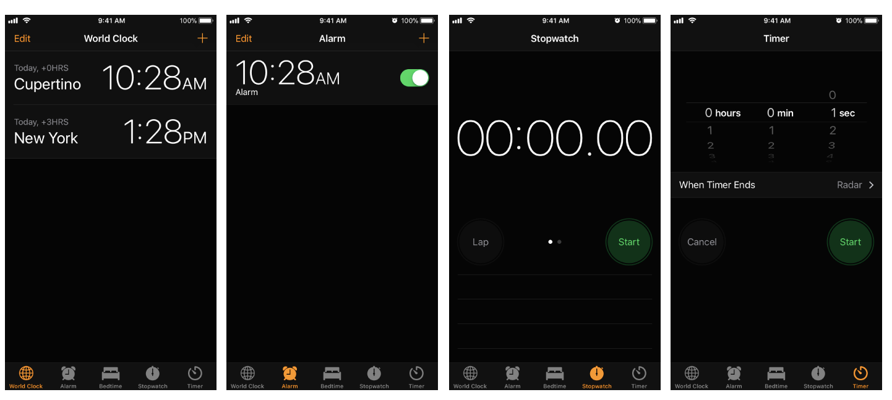
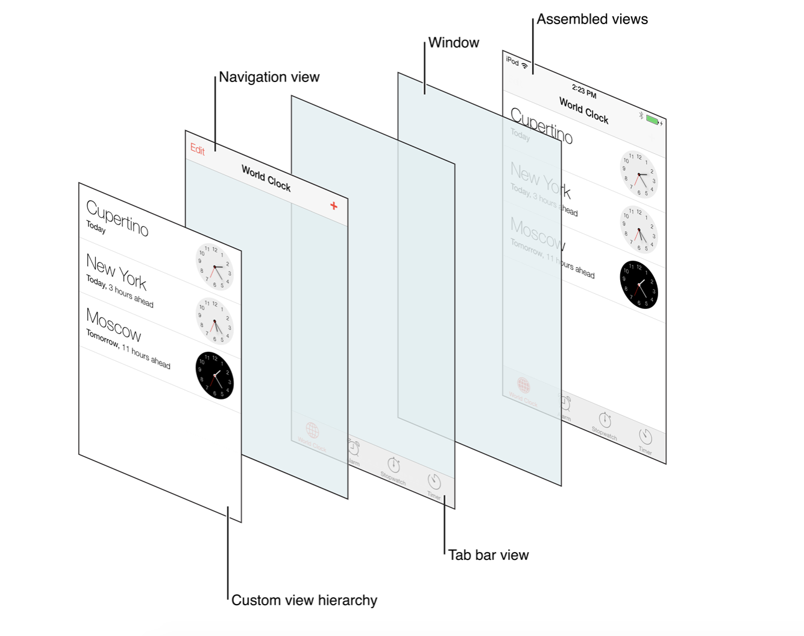
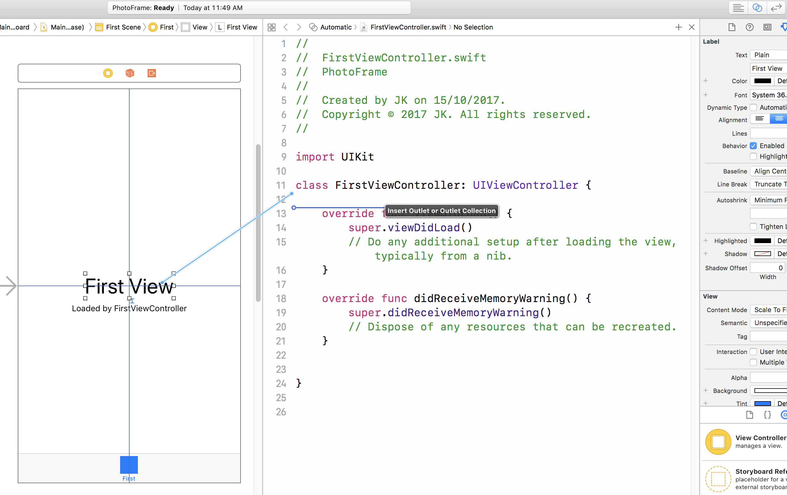
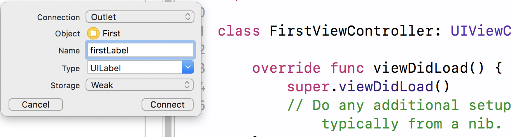

# Photo Frame

### 1단계

##### 요구사항
* iOS 프로젝트 Tabbed App 템플릿을 만들고, 프로젝트 이름을 _PhotoFrame_ 으로 지정함

##### 실행결과

```swift
import UIKit

class FirstViewController: UIViewController {
    override**** func viewDidLoad() {
        super.viewDidLoad()
        print(#file, #line, #function, #column)
    }

    override func didReceiveMemoryWarning() {
        super.didReceiveMemoryWarning()
        
    }
}
```

</img>

##### [View](https://developer.apple.com/library/content/documentation/WindowsViews/Conceptual/ViewPG_iPhoneOS/CreatingViews/CreatingViews.html)

> View objects are the main way your application interacts with the user, they have many responsibilities

##### [View Controllers](https://developer.apple.com/documentation/uikit/view_controllers)
* View를 제어하는 Controller 객체
* _View의 라이프 사이클을 관리함_
* [View Controller Programming Guide for iOS](https://developer.apple.com/library/content/featuredarticles/ViewControllerPGforiPhoneOS/index.html#//apple_ref/doc/uid/TP40007457-CH2-SW1)

</img>

##### [UITabBar](https://developer.apple.com/documentation/uikit/uitabbar)
* 일반적으로 [UITabBarController](https://developer.apple.com/documentation/uikit/uitabbarcontroller)와 함께 사용하지만, 독립적인 컨트롤 형태로도 사용할 수 있음
* 하단에 있으며 [UITabBarItem](https://developer.apple.com/documentation/uikit/uitabbaritem)객체를 보여줌
* UITabbar는 Interface Builder, 생성자, [setItems](https://developer.apple.com/documentation/uikit/uitabbar/1623455-setitems)를 통해 설정할 수 있지만 _UITabBarController는 TabBar에 제공하는 객체를 개발자가 직접 만들어야 함_
* [UIToolBar](https://developer.apple.com/documentation/uikit/uitoolbar)와 비슷하지만, 목적이 다름
    * UITabbar
        * 화면 전환 시 사용
    * UIToolbar 
        * 하나의 화면에서 탭 메뉴 사용
* Tabbar는 선택 항목, 사용자 지정 항목에 대해 Delegate 객체에 알려야 함
* Tabbar를 만들 때 Tabbar 항목의 선택, 추가, 삭제, 정렬에 대한 정보를 Delegate([UITabBarDelegate](https://developer.apple.com/documentation/uikit/uitabbardelegate)) 객체에 알려야 함

##### [UITabBarController](https://developer.apple.com/documentation/uikit/uitabbarcontroller)
* 보이는 화면과 선택된 탭 관계는 일반적으로 AS-IS 관계지만, subclass일 수도 있음
* TabBarController Interface의 탭은 사용자가 선택하였을 때 RootView를 보여줌
* 이전 화면과 관계없이 RooView를 보여줌
* TabBar Interface는 서로 다른 유형의 화면을 보여줌
    * 아이폰의 시계 앱에서 하단 메뉴를 TabBar Interface로 이용하여 만듦

</img>

* TabBarController에 직접 접근하면 안 됨. [viewControllers](https://developer.apple.com/documentation/uikit/uitabbarcontroller/1621185-viewcontrollers) 프로퍼티를 이용해야 함
* 개발자가 지정한 순서대로 화면에 나타나며 [selectedViewController](https://developer.apple.com/documentation/uikit/uitabbarcontroller/1621172-selectedviewcontroller) 프로퍼티를 이용하여 먼저 보여줄 화면을 정할 수 있음
* 사용자가 TabBar Interface를 선택하였을 때 TabBarController 객체에서 일어나는 상호작용을 Delegate에게 알려야 함
* [UITabBarControllerDelegate](https://developer.apple.com/documentation/uikit/uitabbarcontrollerdelegate) 프로토콜에 준수해야 함
* Delegate는 TabBar를 선택할 때 작업을 추가하거나 선택하지 못하게 제어할 수 있음. 그리고 Navigation Controller로 구성된 TabBar의 변화를 알 수 있음
* UITabBarController는 UIViewController를 상속받았기 때문에 TabbarController는 [View](https://developer.apple.com/documentation/uikit/uiviewcontroller/1621460-view) 속성으로 접근할 수 있는 View를 소유할 수 있음
* TabBarController View는 TabBar View와 View 내용을 담는 컨테이너
* TabBar View는 항목에 대한 선택을 제어할 수 있음
* ToolBar View와 TabBar에 대한 항목은 변하지만, 그것을 관리하는 View는 변하지 않음
* 현재 선택된 Tab의 View Controller만 반영하여 View를 바꿈
* Navigation Controller와 Custom View Controller는 Tab의 RootViewController로 사용할 수 있음

</img>

### 2단계

##### 요구사항
* First Scene에 만들어져 있는 레이블을 `IBOutlet`으로 연결함
* 연결한 아웃렛 변수에 값을 변경함

##### 프로그래밍 요구사항
* Xcode 프로젝트 내비게이터에서 Main.storyboard 파일을 선택하고 First Scene 에 있는 'First View' 레이블(Label)을 선택하고 Assistant Editor 모드로 변경함
* 레이블을 선택하고 `Control + 드래그` 해서 ViewController 코드에 IBOutlet으로 연결함

</img>

* Outlet 이름으로 photoLabel을 입력함

</img>

* ViewController 클래스 viewDidLoad() 함수에서 위에 추가한 아웃렛 변수에 값을 변경하고 다시 실행함

```swift
self.firstLabel.text = "JK의 사진액자"
```

* 위와 같이 코드로 firstLabel의 속성을 변경해봄. 글자색, 배경색, 투명도, 글자 크기를 바꿔봄
* firstLabel 아래 있는 레이블도 firstDescription 아웃렛으로 연결함
    * 마찬가지 방식으로 값을 변경해서 꾸며봄

##### 실행결과 

```swift
self.photoLabel.text = "AMING의 사진액자"
self.photoLabel.textColor = UIColor(red: 0.333, green: 0.455, blue: 0.116, alpha: 1.0)
self.photoLabel.font = UIFont.boldSystemFont(ofSize: 40)
self.firstDescription.text = "AMING의 사진액자입니다 :)"
self.firstDescription.textColor = UIColor.green
```
##### [IBOutlet](https://developer.apple.com/documentation/appkit/constants/interface_builder_constants/iboutlet)
* `IB- (Interface Builder)`
* 앱 코드에서 스토리 보드 객체로 연결함
* [Interface Builder Constants](https://developer.apple.com/documentation/appkit/constants/interface_builder_constants?language=objc)
* [IBOutlet](https://soooprmx.com/archives/5123)

> Type qualifier used by Interface Builder to expose a symbol as a connection point for sending messages from app code to a user interface element. Used immediately before an object type in a property or instance variable declaration. 

### 3단계

##### 요구사항
* First Scene에 버튼(UIButton)을 추가하고 IBAction으로 연결함
* 연결한 액션에 대한 메서드를 구현함

##### 프로그래밍 요구사항
* Main.storyboard 에서 First Scene에 UIButton을 추가함
    * 우측 유틸리티 영역 하단 3번째 탭 - 객체 라이브러리(Object Library)에서 Button 을 찾아서 View로 드래그함
    * 추가한 버튼을 선택하고 우측 유틸리티 영역 상단 4번째 탭 - 속성(Attributes)에서 Title을 다음으로 변경함

</img>

* 버튼을 선택하고 `Control + 드래그` 해서 ViewController 코드에 `IBAction으로 연결함`

</img>

* 다음과 팝업에서 Connection 항목에서 IBOutlet 대신 IBAction 으로 변경함

</img>

* 액션 이름을 nextButtonTouched으로 지정함

##### 실행결과

```swift
@IBAction func nextButtonTouched(_ sender: Any) {
    self.photoLabel.textColor = UIColor.white
    self.photoLabel.backgroundColor = UIColor.black
}
```

##### IBAction, IBOutlet 연결구조
* ViewController가 제어하려는 객체는 ViewController가 프로퍼티 등으로 지정하여 알고 있어야 함. Interface Builder 객체를 ViewController와 연결하기 위해서 해당 객체를 IBOutlet으로 연결함
* UI 요소는 ViewController에게 액션 메시지를 전달함. 사용자 동작에 대해 액션을 수행할 수 있음. 이 때 IBAction으로 연결함
* [ViewController Outlet, Action](https://soooprmx.com/archives/4486)

</img>

##### [UIControlEvents](https://developer.apple.com/documentation/uikit/uicontrolevents)
* [How to get event from IBAction method?](https://stackoverflow.com/questions/9344378/how-to-get-event-from-ibaction-method)

> The "event" is the one passed to your action method, but I assume your real question is which of the `UIControlEvents` caused the action. `UIEvent` and `UIControlEvents` are unrelated. The target/action pattern provides a `UIEvent`. If you want to handle different `UIControlEvents` differently, you should implement different actions for them.
> The target/action mechanism comes from `UIResponder`. `UIControlEvents` are related to `UIControl`.

##### IBAction에서 여러가지 이벤트 설정할 수 있음

</img>

### 4단계

##### 요구사항
* 사진액자 - IBAction 요구사항을 구현한 상태로 시작함
* 스토리보드 구성 요소에 대해 학습하고 새로운 Scene과 Segue를 추가함
* 실행하고 새로운 화면을 캡처해서 readme.md 파일에 포함함

##### 프로그래밍 요구사항
* Main 스토리보드에서 First Scene 옆에 ViewController를 드래그해서 새로운 Scene을 추가함
* 앞 단계에서 추가한 [다음]버튼을 선택하고 `Control + 드래그` 를 해서 새로 추가한 Scene에 연결함
* 팝업으로 표시되는 Action Segue에서 Show 항목을 선택함

</img>
</img>

* Scene과 Scene 사이에 화살표를 선택하면 Segue 속성을 변경할 수 있음
* 새로 추가한 Scene 속성에서 배경 색상(Background Color)을 원하는 색상으로 변경함. 새로 앱을 실행해보고 [다음] 버튼을 누르면 새로운 화면이 나타나는지 확인함
* 다시 스토리보드에서 위에 추가한 Scene (혹은 ViewController)에 [다음] 버튼을 추가함. 우측 옆에 한 단계 더 표현하기 위한 ViewController를 추가하고 배경 색상을 다른 색상으로 변경함. 위와 마찬가지로 [다음]버튼에서 새 Scene으로 Segue를 연결함
* 예를 들어 First Scene 다음에 추가한 화면이 Yellow 화면이었다면, First Scene에서 [다음] 버튼을 누르면 Yellow 화면이 표시되고, Yellow 화면에서 [다음] 버튼을 누르면 Blue 화면이 나오는 방식으로 두 단계 표시함

##### 실행결과

</img>

##### [Using Segues](https://developer.apple.com/library/content/featuredarticles/ViewControllerPGforiPhoneOS/UsingSegues.html)
* Show(Push)
    * A navigation controller pushes the new view controller onto its navigation stack.
    * `showViewController:sender:`
* Show Detail(Replace)
    * Only using a iPad  
    * This segue is relevant only for view controllers embedded inside a [UISplitViewController](https://developer.apple.com/documentation/uikit/uisplitviewcontroller) object. With this segue, a split view controller replaces its second child view controller (the detail controller) with the new content.
    * `showDetailViewController:sender:`
* Present Modally
    * This segue displays the view controller modally using the specified presentation and transition styles. 
    * The navigation stack has no effect.
* Present as Popover
    * Show simple pop-up on iPhone 
    * In a horizontally regular environment, the view controller appears in a popover.
* [What are the differences between segues: “show”, “show detail”, “present modally”, “present as popover”?](https://stackoverflow.com/questions/26287247/what-are-the-differences-between-segues-show-show-detail-present-modally)

### 5단계

##### 요구사항
* 사진액자 - Scene과 Segue 요구사항을 구현한 상태로 시작함
* 스토리보드 구성 요소와 클래스 코드와 연결해서 동작을 확장함

##### 프로그래밍 요구사항
* 프로젝트에 새로운 ViewController 클래스를 추가한다. File > New... > File... 메뉴를 선택함. 다음과 같은 화면에서 Cocoa Touch Class를 선택함
* 다음과 같이 UIViewController에서 상속받도록 입력하고, 원하는 클래스명을 입력함 (예시 YellowViewController)
* 다음 화면에서는 프로젝트내 어떤 경로에 저장하며, 프로젝트 그룹/타깃에 저장할 것인지 선택함
    * 하위 디렉토리가 있거나 원하는 하위 그룹이 있으면 변경할 수 있음
    * 빌드하는 타깃이 여러 개인 경우, 복수로 선택할 수도 있음
* 스토리보드에서 새로 추가한 Scene을 선택하고, 우측 유틸리티 영역 3번째 Identity 탭을 선택함
    * Custom Class > Class 항목에 YellowViewController (자신이 생성한 클래스 이름)을 지정함
    * 자동완성이 되야 클래스가 제대로 생성된 것! 자동완성이 안된다면 앞 단계를 다시 확인해서 UIViewController에서 상속 받도록 만들었는지 확인하고 클래스를 다시 만듦
* 이제 스토리보드에서 YellowViewController 화면에 [닫기] 버튼을 추가함
* Assistant Editor를 선택하고 [닫기] 버튼에 대한 IBAction 액션을 연결함
    * 만약 방금 추가한 YellowViewController (혹은 자신이 생성한 클래스)가 우측에 자동으로 연결되지 않으면 Custom Class가 정상적으로 연결되지 않았거나
    * 우측 Assistant 편집기 상단에 점프바(JumpBar)에 `Automatic` 이라고 선택되어 있는지 확인함. 다른 상태인 경우 `Automatic으로 변경함`

</img>
</img>
</img>
</img>

* IBAction 이름은 `closeButtonTouched` 로 지정하고 다음과 같이 코드를 작성함

```swift
@IBAction func closeButtonTouched(_ sender: Any) {
    self.dismiss(animated: true, completion: nil)
}
```

* 위와 동일하게 세 번째 추가한 화면에 대해 ViewController 클래스를 지정하고, [닫기]버튼을 추가하고, 액션을 연결해서 화면을 닫는 동작이 동작하도록 구현함
* 뷰 컨트롤러 강의 자료에 있는 화면 관련 콜백 함수들에 모두 print(#file, #line, #function, #column) 코드를 추가함
    * `viewWillAppear()`
    * `viewDidAppear()`
    * `viewWillDisappear()`
    * `viewDidDisappear()`

##### 실행결과
* 번외
    * [Trying to add 3rd tab to tabBarController](https://stackoverflow.com/questions/10054865/trying-to-add-3rd-tab-to-tabbarcontroller)

</img>

##### View Life Cycle
* [App Life Cycle 정리](https://github.com/yuaming/practice-swift/tree/master/AppLifeCycle)

##### `dismiss` 와 뒤로 돌아가는 Segue 연결의 차이점
* `Dismiss` deals with only single view-controller it will remove the current view-controller from memory.
* `Unwind segue` can be used to navigate back through push, modal or popover segues, On top of that you can actually unwind through not only one but a series of push/modal/popover segues, e.g. "go back" multiple steps in your navigation hierarchy with a single unwind action.
* [What's the difference between popping a view controller, dismissing a view controller, and using an unwind segue?](https://stackoverflow.com/questions/45318855/whats-the-difference-between-popping-a-view-controller-dismissing-a-view-contr)

##### YellowViewController에서 Segue를 제거하고 다음 화면을 보여줄 때 코드로 보여주는 방법을 찾아보고 적용함
* [UIStoryBoard](https://developer.apple.com/documentation/uikit/uistoryboard)
* [Instantiate and Present a viewController in Swift](https://stackoverflow.com/questions/24035984/instantiate-and-present-a-viewcontroller-in-swift)
* [Custom segue to a different storyboard](https://stackoverflow.com/questions/26189950/custom-segue-to-a-different-storyboard?rq=1)

```swift
@IBAction func nextPageButton(_ sender: UIButton) {
    let blueViewController: UIViewController = UIStoryboard(name: "Main", bundle: nil).instantiateViewController(withIdentifier: "BlueViewController")
    
    self.present(blueViewController, animated: true, completion: ({
        print("Segue 호출 확인:)")
    }))
}
```