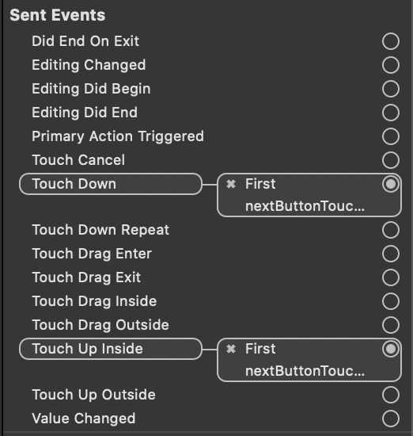

# STEP1. 사진액자 앱

코드스쿼드 마스터즈 iOS 클래스 PhotoFrame 프로젝트

## STEP1-1 Tabbed App 프로젝트 생성

* Tabbed App 템플릿으로 프로젝트 생성
* `viewDidLoad` 함수에 코드 추가하여 호출 확인
    * `viewDidLoad`는 화면이 처음 보일 때 뷰가 메모리에 로드되며 호출된다.

## STEP1-2 Photo Labels 셋업

* 첫 번째 화면의 레이블들을 IBOutlet으로 ViewController와 연결
* 아웃렛 변수를 통해 레이블 설정
    * 시스템 폰트, 텍스트 색상 등 변경
        * bold 서체를 반환하는 `boldSystemFont(ofSize:)` 타입 메서드를 통해 폰트 설정
    * 그림자 색상과 offset 설정
        * `shadowOffset` 프로퍼티는 `CGSize` 타입이므로 해당 타입으로 생성하여 할당

**실행 화면**

## STEP1-3 버튼을 눌러서 레이블 프로퍼티 변경

* IBAction으로 버튼에 일어나는 Touch up 이벤트와 메서드를 연결
    * Touch up 이벤트 외에도, Touch down, Touch Drag 등의 이벤트들이 있다.

* 스토리보드의 Connection Inspector를 이용하여 다음과 같이 하나의 이벤트에 여러 액션 메서드들을 연결할 수 있다.

* 여러 개의 버튼을 하나의 액션에 연결할 수도 있다.

* 또한 다음과 같이 여러 개의 이벤트를 하나의 버튼에 연결할 수도 있다.

**실행 화면**

## STEP1-4 세그를 통한 화면 전환

* 버튼과 뷰 컨트롤러를 세그 객체로 연결하여 화면 전환 구현
    * 세그 형식을 Show로 설정
* 전환된 뷰 컨트롤러의 배경 색상을 바꾸어 명확하게 나타냄
* 또다른 뷰 컨트롤러를 세그 객체로 연결하여 그 다음으로의 화면 전환을 구현
* 해당 뷰 컨트롤러의 배경 색상도 바꾸어 표시

**실행 화면**

