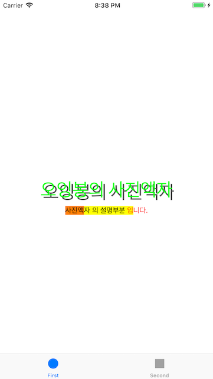
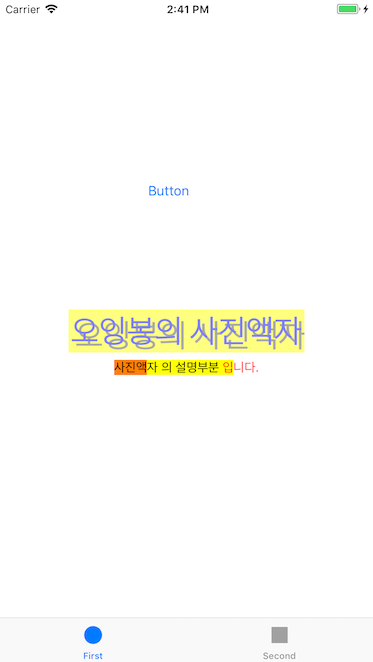

# PhotoFrame

## Step1 - Tabbed App 템플릿


### Console
`First :  /Users/oingbong/Documents/CodeSquad/Level3/swift-photoframe/PhotoFrame/PhotoFrame/FirstViewController.swift 17 viewDidLoad() 58`

`Second :  /Users/oingbong/Documents/CodeSquad/Level3/swift-photoframe/PhotoFrame/PhotoFrame/SecondViewController.swift 16 viewDidLoad() 57`


### UITabbarController
 - UITabbar 를 포함해 UITabbar 에서 선택한 View 까지 포함하는 전체적인 의미

### UITabbar
 - 여러 View 중에 하나를 선택할 수 있게 하단 혹은 화면 끝단에 존재하는 라디오 버튼 형식의 바

---

## Step2 - IBOutlet

### UILabel

> 하나 이상의 읽기 전용 텍스트 행을 표시하는 보기 , 의도된 목적을 설명하기 위해 컨트롤과 함께 사용되는 경우가 많습니다.

 - 개요
 : 레이블 모양을 구성할 수 있으며, 레이블 내의 문자열도 사용자가 지정할 수 있습니다.  

 - 국제화
 : 레이블은 많은 사용자와 통신할 수 있는 중요한 컨트롤 중 하나이므로 국제화가 중요합니다. 따라서 국제화 구현도 가능합니다. ( 아래 URL 참조 )
[About Internationalization and Localization](https://developer.apple.com/library/archive/documentation/MacOSX/Conceptual/BPInternational/Introduction/Introduction.html#//apple_ref/doc/uid/10000171i)

### Topics

---
##### Accessing the Text Attributes (텍스트 속성 엑세스)
| 이름 | 내용 |
| --- | :---: |
| `var text: String?` | 레이블에 표시되는 텍스트 |
| `var attributedText: NSAttributedString?` | 레이블로 표시되는 현재 스타일 텍스트 |
| `var font: UIFont!` | 텍스트를 표시하는데 사용되는 글꼴 |
| `var textColor: UIColor!` | 텍스트 색상 |
| `var textAlignment: NSTextAlignment` | 텍스트를 정렬하는데 사용하는 기술 |
| `var lineBreakMode: NSLineBreakMode` | 레이블의 텍스트를 줄바꿈하고 자르는데 사용하는 기술 |
| `var isEnabled: Bool` | 레이블의 텍스트를 그릴 때 사용할 활성화 상태 |
---
##### Sizing the Label's Text (레이블 텍스트 크기 조정)
| 이름 | 내용 |
| --- | :---: |
| `var adjustsFontSizeToFitWidth: Bool` | 제목 문자열을 레이블의 경계 사각형에 맞추기 위해 글꼴 크기를 줄여야 하는지 여부를 나타내는 부울 값 |
| `var allowDefaultTighteningForTruncation: Bool` | 레이블을 잘라내기 전에 텍스트를 고정하는지 여부를 나타내는 부울 값 |
| `var baselineAdjustment: UIBaselineAdjustment` | 레이블에 맞게 텍스트를 축소해야 할 때 텍스트 기준선이 조정되는 방식을 제어 |
| `var minimumScaleFactor: CGFloat` | 라벨의 텍스트에 지원되는 최소 축척 비율 |
| `var numberOfLines: Int` | 텍스트 렌더링에 사용할 최대 줄 수 |
---
##### Managing Highlight Values (하이라이트 값 관리)
| 이름 | 내용 |
| --- | :---: |
| `var highlightedTextColor: UIColor?` | 레이블의 텍스트에 적용된 강조 표시 색상 |
| `var isHighlighted: Bool` | 강조 표시로 레이블을 그릴지 여부를 나타내는 부울 값 |
---
##### Drawing a Shadow (그림자 그리기)
| 이름 | 내용 |
| --- | :---: |
| `var shadowColor: UIColor?` | 텍스트의 그림자 색상 |
| `var shadowOffset: CGSize` | 텍스트의 그림자 오프셋(점 단위로 측정) |
---
##### Drawing and Positioning Overrides (중첩 그리기 및 배치)
| 이름 | 내용 |
| --- | :---: |
| `func textRect(forBounds: CGRect, limitedToNumberOfLines: Int) -> CGRect` | 레이블의 텍스트에 대한 직사각형을 반환 |
| `var drawText(in: CGRect)` | 지정된 사각형에 레이블의 텍스트(또는 그림자)를 그립니다. |
---
##### Getting the Layout Constraints (레이아웃 제약 조건 가져오기)
| 이름 | 내용 |
| --- | :---: |
| `var preferredMaxLayoutWidth: CGFloat` | 다중 행 레이블의 기본 최대 너비(점) |
---
##### Setting and Getting Attributes (특성 설정 및 가져오기)
| 이름 | 내용 |
| --- | :---: |
| `var isUserInteractionEnabled: Bool` | 사용자 이벤트를 무시하고 이벤트 대기열에서 제거할지 여부를 결정하는 부울 값 |
---
##### Related Types (관련유형)
| 이름 | 내용 |
| --- | :---: |
| `enum NSTextAlignment` | 이 상수는 텍스트 정렬을 지정 |
---
##### Instance Properties (인스턴스 특성) - Beta
| 이름 | 내용 |
| --- | :---: |
| `var enablesMarqueeWhenAncestorFocused: Bool` | - |
---

#### NSMutableAttributedString & NSAttributedString 차이
: NSMutableAttributedString 은 변경 가능한 문자열 객체로써 append 등 가능 , NSAttributedString 는 변경 못함

#### 순환참조
 - strong : `Defalut` 로써 아무것도 명시하지 않으면 설정되며 `강한참조`라고도 합니다.
 - weak : `약한참조` 이며 옵셔널입니다.
 - unowned : `weak` 와 동일한 `약한참조` 이지만 옵셔널이 아닙니다.
 ```
클래스의 메모리와 관련된 용어들이며 Swift 는 자동으로 메모리 관리를 해줍니다. 따라서, ARC(Automatic Reference Counting) 라는 
용어 아래 많은 관련 용어들이 있지만 그 중 기본적으로 strong , weak , unowned 용어가 있습니다.
레퍼런스 카운팅을 계산하여 메모리를 해제하는 여부를 결정하는데 사용되는 것들이며 strong 을 잘못쓰게 되면
영원히 메모리상에서 지울 수 없는 인스턴스가 존재하게 되며 이를 보완하기 위해 weak 와 unowned 을 사용합니다.
weak 는 옵셔널이기 때문에 참조하는 값이 없다면 nil 로 값이 설정되지만 unowned은 항상 값이 있다는 것을 전제로 하기 때문에 참조값이 없는 경우에는 
크러시가 발생하게 될 것입니다.
```
#### 참고
 - [fonts - How do I make an attributed string using Swift? - Stack Overflow](https://stackoverflow.com/questions/24666515/how-do-i-make-an-attributed-string-using-swift)
 - [때로는 까칠하게.. :: Swift ARC(Automatic Reference Counting)](http://kka7.tistory.com/21)
 - [스위프트 ARC와 순환참조와 클로저 · Out of Bedlam](https://outofbedlam.github.io/swift/2016/01/31/Swift-ARC-Closure-weakself/)



---

## Step3 - IBAction

### IBAction 이벤트 종류
| 이름 | 내용 |
| --- | :---: |
| Did End On Exit | 

| Editing Changed | UITextField 객체에서 편집 변경을 수행하는 터치 |
| Editing Did Begin | UITextField 객체에서 해당 경계에 들어서면서 편집 세션을 시작하는 터치 |
| Editing Did End | UITextField 객체에서 해당 경계를 벗어나 편집 세션을 종료하는 터치 |
| Primary Action Triggered | 버튼에 의해 트리거(시작)된 의미 동작 |
| Touch Cancel | 컨트롤의 현재 터치를 취소하는 시스템 이벤트 |
| Touch Down | 버튼을 누를 때의 상태 이벤트 |
| Touch Down Repeat | 컨트롤에서 반복된 터치다운 이벤트 (이 이벤트의 경우 UITouch tapCount 메소드의 값이 1보다 큽니다) |
| Touch Drag Enter | 제어 범위로 손가락을 끄는 이벤트 |
| Touch Drag Exit | 제어 범위내에서 밖으로 손가락을 끄는 이벤트 |
| Touch Drag Inside | 제어 범위내에서 손가락을 끄는 이벤트 |
| Touch Drag Outside | 제어 범위 바로 밖에서 손가락을 끄는 이벤트 |
| Touch Up Inside (Default) | 제어 범위내에서 버튼을 누르고 땠을 때의 상태 이벤트 |
| Touch Up OutSide | 제어 범위밖에서 버튼을 누르고 땠을 때의 상태 이벤트 |
| Value Changed | 터치를 드래그하거나 다른 방식으로 조작하여 일련의 다른 값을 방출하도록하는 컨트롤 |

### 버튼 클릭 Before & After 스크린샷



### 버튼에 액션을 여러개 추가할 수 있을까?
 - 가능 : 아래 스크린샷 참고
 

### 버튼이 여러일 때 하나의 액션에 추가할 수 있을까?
 - 가능 : 하나의 액션을 만들고 추가적으로 버튼을 해당 액션에 드래그해서 중복 설정이 가능합니다.

#### 참고
 - [UIControl.Event - UIControl | Apple Developer Documentation](https://developer.apple.com/documentation/uikit/uicontrol/event)


