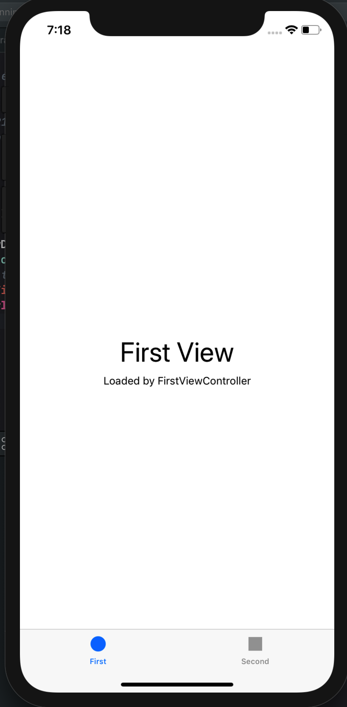
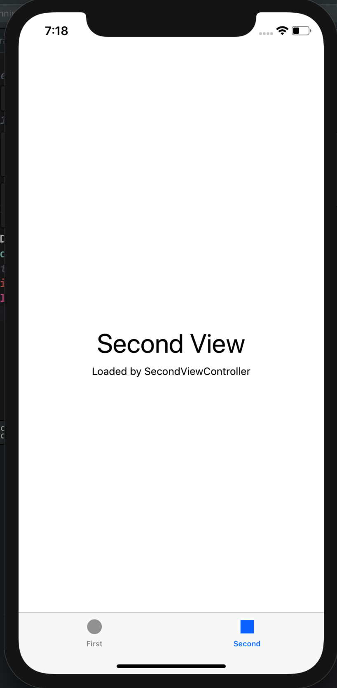
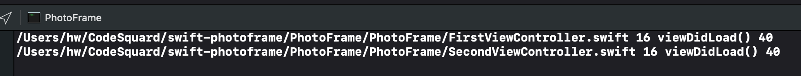

- UITabBarController 와 UITabBar에 대해 학습

  [UITabBar](<https://developer.apple.com/documentation/uikit/uitabbar>)

  [UIView](<https://developer.apple.com/documentation/uikit/uiview>)

  [UIViewController](<https://developer.apple.com/documentation/uikit/uiviewcontroller>)

  [UITabBarController](<https://developer.apple.com/documentation/uikit/uitabbarcontroller>)

  

# 각 클래스 역할은 무엇인가? 어떤 경우에 사용하나?

## 1. UITabBarController

-  radio-style selection interface를 관리하는 컨테이너 뷰 컨트롤러이다. radio를 선택하면, 어느 child view controller를 표시할지 결정한다.  
- **UIViewController** 클래스를 상속받는다.
  - 따라서, tab bar controller들은 view property를 통해 접근가능한 각자의 view를 소유한다.

### UITabBarController에 대한 document 부연 설명

- 각각의 tab bar controller interface의 **tab**은 **한개의 a custom view controller와 연관**되어있다.
- **[ Responding & Resizing ]** - 사용자가 **특정 tab을 선택**하면, 해당 탭의 tab bar controller는 `기존 view`를 `선택된 view controller와 상응하는 root view로 대체`한다. 
- 이때 `사용자의 터치`는 이전 tab이 무엇이 선택되었든, 결국 `root view`의 탭을 나타낸다. (해당 탭이 이미 선택된 경우에도 마찬가지이다.
- **[ update ]** - 탭 선택은 인터페이스의 콘텐츠들을 대체하므로, **각 탭에 의해 관리되는 인터페이스 유형은 각기 달라도 무방**하다.
  - 사실상 tab bar interface들은 서로 다른 유형의 정보나 같은 정보를 전혀 다른 스타일의 인터페이스로 표시하기 위해 사용한다.
- **[ View를 제어 ]** - tab bar controller의 tab bar view에 직접 접근하면 안된다. 
  - **즉, tab bar view는 controller를 통해서만 접근이 가능해야 한다.**
- **[ Coordinating ]** - tab bar controller의 tabs를 조절(configure)하기 위해, 각각의 탭의 root view에게 viewControllers 특성을 제공하도록 뷰 컨트롤러를 할당한다.
- view controller를 특정 짓는 순서대로 tab bar가 나타난다.
- view에 대한 하나의 tab bar controller는 `개발자의 커스텀 컨텐츠를 포함한 view`와  `tab bar view`에 대한 `컨테이너 역할`을 한다.
- tab bar view는 사용자를 위한 선택지(selection controls)를 제공하며, 하나 이상의  tab bar item으로 구성된다.

-------

## 2. UITabBar 

- tab bar에 하나 이상의 버튼들을 나타내는 컨트롤로 앱 내의 다양한 subtasks, views, models을 선택하기 위해 사용한다.
- **UIView** 클래스를 상속받는다.
- **사용자와 interaction하며, 사용자에게 컨텐츠를 표시하는 역할을 한다.**

### UITabBar 대한 document 부연 설명

- TabBar는 TabBarController와 연계되어 사용이 가능하지만, app에서 stand alone control로도 사용이 가능하다.
- TabBar는 항상 화면의 bottom edge에 나타나야 한다. 
- **[ Display ]** - TabBar는 하나 이상의 UITabBarItem의 컨텐츠를 표시한다. 
- **[ Display ]** - TabBar의 모양은 개발자의 인터페이스의 요구사항에 맞게 조정가능하다. (색상, 배경이미지 등)
- **[ 상호작용 ]** - TabBarItem 선택시 해당 아이템이 하이라이트 처리되어야 하며, Item 선택이 당신의 앱에 상응하는 모드를 가능하게 해야 한다.
- tab bar는 선택된 tab이나 user customizations에 대해 `delegate object`인 `controller`에게 알린다(report).
- 그밖에 tab bar Item의 `추가`, `제거`, `재정렬`도 마찬가지로 controller에게 *response*를 ***위임(delegate)***한다.

 tab bar reports selections and user customizations to its delegate object. For tab bars you create yourself, use the delegate to respond to selections or to the addition, removal, or reordering of items in the tab bar. (A `UITabBarController` object acts as the delegate for the tab bar it manages.)

## UITabBar vs UITooBar 

> The `UITabBar` class and [`UIToolbar`](https://developer.apple.com/documentation/uikit/uitoolbar) classes have similar appearances but different purposes. Use tab bars to convey and change your app’s mode. Use toolbars to present the user with a set of actions that are relevant to the currently presented content. 

# UITabBar와 UITabBarController의 차이점은 무엇인가?

- **MVC Design Pattern**과 관련이 있다고 볼 수 있다.
  -  각각 `UIView`와 `UIViewController`를 상속받는다.
- 따라서 View와 Controller에 대한 차이가 이 둘의 차이로 대변될 것이다.

- **`UIView`**는 `유저에게 data를 표시`하고, `user의 input을 입력받는 역할`을 하는 객체이다.

  - 1. **Drawing and animation**

    - Views draw content in their rectangular area using UIKit or Core Graphics.
    - Some view properties can be animated to new values.

  - 2. **Layout and subview management**

    - Views may contain zero or more subviews.
    - Views can adjust the size and position of their subviews.
    - Use Auto Layout to define the rules for resizing and repositioning your views in response to changes in the view hierarchy.

  - 3. **Event handling**

    - A view is a subclass of [`UIResponder`](https://developer.apple.com/documentation/uikit/uiresponder) and can respond to touches and other types of events.
    - Views can install gesture recognizers to handle common gestures.

    

- **`UIViewController`**는 `유저에게 표시할 data가 무엇인지 파악`하고, `유저의 input으로부터 무엇을 할지 결정`하는 객체이다.

  - **Update** views contents
  - **Responding** to user interactions with views.
  - **Resizing** views and managing the layout of the overall interface.
  - **Coordinating** with other objects—including other view controllers—in your app.

-  View를 상속받는 UITabBar는 **사용자에게 컨텐츠를 표시하고, 사용자의 상호작용을 받는 역할**을 한다.

-  반면 Controller 역할을 하는 UITabBarController는 **사용자와의 상호작용을 통해 view와 nested viewController를 통제하여, 기존의 View를 대체하여 표시할 View를 보여주는 역할**을 담당한다. 

- cf. 기본 UITabBarController 대신에 User-defined controller를 사용한다면, UITabBar와 해당 컨트롤러를 연결(`hook`)하는 작업을 취해야 할 것이다.

  

  

# 관련 클래스는 무엇이 있나?

- UITabBar : UIView : **UIResponder**
- UITabBarController : UIViewController : **UIResponder**

- view controllers are [`UIResponder`](https://developer.apple.com/documentation/uikit/uiresponder) objects and are inserted into the responder chain between the view controller’s root view and that view’s superview, which typically belongs to a different view controller.

