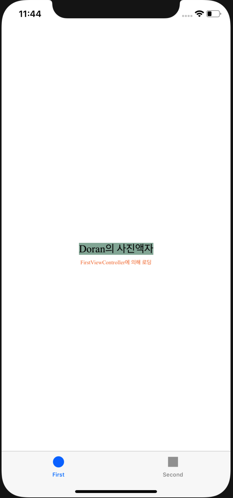

STEP 11-2

# 결과 화면




# UILabel Properties 정리


```swift
@available(iOS 2.0, *)	/// attribute로 ios 2.0 이상 사용가능한 오픈클래스를 의미
open class UILabel : UIView, NSCoding, UIContentSizeCategoryAdjusting	/// 상속받는 상위 클래스들
```

기본적으로 아래의 프로퍼티들을 보유하고 있다.  우선 간단한 것만 주석을 변역하여 남기도록 한다.

```swift
	 	open var text: String? // default는 nil이다.
    open var font: UIFont! // default는 nil이다. 시스템 폰트는 17, 플레인이다.
    open var textColor: UIColor! // default is nil (text 는 기본 검정색)
    open var shadowColor: UIColor? // default is nil (기본적으로 음영 없음)
    open var shadowOffset: CGSize // default is CGSizeMake(0, -1) -- a top shadow
    open var textAlignment: NSTextAlignment 
    open var lineBreakMode: NSLineBreakMode 
    
    // 아래의 속성들은 레이블에 의해 추출되는 문자열들로, 설정시 위의 프로퍼티들을 무시한다.
    @available(iOS 6.0, *)
    @NSCopying open var attributedText: NSAttributedString? // default is nil
    
    // 하이라이트 프로퍼티는 `터치로 눌린 상태`와 같은 서브클래스에 의해 사용된다. 
		//사용자 프로퍼티의 base 클래스의 일부분으로 사용하기에 유용하다.
    open var highlightedTextColor: UIColor? // default is nil
    open var isHighlighted: Bool // default is NO
    open var isUserInteractionEnabled: Bool // default is NO
    open var isEnabled: Bool // default is YES. changes how the label is drawn

    // numberOfLines은 sizeToFit이 호출되었을때 실제로 화면에 나타낼 라인의 수를 결정한다.
    // 기본값은 1이다. (싱글라인) 0의 값은 제한없음을 의미한다.
    // 만약 텍스트의 높이가 지정된 라인수에 도달하거나 허용된 라인수보다 뷰의 크기가 작다면, 
		// 텍스트는 line breack mode에 의해 truncated된다.
    open var numberOfLines: Int
    
    // 다음 세가지 프로퍼티들은 minimum scaling factor보다 크거나 같은 scaling factor에 의해 
		// 특정 높이에 자동적으로 label을 맞추도록 한다. 
    // 또한 텍스트가 폰트를 축소시켜야 하는 경우에 텍스트의 baseline이 움직이는 방향을 구체적으로 조정할 수 있다.
    open var adjustsFontSizeToFitWidth: Bool // 1st property - default is NO
    open var baselineAdjustment: UIBaselineAdjustment 
    // 2nd property - default is UIBaselineAdjustmentAlignBaselines
    @available(iOS 6.0, *)
    open var minimumScaleFactor: CGFloat // 3rd property - default is 0.0
    
    // 만약 현재의 line break mode가 truncation modes 중 하나라면, 
		// truncate가 시작되기 전에 라인을 맞추기 위해 글자사이의 자간, 장평을 줄이는 것을 허용하는 bool 변수
    // 시폰트, 라인 너비에 따라 시스템에서 글자를 밀집시키는 정도가 달라진다.
    @available(iOS 9.0, *)
    open var allowsDefaultTighteningForTruncation: Bool // default is NO

    
    // points를 오버라이드 한다. super 메서드를 호출하기 전에 사각형을 조절할 수 있다.
    // label 은 default content mode of UIViewContentModeRedraw를 갖는다.
    open func textRect(forBounds bounds: CGRect, limitedToNumberOfLines numberOfLines: Int) -> CGRect

    open func drawText(in rect: CGRect)

    
    // Support for constraint-based layout (auto layout)
    // If nonzero, this is used when determining -intrinsicContentSize for multiline labels
    @available(iOS 6.0, *)
    open var preferredMaxLayoutWidth: CGFloat
```


