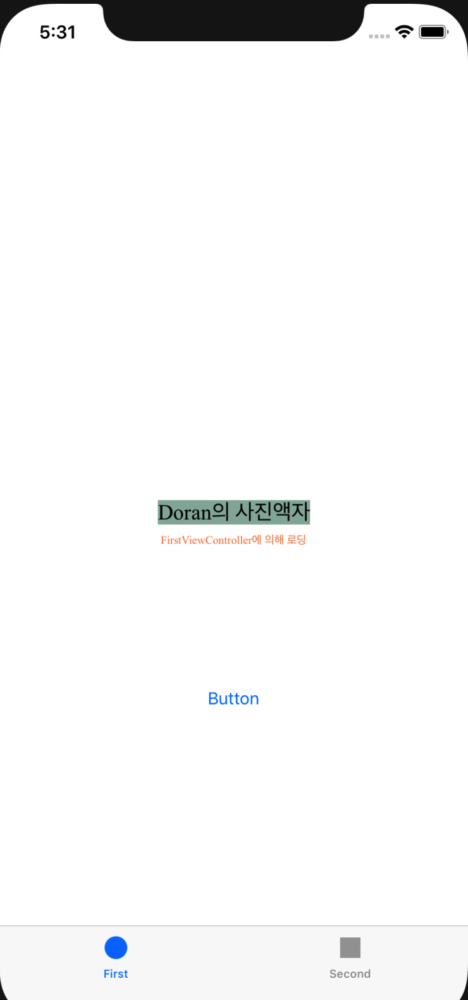
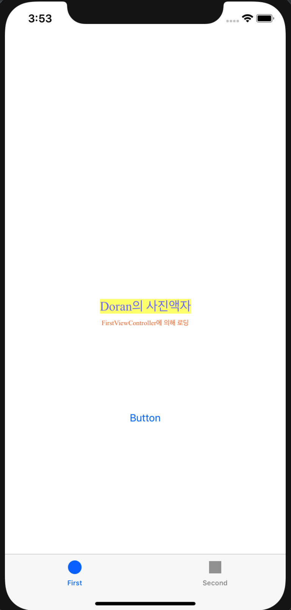
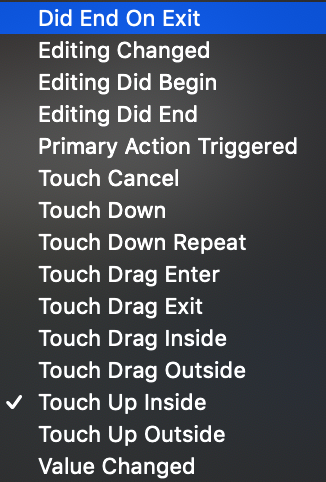
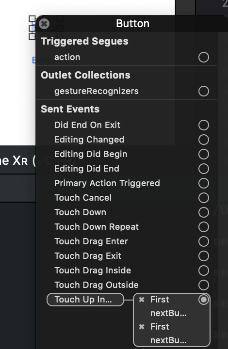
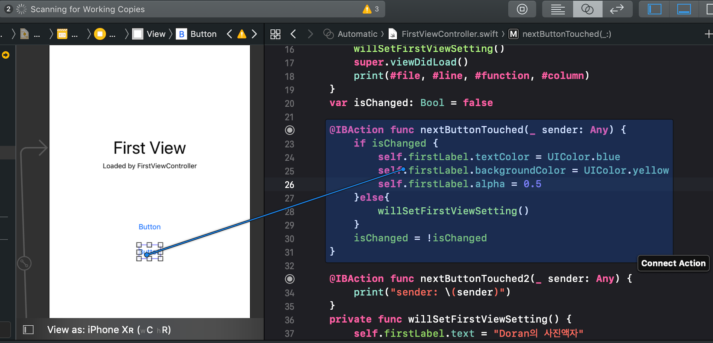

STEP 11-3

# 결과 화면

- 버튼에 IBAction을 추가할 때 이벤트(Event) 종류에는 어떤 것들이 있는지 학습한다.
  - 버튼 이벤트 종류
  - 

-----

- 버튼에 액션을 여러개 추가할 수 있을까?
  - **하나의 버튼에 여러 액션을 추가하는 것이 가능하다.**
  - 

- 버튼이 여러일 때 하나의 액션에 추가할 수 있을까?
  - **기존 IBAction에 새로운 버튼을 연결**하면 된다.
  - 

----

- 

