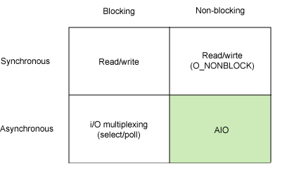

STEP 11-5

# 3. Block / Non Blcock  학습내용 정리

Sync/Async 정리하는 김에 혼동되는 개념을 명확히 되짚고 넘어가고자 재차 학습

# Blocking 

- **자신의 수행결과가 끝날 때까지 제어권을 갖고 있는 것을 의미**

- 가령 swift에서 read/write의 메서드의 일종인 readInput()이 호출된 경우, 사용자의 입력이 일어나야만 제어권이 다시 프로그래밍의 메인스레드로 넘어간다. (그래서 이후의 코드가 실행된다.)

  - 위 예는 Sync&Blocking의 예제이다.

  

# NonBlocking

- 자신이 호출되었을 때 **제어권을 바로 자신을 호출한 쪽으로 넘기며**, **자신을 호출한 쪽에서 다른 일을 할 수 있도록 하는 것을 의미**
- 가령 javascript에서 setTimeout(callback, millisecond) 함수의 경우, 함수 호출시 제어권을 반납하여 callback함수의 내용을 실행할 수 있다. 
  - 이 경우는 비동기&nonBlocking의 예라고 볼 수 있다.

[출처 : Synchronous(동기) Vs Asynchronous(비동기)](https://nesoy.github.io/articles/2017-01/Synchronized)

## 부연설명

[이미지 및 내용 출처](https://homoefficio.github.io/2017/02/19/Blocking-NonBlocking-Synchronous-Asynchronous/)

위의 예와 같이 Sync&Blocking, Async&Nonblocking의 예제는 익숙하다.

**Sync&Blocking**

- file read/write

**Async&Nonblocking**

- async I/O
- node.js 등

### 그러나 두 그룹은 **`관심사`** 가 다르다.

> **Blocking/NonBlocking은 호출되는 함수(callee)가 바로 리턴하느냐 마느냐가 관심사**
>
> 바로 리턴 == caller에게 제어권을 바로 넘겨줌을 의미한다.

### NonBlocking

- 따라서 Callee가 Caller에게 **바로 리턴하여 Caller가 다른 일을 수행할 수** 있다.

### Blocking

- 반면에 Callee가 **자신의 작업수행동안 Caller에게 제어권을 돌려주지 않고 대기하게** 만든다.

> **Synchronous/Asynchronous는 호출되는 함수의 작업 완료 여부를 누가 신경쓰냐가 관심사**
>
> 작업완료를 caller가 신경쓰면 Sync, callee(callback) 이 신경쓰면 Async
>
> `작업완료를 신경쓰는 주체 `는 좀 더 넓은 의미로는 작업완료 후에 할 동작의 수행 주체를 의미한다.

###  Asynchronous 

-  callee에게 작업완료 후 수행할 동작인 callback을 전달하여, callee의 작업이 완료되면 callee가 전달받은 callback을 실행하고, caller는 작업 완료 여부를 신경쓰지 않는다.

호출하는 함수가 호출되는 함수의 작업 완료 후 리턴을 기다리거나, 또는 호출되는 함수로부터 바로 리턴 받더라도 작업 완료 여부를 호출하는 함수 스스로 계속 확인하며 신경쓰면 Synchronous다.

----

Sync & NonBlocking

- java8의 `CompletableFuture` 가 이에 해당한다고 한다.

Async & Blocking

- 비동기 server와 blocking 방식의 DB를 연동하는 경우가 이에 해당한다.
  - ex) node,js & mySQL