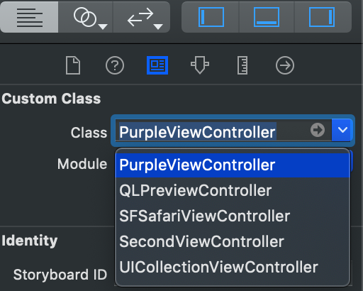
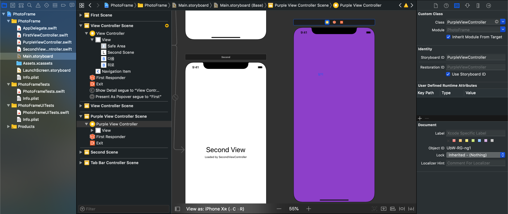
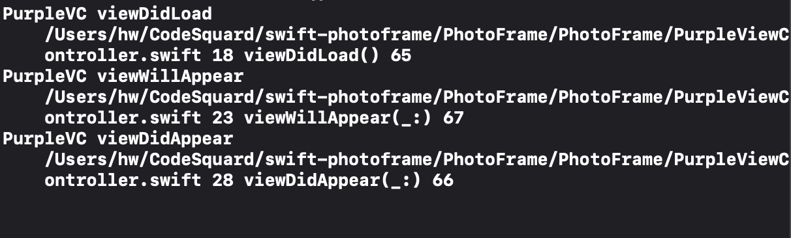
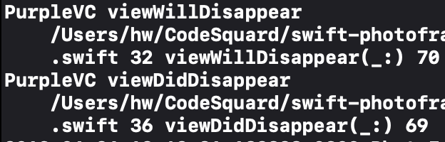
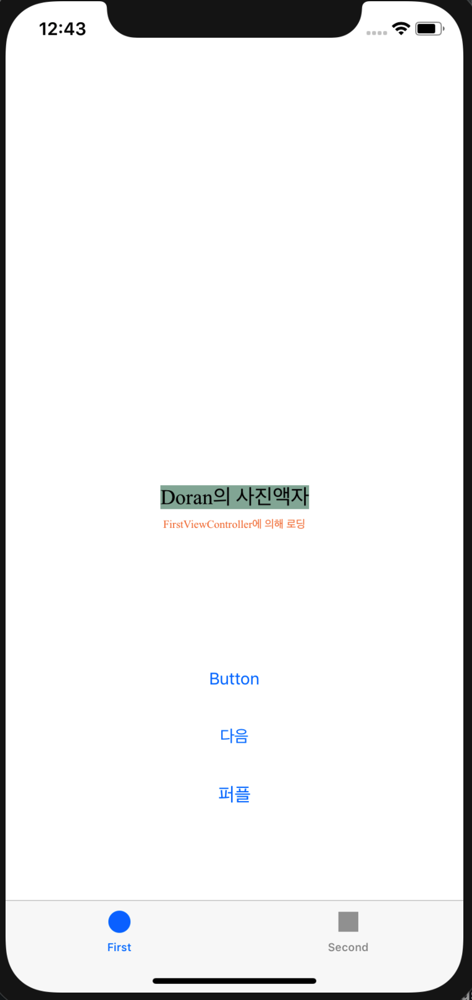
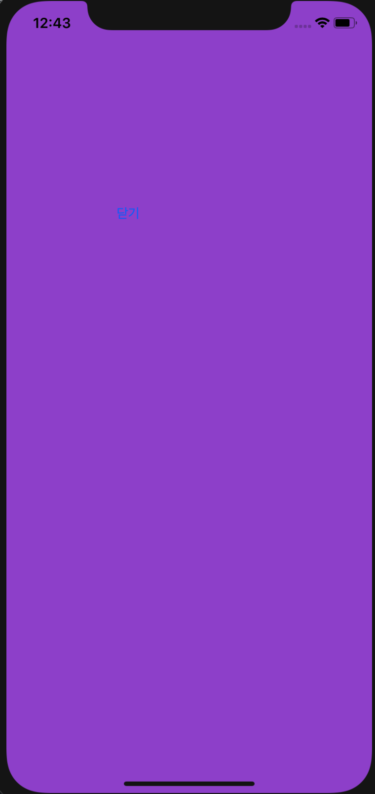

**STEP 11-5**


## 목표 

- FirstViewController의 버튼에 IBAction 함수를 추가하여 뷰컨트롤러를 PurpleViewController로 전환시킨다. 


## 학습추가 구현

- FirstVC의 버튼에서 PurpleVC로의 Segue를 제거하고 다음 화면을 보여줄 때 코드로 보여주는 방법을 찾아보고 적용

### 구현 내용

```swift
    @IBAction func showPurpleView(_ sender: Any) {
        let storyboard : UIStoryboard = UIStoryboard(name: "Main", bundle: nil)
        let purpleVC = storyboard.instantiateViewController(withIdentifier: "PurpleViewController")
        if let purpleVC = purpleVC as? PurpleViewController  {
            // 화면을 전환할 때 사용할 애니메이션 정의
            purpleVC.modalTransitionStyle = UIModalTransitionStyle.coverVertical
            // 인자값으로 받은 뷰 컨트롤러로 화면 이동
            self.present(purpleVC, animated: true, completion: nil)
        }
    }
```


### 작동시 초기 문제점 

storyboard에서 Identifier로 `PurpleViewController`를 찾지 못하는 문제가 발생

- PurpleViewController를 Cocoa Touch class 의 UIViewController의 subclass로 생성하는것을 잘못했나?

  - Main.storyboard의 CustomClass로 PurpleViewController 가 생성되었고, Class select 바에서도 등록된 것으로 보아 문제 없음

  관련 이미지

  


### 원인 파악

> UIViewController로 등록한 것은 맞지만, 특정 스토리보드(`Main.storyboard`)의 소속으로 매핑이 되지 않은 것이 문제 아닐까?

- 스토리보드에 *생성한 뷰 컨트롤러* 를 인식시킬 수 있는 id를 부여하는 방법을 찾아봄


### 해결 방안

- utilitybar에서 identity로 storyboard ID를 부여 할 수 있음

  

- 테스트 후 다시 살펴보니restoration ID만 나타나는 것으로 보아, 이미 등록한 후에는 ID를 변경하는 방법만 표시되는 듯 하다.


결과화면에 앞서 viewController의 라이프사이클을 이루는 콜백함수들의 출력 순서를 콘솔에 찍어보았다.

- **생성** 순서는 `init()` —> ` loadView() `—> `viewDidLoad()`—> `viewWillAppear()` —> `viewDidAppear()` 

- **소멸** 순서는 `viewWillDisappear()` —> `viewDidDisappear()` 이다.

**이 중, 개발자에 의해 직접 컨트롤 되지 않는 부분은  `init()` —> ` loadView() ` 부분이다.**

### `퍼플` 버튼 터치시 (PurpleViewController 생성)

- viewController 생성 ->  `loadView` 로 메모리 적재된 뷰 컨트롤러에 대해 후속작업을 수행하기 위한 `viewDidLoad`가 호출됨
- `viewWillAppear`가 호출됨
- `viewDidAppear`가 호출됨




### `닫기` 버튼으로 창 닫을 시 

- 뷰 컨트롤러가 `소멸 전` 에 수행될 작업을 위한 ` viewWillDisappear `호출
- 뷰 컨트롤러가 `소멸 후`에 수행될 작업을 위한 `viewDidDisapper` 호출




결과화면은 아래와 같다.






