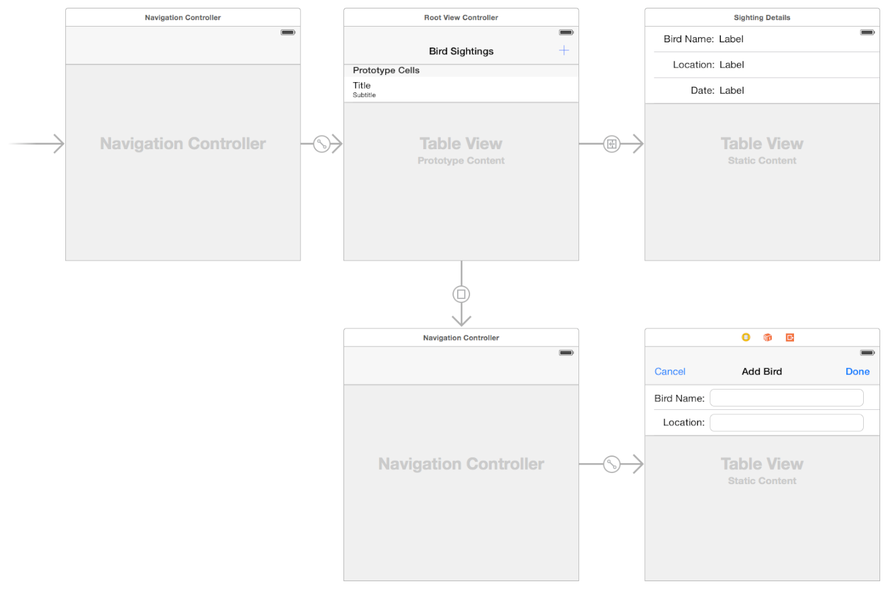

**STEP 11-6**

# 3. Navigation Controller

### previously on `RootViewController` 

이전에 설명한 바와 같이 rootViewController는 **뷰 계층구조의 anchor 역할**을 합니다. (가장 기저에 존재)

- 모든 window는 오직 하나의 rootViewController를 지닙니다. 
- rootViewController는 window를 content로 채우는 역할을 합니다.
- 사용자에 의해 처음에 보여질 content를 결정하는 것도 rootVC의 역할입니다.
- 왜나하면, window는 그 자체로는 콘텐츠를 갖지 않기 때문입니다.
- rootViewController는 UIWindow가 지닌 `rootViewController` 프로퍼티를 통해서 접근이 가능합니다.

-----

### Navigation Controller

첫번째 Container View Controller로 NavigationController를 설명합니다.

NavigationController는 **rootViewController** **처럼 행동**합니다.

-  `UINavigationController` 객체는 계층적 데이터 집합을 통해 navigation하는 것을 지원합니다. 네비게이션 인터페이스는 **하나의 자식 뷰 컨트롤러를 한번에 제공**합니다. 인터페이스의 상단에 위치한 네비게이션 bar 는 data 계층구조에서의 현재의 위치를 나타내며, 한 단계 이전단계로 돌아가는 `back` 버튼을 표시합니다. 네비게이션의 **데이터 계층구조 탐색**은 그 역할을 **자식 뷰 컨트롤러**가 수행하며, 테이블이나 버튼들을 사용하여 구현할 수 있습니다. 

- NavigationController는 데이터 계층구조 탐색을 위해 view controller를 `push`하거나 `pop`하는 `stack 구조`로 이뤄져있습니다. 새로운 뷰 컨트롤러를 `push`하거나, `back` 버튼을 통해 현재 최상단에 자리잡고있는 계층구조상의 뷰 컨트롤러를 해제(dismiss)하며 `pop`을 수행합니다. 

  

- 네비게이션 컨트롤러는 자신의 행동을 일정부분 delegate object와 협조합니다. 

  

  - delegate object는 다음의 일을 수행합니다.
    - 뷰 컨트롤러에 대한 push와 pop을 오버라이딩할 수 있습니다.
    - custom animation transitions를 제공할 수 있습니다.
    - navigation interface의 원점을 지정할 수 있습니다.
    - 위임 객체는 반드시 [`UINavigationControllerDelegate`](https://developer.apple.com/documentation/uikit/uinavigationcontrollerdelegate) protocol을 따릅니다.
  - UINavigationBar가 이러한 delegate object의 대표적인 예 입니다.

  

  

- 뷰 컨트롤러 간의 탐색**은 네비게이션 컨트롤러와 자식 뷰 컨트롤러들이 **공동으로 관리**합니다. 

  - 사용자가 자식 뷰 컨트롤러와 버튼이나 table row로 상호작용을 할 때, 자식 컨트롤러는 네비게이션 컨트롤러에게 새로운 뷰 컨트롤러를 view에 `push`할 것을 요청합니다.

  - 그 *자식 뷰 컨트롤러* 는 새로운 뷰 컨트롤러의 *콘텐츠의 configuration을 책임* 지고, 네비게이션 컨트롤러는 **transition animation들을 담당**합니다.
  - **네비게이션 컨트롤러**는 현재 스택 내 최상단의 뷰 컨트롤러를 `dismiss` 하는 back 버튼이 달린 **네비게이션 bar도 관리**합니다.

**Figure 2-2** A container acting as the root view controller

**Figure 5-1** 는 네비게이션 컨트롤러와 뷰들간의 구조를 보여줍니다. 

​	대부분의 콘텐츠는 스택 가장 최상단의 뷰 컨트롤러의 콘텐츠로 채워지게 됩니다. 

​	네비게이션 바는 아주 적은 부분만 차지합니다. (그림 상단 파란색)

**Figure 5-1 Structure of a navigation interface**

----

### NavigationController와 rootViewController 차이 (추가)

- 아래의 예시처럼 특정 ViewController로부터 NavigationController를 추가하여 사용할 수 있습니다. 이 경우 Add 버튼을  기점으로 기존의 Navigation 방향과 다른 새로운 탐색 방향을 추가하여 새로이  데이터 계층구조를 만든다고 볼 수 있습니다. 

  

### Reference

[공식 document](https://developer.apple.com/documentation/uikit/uinavigationcontroller)

[컨테이너 뷰 컨트롤러에 대한 애플 참조문서](https://developer.apple.com/library/archive/featuredarticles/ViewControllerPGforiPhoneOS/ImplementingaContainerViewController.html#//apple_ref/doc/uid/TP40007457-CH11-SW1)