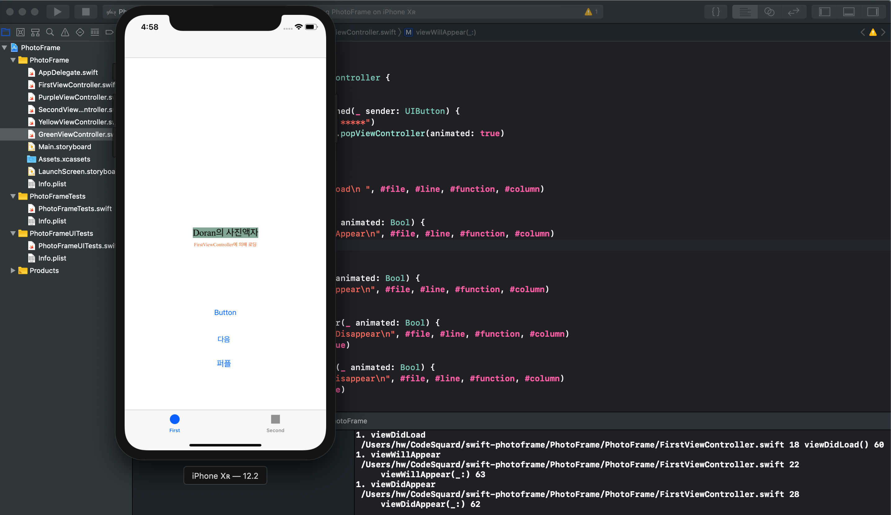

**STEP 11-6**

### 0. NavigationController 추가

### 1. 초기 화면

## NavigationController로 이동

### 2.  GreenVC로 이동

### 3. YelloVC로 이동

### 4. NavigationBar의 Back 버튼으로 이동

### 5. NavigationBar의 Back 버튼으로 이동

### 6. Navigation Back 버튼이동과 수정한 `닫기` 비교

- 4번과 비교하면 된다. 코드로 직접 구현 방식과 네비게이션 바의 back 버튼을 통한 callback 호출에는 차이가 없다.

- 결론 먼저 말해서 **STEP 6 에서 NavigationController를 활용시** rootVC에 해당하는 **firstViewController는 다시 생성되지 않고 `스택에 보존`** 되어있다.
- 반면에 **STEP 5**의 방식으로 화면을 전환하면 **이전화면으로 전환시에** firstViewController가 소멸 후 재생성되어 **`viewDidLoad` 메서드를 다시 호출**한다.

### STEP 5 : first -> green 전환시  

### STEP 5 : green -> first 전환시  

----

---

### STEP 6 : first -> green 전환시  

### STEP 6 : green -> first 전환시  

