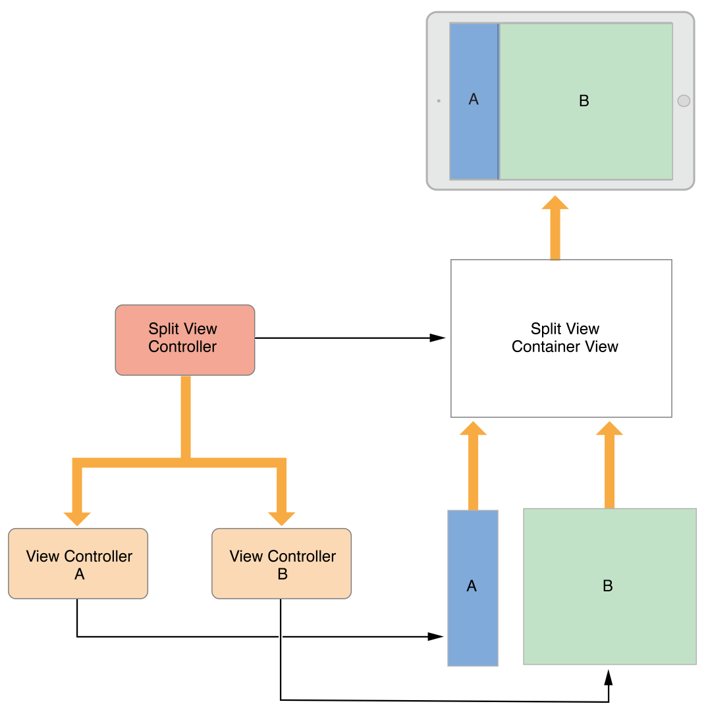
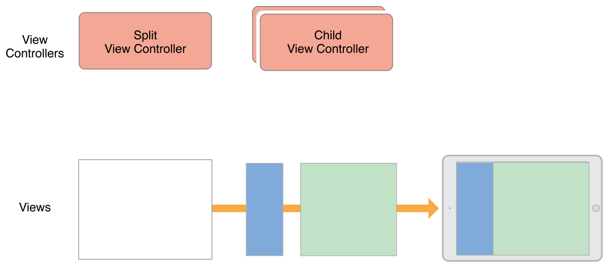

**STEP 11-6**

# 4. Split View Controller

[출처](https://developer.apple.com/documentation/uikit/uisplitviewcontroller)

### Role of Split View Controller

스플릿 뷰 컨트롤러는 컨테이너 뷰 컨트롤러의 하나로, **두개의 자식 뷰 컨트롤러를 master-detail 인터페이스 구조로 관리할 때 사용**합니다.

이러한 유형의 인터페이스에서, master 뷰 컨트롤러의 변화가 detail 뷰컨트롤러의 변화를 주도합니다. 

> iOS 8 이후에는 UISplitViewController를 모든 iOS 장치에서 사용할 수 있습니다. (iOS 8 이전은 iPad만 지원됩니다. )

앱의 UI를 만드는 과정에서 split view controller는 대부분 앱의 window의 rootVC에 위치하지만, 다른 뷰 컨트롤러에 포함시킬 수 도 있습니다. split view controller 그 자체로는 별다른 중요한 모양(appearance)을 지니고 있지 않지고, 대부분의 외관(appearance)은 설치한 child 뷰 컨트롤러들에 의해 결정됩니다. 

### **How to configure child VC of splitVC**

스플릿VC의 자식VC는 Interface Builder (or storyboard)를 통해 구성하거나, viewController들의 프로퍼티에 할당하는 프로그래밍 방식으로  구현하는 것이 가능합니다. 

자식 뷰 컨트롤러는 커스텀 뷰 컨트롤러나 다른 컨테이너 뷰 컨트롤러(네비게이션 컨트롤러 등)이 될 수 있습니다.

### 주의사항 

> **절대 split view controller를 네비게이션 스택에 push하면 안됩니다.** 
>
> 아무리 splitVC를 다른 Container View Controller의 자식으로 두는게 가능하다지만, 대부분의 경우 권장되지 않습니다.
>
> 대부분의 경우, split view controller는 app의 window의 **rootVC**에 설치됩니다. ( see [iOS Human Interface Guidelines](https://developer.apple.com/ios/human-interface-guidelines/).)

----

### 보여주는 방식 

 `UISplitViewController` 객체는 master-detail 구조로 두 개의 뷰 컨트롤러의 콘텐츠를 보여줍니다.  뷰 컨트롤러를 정렬할 때, master에 해당하는 뷰 컨트롤러의 콘텐츠는 어느 details 뷰 컨트롤러가 표시될지를 결정합니다.

  두 개의 뷰 컨트롤러가 보여지는 방식은 현재의 환경(environment)에 의해 영향을 받습니다. 즉, `splitVC는 자식 뷰 컨트롤러의 정렬을 가용한 공간을 신경써서 결정`합니다.  

 일반적으로 화면이 수평적인 환경에서는 스플릿 뷰 컨트롤러가 두 뷰 컨트롤러를 가능한한 나란히 보여주지만, master는 일반적으로 숨기고, 필요한 경우에만 나타내기도 합니다. 

 좀더 수평적으로 압축적인 환경에서는 한번에 하나의 뷰 컨트롤러만 보여주기도 합니다. 스플릿 뷰 컨트롤러가 네비게이션 컨트롤러처럼 행동하는데, 최초에 master 뷰 컨트롤러를 보여주고, secondary(detail) 뷰 컨트롤러를 필요에 따라 `push`하거나 `pop` 합니다.

 선호하는 구체적인 정렬 방식에 대해 splitVC의  [`preferredDisplayMode`](https://developer.apple.com/documentation/uikit/uisplitviewcontroller/1623170-preferreddisplaymode)  프로퍼티에 값을 할당하여 요청할 수 있습니다.

### Display modes for a split view controller

| mode         | description                                                  |
| ------------ | ------------------------------------------------------------ |
| Side-by-side | 두 뷰 컨트롤러를 나란히 보여주는 방식.   [`preferredPrimaryColumnWidthFraction`](https://developer.apple.com/documentation/uikit/uisplitviewcontroller/1623183-preferredprimarycolumnwidthfract) 프로퍼티를 사용하여 primary view controller의 width를 조절할 수 있다. [`isCollapsed`](https://developer.apple.com/documentation/uikit/uisplitviewcontroller/1623185-iscollapsed) property 값이 `true` 인 경우에는 사용이 부적절하다.   - collapsed interface 에서는 하나의 뷰 컨트롤러만 보여줄 수 있기 때문에  - [`UISplitViewController.DisplayMode.allVisible`](https://developer.apple.com/documentation/uikit/uisplitviewcontroller/displaymode/allvisible) 를 참고 |
| Hidden       | secondary VC 를 화면에 나타내고 primary를 화면에서 감추는 방식.   - [`UISplitViewController.DisplayMode.primaryHidden`](https://developer.apple.com/documentation/uikit/uisplitviewcontroller/displaymode/primaryhidden) 참고 - primary를 화면에 나타내기 위해서는 modal로 나타내거나 화면 display 모드를 변경해야 한다. |
| Overlay      | secondary VC를 화면에 나타내지만, primary를 상단에 포개서 보여주는 방식. - primaryVC가 secondaryVC를 덮어서 감출 수 있다. - [`UISplitViewController.DisplayMode.primaryOverlay`](https://developer.apple.com/documentation/uikit/uisplitviewcontroller/displaymode/primaryoverlay) constant |

Figure 5-2 shows the structure of a split view interface and its views in a regularly horizontal environment. The split view controller itself has only its container view by default. In this example, the two child views are displayed side-by-side. The size of the child views is configurable, as is the visibility of the master view.

