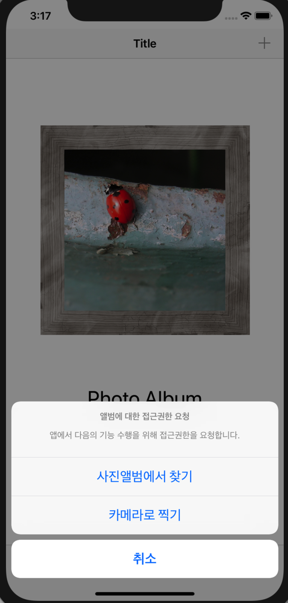
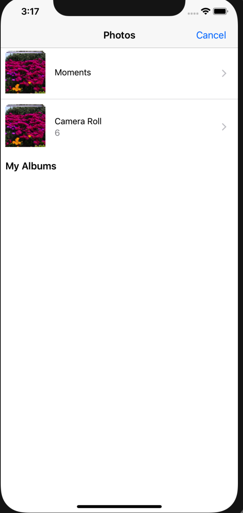

**STEP 11-7**

# 결과화면


### 1. 선택 버튼 혹은 Navigation bar의 + 버튼 누를시




### 2. 앨범에서 메뉴 선택




### 3. 앨범에 기본 저장된 사진 선택시 


### 4. 액자 내의 이미지 뷰가 변경된 결과화면


### 5. 카메라 선택시 (iphone 연결하여 앱 실행 후 카메라로 사진 촬영) 결과화면


- 일반적으로 카메라 앱은 시뮬레이터에서는 작동하지 않기때문에 직접 폰에 앱을 설치하여 작동해보았습니다.


### Reference

- 해당 기능 구현예제에 대한 샘플은 다음의 레퍼런스를 참고하였습니다.

  - [UIImagePickerController 공식문서](https://developer.apple.com/documentation/uikit/uiimagepickercontroller)

  - [사진앨범/카메라에서 이미지 가져오기](https://zeddios.tistory.com/125)

  - [UIImagePickerControllerDelegate 채택 시 UINavigationControllerDelegate 채택하는 이유](https://forums.bignerdranch.com/t/why-uinavigationcontrollerdelegate/8498)

    

### 추가고민

- 카메라 사용시 권한에 대한 alert이 뜨는 반면, photo album 라이브러리 사용시 해당 alert창이 뜨지 않아서 수동으로라도 제어할 수 있는 방안에 대해 고민


### 주의사항

```swift
func imagePickerController
```

기본적으로 앨범 라이브러리에서 **이미지 선택시** `imagePickerController`를 자동으로 `dismiss` 시키지만, **위 메서드 구현시에는 직접 dismiss를 호출하여 imagePickerController를 dismiss 시켜주어야 한다.**

